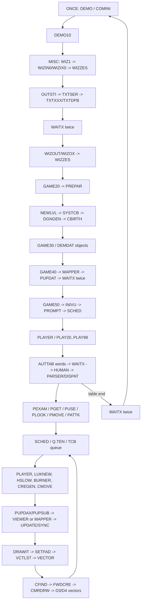

# Daggorath cartridge-compatible attract architecture

**Status: ARCHITECTURE SELECTED, implementation not started, 2026-10-02.**

This audit selects **Architecture B: an original attract execution core with a
small EOU adaptation layer**.  The modern NitrOS-9 game remains the product
engine for human play.  The compatibility core is a separate, bounded phase
whose contract is to reproduce the cartridge attract sequence.  This report
does not port a routine, create a compatibility state block, or change current
gameplay.

The visible oracle is the 36-beat [cartridge storyboard](DAGGORATH_CARTRIDGE_STORYBOARD.md).
The product boundary and human-game roadmap remain the [ratified master
plan](DAGGORATH_EOU_MASTER_PLAN.md).  Current implementation evidence comes
from [M3](DAGGORATH_DYNAMIC_PRESENTATION_M3.md),
[M4](DAGGORATH_CARTRIDGE_OPENING_M4.md), the
[opening latency study](DAGGORATH_M4_OPENING_LATENCY_ROOT_CAUSE.md), and
[M5](DAGGORATH_GIANT_ENCOUNTER_M5.md).

## Evidence and limits

The recovered source is read-only
`/Volumes/SEDONA/Projects/daggorath-reference` at commit
`a94326f00ebb16a106b540c58bc2ccf5f7b66dac`.  A disposable lwasm build of
`DAGGORATH.ASM` produced the complete original `$C000..$DFFF` image in exactly
8,192 bytes (SHA-256
`35e6a77354dcf1a3048f276824b7a0f9f759115fdd40603664cebfb3a7da6571`).
That result proves the source graph is compact and internally consistent.  It
does not prove that an unmodified ROM image is an OS-9 callable module.

Source labels cited below refer to that pinned tree.  Runtime claims about EOU
come from the named live reports; source structure alone is not treated as live
proof.  The source-built cartridge is the established project oracle, without
claiming independent identity to a retail dump.

## Product split

| Mode | Governing requirement | Ownership |
| --- | --- | --- |
| Compatibility attract | Cartridge-equivalent visible and audible choreography, including intermediate states | Original-derived assembly call graph and private state; narrow OS-9 adapters |
| Human game | Complete, maintainable NitrOS-9 game with type-ahead, menus, fixes, optional color and future acceleration | Existing CMOC engine, `dodcmd`, `dodsched`, native heartbeat, credited audio |

The two modes may share authoritative source data and OS-9 boundary services.
They do not share live gameplay state.  A key during attract causes orderly
compatibility cleanup and a phase transition to a **fresh** modern game.  This
prevents a fidelity subsystem from destabilizing human play or forcing modern
features into cartridge-era layout constraints.

The compatibility phase should stay mapped for the duration of one attract
cycle.  It is not a transient command overlay, and it does not need `dodcmd` or
`dodsched`: the original scheduler, parser, command routines and rendering
order are the behavior being preserved.  The existing public `F$Chain` phase
controller remains the coarse lifecycle boundary.

## Original attract call graph

The following graph is the smallest coherent behavioral graph found in the
source.  Names are original labels, not proposed replacements.

Important subordinate paths are:

- `COMMON:CLOCK/CLK20/CLK50` provides tick work, Wizard buzz, keyboard
  interruption, queue promotion and heartbeat countdown.
- `COMTXT/TXTSER` owns the four primary rows, CR, clear, scroll, prompt and
  character formation.
- `CMOVE/CWALK` changes CCB positions, queues sounds, sets `NEWLUK`, and can
  request an immediate `PUPDAT` for a same-cell event.
- `PATTK` emits the weapon sound, `KLINK` on a hit, death redraw, `BANG`, object
  drops, power absorption and `HUPDAT` in source order.
- `PLAYER:PLAY20` waits twice at the AUTTAB terminator and jumps to `DEMO`,
  reinitializing the private state before the next Wizard.

AUTTAB is the original 17-command table: EXAMINE; PULL RIGHT TORCH; USE RIGHT;
LOOK; MOVE; PULL LEFT SHIELD; PULL RIGHT SWORD; MOVE; MOVE; ATTACK RIGHT; TURN
RIGHT; MOVE; MOVE; MOVE; TURN RIGHT; MOVE; MOVE.  It feeds the ordinary parser;
it is not a direct state script.

## Routine classification

The classification is about the routine's **attract use**.  A routine can keep
its algorithm while receiving a new boundary for hardware or presentation.

| Classification | Original routines/data | Reason and boundary |
| --- | --- | --- |
| **DIRECT PIC PORT** | `RANDOM`, `SCAL16`, `DGNGEN`, `CBIRTH`, `FNDCEL`, `CFIND`, `FNDOBJ`, `ATTACK`, `DAMAGE`, `STEP`, `STEPOK`, hot queue/list arithmetic, vector scaling/DDA leaves | Pure state/math/table work; replace absolute state/table references with state-base or PCR-relative references without changing order |
| **PIC PORT + ADAPTER** | `DEMO10`, `GAME20/30/40/50`, `WIZIN/WIZOUT/WIZZES`, `WAITX`, `SCHED`, `CLOCK`, `PLAYER/HUMAN/PARSER`, `PUPDAX/PUPSUB`, `VIEWER/DRAWIT/CMRDRW`, `VCTLST/VECTOR`, `MAPPER`, `COMTXT/TXTSER`, `CMOVE/CWALK/CREGEN`, `PATTK` | Sequencing is fidelity-critical, but direct screen, IRQ, input, sound or absolute data access must cross an adapter |
| **SHARED MODERN SERVICE** | CoWin ownership and transfer, process/phase lifecycle, native PB1 output, credited audio transport, SCF key readiness, OS-9 clock/sleep, error cleanup | Existing services can preserve the externally visible contract without reproducing bare-metal ownership |
| **MODERN REIMPLEMENTATION** | `COMINI` hardware takeover, private interrupt-vector installation, SAM page selection/flip, PIA keyboard scan, DAC waveform loops, BASIC/cassette entry points | These operations conflict with Level II ownership; reproduce their observable result at a narrow interface |
| **VIRTUALIZE ONLY IF NECESSARY** | private SWI/SWI2 inline-byte dispatcher, interrupt-frame PC rewriting, a two-address screen illusion | Rewrite as assembly gateways first; emulate only a stubborn local convention, never a whole 6809 CPU |

Preliminary static classification places **about 65–75% of the original 8 KiB
routine/data graph** in DIRECT PIC or PIC+ADAPTER scope.  That is a functional
estimate, not a measured port byte count.  The prototype and link map must
replace it with exact numbers before production migration.

## Fixed-address dependency inventory

The original program is one absolute image with code at `$C000`, private state
beginning at `$0200`, and two screens below `$4000`.  These dependencies are
why the 8 KiB build result is evidence for size, not permission to execute it
unchanged under Level II.

| Original dependency | Purpose | Compatibility adaptation | Fidelity risk |
| --- | --- | --- | --- |
| code origin `$C000..$DFFF` | all routine/table addresses | relocatable lwasm sections; PCR access; generated relative offsets/fixups | High if any absolute table entry remains |
| DP `$02`; `DP.BEG=$0200`, `DP.END=$02D1` | 209-byte hot state | 256-byte aligned page within process data; save/set/restore DP only inside core | Medium: interrupts and adapter calls must never inherit compatibility DP |
| `$02D1..$0F05` | keyboard/line/string, TXBs, 32 CCBs, 32×32 maze, 38 TCBs, empty hand, 72 OCBs | private cartridge-layout state image with generated offset symbols | Low if offsets and byte order remain exact |
| stack `PDL=$1000` | private push-down list | ordinary process stack or a bounded private stack with explicit gateway | High for routines that consume inline bytes or saved frames |
| D0 `$1000`, D1 `$2800` | two 6,144-byte 256×192 1-bpp screens, 32 bytes/line | one cartridge-layout offscreen buffer plus CoWin-visible target; adapter preserves present/alternate semantics | Medium; presentation boundaries and erase behavior must remain exact |
| `$0100/$0103/$0106/$0109/$010C/$010F` | private SWI3/SWI2/SWI/NMI/IRQ/FIRQ vectors | direct assembly dispatch/gateways and OS-9 signal/tick service | High; saved-frame offsets are convention-sensitive |
| PIA `$FF00/$FF20` | keyboard matrix, DAC, PB1 | SCF readiness, credited audio, native heartbeat driver | Low for events; waveform identity is backend-dependent |
| SAM `$FFC0..$FFD3` and display state | mode/page selection | CoWin owns mode 5; presenter uploads completed regions | Low visually if raster/present order matches |
| absolute `FDB` tables (`FWDCRE`, vector-list `V$JMP/V$JSR`, command/data tables) | dispatch and geometry chaining | module-relative 16-bit offsets or one-time fixups into private state | High; a missed pointer can silently draw the wrong list |
| writable globals and RAM vector stubs | shared mutable execution state | all mutable bytes in process-owned compatibility state | Low after byte-layout oracle exists |
| IRQ/SYNC/CWAI assumptions | timing, queue promotion, visible pacing | one 60 Hz logical tick source; readiness/yield at explicit waits | Medium; renderer CPU time is not a portable timing API |
| inline parameter bytes after SWI/JSR | compact dispatch | explicit adapter calls or a local assembly dispatcher that advances saved PC safely | Medium |

No direct instruction-stream self-modification was found in the audited attract
graph.  There **is** control-flow mutation: `CLK50` rewrites the interrupted
return PC to leave attract mode, and several dispatchers consume inline bytes
from a saved return frame.  Those constructs need explicit rewrites; they must
not be called ordinary reentrant code merely because opcode bytes stay fixed.

## Private state and direct-page strategy

The linker map gives this private-state footprint:

| Range | Size/purpose |
| --- | --- |
| `$0200..$02D0` | 209-byte direct page |
| `$02D1..$0333` | keyboard and line buffers |
| `$0334..$03D3` | string/TXB/control state |
| `$03D4..$05F3` | 32 CCBs |
| `$05F4..$09F3` | 1,024-byte maze |
| `$09FD..$0B06` | 38 TCBs |
| `$0B07..$0F04` | empty hand and 72 OCBs |

The non-screen state from `$0200` through `$0F04` is 3,333 bytes.  Preserving
this selected layout minimizes drift in the exact code that currently differs:
queue order, CCB motion, pointer chains, text cursor state and RNG.  It is safer
than translating every original reference to the modern `Game` layout, and it
does not give the core access to OS-9 system memory because the addresses become
offsets inside caller-owned process data.

Compatibility entry saves the process DP, loads the compatibility page, and
restores DP on every exit.  A routine must restore normal DP **before** an OS-9
call, C call or service adapter unless that gateway explicitly switches it.
The IRQ handler remains OS-9-owned; it records/promotes logical work through a
normal-DP service.  No asynchronous OS-9 path may execute while assuming `$02`.

## PIC and ABI rules

1. Assemble code, rodata, data and bss as relocatable lwasm sections; export only
   the phase entry and narrow adapter imports.
2. Address local constants with `LEAX/LEAY label,PCR`.  Address mutable state
   through one passed state base or compatibility DP offsets.
3. Convert address-bearing tables to module-relative offsets, PCR thunks, or
   verified one-time fixups.  Never bake a link-time module address into a live
   CPU target.
4. Preserve the 6809 calling path.  Optional 6309 code is a later measured
   alternative with a byte/state-equivalent 6809 fallback.
5. Keep the assembly core in the phase process for the whole attract cycle.
   No pointer into its code/data crosses an unload or `F$UnLink`.
6. Use assembly gateways at C/OS-9 boundaries.  Save/restore required registers,
   compatibility DP and resident CMOC `Y`.  Resolve C targets at runtime/PCR;
   never repeat the mapped-callback defects documented in
   [Level II modularization](DAGGORATH_LEVEL2_MODULARIZATION.md).
7. Prefer core-to-adapter calls with simple register/scalar arguments.  Do not
   expose a broad callback table or let C call fine-grained hot routines.
8. Keep default CMOC function-stack checking.  A mapped/PIC caller entering
   resident C must pass through the context-safe gateway.

The recommended shape is assembly-dominant: one C or assembly phase shell calls
`compat_run(state, services)`.  The core calls only `present`, `wait/tick`,
`poll_interrupt_key`, `heartbeat_event`, and `sound_event`.  This small surface
preserves source ordering and reduces the register/DP/Y combinations that need
live Level II proof.

## Screen and presentation model

The original renderer expects 256×192, 1 bpp, 32 bytes per scanline, with
vector/status/primary regions at y=0–151, 152–159 and 160–191.  D0 and D1 are
6,144 bytes each.  Drawing targets the alternate screen and `UPDATE/SYNC`
controls which completed state becomes visible.  Text routines can update both
screens; clears and vector fades depend on that model.

| Approach | Fidelity | 6809 cost | Data cost | Decision |
| --- | --- | --- | --- | --- |
| direct CoWin primitives | Low–medium; call granularity can reorder formation | repeated OS-9 calls | low | Reject for the core |
| two cartridge buffers then conversion | Highest model fidelity | conversion plus copy | 12,288 bytes before state/stack | Does not fit safely with 3,333-byte state in two blocks |
| **one cartridge buffer + CoWin visible surface** | High if alternate/present semantics are adapted | one bounded conversion/upload per source presentation boundary | 6,144 bytes | **Selected** |
| current logical renderer hybrid | Medium; already lost Giant intermediate states | known CMOC/render overhead | existing | Retain as modern reference, not compatibility baseline |

One 6,144-byte logical screen plus 3,333-byte state uses 9,477 bytes, leaving
about 6,907 bytes in two 8 KiB process-data blocks for stack and adapters.  The
CoWin surface acts as the visible side of the original double-buffer contract.
The presenter records which logical state is current and uploads the completed
buffer; it need not retain two private copies if clear/copy/text operations are
adapted carefully.

`compat_present(reason)` is a semantic boundary, not permission to coalesce.
It is invoked at every original visibility boundary: each Wizard step/fade,
required text formation/line state, black transition, map, `PUPDAT`, movement
half-step/turn state, creature approach, attack, death and post-kill state.
The M5 result—nine source presentation requests but no recognizable Giant—is
direct evidence that preserving final state alone is insufficient.

## Subsystem recommendations

### Wizard and opening

Port `WIZIX0/WIZOX/WIZZES`, the `WIZ1` vectors and their actual call sequence.
Fade-in uses the source sequence from 32 down through 0 in steps of two; fade-out
uses 0 through 30 in steps of two.  Each `WIZZES` clears/draws/presents.  Keep
copyright and welcome text in the same compatibility screen model.  Translate
the opening buzz and explosion to semantic audio events.  Crucially, retain
`GAME20: PREPAR` before the expensive `NEWLVL` work.  This removes the modern
architecture's multi-second setup gap between Wizard and PREPARE without
inventing a shorter sleep.

### Primary text

Port `TXTXXX/TXTDPB/TXTSER/TXTSCR` and glyph data.  These routines define
formation order, four rows at y=160/168/176/184, CR, scrolling, clearing,
command echo and lone-dot prompt.  A final-raster-only modern text call is not
equivalent.  The CoWin adapter should upload at the source-observable boundary;
it should not add `OK`, merge line formation, or discard retained rows.

### Map

Port `MAPPER` with its data tables and draw order into the cartridge-layout
buffer.  It walks the complete 32×32 maze, then creatures, objects, player and
features.  Preserve the two explicit source waits and map-to-black/dungeon
transition.  Color accents remain a future modern presentation option.

### AUTTAB, scheduler and creatures

Retain `PLAYER`, ordinary `HUMAN/PARSER` dispatch for the 17 words, `SCHED`,
TCB queues, `LUKNEW`, `PUPDAT`, `CMOVE/CWALK`, `HSLOW`, `BURNER` and `CREGEN`.
This is the coupled behavior that Architecture A would split.  Explicit `WAITX`
calls and queue countdowns are semantic; a command-number delay table is not.
The compatibility tick adapter promotes tasks in original order and yields to
OS-9 without using wall-clock renderer duration as an attract script.

### Stone Giant

The source path is:

`CCB position/type` → `VIEWER` range/line-of-sight extraction → `CFIND` →
`FWDCRE` → `CMRDRW` scale/origin selection → `SGINT2`/`SGIANT` → `VCTLST` →
`VECTOR` DDA → completed alternate screen → `UPDATE/SYNC`.

`SGINT2` draws the axe prelude and falls through to `SGIANT`; vector-list
control bytes include `V$NEW`, `V$JMP`, `V$JSR`, `V$RTS`, relative and absolute
modes.  Range and CCB motion select scale and visibility.  Walls/line-of-sight
create occlusion.  `CMOVE/CWALK` changes position and requests `NEWLUK/PUPDAT`.
Together these produce the storyboard progression from sparse pixels to a
recognizable Giant, nearer/larger frames, occlusion and reappearance.

Port that complete slice, including original tables and presentation calls.
Replacing only the final Giant vector list would leave the current failure's
range, projection, scheduling and visibility boundaries unresolved.

### Heartbeat

Keep **one** authoritative logical heartbeat.  Port the original
`HEARTC/HEARTR/HEARTS` countdown/phase and `HUPDAT` rate computation as state
semantics.  On each source phase event, the adapter updates both the logical
heart glyph and native PB1 service from the same event.  Do not run an
independent visual clock beside the driver.  The current native VIRQ/PB1
implementation is the transport and cadence evidence; it does not replace the
compatibility core's source event order.

### Sound

Keep event generation in the original sequence and replace waveform loops:

`original semantic event` → `compat_sound(event, volume/order)` → credited
audio queue → S/SC backend.

`SOUNDS:SNDTAB` maps Giant 2 to `GRAWL`, sword to `WHOOSH`, a creature hit to
`KLINK`, and explosion 0 to `BANG`.  `PATTK` calls them in source order around
attack, hit and death.  Wizard fade/buzz and `KABOOM` become events as well.
Do not execute `SNWAIT`, DAC `$FF20` loops, or synchronously drain the service.
Queue credit/backpressure must preserve order while remaining optional
presentation: audio failure cannot change state, RNG, tick order or exit status.

## Timing and interruption model

| Source mechanism | Class | Compatibility rule |
| --- | --- | --- |
| `WAITX`: 81 `SYNC` iterations | **SEMANTIC TIMING** | wait 81 logical 60 Hz opportunities while scheduler/input/heart continue |
| TCB countdowns and Q.TEN scheduling | **SEMANTIC TIMING** | preserve tick counts, promotions and service order |
| Wizard fade counters and presentation after each draw | **SEMANTIC + PRESENTATION ORDERING** | preserve frame sequence and explicit waits |
| text/glyph memory-write order | **PRESENTATION ORDERING** | preserve visible order where storyboard observes it; do not add arbitrary per-glyph sleeps |
| `VIEWER`, vector, maze and parser instruction duration | **INCIDENTAL CPU TIMING** | run efficiently; never encode AUTTAB-specific delays or RNG padding |
| busy-loop sound synthesis | **HARDWARE/INCIDENTAL** | semantic event to async backend; no busy wait |
| PIA keyboard scan in `CLK50` | **HARDWARE + SEMANTIC** | nonblocking SCF poll each logical tick; any accepted key requests transition |
| PB1/DAC/SAM/IRQ | **HARDWARE TIMING** | native driver/CoWin/audio adapters |

The original cartridge's exact pre-command-10 RNG can include IRQ opportunities
during variable rendering.  The compatibility core runs much closer to the
original 6809 algorithm, but exact cycle identity remains outside the contract
where OS-9/CoWin intervenes.  Acceptance requires source waits, queue order,
all presentation boundaries and cartridge-like pacing; it forbids a trace- or
command-index delay table.

During attract, `CLK50` detects a key even during waits and redirects to fresh
game initialization.  Under EOU, a tick adapter polls the owned SCF path
without blocking.  On a key it marks cancellation; the core exits at the next
safe adapter boundary, stops queued attract audio and heartbeat ownership,
releases the compatibility buffer, preserves the inherited window contract,
and chains to a fresh modern human game.  No maze, RNG, CCB, OCB or scheduler
state is transferred.  The treatment of the interrupting byte (consume versus
make it the first human input) remains a product decision and must be tested.

At AUTTAB end, preserve two source waits and the jump back to `DEMO`.  Reuse the
same phase/window and reinitialize all private state and the logical screen;
do not repeatedly load modules or open windows.  Module/path/reference counts
must remain stable across multiple Wizard-attract loops.

## Architecture comparison

| Criterion | A: selective PIC | **B: original core + adapters** | C: sandbox/virtualization |
| --- | --- | --- | --- |
| Wizard fidelity | High for ported leaf, modern handoff remains | **Highest: original sequence and state** | High |
| text formation fidelity | Medium; mixed cursor/presenter | **Highest** | High |
| PREPARE timing | Medium; current orchestration still exposed | **Highest: original PREPAR-before-init order** | High |
| AUTTAB fidelity | Medium; modern runner/scheduler boundary | **Highest: normal parser + original scheduler** | High |
| Giant fidelity | Medium risk; many coupled leaves | **Highest: complete range/vector/redraw path** | High |
| heartbeat fidelity | High with modern service | **High: source logic + proven service** | Medium–high |
| sound choreography | High if all call sites recovered | **High: original call order + queue adapter** | High |
| attract repeat | Medium, new orchestration | **Native source flow** | High |
| keyboard interruption | Medium, modern phase glue | **Source tick semantics + SCF adapter** | Medium |
| stock 6809 performance | Better than current C in selected leaves | **Best expected; native original algorithms** | Poor: emulating 6809 on 6809 |
| Level II memory | Lowest incremental | **Moderate and feasible** | Highest (memory image + emulator state) |
| implementation complexity | Medium initially; grows across seams | **High but bounded around one graph** | Very high |
| maintainability | Mixed C/ASM behavior at many boundaries | **Source-traceable core, small adapter surface** | Emulator plus original binary semantics |
| human-game reuse | Highest code sharing, but couples fidelity work | **Clean phase split; shares services/assets** | Clean split, little useful reuse |
| source traceability | Fragmented | **Best** | Good at instruction level, weak at adapter meaning |
| regression risk | High recurring risk of collapsed ordering | **Migration risk isolated from human engine** | High architecture/runtime risk |

### Decision

**Architecture B wins.**  The source audit shows the fidelity failures are not
isolated leaves: Wizard formation, text, AUTTAB, scheduler, CCB movement,
perspective, vector lists and presentation boundaries form a compact 8 KiB
execution graph.  Selective PIC would retain the same modern seams that have
already caused timing and Giant choreography drift.  A software 6809 sandbox
would add a CPU/memory/hardware model on a stock 6809 for behavior that can be
made relocatable directly.

Architecture B is not a second product game.  Its scope stops at the original
attract loop and interruption boundary.  Human play, menus, full levels,
modern input, bug policy, optional color and future 6309 work stay in the modern
engine.

## Level II memory and performance model

Expected compatibility phase map:

| Logical blocks | Purpose |
| ---: | --- |
| 2 program | original-derived core, rodata and thin adapters; conservative until linked size is measured |
| 2 data | 3,333-byte cartridge state, 6,144-byte framebuffer, adapter state and stack |
| 1 mapped block | CoWin/GFX physical buffer mapping used for bounded transfer |
| 0 application blocks | `dodcmd`/`dodsched`; compatibility core owns those semantics |
| **5/8 normal** | leaves three blocks for transient OS-9 needs or a reviewed resource mapping |

A one-block program is plausible because the entire absolute source image is
8,192 bytes, but module header, PIC expansion and adapters make **two blocks**
the honest planning value.  A separate optional `dodaudio` process does not
consume this process's DAT.  The heartbeat driver's system residency likewise
does not justify a retained application mapping.

On stock 6809, original-derived hot loops should be substantially faster than
the current CMOC reconstruction: the measured modern opening spent about 16 s
inside demo initialization before the later assembly maze optimization, and
M5 still paid modern logical-render/presentation costs while losing states.
No numeric speedup is claimed before the prototype.  CoWin conversion/upload
remains the unavoidable EOU cost; measure it separately from core drawing.
MAME should preserve the same logical ordering at emulated speed.  A 6309 path
is unnecessary for architecture proof; later it may accelerate conversion/copy
only after the 6809 path is accepted.

## Shared data without divergent copies

Share immutable, source-derived glyphs, vector lists, creature tables,
AUTTAB/command tokens, maze tables, object names and semantic sound IDs through
one generated provenance-controlled source.  It may emit lwasm rodata and C
headers with byte/hash tests.  Do not introduce an OS-9 Data module until its
mapping/lifetime cost has been measured; static phase rodata is simpler for the
first implementation.  Mutable compatibility state remains private and must
not be overlaid onto modern `Game`.

Source/licensing provenance for copied reconstructed tables and routines must
be reviewed before distribution.  This audit establishes engineering
suitability, not a new legal conclusion.

## Acceptance model

The future core is accepted only when all layers pass:

- **State:** exact maze, RNG transitions under the defined logical timing,
  player, objects, CCBs, scheduler and AUTTAB results for deterministic seeds.
- **Visual:** all 36 committed storyboard beats, including Wizard stroke order,
  character formation, map, every distinct Giant approach/occlusion state,
  combat, ending and repeat.
- **Timing:** exact explicit tick counts; cartridge-like transition windows with
  PREPARE immediacy; no EOU-only multi-second gap.  CoWin latency is measured
  and reported separately from semantic waits.
- **Audio:** one heartbeat event drives visual/PB1; Wizard events, GRAWL and
  WHOOSH → KLINK → BANG appear in source order.  Backend latency/failure never
  modifies gameplay.
- **Input/lifecycle:** a key interrupts each relevant phase into a fresh modern
  game; repeated attract loops do not leak paths, modules, memory or audio.
- **Target:** deterministic host/oracle tests, reproducible OS-9 modules and
  CRCs, generated-code review, live MAME 6809, then the applicable real-hardware
  acceptance tier from the master plan.

Pixel comparison may allow documented border/capture and monochrome platform
differences.  It may not excuse a missing beat, collapsed frame or wrong
geometry.  CPU-cycle identity is not required where CoWin/OS-9 necessarily
intervenes.

## Smallest decision prototype

Build a **disposable original-derived Stone Giant rendering slice**, not a
Wizard slice.  Feed it captured cartridge state for beats 019–021 and include:

- compatibility state/DP offsets needed by `VIEWER`, `CFIND`, `CMRDRW`,
  `VCTLST` and `VECTOR`;
- `FWDCRE`, `SGINT2`, `SGIANT` and dependencies;
- one 6,144-byte cartridge-layout buffer;
- a single `compat_present` adapter to the existing CoWin transfer path.

This slice tests the highest-risk facts at once: PIC table chaining, DP/state,
range and occlusion, exact vector raster, screen conversion, presentation
boundaries, stock-6809 performance and the current beat-020 failure.  A Wizard
prototype would test vector drawing but not the scheduler/CCB/perspective
coupling that distinguishes Architecture B from A.  The prototype is identified
only; it was not implemented in this task.

## Migration order

1. Specify and test generated state/table offsets, PIC rules and the five-call
   adapter ABI.
2. Implement the disposable Giant slice and require exact beat 019–021 rasters
   and acceptable 6809 time before production migration.
3. Establish the one-buffer presenter and vector interpreter/raster core.
4. Move original text/glyph/cursor/scroll behavior onto that screen model.
5. Move Wizard/opening vectors, sound events and PREPARE ordering.
6. Move source initialization, map and exact private state oracles.
7. Move tick, queue, scheduler, `LUKNEW/PUPDAT`, creature movement and all
   original presentation boundaries.
8. Move PLAYER/AUTTAB/parser and only the command graph reached by the 17-command
   attract sequence.
9. Connect heartbeat and credited sound adapters.
10. Add key interruption, fresh-human-game chain and repeat lifecycle.
11. Run all 36-beat state/visual/timing/audio acceptance; keep current modern
    attract code until the compatibility path passes.

This order follows the dependency graph.  It deliberately does not start by
porting the Wizard merely because it is the first visible beat.

## Risks and open questions

- Exact PIC expansion and program-block count are unmeasured until a real slice
  links as an OS-9 module.
- Vector-list embedded addresses and inline-dispatch/frame conventions are the
  largest relocation risks.
- One-buffer emulation must prove text updates, clear/erase and alternate-screen
  semantics at every storyboard boundary.
- Calls across compatibility DP, normal OS-9 DP and CMOC `Y` need live target
  tests; host tests cannot validate them.
- Source rendering time can create extra original IRQ opportunities.  The
  accepted fidelity tolerance must separate explicit logic from incidental
  cycles without hiding a visible choreography difference.
- Credited audio preserves event order but not the cartridge DAC waveform or
  synchronous duration; human audio comparison is required.
- The interrupting key's disposition at modern-game handoff is unresolved.
- Reconstructed-source/data distribution provenance needs review.
- Real 6809 CoWin conversion/upload time and repeated-loop reference stability
  remain to be measured.

## Modern-engine debt retained deliberately

The modern engine remains valuable and unchanged.  Its attract reference still
has the documented M4/M5 debt: opening timing differs, the current runner covers
only commands 1–10, beat 020 lacks a recognizable Giant, later approach,
GRAWL/combat/audio and repeat acceptance are incomplete, and four-color work is
deferred.  `dodsched` is exactly 8,192 bytes and may not grow.  These are not
silently relabeled as solved by selecting a compatibility architecture.

## Reusable EOU findings to extract later

Future generic guidance should capture destructive `F$Chain` ownership,
`F$NMLoad` versus mapped `F$Load`, DAT budgeting, resident-CMOC `Y` gateways,
runtime callback relocation, mapped-pointer lifetime, credited async IPC,
stable clock sampling across RTC refresh, PIC conversion of absolute assembly,
compatibility-state design, and dense storyboard-based runtime acceptance.
This audit performs no such refactor.

## Stop point

The architecture decision is ready for human review.  Do not begin the Giant
prototype, port Wizard or text, create the private state block, change current
attract behavior, or delete modern reference code as part of this checkpoint.
