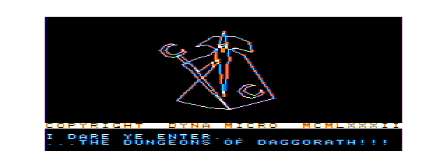
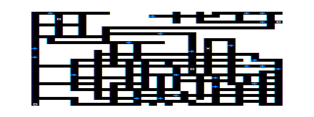
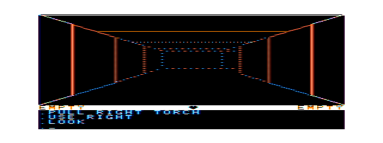

# Daggorath opening and attract mode: source and MAME reference

This is an implementation plan, not a port of the opening. The reference is the read-only recovered source at `/Volumes/SEDONA/Projects/daggorath-reference`, commit `a94326f00ebb16a106b540c58bc2ccf5f7b66dac`. Its `DAGGORATH.ASM` built with `lwasm --format=raw` into an 8 KiB ROM (SHA-256 `35e6a77354dcf1a3048f276824b7a0f9f759115fdd40603664cebfb3a7da6571`). Controlled MAME 0.289 runs of **that source-built ROM** provide the timings and images below. This is reproducible recovered-source behavior, **not independent authentication of a retail cartridge dump**. The existing [Wizard M1](DAGGORATH_WIZARD_M1.md) is a separately measured partial port.

## Reproduction boundary

The ROM was assembled outside this repository with `/usr/local/bin/lwasm` from lwtools 4.22: from the reference checkout, `lwasm --format=raw --output=/private/tmp/daggorath-attract/original.rom DAGGORATH.ASM`. It then ran as `coco3h` at 2 MB with RGB and no disk attached. The launch command was:

```text
/Applications/Emulators/Ample.app/Contents/MacOS/mame64 coco3h -window -skip_gameinfo -ramsize 2M -rompath '/Users/magneto-optimus/Library/Application Support/Ample/roms' -cfg_directory /private/tmp/daggorath-attract-full/cfg -cart /private/tmp/daggorath-attract/original.rom -wavwrite /private/tmp/daggorath-attract-full/audio.wav -autoboot_delay 0 -autoboot_script /private/tmp/daggorath-attract-full/capture.lua
```

The isolated MAME configuration used the verified RGB input port `:screen_config` with value `1`. Lua sampled video frames and source state; MAME's WAV output was captured without guest disk I/O. Three runs covered no input, a key during autoplay, and the full framebuffer/audio trace. Timing is MAME emulated time from launch, at approximately 59.923 video frames/s, not wall-clock time. The raw per-frame trace and WAV remain disposable under `/private/tmp/daggorath-attract-full/`; the representative images and a short unaltered-time opening audio excerpt are curated [here](assets/daggorath-attract/).

## Source-defined sequence

| Order | Original source | Behavior |
| --- | --- | --- |
| Reset | `ONCE.ASM:ONCE/DEMO/COMINI` | Initializes PIA, RAM, video and copyright/status text, then enters `DEMO10`. No separate title-menu routine was found on this path. |
| Wizard | `ONCE.ASM:DEMO10`; `MISC.ASM:WIZIN0/WIZI20/WIZOUT`; `D4.ASM:WIZ1` | Sets `AUTFLG`, synchronizes the IRQ, fades in the original wizard vectors, emits the first explosion, draws the two encoded welcome messages, waits twice, emits the second explosion and fades out. The fade retains the copyright/status text as the source requests. |
| Transition | `ONCE.ASM` immediately after `WIZOUT` | Blanks/flips the display, chooses demo level 2 (the third level), and supplies `DEMDAT`. |
| Preparation | `ONCE.ASM:GAME20/GAME30`; `COMSWI.ASM:PREPAR`; `MISC.ASM` preparation text; `COMDAT.ASM:DEMDAT` | Shows `PREPARE!`, builds the level, then creates and bags the demo objects: iron sword, pine torch and leather shield. |
| Map | `ONCE.ASM:GAME40`; `MAPPER.ASM:MAPPER` | Disables the ordinary scheduler while showing the complete demo map, waits twice, then resumes and synchronizes. This map is part of autoplay, not the ordinary new-game path. |
| Dungeon | `ONCE.ASM:GAME50`; `PLOOK.ASM:INIVUX`; `TOKEN.ASM:AUTTAB`; `HUMAN.ASM:PLAYER` | Initializes the resident view/status and heartbeat, draws a prompt, and lets the scripted demo command stream run through the scheduler. `AUTTAB` begins `EXAMINE`, `PULL RIGHT TORCH`, `USE RIGHT`, `LOOK`, movement/equipment/attack commands, then waits and restarts the demo. |
| User interruption | `COMMON.ASM:CLOCK/CLK50`; `ONCE.ASM:GAME/GAME10` | **Any keyboard depression in autoplay** rewrites the interrupted return address to `GAME`, beginning a fresh normal game. This is not a stage-advance or a character passed through to the demo. `GAME10` establishes the normal start location and `GAMDAT`; `GAME40` skips the demo map when `AUTFLG` is clear. |

The normal game begins dark. Its initial torch is carried but not lit; `PUSE.ASM:PUSE12` ignites a used torch and requests source sound `A$TORC` (`CHUCK`). The automatically illuminated corridor is therefore an **autoplay consequence** of scripted `USE RIGHT`, not a universal opening state.

## Measured visual timeline

The transitions below are sampled frames of the source-built ROM. They are not claims about an authenticated retail cartridge or an exact scanline boundary.

| Frame | Emulated time | Observation |
| ---: | ---: | --- |
| 102 | 1.701 s | First visible wizard fade frame |
| 395 | 6.590 s | Wizard geometry complete |
| 479 | 7.992 s | Both welcome messages complete |
| 641 | 10.696 s | Messages clear |
| 760 | 12.682 s | Fade-out begins its visible phase |
| 1014 | 16.920 s | Final blank frame |
| 1017 | 16.970 s | `PREPARE!` visible |
| 1403 | 23.412 s | Demo map visible |
| 1568 | 26.166 s | Heartbeat enable state observed |
| 1577 | 26.316 s | Demo dungeon view visible |
| 1679 | 28.018 s | Scripted `EXAMINE` begins displaying |
| 2180 | 36.379 s | `PULL RIGHT TORCH` visible |
| 2350 | 39.216 s | First lit 3D corridor, after `USE RIGHT` |

The no-input trace continued through frame 3600 (about one minute) in autoplay. A separate run injected `X` at frame 1800 (30.037 s), while `EXAMINE` was active. `AUTFLG` cleared by frame 1804 (30.104 s), and the normal initial position was established by frame 1833 (30.588 s). A dark playable dungeon was captured by frame 2400. This verifies the any-key restart path in one controlled condition; it does **not** establish the first input-ready frame or response to every key at every stage. The source's `GAME50 → INIVU → PROMPT → SCHED` path identifies when ordinary command processing can begin.

The curated full-trace images are frames 480 (messages), 1080 (`PREPARE!`), 1500 (map), 1680 (`EXAMINE`), and 2400 (lit corridor). The normal dark-dungeon image is frame 2400 of the separate key-interruption run.








## Audio and timing relationships

`COMMON.ASM:CLOCK/CLK20` emits the original roughly 30 Hz DAC wizard buzz while `NOISEF` is set during the fades. `MISC.ASM:WIZI20` requests `A$EXP1` (`KABOOM`) after the fade-in and before fade-out. The captured MAME audio contains two strong explosion-like intervals and fade-associated buzz, consistent with that call order; the source is the evidence for exact call identity. The opening audio excerpt is [available here](assets/daggorath-attract/opening-source-build.mp3). It is a source-built CoCo DAC recording, **not** output from the port's SSC backend. The demo's `USE RIGHT` later requests `A$TORC` (`CHUCK`); subsequent autoplay commands may request other data-dependent effects, which this pass did not isolate event by event. `PLOOK.ASM:INIVUX` enables the heart and its native PB1 heartbeat during dungeon entry; the source heartbeat audio and visual heart share the clock path rather than independent schedulers.

The two `WAIT` calls after the welcome messages and two map waits are part of the cadence. Wizard M1 already has a separately measured fade/content comparison; extending it must preserve its logical frames and canonical 512×192 presentation, and must place any later sounds at the source-defined transitions without inserting new foreground delays. Audio fidelity of the remaining attract sequence has not been established under NitrOS-9.

## Text geometry and prompt semantics

The original does not need a smaller font to obtain four message rows. `COMDAT.ASM`
places the status block at logical Y=152 and the primary text block at logical Y=160.
The latter is 32 columns by four rows. `COMTXT.ASM` advances rows by eight logical
pixels and supplies seven-byte glyphs, giving baselines/rows at Y=160, 168, 176 and
184 inside the existing 256x192 logical framebuffer. The canonical 2x1 presentation
therefore maps the four rows without changing the font, framebuffer or 512x192
viewport.

`MISC.ASM:PROMPX` defines `M$PROM1` as `I.CR,I.DOT`. The dot follows a carriage
return when the command prompt is emitted. It is not a prefix on every response and
must not be added by the message renderer generally.

## Exact autoplay command stream

`TOKEN.ASM:AUTTAB` contains these 17 commands, in this order:

1. `EXAMINE`
2. `PULL RIGHT TORCH`
3. `USE RIGHT`
4. `LOOK`
5. `MOVE`
6. `PULL LEFT SHIELD`
7. `PULL RIGHT SWORD`
8. `MOVE`
9. `MOVE`
10. `ATTACK RIGHT`
11. `TURN RIGHT`
12. `MOVE`
13. `MOVE`
14. `MOVE`
15. `TURN RIGHT`
16. `MOVE`
17. `MOVE`

`HUMAN.ASM:PLAYER` expands each token string through the ordinary input/parser path,
waits between words, and supplies carriage return. At the `-1` terminator it waits
twice and jumps to `DEMO`, restarting the whole sequence. `COMMON.ASM:CLK50` detects
any depressed key during autoplay and changes the interrupted return to
`ONCE.ASM:GAME`; `GAME10` then performs complete normal-game initialization with
the normal start position and `GAMDAT`. The pressed key is not the first command of
the new game.

The demo starts at source level value 2 (the displayed third level) with `DEMDAT`:
iron sword, pine torch and leather shield. The Wizard path requests two KABOOM events.
The scripted `USE RIGHT` follows `PUSE.ASM:PUSE12` and requests CHUCK.

## OS-9 process and module architecture

The maintained source used for this analysis is the external official checkout
`/Volumes/SEDONA/Projects/nitros9-reference`. The applicable implementation is the
CoCo 3 Level II 6309 kernel recipe; the relevant routines are
`level1/modules/kernel/fchain.asm`, `ffork.asm`, `fwait.asm`, `flink.asm`, and
`fload.asm`, included by the Level II kernel sources. Runtime evidence below is from
the verified EOU target and takes precedence where it narrows the source reading.

### System-call comparison

| Mechanism | Verified semantics | Suitability here |
| --- | --- | --- |
| `F$Chain` | Replaces the current primary module and its program/data allocation without creating a child. Level II allocates a replacement process descriptor, copies the preserved descriptor body beginning at `P$SP`, replaces the task/DAT image, and clears pending signals and intercept vectors. Success never returns. | Best fit. It retains a single process identity/lifecycle while each phase gets a fresh address space. Every phase must reinstall its signal handler and remap any GP buffer it needs. |
| `F$Fork` | Creates a concurrent child, copies CWD/CXD, and duplicates only standard paths 0, 1 and 2. A separately opened graphics path above 2 is not inherited automatically. | Poor fit for phase replacement. A parent/controller would remain resident, consume another process/data area, need explicit path duplication/IPC, and wait/reap each child. |
| `F$Wait` | Blocks a parent until one of its children dies and returns that child PID/status. It is relevant to a Fork controller, not to a Chain sequence. | Avoided in the preferred design. It adds child ownership and cannot preserve a nonstandard graphics path by itself. |
| `F$Link` / `F$Load` | `F$Link` locates a compatible module already in the module directory; `F$Load` loads from the execution path when linking fails. `F$Chain` uses this Link-then-Load behavior itself. | Phase modules can be resident or loaded by an explicit execution path. The controller must not assume GShell's current execution directory. |

`F$Chain` preserves paths because Level II copies the process descriptor state into the
replacement descriptor, but it destroys the old program/data image and DAT mappings.
Consequences for Daggorath are precise:

- The game-owned graphics **path** can remain open across a chain.
- CMOC globals, the 6,144-byte logical framebuffer, stack, cached pointers and
  `SS.MpGPB` mappings do not survive. A phase must receive compact scalar identifiers
  in the chain parameter area and rebuild its process-local state.
- CoWin GP buffer storage is not ordinary process data. `cowin.asm:SS.MpGPB` maps its
  system buffer blocks into the caller's DAT image; the mapping must be recreated
  after a chain. CoWin's graphics table records creator process identity and block.
- A successful Chain does not close paths or return to the caller. A failed Chain does
  return an error, so the current phase still owns cleanup.
- `F$Chain` clears the signal/intercept state. Every new phase must install its own
  cancellation handler before doing work.
- The final exiting phase owns orderly removal of heartbeat VIRQ state, audio shutdown,
  GP-buffer deletion, `DWEnd`, graphics-path close and Term/GShell return. Abnormal
  exit still receives OS-9 path cleanup, but Daggorath must not rely on that for its
  device-specific state.

This supports one continuous GShell child: GShell forks the opening module once, the
same process chains through the phases, and only the final `F$Exit` supplies child
status. It avoids a presenter process and preserves exclusive graphics ownership.

## Disposable EOU graphics-chain proof

A private probe under `/private/tmp/dod-chain-probe` tested:

```text
proba (open 640x200 graphics, create/present GP 196/1)
  -> F$Chain /d1/probeb (PutBlk the same GP 196/1 on the inherited path)
  -> F$Chain /d1/proba (PutBlk it again, DWEnd/close, return to shell)
```

Both modules were CMOC OS-9 program modules. The executable names in their module
headers were deliberately kept as `proba` and `probeb`; an earlier disposable build
used an absolute host output path as the module name and correctly failed with 216,
which was probe setup rather than Chain behavior. A fresh read-only disposable floppy
was mounted before cold boot so an older save-state disk binding could not affect the
result.

On the canonical EOU machine, the final run returned to Shell+ and `echo STATUS %*`
reported `STATUS 000`. B and resumed A both successfully wrote GP 196/1 through the
same nonstandard graphics path before A closed it. Thus the live target establishes:

- the graphics path survives A -> B -> A;
- the CoWin buffer storage survives even though each module has fresh process data;
- the replacement phases can issue GFX2 operations without reopening the window;
- final cleanup restores Term and propagates status 000;
- no canonical VHD or saved state was changed by the probe.

The proof does **not** establish that an old mapped pointer survives; it must not be
used that way. It also did not retain frame-timed evidence capable of excluding a
single-video-frame flash, nor did it stress thousands of cycles or interrupt exactly
inside `F$Chain`. Source semantics show that old primary modules are unlinked as the
process is replaced, so module link counts should not accumulate, but repeated-chain
leak measurement and Shift-BREAK at every phase boundary remain implementation
acceptance tests. The probe's successful uninterrupted screen ownership is sufficient
to select the architecture; those lifecycle cases are not silently claimed as proven.

## Exact current memory accounting

These figures come from fresh current builds, ToolShed `os9 ident`, and linker maps.
Both programs request approximately 1.5 KiB of CMOC/OS-9 stack within `M$Mem`; the
module header's data size is the authoritative total process data request.

| Artifact | Module/code image | Initialized writable data | BSS including runtime globals | Stack/runtime remainder in `M$Mem` | `M$Mem` total | Combined module + data |
| --- | ---: | ---: | ---: | ---: | ---: | ---: |
| `dodwiz` | 22,739 bytes (`$58D3`) | 68 bytes (`$0001..$0044`) | 6,319 bytes (`$0045..$18F3`), including the 6,144-byte logical frame | 1,468 bytes | 7,855 bytes (`$1EAF`) | 30,594 bytes |
| `dodgame` | 33,815 bytes (`$8417`) | 71 bytes (`$0001..$0047`) | 9,229 bytes (`$0048..$2454`), including game/scheduler state and the 6,144-byte logical frame | 1,465 bytes | 10,765 bytes (`$2A0D`) | 44,580 bytes |
| disposable B-like chain phase | 2,911 bytes | included in total | no logical framebuffer | included in total | 299 bytes | 3,210 bytes |

The linker maps place `program_end` at `$5885` for `dodwiz` and `$83C5` for
`dodgame`; the difference between those offsets and module size is module header/CRC
packaging rather than process BSS. The stack/runtime remainder above is `M$Mem` minus
the mapped initialized-data-plus-BSS extent; it includes the requested CMOC stack and
small runtime/header effects, so it is not asserted to be stack bytes alone.

The last row is a measured upper-bound example for a tiny chain coordinator, not the
identity of a proposed production controller. A production controller needs only a
phase/restart policy, explicit module names and a compact handoff structure; its exact
size cannot be reported until it exists.

The current `dodgame` build identifies as edition 1, CRC `9D2CD2`; the current
`dodwiz` build identifies as edition 1, CRC `8C7FA5`. Both are re-entrant read-only
6809 object modules and execute on the verified 6309-native EOU target.

The 2 MB physical-memory setting does not give one Level II process a flat 2 MB address
space. Each phase still executes in its 64 KiB logical map. Module code, process data,
stack, CMOC runtime and temporary mappings must fit that map. CoWin owns the GP buffer
storage outside ordinary process data, but an `SS.MpGPB` mapping consumes logical map
space while mapped. Loaded shared system modules consume system/module-pool memory,
not copies inside every process data area.

It is therefore incorrect to prove or disprove a monolith merely by adding the two
module file sizes: duplicate runtime/presentation code could be folded, while
`dodwiz`'s roughly 13,282-byte read-only frame cache and the game's 10,765-byte data
request still create severe real pressure. Only an actual monolithic link/map would
prove its fit. This milestone deliberately does not build one; process chaining gives
each already-valid phase its own measured address-space budget.

## Resource ownership model

The preferred handoff contract is:

1. The first opening phase opens and selects one game-owned graphics path and creates
   the agreed CoWin group/buffers.
2. Before Chain, it unmaps all mapped GP blocks, leaves the physical window/path and
   named buffers alive, drains phase-local audio, removes phase-local VIRQ state, and
   passes only path number, group/buffer identifiers, phase and restart reason.
3. The next phase validates the inherited path, reinstalls cancellation handling,
   remaps only buffers it needs, and reconstructs process-local presentation state.
4. Wizard -> demo and demo -> Wizard use `F$Chain`; neither returns to Term or GShell.
5. Autoplay interruption chains to a **fresh** normal `dodgame` initialization. No
   demo object, level, parser, RNG, scheduler or heartbeat state is reused.
6. Only the terminal phase closes the window and exits to its parent. Chain failure is
   handled by the current phase, which still owns the resources.

Heartbeat and SSC services must be quiescent at a phase boundary unless their driver
contract is explicitly independent of the replaced process image. The conservative
design removes/reinstalls native heartbeat around the same source boundaries as the
original (`INIVUX` enables it for dungeon play) and finishes the phase's foreground
SSC request before Chain. No GFX2 operation moves into VIRQ context.

## Combat M1 dependency for `ATTACK RIGHT`

`ATTACK RIGHT` cannot be a no-op. `PATTK.ASM:PATTK` requires this minimum connected
slice:

- ordinary parser hand selection (`PARHND`) and the right-hand OCB chosen by the
  preceding demo `PULL RIGHT SWORD`;
- iron-sword class/type and offensive fields from the source object tables;
- player attack block, power and accumulated damage;
- creature lookup at the player's exact cell (`CFIND`) after the preceding moves;
- `PATTK.ASM:ATTACK`, including the defender-power/attacker-power probability index
  and original RNG result;
- darkness handling: without a live torch an otherwise successful ordinary weapon hit
  has the additional source 25% test; the demo has already used its pine torch;
- object-class attack sound, KLINK on a hit, and explosion on a kill, through the
  established semantic audio service without changing the combat timing contract;
- `DAMAGE`: separately scale magical and physical offense by the defender's respective
  defenses, accumulate defender damage, and compare damage with power;
- hit/miss messaging and view update;
- on death, drop carried objects, decrement the level population, disable the creature,
  absorb one eighth of its power with the source cap, and retain the wizard/endgame
  branches even if the exact demo target does not take them;
- the final `HUPDAT`, because attack energy expenditure changes player damage and thus
  heartbeat rate/countdown;
- scheduler ordering sufficient to keep creature state, attack target and subsequent
  `TURN/MOVE` commands source-correct.

The unresolved item is the exact deterministic demo encounter at command 10: its
creature type/state, RNG outcome, resulting damage/death and exact sounds must be
captured from the source-built cartridge at that boundary. Similar source control flow
does not prove the same runtime outcome. Combat M1 must establish that state before
coding the slice.

## Staged implementation recommendation

### Attract M1A

- implement the chain handoff/lifecycle contract;
- reproduce the four-row message geometry and authentic CR-plus-dot prompt semantics;
- integrate Wizard, PREPARE, map and demo initialization;
- run the exact AUTTAB parser stream only through the first unsupported source
  operation, with no approximation;
- prove normal/cancellation cleanup, GShell child status and repeated phase chaining.

### Combat M1

- capture the exact command-10 demo state from the source-built cartridge;
- implement the smallest connected `PATTK/ATTACK/DAMAGE` behavior listed above;
- verify state, messages, heartbeat consequences and semantic sound events against the
  cartridge reference.

### Attract M1B

- complete all 17 commands;
- wait twice and chain back to Wizard indefinitely;
- implement source-faithful any-key interruption into freshly initialized normal
  `dodgame`;
- retain the accepted heartbeat generation/presentation synchronization, 33.34 ms
  gate, 512x32 dirty strips, native PB1 heartbeat, SSC foreground service, Wizard buzz,
  game-owned graphics and zero unintended FDC activity.

## Remaining risks and required acceptance evidence

- GP storage survived the bounded probe, but every production phase needs explicit
  buffer inventory, mapping and deletion ownership to prevent double-delete or leaks.
- `F$Chain` clears signal interception; a missing per-phase reinstall could turn
  Shift-BREAK into incomplete device cleanup.
- Phase handoff cannot carry raw pointers, mapped addresses or CMOC object addresses.
- Module lookup must use verified loaded names or explicit execution paths; relying on
  an inherited GShell CXD is fragile.
- The exact visual chain boundary still needs frame-level capture proving no flash to
  Term/GShell.
- Repeated-chain module/path/system-memory accounting and cancellation at each phase
  boundary remain live acceptance gates.
- The exact ATTACK RIGHT encounter is the blocking source-fidelity fact for full
  autoplay.
- The original full-loop timing and all sound/event overlap after command 10 remain to
  be measured.

No production Daggorath or MCP source was changed in the preceding
architecture/proof pass.

## Attract M1B initialization integration (in progress)

The source-derived level-two initializer is now implemented as
`game_init_demo(game, 21)`.  It shares the normal `ONCE.ASM:GAME20` /
`NEWLVL.ASM` construction path instead of loading a later combat fixture.
The `21` is the verified `DGNGEN.ASM:DGEN90` final-spin count; it is not a
compensating RNG adjustment.

The initializer uses `COMDAT.ASM:CMTTAB`'s level-two row and
`DGNGEN.ASM:LVLTAB`'s rolling level-two seed.  It retains the original
`NEWLVL.ASM:NLVL30` descending birth order and `NLVL40..44` post-birth object
attachment order.  Its `COMDAT.ASM:DEMDAT` bag is iron sword (`$0D`), pine
torch (`$0F`), and leather shield (`$10`).

### Exact GAME40 pre-AUTTAB comparison

The host regression compares the source-derived portions of the constructed
state with the disposable original-cartridge `GAME40` capture made before
AUTTAB dispatch:

| Portion | Result |
| --- | --- |
| `MAZLND` (1,024 bytes) | exact SHA-256 `391f323f5a68ca330a2a7c0afa343121794c3d2e1f3bb4af9c66190b64cd90c9` |
| `OCBLND` (1,008 bytes) | exact SHA-256 `dd160d070725056c3e2ae48378fbfe06e7e158cc0ff0a8217aaa8dd086b35526` |
| `CCBLND` (544 bytes) | exact SHA-256 `9b96c8c5c71869c3b90d8b26b44448ae8c652f9b9c018881b6d916dafdcce9ee` |
| player | level 2; `(12,22)`; direction 0; power 6048; damage 0 |
| creatures | 23 populated CCBs; source-derived positions, attachment chains and final RNG `$75,$65,$19` |
| normal command proof | `PULL LEFT SHIELD` finds the DEMDAT leather shield through the ordinary command implementation |

The original `GAME30` reaches `OBIRTH` with register B=`$3C` after this demo
path; the three appended DEMDAT OCBs retain that observed source byte in their
OCB level field.  This is why their exact OCB comparison must not normalize the
field to logical level 2.

### Port-owned logical-level ABI revision

The original stores `LEVEL` separately from its OCB/CCB tables.  The port now
appends one `Game.level` byte after the pre-existing 2,606-byte source-derived
state prefix, making `sizeof(Game)` 2,608 bytes on the supported host ABI.
It preserves every packed maze/OCB/CCB offset and supplies the authoritative
current level for normal later commands such as `DROP`.  The dynamic overlay
and resident host both compile against the same versioned header; the existing
overlay context passes a `Game *` and contains no stale size field.  The new
state remains within the existing two 8K Level II data mappings: the rebuilt
resident data request is 10,788 bytes.

The appended port metadata is deliberately excluded from byte-for-byte claims
about original cartridge RAM.  Regression coverage asserts normal level 0,
demo level 2, the 2,608-byte ABI, exact source-derived table hashes, and a
level-aware ordinary `DROP` after `PULL LEFT SHIELD`.

### AUTTAB prefix result and next dependency

The first nine AUTTAB commands were invoked in order through the production
`dod_overlay_execute` command body and its normal parser/command implementation:

| # | command | result | resulting checkpoint |
| --- | --- | --- | --- |
| 1 | `EXAMINE` | success | state unchanged |
| 2 | `PULL RIGHT TORCH` | success | pine torch in right hand |
| 3 | `USE RIGHT` | success | torch active and lit |
| 4 | `LOOK` | success | state unchanged |
| 5 | `MOVE` | success | `(11,22)`, damage 7 |
| 6 | `PULL LEFT SHIELD` | success | leather shield in left hand |
| 7 | `PULL RIGHT SWORD` | success | iron sword in right hand |
| 8 | `MOVE` | success | `(10,22)`, damage 14 |
| 9 | `MOVE` | success | `(9,22)`, damage 21 |

`PTURN.ASM:PMOV90` confirms that each move correctly adds `(weight / 8) + 3`;
with source weight 35 this is seven damage.  The known original command-10
checkpoint instead has damage 16.  This is the first genuine integration gap:
`COMPLR.ASM:HSLOW` runs on the source jiffy queue between autoplay actions and
recovers damage at the source heartbeat-derived cadence.  The port's current
`game_tick()` applies recovery only from elapsed whole seconds and no AUTTAB
scheduler currently drives those jiffy intervals.  No state, RNG, or damage was
patched to bypass that gap, and `ATTACK RIGHT` was not treated as accepted.

### HSLOW logical-jiffy recovery (resolved)

The earlier damage-21 result was an integration timing defect, not a movement
or combat defect.  Source evidence is retained in the pinned original tree:

- `COMMON.ASM:CLOCK` runs the jiffy queue at 60 Hz and `QUESCN` moves a due
  timer-control block from that clock queue to `SCDQUE`; it does not execute
  the task in interrupt context.
- `COMPLR.ASM:HSLOW` runs when the foreground scheduler next dispatches that
  queued block.  It performs `PDAM - ceil(PDAM / 64)`, invokes `HUPDAT`, and
  returns the new `HEARTR` as its next `Q.JIF` delay.
- `HUMAN.ASM:PLAYER` processes AUTTAB tokens through `MISC.ASM:WAITX`, whose
  81 `SYNC` operations advance 81 jiffies (1.35 s) per command word.  A due
  HSLOW block therefore waits until PLAYER gives the scheduler a turn; it is
  not repeatedly executed while a single `WAITX` still owns PLAYER execution.

`GameTiming` now separates those two source concepts.  `game_timing_advance()`
advances logical 60-Hz clock queues and merely marks due recovery/burn work;
`game_timing_service()` runs each due work item once at a foreground scheduling
boundary.  The NitrOS-9 main loop supplies observed video jiffies as the
wall-clock driver.  No whole-second recovery path remains, and no audio service
is involved in recovery or health-rate propagation.

The deterministic `test_autoplay_timing.py` invokes commands 1–9 through the
ordinary production overlay command implementation, applies the actual AUTTAB
word counts (1, 3, 2, 1, 1, 3, 3, 1, 1), and uses 81 source jiffies per word.
It also proves that a due recovery block does not fire early or fire repeatedly
before the foreground service boundary.

| command | resulting state after its source wait/service boundary |
| --- | --- |
| 1 `EXAMINE` | damage 0; initial rate 46 |
| 2 `PULL RIGHT TORCH` | damage 0 |
| 3 `USE RIGHT` | damage 0; pine torch active |
| 4 `LOOK` | damage 0 |
| 5 `MOVE` | `(11,22)`, damage 7 then HSLOW -> 6, rate 45 |
| 6 `PULL LEFT SHIELD` | damage 6 -> 5 |
| 7 `PULL RIGHT SWORD` | damage 5 -> 4 |
| 8 `MOVE` | `(10,22)`, damage 11 -> 10 |
| 9 `MOVE` | `(9,22)`, damage 17 -> **16** |

Thus the command-10 entry's source-derived player state now matches naturally:
level 2; `(9,22)`; direction 0; power 6048; damage 16; leather shield left;
iron sword right; active pine torch; and the original GAME40 seed remains
`$75,$65,$19`.  Damage was never set specially for autoplay.

### Next dependency: queued creature scheduling

The first remaining gap was the original scheduler's independently queued
creature work while PLAYER releases scheduling during its waits.

### Q.TEN creature due/service model (partially resolved)

`COMCRE.ASM:CBIRTH` gives every CCB a `CMOVE` task on `Q.TEN`, initialized from
`P.CCTMV`. `COMMON.ASM:CLK42` calls `QUESCN` only when JIFFY rolls every six
60-Hz ticks. `QUESCN` decrements the linked queue and appends an expired task to
`SCDQUE`; `COMMON.ASM:SCHED` later runs that task and only then accepts CMOVE's
next `P.CCTMV` or `P.CCTAT` delay. A task cannot repeatedly run and requeue
itself while `HUMAN.ASM:PLAYER` remains inside one `WAITX`.

The port now applies the same due-then-service rule to `CreatureScheduler`:
Q.TEN expiry records CCB indices in source queue order, and one foreground
service pass dispatches each entry exactly once. It reuses the existing
`CRETUR.ASM:CMOVE/CWALK`-derived code and now searches floor objects at
`Game.level`, matching `COMCRE.ASM:FNDOBJ`'s `LEVEL` filter. It remains normal
resident gameplay behavior, not an attract-only move loop.

The AUTTAB regression now proves source-derived movement of CCB slot 18 (type 5,
power 704, damage 0) from its exact GAME40 position `(11,25)` to the captured
command-10 cell `(9,22)`, while preserving player `(9,22)`, damage 16, equipment
and torch state. No CCB coordinate was patched.

Before the later CREGEN-model update below, the bounded port CMOVE/CWALK calls
consumed 187 post-GAME40 RNG transitions and finished at
`$8E,$B4,$F2`; the original captured seed `$F1,$94,$D4` is 203 transitions from
`$75,$65,$19`. `COMCRE.ASM:CREGEN` accounts for one source RNG consumer during
the initial system-task pass, but it does not explain the remaining 15 calls.

This boundary is sensitive to the full `SCDQUE` order: `LUKNEW` can enter
`PUPDAT`/rendering, interrupts continue moving tasks to queues during that work,
and already-serviced CMOVE tasks can become due again before the scheduler drains
its work. The bounded port queue model does not yet represent those source
render-duration-driven interleavings. A disposable built-in-debugger capture was
attempted for the autonomous cartridge path, but did not produce a trustworthy
per-call trace; it is not used as evidence. No dummy RNG calls, forced creature
moves, or command-10 execution were added.

The subsequent CREGEN accounting below resolves its one transition. The
remaining source-faithful `SCDQUE`/presentation interleaving is still required
before command 10 can be compared or executed.

### SCDQUE population and CREGEN update

The later scheduler pass resolves the initial CREGEN accounting while retaining
the broader dependency. `ONCE.ASM:SYSTCB` resets every queue and appends the
five `COMDAT.ASM:TCBDAT` routines to `SCDQUE` in this order: `PLAYER`,
`LUKNEW`, `HSLOW`, `BURNER`, then `CREGEN`. `CBIRTH` separately appends each
CCB's `CMOVE` task to `Q.TEN` with `CCTMV` as its timer.

`COMMON.ASM:QUEADD` is FIFO within each queue. `QUESCN` only removes an
expired clock-queue entry and appends it to `SCDQUE`; it does not run it.
`SCHED` calls one SCD entry to completion, unlinks it, and appends it to its
returned queue. `RSTART` restarts that scan when queue topology requires it.
Thus `PLAYER` owns the scheduler for every 81-jiffy `WAITX` interval: CMOVE
entries can become due during the wait, but cannot execute until `PLAYER`
returns.

The port's scheduler state now represents `CMXLND` separately from packed
CCBs. `game_creature_regenerate()` implements `COMCRE.ASM:CREGEN` itself: it
sums the desired matrix, takes one `RANDOM` only below the source cap of 32,
selects type `2 + (random & 7)`, and increments that desired type. It does not
create a creature. The AUTTAB-prefix regression executes it at the first
system-task boundary and proves the single transition.

| source/model state | transitions from `$75,$65,$19` | seed |
| --- | ---: | --- |
| bounded CMOVE/CWALK queue | 187 | `$8E,$B4,$F2` |
| same queue plus actual CREGEN | 189 | `$48,$87,$8E` |
| independently captured original pre-command-10 state | 203 | `$F1,$94,$D4` |

CREGEN consumes one direct transition, then changes later CMOVE branch choices;
the resulting model therefore adds two transitions overall. Fourteen transitions
remain. They are not inserted as compensation.

### Source-cartridge recovery and presentation-timing measurement

`CRETUR.ASM:CWLK90` requests a delayed update by decrementing `NEWLUK` after a
successful move. At `LUKNEW`'s `3,Q.TEN` dispatch, `COMPLR.ASM:LUKNEW` clears
the flag and runs `PUPDAT`. `PUPDAT` calls `PUPSUB`, dispatches the current
`DSPMOD` (`VIEWER` during the demo), then waits for a display flip with `SYNC`.
IRQs are enabled throughout that vector rendering and flip wait. `CLOCK` may
therefore append more expired CMOVE entries before `SCHED` resumes, and those
entries can run in the same foreground pass.

The earlier bootstrap conclusion was incorrect. The exact source build was
assembled with `lwasm --format=raw` from `DAGGORATH.ASM`; its 8,192-byte payload
has SHA-256 `35e6a77354dcf1a3048f276824b7a0f9f759115fdd40603664cebfb3a7da6571`
and starts with the `ONCE.ASM` `$C000` bytes. The historical successful MAME
launch used that same raw file directly in the `coco3h` generic `-cart` slot.
A fresh normal, Lua-free launch reproduced the Wizard at five and nine seconds.
No header, wrapper, address padding, or source change is required.

This agrees with MAME 0.289's installed-emulator source: the generic CoCo cart
loader copies conventional raw ROM bytes into the cart image, and the Program
Pak reset behavior asserts the cartridge line from `Q`. The source artifact is
therefore a source-correlated Program Pak payload, not a malformed image.

The failed first debugger scripts armed their breakpoints after the initial
source entry had already run and used an ineffective action form. The corrected
disposable scripts use `gtime` only to reach autonomous demo activity and
`bpset address,,{ action ; go }`. They byte-validated live RAM against the
assembled artifact before measuring: `PUPDAX=$C656`, `PUPD99=$C65F`,
`LUKNEW=$D1C2`, `VIEWER=$CE66`, `MAPPER=$CDB2`, `CLOCK=$C27D`, and
`SCHED=$C1F5` all contained the expected assembled instruction bytes. No Lua,
keyboard input, memory tap, canonical media, or repository artifact was used.

Two autonomous 90-second debugger captures produced the same 299 ordered
`CMD`, `PUPDAT`, and `CMOVE` events. The `JIFFY`, `TENTH`, and `SECOND` values
written only by `COMMON.ASM:CLOCK` establish actual 60 Hz logical time during
presentation. Measured `PUPDAT` windows were variable and source-mode-specific:

| display routine | observed source windows |
| --- | --- |
| initial `MAPPER` | 17 jiffies |
| initial `VIEWER` | 4 jiffies |
| text display `$D495` | 15–18 jiffies |
| demo `VIEWER` updates | 17–40 jiffies |

The RNG seed remained unchanged across each measured `PUPDAT` window. The
effect is indirect and source-defined: enabled `CLOCK` calls `QUESCN` during
the window, expired `Q.TEN` entries are appended to `SCDQUE`, and `SCHED` runs
their `CMOVE` bodies only when the foreground task returns.

Most importantly, the trace contains the previously unexplained transition
block. After the port model's `$48878E` state, the original executes queued
`CMOVE` work with observed seed boundaries
`$48878E → $EA4887 → $8F30EA → $D48E8F → $69D48E → $C269D4 → $19C269 →
$FC19C2 → $42FC19 → $D4B342 → $94D4B3 → $F194D4`. Applying the source
`RANDOM.ASM` generator between those boundaries yields exactly 14 transitions.
The resulting `$F194D4` is the accepted state at the command-10 boundary.

`HUMAN.ASM:PLAY30` also establishes an important phase detail: it calls
`WAITX` before feeding each word. Thus the command-10 boundary includes the
two 81-jiffy waits for `ATTACK RIGHT` before its carriage return dispatches.
A disposable port-model trial that appended those 162 ticks to the current
aggregate scheduler produced 25 transitions and `$4C504C`, not the required
14 and `$F194D4`. A constant renderer cost or a final tick lump would therefore
be invented behavior and would also perturb source-derived damage recovery.

**NEXT ATTRACT DEPENDENCY IDENTIFIED:** replace the current aggregate
`game_creature_advance_progress()` timing approximation with a source-order
logical task-queue model for this attract path: `PLAYER` word waits, `CLOCK`/
`QUESCN` queue promotion, `LUKNEW`/`PUPDAT` windows, and `SCHED` re-entry must
remain distinct boundaries. The recovered source timing is sufficient to test
that model, but does not justify a static presentation-delay constant. No dummy
RNG calls, forced moves, seed assignment, command-10 execution, or production
NitrOS-9 change was added in this measurement pass.

### Resident-core scheduler placement boundary

A disposable source-order scheduler prototype modeled the distinct `PLAYER`
word waits, `CLOCK`/`QUESCN` promotion, `LUKNEW` presentation boundaries, and
foreground `SCHED` dispatch. It was intentionally **not retained**: compiling
that model into resident `dodgame` grew the module to 31,172 bytes, exceeding
the existing 30,720-byte resident-core test limit by 452 bytes. The failure
was an established size assertion, so neither the assertion nor the resident
limit was changed. No production scheduler implementation from that prototype
remains in this worktree.

The trace still establishes that the 14 transitions must arise from exact timer
state and queue order, not aggregate elapsed time. The next bounded dependency
is therefore an explicit Level II placement decision for a source-order logical
scheduler, together with capture of the original `HSLOW`/`LUKNEW` remaining
timers and `SCDQUE` position at the `$48878E` trace boundary. That work cannot
be silently folded into the current four-block resident module. No dummy RNG
calls, forced moves, seed assignment, command-10 execution, or production
NitrOS-9 change was added in this measurement pass.

### Dedicated scheduler module checkpoint

The placement decision is now implemented as `dodsched`, a 1,608-byte one-block
`$21/$80` callable module. Its caller-owned 52-byte state models source FIFO/clock
state and survives its temporary link/unlink lifecycle. The resident owns Game, RNG,
CCB/OCB data and graphics; `dodsched` owns source queue ordering and calls narrowly
defined resident primitives. The full mapping remains `4 dodgame + 2 data + 1 CoWin +
1 temporary module`; command and scheduler modules alternate and are never mapped at
the same time. Details, ABI, artifacts and the mandatory error policy are in
[DAGGORATH_LEVEL2_MODULARIZATION.md](DAGGORATH_LEVEL2_MODULARIZATION.md).

The first module-driven AUTTAB boundary matches the autonomous cartridge capture:
`EXAMINE` reaches `$A5B1C9`, whereas the earlier aggregate approximation was already one
`RANDOM` transition early. This proves the source-order module is necessary. It does
not yet establish the full `$F194D4` command-10 checkpoint: the remaining dependency is
the verified, variable source logical cost of later `PUPDAT`/`VIEWER` windows. Its
deliberately zero-presentation baseline ends at 185 transitions / `$F2A74C`, not a
source target. No fixed delay, seed adjustment, forced movement, or command-10 execution
has been used.

### AUTTAB 1--9 presentation-timing mapping boundary

The recovered original-cartridge trace has now been reduced to its complete chronological
`PUPDAX` record through the command-10 boundary.  Times are the source `CLOCK` jiffies
(`JIFFY`, `TENTH`, `SECOND`), not host or CoWin time.  Each measured interval starts at
`PUPDAT.ASM:PUPDAX`, includes its `PUPSUB` call and final display-flip `SYNC`, and leaves
the RNG unchanged.  The final two columns are independently derived from the trace's
`CMD` seed boundaries using the source `RANDOM.ASM` transition.

| phase | source-selected display path | measured `PUPDAX` windows (jiffies) | RNG transitions to next AUTTAB command | next-command seed |
| --- | --- | --- | ---: | --- |
| `GAME40` map | `ONCE.ASM:GAME40` sets `DSPMOD=MAPPER`, `MAPFLG=-1` | 17 | — | — |
| initial dungeon | `GAME50 -> INIVU -> PLOOK` sets `DSPMOD=VIEWER` | 4 | — | `$756519` before command 1 |
| 1 `EXAMINE` | `PEXAM.ASM:PEXAM -> EXAMIN` | 18 | 15 | `$A5B1C9` |
| 2 `PULL RIGHT TORCH` | `PGET.ASM:PPULL -> COMUPD`, current `DSPMOD=EXAMIN` | 15, 15 | 26 | `$93F916` |
| 3 `USE RIGHT` | `PUSE.ASM:PUSE12`, current `DSPMOD=EXAMIN` | 17, 17, 18 | 22 | `$3D4150` |
| 4 `LOOK` | `PLOOK.ASM:PLOOK -> VIEWER` | 25, 25 | 13 | `$7EF0F8` |
| 5 `MOVE` | `PTURN.ASM:PMOVE` half-step `PUPDAT`; then its direct `PUPSUB` | 28, 23 | 20 | `$58C320` |
| 6 `PULL LEFT SHIELD` | `PPULL -> COMUPD`, current `DSPMOD=VIEWER` | 23, 23 | 27 | `$B96508` |
| 7 `PULL RIGHT SWORD` | `PPULL -> COMUPD`, current `DSPMOD=VIEWER` | 23, 24 | 29 | `$E0D2D4` |
| 8 `MOVE` | `PMOVE` half-step `PUPDAT`; then its direct `PUPSUB` | 35, 31, 36 | 24 | `$E5C340` |
| 9 `MOVE` | `PMOVE` half-step `PUPDAT`; then its direct `PUPSUB` | 40, 17, 33 | 27 | `$F194D4` |

The columns deliberately do **not** label every second or third `PUPDAX` call as a
particular caller.  The existing trace records the entry/exit of `PUPDAX`, not its
return address or source `SCDQUE` record.  `COMPLR.ASM:LUKNEW` is a possible caller
after `CRETUR.ASM:CWLK90` decrements `NEWLUK`; a creature object pickup can also call
`PUPDAT` directly in `CRETUR.ASM:CMOV10..12`.  Calling either one from timing proximity
would turn an observed window into an unsupported attribution.

The source nevertheless explains why a fixed `VIEWER` value is invalid.  `VIEWER.ASM`
derives a scene from player row/column/direction, each visible cell's `FLATAB` feature
list, regular and magical light through `SETFAX`, forward and side `CFIND` creature
queries, `OFIND` object queries at every visible range, vertical features, and the
range at which a wall terminates the loop.  It calls `DRAWIT`/`VCTLST` for each selected
vector list.  `PEXAM.ASM:EXAMIN` varies separately with room objects, creature presence,
bag contents, and text-scroll work.  The recorded 15--18-jiffy text windows and
17--40-jiffy viewer windows are therefore source-state-dependent work, plus the final
`SYNC` phase, rather than AUTTAB-command constants.

**SOURCE PRESENTATION TIMING BLOCKED.**  The available repeatable trace proves the
windows and their total RNG consequence, but cannot distinguish the remaining source
conditions needed for a portable model: it lacks (1) `PUPDAX` call-site identity,
(2) direct `PUPSUB` entry/exit from `PMOVE`, (3) per-window scene inputs or `DRAWIT`/
`VCTLST` work, and (4) `Q.TEN`/`SCDQUE` snapshots at `PUPDAX` exit and the next `SCHED`
entry.  A debugger capture of those four facts is required before `dodsched` can return
logical presentation time from source state.  A command-number table, a fixed `VIEWER`
delay, RNG padding, forced movement, or a seed assignment would not meet this standard.

No production timing model was added in this pass.  `dodsched` remains inactive in
normal `dodgame`, and command 10 has not been executed through the scheduler path.

### Portable logical-scheduler policy

The source-timing investigation is now closed with an intentional fidelity boundary.
The cartridge reference from the source-correlated 8 KiB build remains:

```text
GAME40 seed 75 65 19
  -> 203 RANDOM transitions
  -> pre-command-10 seed F1 94 D4
```

That exact checkpoint is not a portable NitrOS-9 invariant.  `COMMON.ASM:CLOCK`
continues to receive 60 Hz IRQ opportunities while the bare-metal cartridge is in
`PUPDAT.ASM:VIEWER`/`MAPPER` and their variable vector work.  Those opportunities
promote queued work that later reaches `SCHED`; their count varies with incidental
6809 renderer execution time.  The CoWin renderer has no source-equivalent portable
time function, and using its host/GFX2 duration would make gameplay speed dependent.
Reproducing the cartridge value would therefore require cycle-level emulation or an
AUTTAB-specific timing trace.  Neither is part of this port.

`dodsched` consequently models only source-semantic and explicit logical time:

- `HUMAN.ASM:PLAYER`'s 81-jiffy `WAITX` per AUTTAB word;
- `COMMON.ASM:CLOCK` and `QUESCN` promotion order;
- FIFO foreground `SCHED` service for `HSLOW`, `BURNER`, `CREGEN`, and `CMOVE`;
- `LUKNEW` source requests and the resulting foreground boundary.

The selected source-presentation callback contributes zero logical jiffies.  It does
not measure or compensate for CoWin/GFX2 rendering.  This is deliberate: the port
must be deterministic across rendering speed, and it must not pad RANDOM, force a
creature move, or use command-number timing constants.

The regression in `test/scheduler_attract.c` establishes the deterministic portable
pre-command-10 state.  It preserves the source-semantic player/equipment/creature
checkpoint—level 2, player `(9,22)`, direction 0, power 6048, damage 16, active torch,
shield, iron sword, and Stone Giant 2/CCB 18 at `(9,22)` with power 704 and damage
zero—but reaches 185 transitions and `F2 A7 4C`.  This is the expected result of the
portable policy, not a failed attempt to reach `F1 94 D4`.

At that checkpoint CCB 18 is also due in the player's cell.  The later CMOV20
integration records and services that source attack before command 10; the exact
portable consequence is documented below.  The independent Combat M1 fixture remains
exact: its cartridge seed `F1 94 D4` must still yield `65 F1 94`, hit value 94, and the
same source-defined kill result.  It was not weakened or replaced by the portable test.

### CMOV20 creature-initiated combat — portable scheduler integration

`CRETUR.ASM:CMOV20` is now implemented through the existing callable
`dodsched` module.  The resident creature primitive only detects a same-cell
CCB and records an `attackDue` boundary.  The foreground owner temporarily
links `dodsched`, which performs the source order
`CMOV20 -> SOUNDS -> SHIELD (left, then right) -> ATTACK -> [A$KLK3] ->
DAMAGE -> CMOV30/HUPDAT`, then unlinks before any command overlay can map.
The VIRQ remains uninvolved in graphics or combat.

The implementation is source semantic rather than symmetric with player
combat.  It uses the CCB power/offense fields, selects the lower `P.OCXXX`
shield word from a hand whose OCB class is `K.SHIE`, makes exactly one
`RANDOM.ASM` transition for `ATTACK`, and calls `HUPDAT` after both a hit and
a miss.  It does not apply player darkness or energy rules.  `SOUNDS.ASM`
creature-type sound is queued first; a successful player hit queues `A$KLK3`
(`CLANK`) second.  The foreground drains this bounded presentation batch only
after authoritative damage and heartbeat-rate propagation, so a missing or
failed optional `dodaudio` cannot affect game state, RNG, or scheduler state.

This changes the portable AUTTAB trajectory in a deliberate, observable way.
After command 9, the explicit portable queue state is the prior
`$F2A74C` reference.  CCB 18 is due in the player's cell, so CMOV20 consumes
the next result and misses:

```text
pre-CMOV20                 F2 A7 4C
CMOV20 RANDOM / GRAWL      B4 F2 A7
ATTACK RIGHT RANDOM        8E B4 F2
```

The regression proves the actual cause: `combatPending=1`, `attackDue=0`, the
CCB attack delay is reset to 13 tenths, and exactly one `GRAWL` is queued
before command 10.  The ordinary command-overlay Combat M1 call then has hit
value 135, but retains the expected energy 236, target damage 708, player
damage 252, CCB-18 death, power 6136, and `WHOOSH -> KLINK -> BANG` events.
This portable sequence does **not** replace the independent exact
cartridge-combat fixture: its `$F194D4` seed and captured expected result stay
unchanged.

The CMOV20 source dependency that previously blocked normal scheduler use is
therefore resolved.  The approved production activation now gives `dodsched`
the whole normal CLOCK/QUESCN/SCHED boundary, including CMOVE and CMOV20.  The
resident loop holds authoritative `Game` state and invokes one retained-load,
temporary-link scheduler call per foreground boundary.  The module is exactly
one 8 KiB block; `dodcmd` is unlinked before that call, preserving the one-slot
alternation.  The activated portable policy remains independent of GFX2 render
duration and retains the source-semantic AUTTAB trajectory above.
