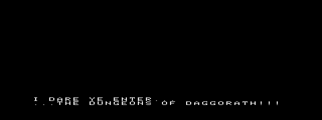
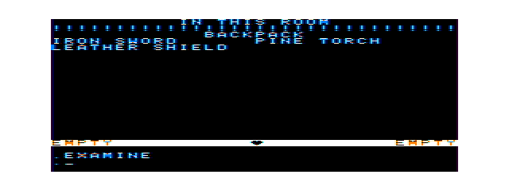
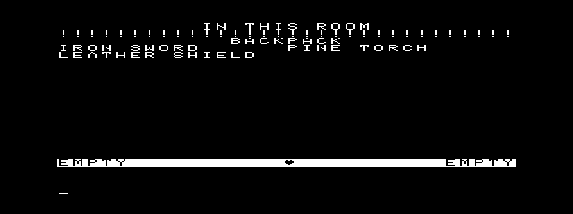
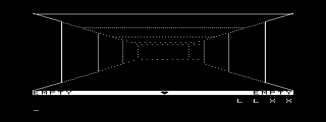
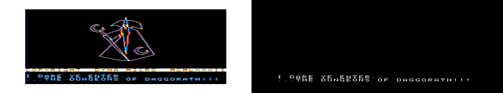
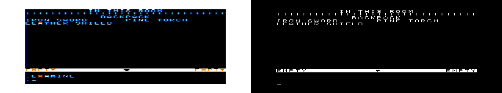
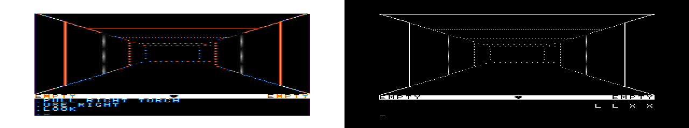
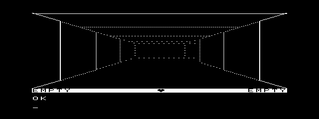
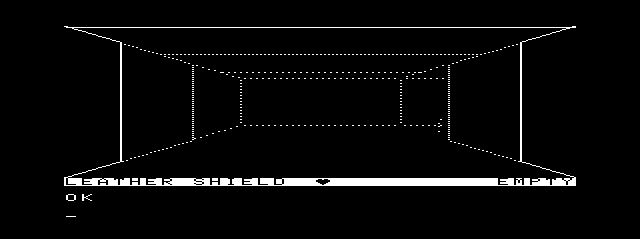
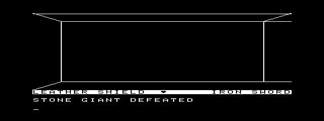

# Daggorath attract/intro visual fidelity M2

**Status:** source-coordinate correction, the mapped-text lifetime correction, and a fresh exact-build autonomous replay are complete. This pass does not extend autoplay beyond command 10, alter four-colour research, or change gameplay/scheduler/RNG behavior.

The original reference is the read-only recovered source at `/Volumes/SEDONA/Projects/daggorath-reference`, commit `a94326f00ebb16a106b540c58bc2ccf5f7b66dac`.  Its source-built 8 KiB ROM SHA-256 is `35e6a77354dcf1a3048f276824b7a0f9f759115fdd40603664cebfb3a7da6571`; original-capture provenance and timing are retained in [Attract M1](DAGGORATH_ATTRACT_M1.md).

## Curated comparison frames

The pairs below are deliberately small.  `*-original.png` is a source-built cartridge capture retained from M1; `*-eou.png` is from the M2 `doddemo` baseline described below.  The `*-original-eou.png` files put the original on the left and EOU on the right for direct review. Screenshots include host-window sampling and therefore are useful for choreography review, while source logical coordinates are the authority for layout.

| Phase | Original cartridge | NitrOS-9 EOU | Evidence |
| --- | --- | --- | --- |
| Welcome state |  |  | The retained original includes the preceding Wizard geometry.  The autonomous EOU runner begins at the welcome-text phase; that omitted Wizard chain is an existing, intentional choreography boundary. |
| `PREPARE!` |  |  | M2 corrects the source cell origin and restores `!`. |
| First AUTTAB EXAMINE |  |  | Both are logical command-1 EXAMINE states, not elapsed-time matches. |
| Lit autoplay corridor |  |  | A source-defined `USE RIGHT` consequence, after the active pine torch is lit. |
| Initial EOU dungeon | — |  | The source frame is known from the M1 trace (frame 1577), but was not retained as an independent curated image.  The initial rendered scene is immediately replaced by AUTTAB command 1; a 25 ms M2 observer saw the status transition but no stable geometry.  This row is explicitly unpaired rather than represented by a guessed source match. |

### Side-by-side review composites

These composites are literal source/EOU pairs, with no geometry resampling or coordinate overlay.  They make the distinct cartridge and type-5 scanout paths visible without claiming pixel identity.

| Phase | Original \| EOU composite |
| --- | --- |
| Opening/welcome |  |
| `PREPARE!` |  |
| AUTTAB command 1 |  |
| Lit autoplay corridor |  |

The EOU right side of the retained corridor composite predates the mapped-message lifetime correction recorded below.  Its `L L X X` text is retained as the diagnostic before-image, not as acceptance evidence for the corrected build.

## Coordinate model and measurements

The cartridge logical framebuffer is 256×192, with 32 bytes per scanline.  Its normal text cell is 8×8 logical pixels, with a five-bit-wide, seven-scanline glyph.  EOU retains that 256×192 logical framebuffer and presents it in the canonical 512×192 viewport within the type-5 640×200×2 CoWin.  Thus the source X coordinate doubles in the 512-pixel game viewport; screenshot chrome/scanout offsets are not presentation coordinates.

| Element | Original rule/evidence | Required logical placement | M2 EOU result | Pre-M2 difference |
| --- | --- | ---: | --- | --- |
| Primary text area | `COMDAT.ASM:TXTPRI` starts after the 19-row EXAMINE area and two status rows. `COMTXT.ASM:TXTCR` advances exactly 32 character cells. | Rows y=160, 168, 176, 184 | Uses the same four rows. | The first welcome line was passed as row 0 (y=160), despite source’s leading carriage return. |
| Welcome line 1 | `ONCE.ASM:DEMO10` first `OUTSTI` string begins with internal `I.CR`. | y=168, col 0 | `I DARE YE ENTER...` is rendered at y=168. | y=160. |
| Welcome line 2 | The following `OUTSTI` continues at the next cursor row. | y=176, col 0 | `...THE DUNGEONS OF DAGGORATH!!!` is rendered at y=176. | It lacked the source punctuation because only letters were mapped. |
| `PREPARE!` | `MISC.ASM:PREPAX` calls `EXAMIO`, sets `P.TXCUR` to `32*9+12`, and emits the compressed eight-character string. | Cell origin (12,9): x=96, y=72; cell field x=96–159, y=72–79; field centre x=127.5 | Clears the full logical framebuffer, then writes exactly eight source-font cells at (12,9). | It was placed in the primary text area using spaces as a visual-centering approximation. |
| Status/heart | `COMDAT.ASM:TXTSTS` begins at y=152.  The port’s existing source-derived status heart occupies cols 15–16, y=152–158. | Status y=152–159; heart x=120–135 | Unchanged. | None. |
| Dungeon viewport | `VIEWER` source geometry draws into the logical game field above the status/text bands. | logical 256×152 upper viewport | Unchanged. | None asserted by this M2 pass. |

The retained original `PREPARE!` bright-pixel rectangle is approximately logical x=98–148.5, y=72–78 after removing its 64,24 screenshot canvas origin.  The M2 EOU bright pixels are approximately x=97–155.5, y=72–78 after removing the EOU capture’s observed 64,26 viewport origin.  The declared cell placement is identical; the residual bright-pixel width reflects the 1-bit source glyph, the EOU type-5 scanout, and screenshot sampling, rather than a second layout rule.

## Original primary text-area model

The lower message area is a source-defined primary text buffer, not an inferred four-row region from the 200-pixel screen height. `COMDAT.ASM` defines `TXTPRI` at `D0$BAS + (256*20)` with `TXCHR = 32*4`; `COMTXT.ASM:TXTDPB` draws a five-pixel glyph over seven scanlines in an eight-pixel cell; and `TXTSER.ASM:TXTCHR` invokes `TXTSCR` when its cursor reaches 128 cells. The cartridge has no primary row at y=192.

| Primary row | Logical y | Source role | Persistence / cursor behavior |
| ---: | ---: | --- | --- |
| 0 | 160 | First primary message row | Cleared by `CLRPRI`; normal character output starts at the current `TXTPRI` cursor. |
| 1 | 168 | Second primary message row | `TXTCR` advances by 32 cells and resets column to zero. `ONCE:DEMO10` begins its first welcome string with this CR, so the first visible welcome line lands here. |
| 2 | 176 | Third primary message row | The next ordinary output persists here until a clear or scroll; the welcome's literal `...` line occupies this row. |
| 3 | 184 | Fourth primary message row / current prompt row in the initial sparse sequence | After the cursor reaches 128 cells, `TXTSCR` copies rows 1–3 upward, clears this row with `P.TXINV`, and resets the cursor here. `MISC:PROMPX` emits its own `CR` then `.` for ordinary interactive input. |

`CLRPRI` clears all four rows and homes `P.TXCUR`; `MISC:WIZIX0`, `MISC:WIZOX`, `PLOOK`, and fainting handling call it at their respective source transitions. The primary text buffer is distinct from the 19-row EXAMINE text buffer (`TXTEXA`, y=0–151) and the two-row status buffer (`TXTSTS`, y=152–159). Welcome text uses ordinary primary output and therefore follows the same cursor and scroll rules as later command/message output; `PREPARE!` instead selects `TXTEXA` through `EXAMIO`.

The M2 attract renderer exposes all four primary rows at the source coordinates and clears its four-row phase before the welcome sequence. The sparse welcome deliberately leaves rows 0 and 3 blank, which is why its screenshots do not visibly demonstrate all four rows or a scroll. The normal live renderer reconstructs the current scene/status and current input state each redraw; it currently displays its current result at y=168 and current editable input at y=184. It does not claim to emulate a retained multi-message transcript across scene rebuilds. That behavior is outside the autonomous M1B/M2 intro sequence; the source four-row capacity and scrolling rule are now explicit and locked by focused source/renderer coverage rather than being misrepresented as a two-row hardware limit.

## Source-derived correction

`SWCHAR.ASM:SWCTAB` and `CD.ASM` establish the internal glyph codes used by `OUTSTI`: `A`–`Z` are 1–26, `!` is 27, `?` is 29, and `.` is 30.  The port’s presentation mapper now supports those source codes and preserves the original eight-pixel cell advance.  It does not add proportional centering or change parser/prompt semantics.

`game_render_prepare()` is a presentation-only operation.  It clears the logical frame, just as `PREPAX → EXAMIO` selects/clears the EXAMINE display before output, then writes `PREPARE!` at source cell `(12,9)`.  The regular four-row attract renderer remains separate because `PREPARE!` is not primary-text output.

Focused regression coverage in `apps/daggorath/test_attract_layout.py` verifies the `PREPAX` source cursor contract, exact glyph pixels at `(12,9)`, the clear region, the leading-CR welcome rows, and `!`/`.` rendering.  It does not encode screenshot-pixel offsets as game behavior.

## Human-review correction pass

### Wizard disposition: existing subsystem, not a fake intro

The original sequence really does begin with the Wizard: `ONCE.ASM:DEMO10` sets autoplay, synchronizes, then dispatches `MISC.ASM:WIZIN0`; only after its vector/fade/message/wait/`WIZOUT` choreography does `ONCE` move on to level-two demo setup.  The existing `dodwiz` is a separate graphical program: it allocates and closes its own CoWin path, plays its measured frame sequence, and returns to Term.  `doddemo` owns a different graphics path and the retained `dodcmd`/`dodsched` lifecycle.

Reusing that implementation as a real `Wizard → messages → PREPARE! → demo` sequence requires the already documented chain/controller lifecycle: each chained process must rebuild local state and mappings while a single owner preserves the graphics environment.  Calling or copying `dodwiz` from `doddemo` would instead duplicate the Wizard or destroy/recreate the window.  That is a distinct opening-lifecycle milestone, so M2 deliberately leaves Wizard integration deferred and labels the opening composite accordingly.

### Leading-dot disposition: no missing intro dot

The source distinguishes two cases. `ONCE.ASM:DEMO10` emits its first expanded welcome string with an initial `I.CR`, placing `I DARE YE ENTER...` at primary row y=168; its next string begins with the three literal `I.DOT` glyphs, placing `...THE DUNGEONS OF DAGGORATH!!!` at y=176.  The M2 EOU baseline displays exactly those dots and no prefix before the first line.  `MISC.ASM:PROMPX` defines `I.CR,I.DOT` for the ordinary command prompt, so a dot must not be fabricated before every intro line or persist as a message cursor.

### `L L X X` / `H H H` disposition: mapped-overlay pointer lifetime fixed

The varying fragments were not source glyphs below the playfield. They appeared in the primary-text/input region after a command because `command-overlay.c` returned `DagOverlayContextV1.outputMessage` as a pointer to `dodcmd` static storage. `overlay-host.c` unlinked `dodcmd` and then `demo.c` rendered that dangling pointer. The freed temporary mapping could contain a different later pattern, explaining both observed strings.

The host now copies the NUL-terminated result message into its resident 32-byte storage while the overlay remains mapped, then performs `F$UnLink`; rendering receives only that resident copy. `apps/daggorath/test/overlay_host.c` overwrites its simulated mapped message during unlink and proves the caller still receives the pre-unlink text. This corrects the producer rather than clearing a screen region.

The post-review candidate was rebuilt twice byte-for-byte identically:

| Module | Size | Data request | CRC | SHA-256 |
| --- | ---: | ---: | --- | --- |
| `doddemo` | 21,846 bytes | 10,875 bytes | `59046C` | `f51e0bc19401f3bceba2b8a1fb2d8f1cf063041dcc4249788135b376db51eab5` |

The full host Daggorath suite passes against this candidate. The fresh exact-build replay below is the final acceptance evidence for this report; this preceding paragraph records the reproducible-build baseline that led into it.

### Status and heartbeat disposition: source coordinate translation is correct

`COMDAT.ASM:TXTSTS` starts at logical y=152. `game_render_status()` fills y=152–159, and `game_render_heart()` writes the two source heart columns at logical x=120–135 (columns 15–16), y=152–158. The type-5 viewport translation is `(physical x, y) = (64 + 2*logical x, 4 + logical y)`, so the heart PutBlk packet uses x=`$0130` (304), y=156 for its 32×7 physical image. The apparent low byte `48` is the low half of the 16-bit x coordinate, not x=48. No heartbeat timing, phase, or health behavior changed.

### Dungeon and status composition

The source and EOU corridor composite confirms the intended separation: the perspective field occupies logical y=0–151, the inverse status strip occupies y=152–159, and primary text/input starts at y=160. The EOU type-5 path remains monochrome and has different scanout/screenshot sampling from the source cartridge, but the logical viewport, status placement, hand labels, and heart origin use the same source coordinates. The pre-fix varying message fragments are the only confirmed composition defect from this review.

## Historical M2 live baseline

This run predates the final mapped-text correction candidate recorded below. It is retained as chronological before-evidence and is not the final M2 acceptance artifact. The exact production `doddemo` module in that earlier run was:

| Module | Size | Data request | CRC | SHA-256 |
| --- | ---: | ---: | --- | --- |
| `doddemo` | 21,732 bytes | 10,843 bytes | `1602CC` | `ca2d09a742ca47546cc2787df9fc7c877257d3d4cce36da83fcf02494e147721` |

A byte-verified production run in the recovered RGB EOU environment (`coco3h`, 2 MB, `montype r`) completed with guest status `000` in 79.419 seconds.  It observed one graphics departure and return to Term, then completed AUTTAB commands 1–10 through the accepted command-10 Combat M1 boundary.  Representative EOU samples were taken at 26.524 s (welcome), 28.025 s (`PREPARE!`), 31.029 s (first EXAMINE), 37.520 s (lit corridor), and 71.515 s (post-combat trajectory).  No game state, demo initialization, RNG, `dodcmd`, `dodsched`, heartbeat semantics, or AUTTAB command content changed for this presentation correction.

A separately rebuilt source ROM was byte-identical to the recorded M1 SHA.  An isolated attempt to add new frame-numbered original captures completed forty emulated seconds but this installed MAME frame notifier emitted no files; it adds no contrary visual evidence.  Existing M1 source-built images and its recorded original timeline remain the source-reference evidence for this report.

## Fresh M2 graphical acceptance

The private RGB observer was repaired without changing MCP production code: the restored MAME state replaces image-device state, so the disposable `flop2` must be mounted **after** `os9_restore_ready`; the private harness then preserves the already verified Term handshake for that harmless second-drive mount. The observer staged the candidate, restored `nos9_ready_v2`, loaded `dhbpack` and `demostage`, and ran `doddemo` with graphics enabled.

The host artifact verified before launch was `doddemo` SHA-256 `f51e0bc19401f3bceba2b8a1fb2d8f1cf063041dcc4249788135b376db51eab5`. The run completed with guest status `000` in 77.882 s, made one graphics departure, and returned to a verified Term prompt. Fresh compact snapshots are retained here rather than the private burst:

| Observed elapsed time | Fresh EOU evidence | What it establishes |
| ---: | --- | --- |
| 28.023 s |  | `PREPARE!` remains at the source EXAMINE cell. |
| 37.518 s |  | Initial source-derived dungeon/status composition; no stale mapped-overlay text. |
| 50.018 s |  | AUTTAB inventory/autoplay has advanced normally; the source text area is clean. |
| 71.511 s |  | Command-10 combat reached its stable `STONE GIANT DEFEATED` state with no `LLXX`/`HHH` fragment. |

The source-defined welcome dwell is shorter than the observer’s stable graphics-capture point: a 20 ms private capture bracketed its display transition but did not yield a stable opening bitmap. The retained baseline welcome frame above remains the direct visual evidence for its `I DARE YE ENTER...` / `...THE DUNGEONS OF DAGGORATH!!!` punctuation. The exact candidate separately passed the source-backed renderer test for the CR row, all three literal dots, and all four primary-row coordinates. This is an observer sampling limit, recorded explicitly rather than treating a delayed screenshot label as proof.

The fresh evidence confirms the accepted resident-copy fix: the former post-unlink text producer cannot be observed in the initial, autoplay, or post-combat primary area. The status heart stays at the documented source translation, and neither timing nor health semantics changed.

## Intentional remaining visual differences

- The autonomous EOU `doddemo` begins at the welcome-message phase; it does not yet chain the original Wizard vector/fade sequence into gameplay.  The Wizard is shown only on the original side of the first pair.
- EOU is intentionally CoWin type-5 monochrome 640×200×2.  Type-7/four-colour work remains deferred in [presentation colour research](DAGGORATH_PRESENTATION_COLOR_RESEARCH.md).
- This pass does not emulate incidental bare-metal renderer time, map-stage choreography, or AUTTAB 11–17.
- The original initial-dungeon frame is documented by M1’s source-built trace but is not represented as a fabricated frame pair here.  The paired EXAMINE and corridor frames exercise the same source-derived level-two renderer, status/hands, equipment, and autoplay path.

## Review conclusion

The fresh exact-build run is the M2 acceptance baseline. M2 corrects the measured welcome cursor rows/punctuation and the `PREPARE!` EXAMINE-cell placement/clear. The human-review pass additionally fixed the mapped-overlay result-message lifetime defect, verified that the intro dots already follow source semantics, and verified the heart/status coordinate translation. Wizard remains an explicitly documented lifecycle boundary, not a substituted image. The paired images are intended for visual judgment alongside those scope differences; they do not claim pixel identity across the cartridge and CoWin screen paths.
