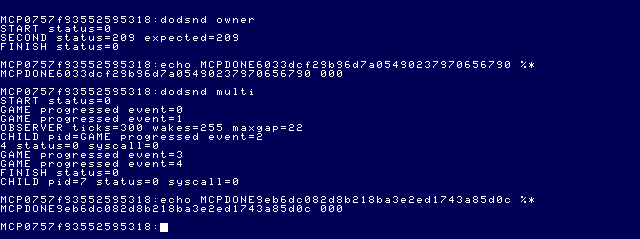
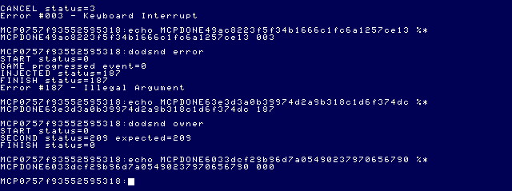
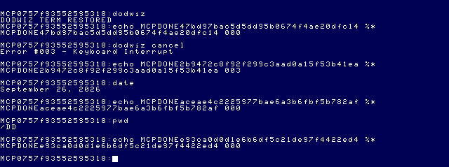
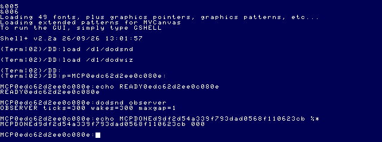

# Daggorath Audio Milestone 1

## Result and scope

The new `dodaudio` service and `dodsnd` harness exercise semantic SQUEAK through
anonymous OS-9 pipes and the Speech/Sound cartridge (SSC). Wizard source and
behavior are unchanged. This is an enhanced interpretation, not waveform-identical
DAC emulation. The approved four-step revision measures **about 32 ms**, replacing the initial
64-ms eight-step mapping. The nominal
original 6809 source model is approximately **14.28 ms**. The revision more than halves the duration error in absolute
milliseconds (about 50 ms excess becomes about 18 ms), but remains about 2.2 times
the nominal duration; it is not an exact timing match. No audio was added to the Wizard.

Captured PCM proves synthesis in MAME, **not playback through the user's speakers**.
The user reports hearing nothing. This service directly accesses documented Pak
registers; it does not require a guest SSPak driver in the boot. Host playback
routing and real-cartridge operation remain unverified.

## Architecture and public API

Source is under [apps/daggorath/src/audio](../../apps/daggorath/src/audio/).

| Files | Responsibility |
| --- | --- |
| `audio.h`, `event.c` | Semantic events, versioning and validation |
| `client.c`, `ipc.h`, `ipc.c` | Client lifetime, anonymous pipes, OS-9 process adapters |
| `service.c`, `service-module.asm` | Single cooperating service and dispatch |
| `backend.h`, `ssc.c`, `ssc_io.h`, `ssc_io.c` | Backend boundary and SSC implementation |
| `harness.c`, `harness-module.asm` | Production API exerciser, including observer |

`audio_start(client, servicePath, profile)` starts the helper once.
`audio_submit(client, operation, sound, gain)` queues one semantic request;
`audio_receive(client)` waits for its acknowledgement. PLAY acknowledgement means
programmed/accepted, **not playback complete**. The caller can continue between
submit and receive. `audio_finish` requests shutdown and reaps; `audio_cancel`
sends handled signal 3 and reaps. These are synchronization points, not a general
nonblocking event framework.

The backend interface supports open/play/stop/drain/close. Only SSC is implemented.
Future Mega Mini OPL3 can implement that boundary on real hardware; no simulated
OPL3, GMC, PSG, MIDI or DAC implementation is present. Game-facing requests contain
no AY register numbers. Profile selection is deployment configuration.

### Wire format v1

Eight bytes: `DA 01 opcode sound gain sequence 00 00`.

| Opcode | Meaning |
| --- | --- |
| 1 | PLAY: sound ID 0 (SQUEAK), gain 255 only in M1 |
| 2 | STOP, sound/gain must be zero |
| 3 | DRAIN, sound/gain must be zero |
| 4 | SHUTDOWN, sound/gain must be zero |

Replies echo the request with byte 4 replaced by OS-9 status. Startup uses opcode
and sequence zero. One request may be outstanding; sequence is an 8-bit counter.
Bad framing/version/reserved fields return 187; unsupported sound/gain/profile
returns 208. There is no promise of polyphony, arbitrary gain or event mixing.
DRAIN conservatively sleeps 12 ticks then explicitly stops the chip; it is a
bounded fence, not a hardware completion timestamp.

Two anonymous `/pipe` paths provide request/reply channels. The child inherits
request stdin and reply stdout; stderr remains separate. Partial reads are handled.
One pending eight-byte request bounds normal pipe pressure. The client must own its
child-reaping coordination: OS-9 F$Wait can reap another child, and a mismatched PID
is an error. This is not ready for unrelated concurrent child waiters without an
application-level coordinator. Pipe reads have no independent watchdog; MCP timeout
can detect a hung guest operation but is not an in-process recovery guarantee.

## Evidence and provenance

Consult [source precedence](../source-index/README.md),
[pipes](../source-index/PIPES.md), [sound](../source-index/SOUND.md),
[audio research](DAGGORATH_AUDIO_RESEARCH.md), and
[SSC probe](DAGGORATH_SPEECH_SOUND_PROBE.md).

- Original read-only `daggorath-reference/SOUNDS.ASM`: `SNDTAB` entry 0,
  `A$SQK0`, `SQUEAK`, `SNSQK1`, `SNSQK2`, `SNSUB2`, `SNOUT`, `SNWAIT`.
  This is the spider SQUEAK event. The harness requests that event; Wizard does not.
- `/dd/SOURCECODE/ASM/NITROS9/SCF/sspak.asm:SpkOut` supplies the PIA routing
  precedent. The historical source is evidence for that mechanism, not an assumed
  exact match to a loaded driver.
- Official upstream `nitros9-reference` commit
  `f470fa52eb172b59b22c1b722074998cb42de9b1`: `level1/modules/pipeman.asm`,
  `level1/modules/kernel/ffork.asm`, `flink.asm:FLinkReEntrant`, `fwait.asm`,
  `fsend.asm`, and `defs/os9.d`. F$Fork inherits paths 0–2; non-reentrant module
  linking supplies the cooperating single-instance check. See the indexed
  [runtime matches](../source-index/RUNTIME_MATCHES.md) for PipeMan limitations.
- [Tandy Speech/Sound manual](https://tlindner.macmess.org/wp-content/uploads/2006/09/sscmanual.pdf),
  pp. 10–11: reset/data/status; pp. 15–18: buffered tone events and explicit final
  silence; p. 26: timer base and buffer load; p. 28: stop/play commands.
- MAME 0.289 `src/devices/bus/coco/coco_ssc.cpp`: global Pak handlers, AY clock
  behavior, and raw audio output. Earlier live clock evidence is retained in the
  SSC probe report. The current profile explicitly chooses 3,579,544 Hz.
- [Motorola M6809 Appendix D transcription](https://www.maddes.net/m6809pm/appendix_d.htm)
  supplies instruction-cycle inputs to [squeak_model.py](../../apps/daggorath/squeak_model.py).
  The repository's `MCP/Documents`/`DOCS_INDEX.md` were unavailable; these identified
  primary manual/source references were used instead.

## Exact SSC interpretation

The original emits high/zero pulse pairs with 32 descending delay counts. Its
SNOUT multiplication/masking supplies the DAC values; there is no amplitude envelope
in this routine. The nominal model accounts for direct SNVOL access and gives
12,776 cycles / 894,886 Hz = about 14.28 ms. This excludes interrupts, dispatch,
wait-state effects and 6309/native differences; it is **not a measured cartridge
recording**.

The SSC interpretation groups the 32 descending waits into four groups of eight,
represented by delay counts 28, 20, 12 and 4. These rounded central samples retain
the rising pitch direction while reducing firmware events. They do not preserve
every instantaneous original pitch or its unequal cycle duration.

| Step | Source wait-count representative | Rounded target Hz | AY period, fast profile | Calculated AY Hz |
| --- | ---: | ---: | ---: | ---: |
| 1 | 28 | 1535 | 145 | 1542.907 |
| 2 | 20 | 1967 | 113 | 1979.836 |
| 3 | 12 | 2737 | 81 | 2761.994 |
| 4 | 4 | 4497 | 49 | 4565.745 |

The backend test now checks these exact periods, four amplitude-12 events and zero
event-duration bytes, as well as the original ownership/stop/cleanup assertions.
The user explicitly approved this mapping and corresponding expectation correction. Period = integer `clock / (16 * targetHz)`. The explicit
`ssc-mame-fast` profile uses 3,579,544 Hz. `ssc-slow` uses 1,789,772 Hz and is
host-tested only; neither profile auto-detects a later clock change.

Initialization sends `8F 01`, `98`, four four-byte channel-A events
`[12, periodHigh, periodLow, 0]`, final silence `[0,0,1,0]`, and `FF`.
PLAY sends just `D8`; STOP sends `CF`. The cartridge firmware advances the buffer
without CPU waveform generation. There are no interrupt hooks or interrupt masks.
Each command write is paced by a one-tick sleep; ready-bit polling is bounded to
12 attempts. Buffer initialization is relatively slow but happens once per service.

The earlier eight-step firmware sequence took about 8 ms per tone, 64 ms overall,
even with zero event duration. The four-step revision keeps timer base one, zero
duration bytes, fixed amplitude 12 (no envelope), and explicit final silence.
Only the tone table, loop bound, nominal grouping model and mapping assertions
changed. Service, IPC, ownership and DRAIN behavior are unchanged.

A prior timer-base-zero experiment failed with bounded 246 startup status; its
internal firmware cause was not established. Base one is the verified working
setting. This does not establish a universal minimum SSC duration. Shortening the
host's sleep does not accelerate a firmware-owned buffered sequence. No CPU waveform
synthesis or scheduling suppression was added to chase the 14.28-ms model.

## Ownership and cleanup

`dodaudio` is non-reentrant (At/Rv 01). A second concurrent instance is rejected by
OS-9 with 209; the original remains usable. Do not preload it with `load`, which
would hold a non-reentrant link and prevent the intended fork. The harness forks
`/d1/dodaudio` directly.

Backend acquisition checks idle status, saves PIA routing bits, resets the cartridge
once, and selects its mux. No MPI slot-selection writes are needed for the verified
global FF7D/FF7E handlers. Other SSPak clients, joystick/mux users, or differently
named direct hardware programs can still conflict: this is **not system-wide
arbitration**. Exclusive cartridge/mux use is an explicit deployment requirement.

Normal shutdown and handled signal/error send CF, restore only the saved mux bits,
and release the process. Reset is reserved for acquisition or bounded stop failure
recovery. Normal repeated events never reset. Forced uncatchable termination and
hardware failure cannot guarantee cleanup; no such guarantee is claimed.

## Build and artifact identity

```
python3 apps/daggorath/build_audio.py MCP/work/audio-m1-four/build
python3 apps/daggorath/build_audio.py MCP/work/audio-m1-four/rebuild
python3 apps/daggorath/test_audio.py
```

CMOC 0.1.90, lwtools 4.22, `--os9 -O0 --add-os9-stack-space=2048`.
[Exact commands/source hashes/module identification](assets/daggorath-audio-m1/build.json)
record both products. Independent builds were byte-identical.

| Module | Size | CRC | Type/language | Edition | At/Rv |
| --- | ---: | --- | --- | ---: | --- |
| dodaudio | 4137 | D6911A (Good) | 11, program/6809 | 1 | 01 |
| dodsnd | 7187 | CB2146 (Good) | 11, program/6809 | 1 | 81 |
| unchanged dodwiz | 19809 | FD6C50 (Good) | program/6809 | existing | existing |

The [artifact staging workflow](../architecture/NITROS9_ARTIFACT_STAGING.md) used a
fresh disposable floppy, privately cloned boot/media and a cold boot. No canonical
VHD or floppy was mounted for these tests. A fresh private checkpoint was aligned
with that disk; the configured ready-state name was used explicitly for the verified restore. No canonical save state was overwritten.
After a restore, the next RTC minute correction can still jump ticks; the observer
run was after that correction, and the passive clock trace was checked for it.

## Live results and measurements

[Exact structured responses](assets/daggorath-audio-m1/results.json) preserve markers,
status and timings. Command timings include startup, shell and MCP handshakes; they
are not effect duration.

| Command | Status | MCP elapsed ms | Finding |
| --- | --- | ---: | --- |
| dodsnd normal | 000 | 12047 | startup, PLAY, caller progress, drain, shutdown |
| dodsnd repeat | 000 | 15428 | five events, one initialization |
| dodsnd stop | 000 | 11057 | early STOP, clean shutdown |
| dodsnd cancel | 003 | 11558 | handled child cancellation, shell recovered |
| dodsnd error | 187 | 11421 | deliberate malformed-version service request |
| dodsnd owner | 000 | 14997 | second owner rejected with 209 |
| dodsnd multi | 000 | 15366 | observer and repeated-event caller both exited 000 |
| dodwiz, graphics allowed | 000 | 22800 | normal graphics departure/return, strict handshake |
| dodwiz cancel, graphics allowed | 003 | 10781 | Term restored after handled cancellation |
| date / pwd | 000 / 000 | 6452 / 7364 | strict shell healthy afterward |

The malformed-version injection alone bypasses client validation to test the
service error path. Ordinary sound tests use the public API. STOP/cancel are early
requests: this capture contains no sustained chirp for either, only acquisition/cleanup
level changes. They do not establish arbitrary mid-effect cancellation latency. The
protocol-error run allowed a complete 32-ms chirp before clean error exit. The service was repeatedly started and stopped.
MAME exited cleanly afterward.






The observer completed 300 ticks, 255 wakes, **largest gap 22 ticks**, including
process creation, disk loading, backend initialization and five chirps. This is
larger than the earlier isolated SSC 7–8-tick result, but far below the earlier
SS.Tone 124-tick result. It is not a steady-state CPU occupancy measurement and the
22-tick gap cannot be attributed solely to synthesis. Both processes progressed;
the service sleeps or blocks on its pipe while the chip generates the waveform.
A same-session idle control crossed an RTC correction and gave a spurious 181-tick
gap; it is excluded. Repeating that control immediately after restoring the same
private checkpoint gave **300 ticks / 300 wakes / maximum gap 1 tick**. Its passive
clock trace has no discontinuity after restore. The concurrent measurement window
(approximately emulated seconds 272–277) likewise contains no clock jump. Historical
SS.Tone numbers are comparison evidence, not a new SS.Tone run in this revision.

MAME recorded four-channel 48 kHz signed 16-bit WAV. Channel 1 (zero-based) contains
12 full chirps: normal, five repeated, protocol-error playback, and five concurrent.
With 1-ms AC-RMS detection windows they occupy **32–33 ms**; the occasional extra bin
comes from boundary alignment. Sample-level first-to-last departure from the DC
baseline measures **31.25–31.52 ms**, excluding the final low half-cycle. Therefore
“about 32 ms” is the supported duration, not a claim of exact 32.000-ms scheduling.
Four firmware steps are about 8 ms each; host sleeps do not generate those samples.

For the first normal chirp the measured interior cycle frequencies are
**1542.45, 1980.52, 2762.03 and 4565.43 Hz**, closely matching the integer-period
model. These estimates interpolate rising crossings over the central 4 ms of each
step. AC RMS is about **2850** sample units. Fixed amplitude 12 has no programmed
fade or envelope; each pitch is a square-wave interpretation, followed by explicit
silence. The original's continuous 32-count progression is reduced to four pitches.

[Small lossless diagnostic excerpt](assets/daggorath-audio-m1/squeak.flac) and
[measurements](assets/daggorath-audio-m1/measurements.json) are retained. The excerpt
is raw channel extraction without normalization, filtering or synthetic replacement.

Before and after every measured chirp, the sampled channel sits at a constant
**10371 DC level with zero AC RMS**. Following final cleanup the last recorded
second is exactly zero. MAME's SSC filter uses high-pass output for activity
detection but passes raw input to the output stream; constant raw DC does not mean
an ongoing oscillation.

There are still **±10371-sample raw level steps** around acquisition/cleanup, which
can create clicks in an AC-coupled playback path. The first normal acquisition also
contains 20-ms DC dropouts around 195.340–195.360 and 195.540–195.560 seconds in the
capture. These are separately recorded from the 195.421-second chirp; their precise
internal firmware/routing cause was not isolated. No “transient-free” claim is made.
The ordinary five-event repeated run has only the entry/exit large DC steps, not a
reset transient between events. Source and tests still enforce one reset at
acquisition and none between PLAYs. Real speaker audibility remains unverified.

## Regression, integrity and limitations

- Audio host tests: 36 checks (19 event/backend, 10 client/IPC, 7 service lifecycle).
- Existing Daggorath tests: 22 renderer checks, 2 presentation cases, 19 cached
  playback frames and 5 lifecycle cases. Existing assertions were not weakened.
- MCP: 115 tests passed, zero skipped; TypeScript build passed.
- Local report links, new-file trailing whitespace, and `git diff --check` passed.
- Wizard rebuilt byte-identically to the previous artifact; original-derived source,
  renderer, presentation and timing files remained unchanged.
- [Before/after SHA-256 evidence](assets/daggorath-audio-m1/hashes.json) confirms all
  canonical media and existing Wizard sources unchanged.
- Real hardware, slow-clock profile, sustained hardware contention, forced termination,
  and long-run service fault recovery are not validated by this milestone.

## Recommended Audio M2

Keep the approved four-step interpretation as the current enhanced SQUEAK mapping.
Before further fidelity work, compare it against a captured original cartridge event;
the 14.28-ms reference here remains a source-cycle model. Improve service startup/acknowledgement and
fault recovery before integrating it into a larger application with multiple child
processes. Validate real SSC ownership, clock profile and speaker routing separately.
Then add one further source-derived semantic event; do not add SQUEAK to Wizard.
Future hardware backends retain the semantic API but need their own ownership,
timing and cleanup tests. Mega Mini OPL3 remains a physical-hardware project.
