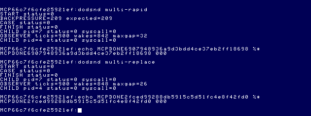
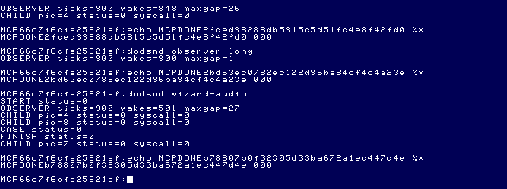
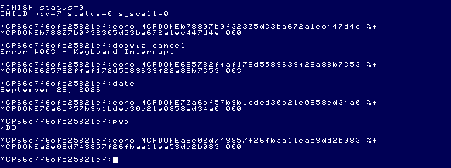

# Daggorath Audio M2 — implementation and validation record

Status: implemented and live-tested on disposable media. The approved M1 compatibility
test update passes. Follow-up controls identify a MAME speaker-routing gain artifact
triggered by brief EOU JoyDrv mux muting; see the investigation below. Production
audio behavior remains unchanged and physical-cartridge behavior is not verified.

## Selected effects and provenance

Exactly two additions join SQUEAK (ID 0): **WHOOP (14, A$SCRO)** and
**PHASER (13, A$RING)**. The original read-only reference is
`/Volumes/SEDONA/Projects/daggorath-reference/SOUNDS.ASM`, reference commit
`a94326f00ebb16a106b540c58bc2ccf5f7b66dac`. Existing OS-9 IPC/lifecycle provenance
remains as documented in M1; the read-only upstream reference is
`f470fa52eb172b59b22c1b722074998cb42de9b1`.

WHOOP is the longer scroll sweep: X=$100..1 through SNSQK1/SNSQK2/SNSUB2/SNWAIT.
`PUSE.ASM:USC200` invokes A$SCRO before changing to map display.
PHASER sets U=MSQUEK and repeats ten sweeps through PHAS1/PHAS2;
MSQUEK starts at X=$40. `PINCAN.ASM` invokes A$RING, and
`PATTK.ASM` dispatches object class+SNDOBJ before ring usage/damage processing.
`CD.ASM:K.RING=1` plus SNDOBJ=12 establishes ID 13.

Both synchronously write six-bit DAC samples through SNOUT, scaled by SNVOL;
SOUNDX clears the DAC afterward. They use high/zero pulses, decreasing delays and
no programmed amplitude envelope. Original foreground sounds share scratch state
and do not form independent overlapping voices. PHASER is **finite repeating**, not
an indefinite sustained tone. Its ten sweeps make coalescing, interruption and
completion meaningful without inventing a new sound or implementing heartbeat.

Using the M1 nominal 6809 cycle model `135+16*n` per pulse pair gives WHOOP about
626.79 ms and a PHASER sweep about 46.85 ms, or approximately 469 ms for ten.
Wrapper/dispatch cycles, interrupts and CPU differences are not a cartridge
measurement. See [M1](DAGGORATH_AUDIO_M1.md) and
[audio research](DAGGORATH_AUDIO_RESEARCH.md) for the source model's limitations.

## API and explicit policy

The existing version-1 eight-byte semantic protocol remains. PLAY additionally
accepts IDs 13 and 14 at gain 255. Callers use `audio_submit(..., AUDIO_PLAY,
AUDIO_WHOOP/AUDIO_PHASER, 255)` followed by `audio_receive`; submission permits
the caller to progress while the service performs the request. No channel, register, period or SSC command is
exposed. STOP, DRAIN and SHUTDOWN keep their operation numbers.

The service-owned backend holds an `AudioVoice`; the backend-independent decisions
are in [policy.h](../../apps/daggorath/src/audio/policy.h). States distinguish idle,
transient, finite repetition, replacement, stopped and shutdown. While blocked on
IPC, state is last-observed; it is reconciled against hardware before another PLAY
or during DRAIN. No worker waveform loop or interrupt handler was introduced.

| Incoming event | Active event | Decision |
| --- | --- | --- |
| Any supported | none | Start |
| SQUEAK / WHOOP | same | Stop and retrigger |
| PHASER | PHASER | Coalesce; retain the current ten-sweep sequence |
| Higher priority | lower priority | Stop, replace; never resume the interrupted event |
| Lower priority | higher priority | Discard immediately; no deferred playback |
| STOP | any | Stop hardware and clear active state |
| SHUTDOWN/error/cancel | any | Stop, restore owned routing, release process |

Priority is PHASER > WHOOP > SQUEAK. This is **port policy**, chosen to retain an
attack over a scroll cue or creature chirp. The serial original supplies no such
concurrent priority table. PLAY status 000 means the request was processed; it can
mean suppressed/coalesced, not necessarily a newly audible event. Gameplay
integration will need to retain original action fences where required.

## SSC channel and timing policy

One channel, A, is sufficient for the original non-overlapping foreground sounds.
No additional channels are enabled. Replacement explicitly sends CF before the new
buffer command; no cartridge reset occurs between effects. Acquisition/ownership
remain the M1 non-reentrant service plus exclusive external mux-use convention.

Manufacturer SSC manual pp. 10–11 defines delayed active-low sound status; pp. 15–18
specify four-byte tone records, 64-byte buffers and mandatory final silence;
pp. 26–28 define load/execute commands. The manual is linked in
[the probe](DAGGORATH_SPEECH_SOUND_PROBE.md). Repository manuals were unavailable;
identified manufacturer documentation and the previously verified EOU/MAME path
supply this evidence.

| Effect | Buffer allocation | Recipe |
| --- | --- | --- |
| SQUEAK | 0 | Existing four tones, periods 145/113/81/49, duration byte 0 |
| WHOOP | 1 | Eight tones from representative waits 240/208/176/144/112/80/48/16, duration bytes 17/14/12/10/8/5/3/1 |
| PHASER | 2–5 | Ten repetitions of six tones, representative waits 59/48/37/27/16/5, duration byte 0 |

Every recipe ends with amplitude-zero tone and FF terminator. WHOOP occupies 37
bytes including final silence/terminator. PHASER occupies 245 bytes and uses the
verified consecutive-buffer load/execute commands 8A/CA. No allocation overlaps.
The service loads all recipes once: 308 command/data bytes, paced by yielding.
This increases initialization cost (at least 314 yielding ticks including reset,
about 5.24 seconds at 60 Hz) but removes recipe uploads from event playback.
The intended long-lived service pays this once; acceptance harnesses deliberately
start a fresh service per case to exercise ownership and cleanup.

Target frequencies are rounded from the original nominal delay model. SSC periods
use integer `clock/(16*Hz)` with the existing explicit `ssc-mame-fast` 3,579,544-Hz
profile; slow-mode support is not a new live claim. All tones use fixed amplitude
12 without an envelope. The backend remains an enhanced square-wave interpretation.
The firmware, not the OS-9 process, advances tone steps.

| Effect | AY periods | Actual profile frequencies (Hz) |
| --- | --- | --- |
| SQUEAK | 145,113,81,49 | 1542.9,1979.8,2762.0,4565.7 |
| WHOOP | 994,867,738,609,482,353,225,97 | 225.1,258.0,303.1,367.4,464.2,633.8,994.3,2306.4 |
| PHASER | 269,225,181,141,97,53 | 831.7,994.3,1236.0,1586.7,2306.4,4221.2 |

No assumption that the manual's slow-clock frequency table applies to the canonical
fast MAME profile is made. There is no automatic unverified clock detection.

DRAIN polls sound activity with one-tick sleeps and a 180-tick bound, then explicitly
stops. This replaces the M1 fixed 12-tick fence, which would truncate the new longer
effects. A six-tick post-reset yield avoids sending configuration while the MCU is starting.
PLAY yields six ticks after D8/D9, or 18 ticks after CA, before acknowledging;
these are bounded startup allowances, not synthesis loops. Completion then uses
the activity signal. This limits acknowledged request rate and must be recalibrated
before claiming another clock profile or real-cartridge compatibility.

### Firmware timer and failed-pilot findings

The M1 timer-base byte 1 was unsuitable for these longer buffered sequences.
The manufacturer specifies the timer command but not absolute time units.
[Tim Lindner's firmware disassembly](https://tlindner.macmess.org/?page_id=96),
F0BD/F15C, identifies prescaler 31 and the timer reload register. Matching
[MAME 0.289 TMS7000 source](https://github.com/mamedev/mame/blob/mame0289/src/devices/cpu/tms7000/tms7000.cpp),
`timer_run`/`timer_tick_low`, gives:

`tick = (reload + 1) × 16 × 32 / MCU clock`.

Reload 55 at 3,579,544 Hz gives 8.009959 ms; reload 27 at 1,789,772 Hz gives the
same value (slow profile host-tested only). Base 1 gives approximately 0.286 ms.
The hypothesis that this overloaded firmware timer processing is supported by
truncated/inconsistent pilot playback, but CPU interrupt occupancy was not measured.
Read-only SSC RAM inspection verified complete recipes at offsets 0x200, 0x240,
and 0x280 before playback; missing upload data was not the cause.

A separate pilot with the corrected timer still truncated PHASER: I/O taps recorded
CA at 454.205 s, CF at 454.330 s, and the first observed period update at 454.417 s.
The six-tick startup allowance was too short for the long-buffer command.
The 18-tick allowance produced all ten sweeps in subsequent capture. It is an
empirically bounded MAME-profile allowance, not an undocumented hardware guarantee.

Nominal hardware recipe times are 32.040 ms (SQUEAK), 624.777 ms (WHOOP), and
480.598 ms (PHASER). Initial timer phase and firmware dispatch add variability;
measured PCM, not these formulas, determines the reported audible duration.
WHOOP quantizes source group timing into 18/15/13/11/9/6/4/2 timer ticks.
PHASER uses six approximately 8-ms steps per sweep, repeated ten times.
The latter loses some original within-sweep timing shape. No original waveform
or exact cartridge-fidelity claim is made.

## IPC and backpressure

The public client still permits one outstanding request. A second submit before
receive returns 209 locally. Acknowledged rapid requests are evaluated against the
current voice; there is no software event queue to replay stale requests later.
Suppressed requests and coalesced PHASER triggers are consumed immediately.
Firmware replacement is explicitly stopped before execution of the new recipe.
Untrusted clients writing arbitrary pipe backlogs are outside this single-client
protocol contract; there is no newly invented multi-client daemon.

## Validation

Live validation uses private EOU media and an isolated MAME 0.289 session. The
initial ready-state handshake succeeded. All measured commands below completed
through the normal separate status-marker/fresh-prompt protocol; status 187 and
003 are expected guest results for deliberately injected errors/cancellation.

The approved M1 compatibility update replaces its obsolete 24-byte initialization
expectation with complete protocol assertions. M1 loaded only SQUEAK: two timer
bytes plus one load command, four four-byte tones, and five silence/terminator
bytes. M2 adds WHOOP's eight tones and PHASER's sixty tones:

`2 + (1 + 4×4 + 5) + (1 + 8×4 + 5) + (1 + 60×4 + 5) = 308 bytes`.

The test checks timer `8F 37`, load commands `98/99/8A`, every channel/amplitude,
period and duration byte, each silence and FF terminator, and exact exhaustion of
the command stream. It does not merely change 24 to 308. Original SQUEAK pitch,
ownership, reset, stop, cancellation, bounded failure and routing-restoration
assertions remain unchanged. The complete M1 runner now passes all 36 checks.

| Host verification | Result |
| --- | --- |
| M2 policy/backend/recipe tests | 11 + 11 + 5 = 27 passed |
| Complete M1 audio suite | 19 backend/protocol + 10 client + 7 service = 36 passed |
| Renderer / presentation / cached-frame / lifecycle | 22 / 2 / 19 / 5 passed |
| Complete MCP suite | 115 passed, 0 failed, 0 skipped |
| TypeScript build | passed |
| Reproducible audio builds | both modules byte-identical |
| Reproducible Wizard builds | two fresh builds byte-identical to unchanged live-tested module |

Artifact identities verified by ToolShed (good CRC):

| Module | Size | CRC | Type/language | Attributes/revision | Edition |
| --- | --- | --- | --- | --- | --- |
| dodaudio | 5571 | ABB59D | 11, program/6809 object | 01, non-share/read-only, rev 1 | 1 |
| dodsnd | 9710 | CC26DC | 11, program/6809 object | 81, reentrant/read-only, rev 1 | 1 |
| dodwiz (unchanged) | 19809 | FD6C50 | 11, program/6809 object | 81, reentrant/read-only, rev 1 | 1 |

### Captured audio

MAME PCM is 48-kHz/16-bit. Durations below use 1-ms windows with nonzero AC
variation, merging gaps up to 10 ms so low-frequency square-wave plateaus do not
split an event. Resolution is approximately 1–2 ms; these are waveform duration
measurements, not wall-clock MCP call times.

| Case | Observed audible duration | Evidence |
| --- | --- | --- |
| SQUEAK, single | 32 ms | [raw excerpt](assets/daggorath-audio-m2/squeak.flac) |
| SQUEAK, five repeats | 31,35,31,29,29 ms | separately audible, no reset between events |
| SQUEAK, nine rapid accepted requests | 27–33 ms each | local second-outstanding submit rejected 209 |
| WHOOP | 620 ms | [raw excerpt](assets/daggorath-audio-m2/whoop.flac) |
| PHASER | 484 ms | [raw excerpt](assets/daggorath-audio-m2/phaser.flac) |
| WHOOP → PHASER, immediate | 94 ms WHOOP, 197 ms gap, 483 ms PHASER | lower event does not resume |
| WHOOP → PHASER, delayed | 190 ms WHOOP, 202 ms gap, 477 ms PHASER | [raw excerpt](assets/daggorath-audio-m2/replacement.flac) |
| PHASER coalescing | 482 ms | second request does not restart the sequence |

FFT spot checks agree with the programmed progression: WHOOP approximately
225/258/303/369/465/995 Hz at sampled stages; the short analysis window limits
resolution. PHASER's first sampled step is approximately 832 Hz; SQUEAK's is
approximately 1543 Hz. AY register traces independently show the complete recipes,
ten PHASER sweeps, and amplitude zero on channels B/C in every sampled frame.

CA has roughly 0.20-s startup latency in this profile; D8/D9 are much shorter.
This latency is separate from audible duration. Playback acknowledgement includes
the bounded startup allowance; cancellation/STOP cannot preempt an in-flight
request before that allowance completes. The explicit submit/receive interface
lets the game remain independently schedulable during it.

Raw MAME PCM includes a constant DC level (10371 in the sampled pre-event interval)
and reset/stop steps. Constant level is not a sustained tone. The excerpts retain
those steps without filtering or normalization. Post-event AC is silent; switching
transients remain a fidelity limitation. No claim about the user's speaker output
or real-cartridge fidelity follows from these captures.

### Scheduling

The observer uses the existing OS-9 clock routine and one-tick sleeps for 900 ticks.
Runs start early in a guest minute; the passive calendar/tick trace is retained
locally to identify RTC/save-state discontinuities. These are process-progress
measurements, not CPU-utilization percentages or IRQ-latency instrumentation.

| Concurrent workload | Observer ticks | Wakeups | Largest gap (ticks) |
| --- | --- | --- | --- |
| Fresh idle control | 900 | 900 | 1 |
| Five SQUEAK requests | 900 | 823 | 36 |
| WHOOP | 900 | 846 | 29 |
| PHASER | 900 | 844 | 32 |
| Rapid SQUEAK | 900 | 842 | 32 |
| WHOOP replaced by PHASER | 900 | 848 | 26 |
| Wizard + 15 PHASER sequences | 900 | 501 | 27 |

Each includes service startup and recipe upload; all children returned 000.
The observer progresses while audio plays, and the hardware continues tone
sequencing during service sleeps. No CPU waveform loop or interrupt masking was
added. The historical SS.Tone result was 124 ticks, ordinary CPU load 9 ticks,
and M1 audio 22 ticks under its shorter 300-tick experiment. These are contextual
comparisons, not identical-duration controlled CPU occupancy measurements.

### Lifecycle and Wizard results

[Exact structured MCP responses](assets/daggorath-audio-m2/verification.json)
retain markers, timings, statuses and shell-ready fields.
[Build provenance](assets/daggorath-audio-m2/build.json) and
[test results](assets/daggorath-audio-m2/tests.log) accompany them.

| Cases | OS-9 status |
| --- | --- |
| Single/repeated SQUEAK, WHOOP, PHASER | 000 |
| Rapid, immediate replacement, delayed replacement, coalescing, suppression | 000 |
| Active STOP and active SHUTDOWN | 000 |
| Active and ordinary cancellation | 003 |
| Active and ordinary deliberately malformed protocol | 187 |
| Duplicate-owner test | harness 000; second owner rejected 209 |
| All five observer/load cases | 000 |
| Wizard + PHASER loop | 000; all three children returned 000 |
| Wizard handled cancellation | 003 |
| Subsequent strict date / pwd | 000 / 000 |

Every response has `completed:true`, `timedOut:false`, `shellReady:true`.
Wizard runs use `allowGraphics:true`, with one display departure and verified
console return. The combined harness took 41,645 ms including initialization,
15 audio events and the MCP handshake; this is **not** the Wizard animation's
duration. Cancellation returned in 10,786 ms including its handshake.
The original-derived Wizard source, cache and module remained unchanged.

WHOOP's measured truncations were 189 ms for STOP, 235 ms for shutdown,
194 ms for cancellation and 190 ms for protocol error. No later event replay
was observed. The duplicate-owner test produced no sustained audio. MAME stopped
cleanly after final shell checks; the private MCP session was then closed.






**Initial concurrent PCM observation (resolved by the follow-up below):** fourteen of the fifteen Wizard-run PHASER events
had continuous measured spans of 476–483 ms. One event had a 480-ms first-to-last
span but three approximately 19-ms all-zero PCM gaps. Its AY frame samples stayed
at amplitude 12/channel A enabled, with continuing periods; I/O taps show CA at
829.157692 s and the next CF at 830.002132 s, after the sequence, not during those
gaps. That initial trace ruled out an explicit service STOP but did not record mux
changes. The follow-up below identifies the reproduced mechanism. Retained [unfiltered diagnostic capture](assets/daggorath-audio-m2/wizard-capture-gap.flac)
contains the anomaly. Do not describe this run as proof of uninterrupted concurrent
audio, or silently correct/filter out the missing samples. No production MCP or
Wizard modification was made in response.

## PHASER gap investigation — approved follow-up

### Controls and timing discipline

No production source changed in this follow-up. Private EOU image copies and a
fresh sealed artifact floppy held the unchanged dodaudio/dodsnd/dodwiz modules
plus a disposable `gaptest` coordinator. A cold boot was followed by a private
`os9_restore_ready` handshake. The coordinator uses the production semantic client;
each audio worker owns only its service child, while the coordinator separately
reaps the observer/Wizard. It introduces no hardware writes or new effects.

Controls run early in a guest minute. One initial standalone pilot crossed a
one-second RTC correction (61 ticks between frame observations); it was rejected
for timing and repeated. Every retained control has frame-to-frame calendar/tick
increments of 0–2 ticks, with no backward or large discontinuity. No additional
save-state restore occurred during retained measurements.

| Control | Events | Speaker gaps of at least 2 ms while upstream oscillates | Affected events |
| --- | --- | --- | --- |
| A: three separate PHASER invocations | 3 | 0 | 0/3 |
| B: repeated PHASER + observer | 15 | 2 × 20 ms | 2/15 |
| C1: repeated PHASER + Wizard | 15 | 3 × 20 ms | 2/15 |
| C2: repeat of PHASER + Wizard | 15 | 0 | 0/15 |
| D: repeated PHASER, no observer/Wizard | 15 | 3 × 20 ms | 1/15 |
| E1: repeated WHOOP + Wizard | 15 | 0 | 0/15 |
| E2: repeated WHOOP + observer | 15 | 5 × 20 ms | 2/15 |

All retained controls returned 000 with a fresh prompt. Four events in each
Wizard control started while graphics was selected; the remainder continued after
Term returned. All thirteen detected gaps occurred in Term, including C1's gaps
after Wizard returned. Thus the table does **not** claim that all fifteen events
overlap graphics or that the C1 gaps occurred during graphics.

Observer B: 900 ticks, 861 wakes, maximum gap 30 ticks. Observer E2: 900 ticks,
869 wakes, maximum gap 30 ticks. Both children and their audio workers exited 000.
These include initialization and remain substantially below historical SS.Tone's
124-tick maximum gap. They are not CPU-utilization measurements.

[Exact control responses and gap intervals](assets/daggorath-audio-m2/gap-controls.json)
include unique markers and timings. [Final shell responses](assets/daggorath-audio-m2/gap-shell-results.json)
record resident-module identification, Wizard cancellation 003, and strict date/pwd
000. Both normal Wizard controls returned 000 and verified graphics-to-Term return.

### Instrumentation and common timeline

Only an ignored private bridge copy was instrumented. Read-only/pass-through taps
recorded FF01/FF03/FF23 (PIA routing), FF7D/FF7E (SSC reset/data), FF7F (MPI), and
FF98/FF99 (display), with emulated time and CPU PC. Frame observations recorded the
OS-9 calendar/tick, all sixteen AY registers, GIME mode and MAME mute state.

MAME's verified `machine.sounds[tag].hook` and `emu.register_sound_update` APIs
captured floating-point samples at two points: `coco_sac_tag` (SSC waveform before
output gain) and `ssc_audio` (downstream speaker). Each callback recorded emulated
end time, first sample and count. These map commands, routing writes, display and
PCM to one timeline across the initial restore. Event starts/stops are anchored by
CA/D9/CF, not inferred from nonzero period registers. AY frame sampling cannot see
every 8-ms step; continuous upstream samples provide the stronger evidence here.

MAME `-wavwrite` captured 48-kHz/16-bit four-channel PCM internally; no microphone,
loopback driver or macOS audio capture was used. All **39,695,360 available speaker
hook samples** match WAV channel 1 exactly after MAME's documented float-to-int16
conversion, with zero mismatches. The WAV has 641 additional terminal samples not
flushed to the hook file at shutdown; those are outside every control interval.
[Exact comparison counts](assets/daggorath-audio-m2/gap-pcm-equality.json).

No gaps were hidden, filled, interpolated or normalized. The retained
[paired diagnostic excerpt](assets/daggorath-audio-m2/gap-upstream-speaker.flac)
uses left=upstream SSC and right=speaker on identical sample indices. Conversion to
int16 follows MAME's conversion; it does not repair missing samples.

### Correlated example and verified mechanism

For the first B gap:

| Emulated time | Observation |
| --- | --- |
| 293.640021–293.660021 s | 960 consecutive zero speaker samples (20 ms); upstream SSC keeps oscillating |
| 293.659801359 s | FF23 ← 34 hex: sound disabled; writer PC B0F8 |
| 293.660000000 s | MAME periodic sound update occurs while cartridge output is disabled |
| 293.660115366 s | FF23 ← 3C hex: sound restored; writer PC B139 |

Actual mux disable duration: **0.314007 ms**, not 20 ms. During the speaker gap,
AY R7=FE (tone A enabled), R8=12 (fixed amplitude), R9/R10=0; tone periods advance,
the upstream waveform remains non-silent, MAME global mute is false, and there is
no SSC command/reset or MPI-selection write. The same block-boundary relationship
holds for **all thirteen gaps**, with 0.314006–0.314007-ms mux pulses.
[Per-gap correlated evidence](assets/daggorath-audio-m2/gap-correlations.json).

The source path explaining it is:

1. EOU JoyDrv `SSJoyXY` briefly disables sound, changes joystick mux selection,
   reads the axes, then restores the saved mux and sound-enable values.
2. MAME [`coco.cpp:soundmux_status/update_sound`](https://github.com/mamedev/mame/blob/mame0289/src/mame/trs/coco.cpp)
   derives cartridge SOUND_ENABLE from those PIA outputs.
3. [`coco_multi.cpp:set_sound_enable`](https://github.com/mamedev/mame/blob/mame0289/src/devices/bus/coco/coco_multi.cpp)
   forwards it to cartridge slots. The SSC's
   [`set_sound_enable`](https://github.com/mamedev/mame/blob/mame0289/src/devices/bus/coco/coco_ssc.cpp)
   sets SAC/SP0256 output gain to zero or one.
4. [`sound.cpp:set_output_gain/update/compute_dependants/do_update`](https://github.com/mamedev/mame/blob/mame0289/src/emu/sound.cpp)
   updates the source and its upstream dependencies before changing the scalar
   gain. It does not first render the downstream speaker to that transition time.
   The speaker later mixes its pending block using the source's **current gain**.
   If the 20-ms update lands in the brief disabled interval, that whole pending
   speaker block is mixed at zero gain. Otherwise a block can miss the brief mute.
5. `streams_update` writes that already-mixed speaker PCM to WAV. The zero block
   therefore exists upstream of the WAV writer and the host audio device.

This explains why most of the silent block precedes the actual mux-disable write,
why gaps are exactly one audio block, and why identical effects sometimes pass:
occurrence depends on the phase of JoyDrv polling versus the sound-update boundary.
It is not a random PHASER step loss or a fixed gap in its ten-sweep recipe.

### JoyDrv provenance and confidence

The runtime `ident -m JoyDrv` returned edition **9**, size **388**, CRC **10DF89**,
matching the boot-image module. Six observed mux-writing PCs match that module's
instruction offsets at a consistent virtual base B0C1:

| Writer PC | Module instruction offset | Action |
| --- | --- | --- |
| B0F8 | 34 hex | STA 23,X: disable sound |
| B10A | 47 hex | STB 3,X: select joystick mux |
| B12F | 6C hex | STA 1,X: restore SEL1 |
| B131 | 6E hex | STB 3,X: restore SEL2 |
| B139 | 75 hex | STA 23,X: restore sound |
| B199 | D6 hex | STA 1,X in low-resolution axis read |

The matching behavior appears in EOU
`/dd/SOURCECODE/ASM/NITROS9/SCF/joydrv_joy_beta6.asm:SSJoyXY` (lines 96–150,
CR-normalized), and upstream
`/Volumes/SEDONA/Projects/nitros9-reference/level2/coco3/modules/joydrv_joy.asm:SSJoyXY`
at commit `f470fa52eb172b59b22c1b722074998cb42de9b1`. This is behavior/offset and
runtime-metadata evidence, not a claim that the complete EOU and upstream source
or binaries are identical. [Runtime identification](assets/daggorath-audio-m2/gap-joydrv.png).

### Conclusion and remaining boundary

**High confidence:** reproduced gaps arise from brief guest JoyDrv audio-mux muting
being expanded into a full downstream MAME 0.289 speaker block by scalar-gain
update ordering. The SSC synthesis remains autonomous and continuous upstream.
The waveform, amplitude, mixer, command and capture evidence all agree.

The original capture's three gaps, remeasured at sample precision, are also exactly
960 samples/20 ms at WAV times 832.420021, 832.520021 and 832.620021 seconds. The
initial approximately-19-ms description came from coarse activity windows. The
original run lacks mux taps, so attribution of those historical gaps specifically
is a high-confidence inference from this reproduced signature, not a retroactively
measured mux trace.

| Candidate origin | Finding |
| --- | --- |
| dodaudio state machine / SSC transmission | No transition or command during gaps; no production bug identified |
| AY programming, mixer or amplitude | Valid state plus continuous upstream samples excludes loss of synthesis |
| MPI / mux ownership | Real shared PIA muting by JoyDrv is the trigger; no MPI selection change |
| OS-9 scheduling | Changes relative phase; does not stop the hardware oscillator or explain 20-ms mute duration |
| MAME AY emulation | Upstream oscillator output continues; fault localized downstream |
| MAME routing/buffering | Verified scalar-gain/block interaction at the speaker mix |
| WAV writer / host audio capture | Speaker samples already zero and WAV is bit-identical; no host capture path |
| Wizard graphics | Not necessary; reproduced without Wizard and with WHOOP; observed gaps were in Term |

Production code remains unchanged. Reasserting the mux in a busy loop, preventing
JoyDrv polling, disabling scheduling or masking interrupts would be inappropriate
workarounds. Future MAME work should address downstream gain-transition timing;
future physical-hardware audio work still needs coordinated ownership of the shared
joystick/audio mux. Neither is implemented here.

A physical cartridge would encounter the actual brief mux interruption and analog
response; this investigation does not establish its audible result or imply that
it suffers MAME's 20-ms block amplification. Physical measurement remains necessary.
[Source URLs/hashes and diagnostic provenance](assets/daggorath-audio-m2/gap-provenance.json)
identify the read-only MAME tag and ignored control/instrumentation files. Complete
raw PCM/traces remain under `MCP/work/audio-m2-gap/`; curated evidence contains only
small excerpts and correlations. The control harness changes no production API,
effect, ownership model or canonical media.

## Limitations and Audio M3 heartbeat direction

No gameplay integration, extra backend, heartbeat or Wizard buzz was added. A future
heartbeat should preserve health/fainting gameplay timing in game logic and express
beat events semantically. Its priority/channel relationship to foreground effects
needs separate source/runtime research; do not simply enable another AY voice or
port a single-bit busy loop. Keep sound synthesis offloaded and cancellation-safe.

## Reproduction and scope

Build with CMOC 0.1.90 and lwtools 4.22:

```sh
python3 apps/daggorath/build_audio.py MCP/work/audio-m2/build-latency
python3 apps/daggorath/build_audio.py MCP/work/audio-m2/rebuild-latency
python3 apps/daggorath/test_audio.py
python3 apps/daggorath/test_audio_m2.py
python3 apps/daggorath/test.py
python3 apps/daggorath/test_presentation.py
python3 apps/daggorath/test_playback.py
python3 apps/daggorath/test_lifecycle.py
npm test
npm run build
git diff --check
```

The build script records the exact CMOC command, source/header hashes and ToolShed
identification in `build.json`. Both modules use `--os9 -O0 --intermediate
--add-os9-stack-space=2048`; the script records full paths and source lists.
`dodaudio` is intentionally non-reentrant to retain M1 ownership exclusion.
`dodsnd` is reentrant so observers and clients can coexist.

Use [artifact staging](../architecture/NITROS9_ARTIFACT_STAGING.md): fresh artifact
floppy, add dodaudio and unchanged dodwiz while detached, verify attributes, then
seal and cold boot with private copies of both EOU images. No canonical VHD is
installed into or attached. A private ready state is created only after the new
floppy is attached. Do not restore an older state across a host-modified filesystem.

Read-only diagnostics were added only to an ignored copy of the bridge under
`MCP/work/audio-m2/runtime`: frame sampling of AY registers and OS-9 clock,
pass-through FF7D/FF7E access taps, and SSC static-RAM snapshots. No tap changed
read/write values. Production MCP and Wizard code were hash-checked unchanged.
MAME's `-wavwrite` captured four channels at 48 kHz; channel 1 (zero-based) carries
SSC output. This proves emulated output, not sound from the user's speakers.

[Machine-readable media hashes](assets/daggorath-audio-m2/media-hashes.json).
Canonical before/after SHA-256 values (identical):

| Media | SHA-256 |
| --- | --- |
| 63SDC.VHD | db2f0f444073d3b88a3610a63ec9f7d2e2dd4299347181faa6b2b2aa9637de2c |
| 63SDC-MCP-DEV.VHD | 4c6bdc0cd2f68aa57a9c75f75f15fe429f30926aa522917dd8d14aa1b9ae622e |
| 63EMU.DSK | 9a51adb8656b9f003c7f822352c291487362f1b4c43aac1a16672d5d2bcb4c40 |

Final local-link validation, untracked text whitespace checks and `git diff --check`
passed. No source/media/reference repository changes outside the listed audio M2
implementation and evidence were made; no commit was created.
