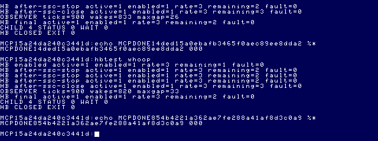
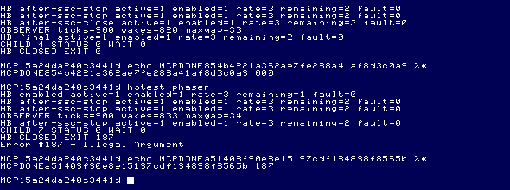
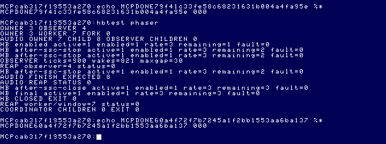
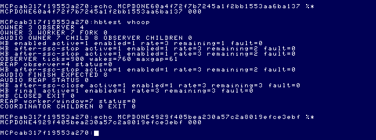

# Daggorath Audio M3 — heartbeat source model and implementation gate

**Status: READY FOR NATIVE HEARTBEAT in resident/post-intro execution.**
Section 13 completes production-candidate acceptance after the approved harness
ownership correction. Active rb1773 HALT floppy I/O remains outside the timing
guarantee; full-game integration is still gated. Sections 11–12 preserve the
intermediate failed fixture runs and are superseded by section 13.

 The live integration-gate
follow-up in section 6 demonstrates independent tones and autonomous service
progress, but rejects two channel-local stop candidates. At that earlier checkpoint, production heartbeat
remained disabled. Section 7 investigates the independent native PB1 alternative;
the bounded pin update works, but the tested process scheduler does not establish
faithful fast cadence under concurrency. Section 8 identifies the supported VIRQ
driver architecture and records that research pass’s lifecycle/probe gate.
Section 9 validates the counter-only driver lifecycle and records cold-loading
video-tick losses. Section 10 identifies the HALT floppy path, clears the
Wizard-specific startup timing concern, and passes the resident activation
boundary; active floppy I/O and untested full-game resource lifetimes remain
explicit limits. Sections 1–5 and their host-regression notes record the initial
source-model pass, before that live follow-up.

## Evidence and provenance

- Original read-only checkout: `/Volumes/SEDONA/Projects/daggorath-reference`,
  commit `a94326f00ebb16a106b540c58bc2ccf5f7b66dac`.
- [Audio research](DAGGORATH_AUDIO_RESEARCH.md), [M1](DAGGORATH_AUDIO_M1.md),
  [M2](DAGGORATH_AUDIO_M2.md), and [source-index navigation](../source-index/README.md).
- Tandy Speech/Sound Cartridge Owner's Manual, pp10–11 (status), pp21–23
  (shared envelope), pp24–28 (direct access and commands), Appendix B
  (registers). The previously retrieved PDF-page-labelled transcription is
  `/private/tmp/daggorath-audio/sscmanual.txt`; it is a local research cache,
  not a vendored manual. `MCP/Documents/` and `DOCS_INDEX.md` are absent in
  this checkout. No local-manual coverage is implied.
- Official MAME 0.289
  [coco_ssc.cpp](https://github.com/mamedev/mame/blob/mame0289/src/devices/bus/coco/coco_ssc.cpp),
  especially `cocossc_sac_device::sound_stream_update` and
  `sound_activity_circuit_output`. The source was retained during M2's gap
  investigation under `MCP/work/audio-m2-gap/coco_ssc.cpp`.

## 1. Original heartbeat semantics

All original paths in this section are relative to the reference checkout above.
These are source observations, not measurements of original cartridge audio.

### Electrical mechanism, cadence and pulse meaning

`COMMON.ASM:CLOCK/CLK30` runs on the video interrupt. If `HBEATF` is nonzero,
it decrements the **byte** `HEARTC`. On zero it reloads `HEARTC` from `HEARTR`,
reads PIA1 port B, XORs `BIT1`, and writes it back. `CD.ASM` defines PIA1 as
`$FF20`, port-B offset 2 and `BIT1=$02`: this is `$FF22` bit 1.

There is no finite pulse recipe, waveform loop, amplitude parameter, or second
scheduled write to finish a pulse. The output holds its new level until the next
edge. With an unchanged positive interval J and video frequency F:

- edge interval: J/F;
- full electrical high/low cycle: 2J/F;
- edge rate: F/J; full-cycle frequency: F/(2J).

The source does not establish the acoustic duration/envelope of a speaker thump.
That requires the analog/output path or controlled original PCM evidence. Do not
label an SSC note duration as the original pulse duration.

A zero countdown/rate byte wraps through 255 on decrement: it represents **256
ticks**, not silence or an invalid negative duration. Disable is a separate flag.
No long sound-generation loop occurs in the heartbeat handler. Its optional visual
heart update is additional IRQ work; it is not a foreground audio wait.

### Health calculation

`HUPDAT.ASM:HUPD00..HUPD20` builds 24-bit numerator `64*PPOW` and denominator
`PPOW+2*PDAM`. Repeated subtraction increments T6 **including the final borrowing
subtraction**. Therefore, for positive power and the ordinary living-player domain:

`HEARTR = floor(64*power/(power+2*damage)) + 1 - 19`.

The header's formula omits that extra one; implementation must follow instructions.
Example ratios, using power 160:

| Damage | HEARTR | Edge interval at nominal 60 ticks/s | Full electrical cycle |
| --- | --- | --- | --- |
| 0 | 46 | 766.667 ms | 1533.333 ms |
| 40 | 24 | 400 ms | 800 ms |
| 80 | 14 | 233.333 ms | 466.667 ms |
| 128 | 6 | 100 ms | 200 ms |
| 160 | 3 | 50 ms | 100 ms |

These are arithmetic targets, **not M3 measured cadence**. Exact video frequency
must be recorded with eventual live captures. The isolated helper accepts only
`power>0` and `damage<=power`. It rejects other inputs without assigning a rate;
it does not pretend to reproduce death, arithmetic wrap, or the zero-denominator
loop of arbitrary corrupt game state.

### Start, update and disable

- `ONCE.ASM:COMINI` clears game RAM and initializes port B with its one-bit sound
  bit low. `GAME50` calls `INIVU`, dispatched to `PLOOK.ASM:INIVUX`.
- `INIVUX` calculates the rate, **increments** HEARTC, decrements HEARTF and
  HBEATF, then updates the display. On initially cleared state, the first edge is
  one video tick later. It does not generally assign HEARTC=1: subsequent calls
  can have different phase and increment/wrap behavior.
- `HUPDAX` changes HEARTR without changing HEARTC. The in-progress countdown
  finishes at the old deadline; the next reload uses the latest rate.
- `MISC.ASM:WIZIX` clears HBEATF. Disabled IRQs leave the countdown and output
  level untouched. It does **not** explicitly drive the sound bit low.
- `WIZIX0`, used by the intro, skips this disable prologue. Fresh intro starts
  with cleared flags; do not infer that WIZIX0 always disables an existing heart.
- `PUSE.ASM:USC210` clears **HEARTF**, the visual flag, when showing the map.
  It does not clear HBEATF. Audio and visual enables must remain distinct.

### Callers and gameplay relationships

| Source/label | Why rate is updated or heartbeat state changes |
| --- | --- |
| `PLOOK.ASM:INIVUX` | Initial/reinitialized view; rate update and audio/visual enable |
| `COMPLR.ASM:HSLOW/HSLOW2` | Damage recovery, followed by rescheduling using HEARTR |
| `CRETUR.ASM:CMOV30` | After creature attack processing |
| `PATTK.ASM:PATT99` | After player attack processing; power may have changed |
| `PTURN.ASM:PMOV90` | Movement adds `(weight >> 3)+3` to damage before rate update |
| `PGET.ASM:WUPDAT` | Get/drop weight update calls HUPDAT; weight itself is not a direct operand of its formula |
| `PUSE.ASM:UFL900` | Strength/healing/poison flask handling, after flask sound |
| `MISC.ASM:WIZIX` | Disable for wizard presentation, including death sequence |
| `PATTK.ASM` ring-riddle path | Calls INIVU again; not necessarily an initial zero-state enable |
| `PINCAN.ASM` | Wizard presentation through WIZIN |

`HUPDAX` also checks fainting: signed comparison at <=3 initiates fainting, and
while fainted recovery requires >4. It finally compares power and damage; damage
strictly greater than power branches to DEATH. DEATH invokes WIZIN, which disables
the heartbeat, then displays the death message and waits for restart. Fainting
itself does not clear HBEATF.

`COMPLR.ASM:HSLOW2` uses HEARTR as its next recovery delay. Audio must **not own**
healing, fainting, death, visual flashing or player state. A future game process
must preserve those relationships independently of backend sound success.

### Interaction with transient sounds

`COMSWI.ASM:SWISER` enables IRQ processing for the foreground sound services.
The IRQ heartbeat can therefore toggle during a synchronous DAC effect. It has no
transient-priority arbitration, is not restarted on SQUEAK/WHOOP/PHASER, and does
not wait for their completion. This establishes software overlap; it does not
establish ideal analog mixing of the original electrical outputs.

## 2. Isolated reference model added

[heartbeat.h](../../apps/daggorath/src/audio/heartbeat.h) separates the living-player
rate calculation from the countdown, enable gate and output phase. It contains no
SSC/AY registers, OS calls, waveform generation, gameplay loop or recovery logic.
It is **not yet called by the audio service**.

Its bulk-advance operation reports how many source edges elapsed and the final
phase. That return value must never be interpreted as instructions to replay a
backlog of audible pulses after scheduling delay. `heartbeat_update` preserves the
remaining countdown; identical updates do not retrigger it. Disable freezes phase.
Initial remaining count 1 models the fresh initial-view case only, not every
possible later INIVUX call.

New tests compare bulk advancement against literal byte-decrement behavior for all
256 HEARTR byte values, plus healthy/damaged rates, invalid player inputs, update
phase retention and disable/resume. Run:

```sh
python3 apps/daggorath/test_audio_m3.py
```

Result: **20 source-semantic checks passed**, including the 256-value comparison.
This is not an M3 backend/service/lifecycle test pass.

## 3. Proposed API/state boundary — not implemented

Use an explicit heartbeat-state operation, separate from AUDIO_PLAY and transient
priority. Its meaning is enabled/disabled plus the game-derived reload interval;
backend register numbers, channels and pitches must not cross the boundary.

- Latest interval replaces earlier desired state; preserve the current deadline.
- Identical updates are idempotent.
- Original software semantics favor independent overlap, not priority replacement.
- Service STOP/SHUTDOWN must silence all owned audio and prevent later automatic
  revival. The source's held DC level on disable is not an excuse to leave an SSC
  tone active after termination.
- DRAIN needs an explicit transient-only meaning when persistent state is active;
  otherwise it can never mean “all audio naturally finished.”
- Future backends may approximate timbre, but must declare timing/phase differences.

The M1 fail-if-called mock extension for a new backend heartbeat operation was
approved by the user and added to the M1 service mock. It asserts if invoked;
no M1 case invokes it. The production backend operation and completion strategy
are not implemented. Existing M1 assertions are untouched.

## 4. Concrete SSC/M2 compatibility gate

M2's `ssc.c:refresh` uses FF7E bit5 to decide that its foreground voice completed.
The manufacturer's status description is global, with no per-channel identity.
MAME 0.289's `cocossc_sac_device` feeds the combined waveform through a high-pass
filter and envelope follower; `sound_activity_circuit_output` applies thresholds.
It is **not** a buffer-finished flag or a channel-A completion flag.

Consequences of simply enabling heartbeat on channel B:

1. Heartbeat energy can keep sound-active asserted after a transient finishes.
2. Gaps in a heartbeat envelope do not prove the transient completed either.
3. M2 DRAIN can time out, or global quiet can be misinterpreted as completion.
4. M2's documented `CF` command stops **all sound**, including another channel.
   It is used for STOP, replacement/retrigger, DRAIN cleanup and shutdown.
5. The service blocks in `ipc_read` when idle. It cannot automatically resume a
   software-suppressed heartbeat merely by adding state to its existing refresh.

These are source-derived incompatibilities, not a claimed M3 live reproduction.
M2 remains valid for its existing single transient lane; do not change its tests
to hide the conflict.

The independent AY channels and shared hardware envelope are promising, but do
not by themselves solve command completion, phase-preserving updates, global-stop
scope, or automatic resumption. A free-running envelope with a restarted rate is
not the source countdown semantics demonstrated above.

### Required bounded validation before production integration

- Prove the chosen channel-B pulse/continuous-envelope mapping in an isolated probe.
- Observe all AY mixer/amplitude/envelope state and SSC status during channel-A
  transients; establish a completion method that cannot mistake heartbeat energy
  for transient activity.
- Verify scoped transient interruption and restoration without cartridge reset.
- Establish a yielding service wake mechanism if software deadlines are necessary.
  Do not assume SS.Ready works on our pipe: the runtime index matches PipeMan
  edition 5/CRC ECE938 to the bundled beta6 binary, while the reviewed ordinary
  upstream PipeMan GetStt is a no-op. A different named-pipe implementation has
  SS.Ready support; its existence does not establish availability here.
- Reuse M2's synchronized PCM/observer methodology, including its documented
  JoyDrv/MAME 20-ms output-block muting boundary.

No production workaround, suppressed-heartbeat policy or new helper process is
claimed verified by this document.

## 5. Remaining M3 work

SSC interpretation/channel allocation, service integration, stale-update handling
under actual IPC load, PCM cadence/transitions, observer measurements, live overlap,
STOP/SHUTDOWN/cancellation/error/ownership regression, reproducible M3 modules and
module identities are **not complete**. No M3 audio artifact or audible result is
claimed. Wizard and existing effects have not been changed. No media was mounted or
written, and no commit was created in this source-research pass.

## Host regression for this partial change

- Complete M1 audio: 36 passed, including the approved fail-if-called mock.
- Complete M2 audio: 27 passed.
- New source-semantic model: 20 passed.
- Other Daggorath renderer/presentation/cache/lifecycle: 22/2/19/5 passed.
- Complete MCP: 115 passed, zero failures/skips. The first sandboxed attempt
  could not create tsx's IPC socket; the permitted rerun passed.
- TypeScript build passed. Two audio builds are byte-identical to each other
  and the existing M2 binaries: dodaudio 5571 bytes/CRC ABB59D; dodsnd 9710
  bytes/CRC CC26DC. These are unchanged M2 identities, **not M3 artifacts**.
- Existing production-source and canonical-media SHA-256 values match the
  pre-work snapshot in `MCP/work/audio-m3/before.json`. New heartbeat.h is an
  isolated reference model and is not linked into either production module.
- Local document links and whitespace checks pass. No M3 live test is claimed.

## 6. Integration-gate follow-up: live probes, September 26

**NOT READY FOR HEARTBEAT INTEGRATION.** Autonomous progress and two-channel
sound generation were demonstrated. A safe channel-local cancellation operation
for the existing buffered foreground recipes was **not** established. The
production dodaudio/backend, IPC protocol and M1/M2 recipes remain unchanged.
There is no production heartbeat and no final heartbeat PCM in this work.

| Mechanism | Result |
| --- | --- |
| A naturally finishes while B remains audible | Verified |
| Guest foreground-local completion detector | Not implemented; global AF empirically unsuitable, recipe deadline remains a candidate |
| Direct R8=0 as foreground_stop | Rejected: subsequent buffered tone re-enables A |
| Channel-A silence buffer as foreground_stop | Rejected: did not interrupt the ongoing WHOOP |
| Stop B without affecting A | Verified with direct R9=0 |
| All-silent / cancellation / error cleanup | Verified with CF and existing ownership cleanup |
| Autonomous yielding service wake | Demonstrated in a separate service-mechanism probe |
| Production latency/queue/lifecycle guarantees | Not established by the bounded probe |

### Probe implementation and separation

- [m3_gate.c](../../apps/daggorath/probes/m3_gate.c): reuses the **unchanged** M2
  SSC transport, ownership acquisition and WHOOP recipe. Adds an independent B
  tone and tests natural completion, direct A mute, a silent A buffer, B mute,
  cancellation and deliberate error. It is not linked into dodaudio.
- [tick_gate.c](../../apps/daggorath/probes/tick_gate.c): blocked service plus
  sleeping wake helper and independent synthetic command producer. Uses the
  source-derived countdown but generates **no heartbeat audio**.
- [gate_coordinator.c](../../apps/daggorath/probes/gate_coordinator.c): waits only
  for its own direct children; service probes own their helper children. Reuses
  unchanged dodsnd observer-long and dodwiz.
- [m3_capture.lua](../../apps/daggorath/probes/m3_capture.lua): read-only AY,
  PIA/SSC write, video/clock and speaker-stream observations. Set
  `DOD_GATE_CAPTURE` to an existing output directory ending in `/`, then append
  it only to a private bridge copy. No production MCP source was changed.
- [analyze_gate.py](../../apps/daggorath/probes/analyze_gate.py): register/PCM
  analysis using recorded sound-hook sample blocks across state restoration.
  Requires NumPy; optional FLAC export uses the installed `/opt/local/bin/ffmpeg`.

The probe's `000` status means the experiment ran and cleaned up successfully.
It does **not** mean a rejected silence strategy passed its hardware criteria.

### Completion: what the experiment establishes

B uses AY fine/coarse period 200/1 (period 456), fixed amplitude 12 and the verified
fast profile. Its nominal frequency is `3579544/(16*456) = 490.62 Hz`.
A runs the actual M2 WHOOP on channel A. Mixer 3C hex enables the two tone lanes
and disables noise/C; natural A silence changes it to 3D while preserving B.

In synchronized controls, A became active approximately 48.8 ms after D9 and
reached its terminal silence approximately 666.3 ms after D9. These are
**frame-sampled register times**, with about 16.7-ms resolution, not sub-sample
PCM onset estimates. R8 became zero, R9 remained 12, and the B waveform continued.
FF7E remained 223 decimal (DF hex, bit5 low). Therefore AF still said sound-active
after A finished. This is a live counterexample to using AF as A's completion.

A service-owned recipe deadline is the appropriate candidate to investigate next:
record the acknowledged start and fixed clock profile, derive duration from each
recipe's `(duration+1)` timer counts and final silence, and explicitly account for
SSC command/startup latency. WHOOP has 78 tone timer counts plus the terminal
silence. With the established 8.009959-ms timer count, that is about 632.8 ms of
recipe time. The measured start offset explains much of the observed 666-ms
command-to-silence span, within frame sampling resolution.

That arithmetic is **not yet a verified completion implementation**. The current
startup fences and one WHOOP isolation test do not prove a universal upper bound
under queued commands, contention, other profiles or real cartridge firmware.
Do not convert a generous fixed delay into a claim of explicit completion. No
AF-independent DRAIN or deadline feature was enabled in production.

AY registers used here were read through MAME's diagnostic API. The documented
SSC AF interface is register **writing**, not a verified guest per-channel readback
API. Do not turn the diagnostic observation into an invented NitrOS-9 driver API.

### Foreground-local versus global silence

The synchronized direct-register test observed:

| Time after D9 | A amplitude | B amplitude | Meaning |
| --- | --- | --- | --- |
| 48.8 ms | 12 | 12 | WHOOP starts while B remains active |
| 232.4 ms | 0 | 12 | Direct AF/R8=0 takes effect |
| 299.2 ms | 12 | 12 | Next buffered WHOOP tone restores A amplitude |
| 666.3 ms | 0 | 12 | WHOOP reaches its natural terminal silence |

Thus AF/R8=0 is a momentary mute, **not cancellation of the queued recipe**.
The second candidate preloads unused sound buffer 7 with an A-only silence and
executes DF during WHOOP. The original sweep still runs through its remaining
periods and reaches silence at the same approximately 666-ms point. It did not
interrupt it early. B's period/amplitude remain intact throughout both candidates.

The manufacturer's command map documents CF as **stop all sound**. The reviewed
map does not establish a channel-specific buffered-sequence cancel command.
Neither passing AY register evidence nor a silent sample interval proves that
there are no pending writes which will restart A.

Do not expose either rejected operation as `foreground_stop()`. A future valid
operation must cancel or exhaust all future A writes and leave B active. Waiting
for natural completion changes M2's interrupt/STOP behavior; CF followed by
reconstructing B violates the requirement that foreground cleanup not silence B.
No such workaround was installed. Reliable cancellation is the outstanding gate
before choosing a foreground sequencer/deadline implementation.

Stopping B with AF/R9=0 was independent: A continued all remaining WHOOP period
changes and reached its normal terminal silence. CF set R8/R9/R10 to zero and
mixer FF. Acquisition used the normal two reset writes; no between-operation
cartridge reset was needed or used. CF remains the verified **all-silent** primitive
for fatal cleanup and ownership release, not a valid scoped stop.

### Autonomous service clock and latency

The tick probe inherits a read/write pipe as path 0. A normal child process sleeps
for two ticks and writes a fixed eight-byte wake frame. The service blocks in
I$Read; no pipe-ready polling, waveform polling, IRQ installation or scheduling
masking is used. A separate producer sends rate-change, disable and shutdown
frames after successive 60-tick sleeps. Normal console paths are restored at exit.

Before each frame is handled, the service samples the existing read-only EOU
`os_clock` adapter and advances by the **elapsed** tick difference, including
minute wrap. It does not assume that one message equals two elapsed ticks.
Coalesced elapsed advancement does not emit a burst of missed audible pulses.
The state is initially enabled at interval 46, updated to 3 while preserving the
remaining countdown, then disabled; no audio backend receives those state changes.

| Control | Service observations | Model edges | Largest observation gap | Command delivery latencies |
| --- | --- | --- | --- | --- |
| Tick service alone | 87 | 12 | 9 ticks | 0 / 0 / 1 tick |
| Tick service + observer | 87 | 12 | 9 ticks | 1 / 0 / 1 tick |
| Tick service + observer + Wizard | 65 | 12 | 101 ticks | 1 / 1 / 2 ticks |

Delivery latency is measured from the producer's timestamp immediately before
writing its frame to service receipt, **not** from an ideal scheduled deadline.
A delayed producer may itself wake late. The 101-tick service gap is therefore
not contradicted by low delivery latency. An earlier commentary misread a small
screenshot as 73-tick command latency; rereading the original shows 1 tick. The
correct values above are retained in the evidence.

The probe demonstrates autonomous progress with no game command arriving, source
countdown updates and clean normal shutdown. It is **not** a production wakeup
implementation: timer messages can queue, helper death/partial I/O and bursty
state-update coalescing need dedicated tests. A bounded single-credit wake/ACK
scheme is a candidate to avoid accumulated wake traffic, not a demonstrated fix
for the graphics-run gap. Keep the existing one-outstanding-client-request rule;
future pending state updates should replace an unsent desired state, not form a
replay queue. None of those future policies is claimed live-verified here.

The coordinator uses absolute module paths and these runs include module loading
and graphics initialization. A warm-resident control is needed before attributing
the large observation gap to the wake mechanism. The synthetic state is active
only during the first two control intervals; this is not a full-intro persistent
heartbeat stress test. Wizard graphics was observed from emulated 448.393 to
464.547 seconds, and returned through the normal graphics-aware handshake.

### Observer results and timing integrity

| Control | Observer ticks | Wakes | Largest observed gap |
| --- | --- | --- | --- |
| Two-channel WHOOP/B probe | 900 | 845 | 35 ticks |
| Autonomous tick service | 900 | 840 | 28 ticks |
| Tick service + Wizard | 900 | 472 | 83 ticks |

All children reported zero. Compare the prior M2 gap investigation's 30-tick
observer maxima and historical SS.Tone's 124 ticks as context, not a normalized
CPU-occupancy benchmark. The isolated tick mechanism yields; the graphics stress
case is not evidence of guaranteed three-tick audio deadlines.

Two initial pilots crossed RTC corrections (frame-derived tick jumps of 60 and
3541 modulo 3600) and were excluded from timing conclusions. Natural/direct-mute
controls were repeated. Every retained final control and the retained earlier
silence/B-stop controls had frame-to-frame tick deltas of 0–2. Each filesystem
change used a detached fresh disposable floppy and a cold boot. Private checkpoints
were created after the corresponding disk was attached; an old disk-cached state
was not restored across host filesystem edits.

### PCM, register evidence and known mux gaps

The retained diagnostic captures are **SSC test tones, not heartbeat mappings**:

- [Natural A completion with B sustained](assets/daggorath-audio-m3-gate/natural-sync.flac).
- [Rejected direct A mute, including output gaps](assets/daggorath-audio-m3-gate/register-sync.flac).
- [Register transitions, PCM windows and mux correlation](assets/daggorath-audio-m3-gate/isolation-analysis.json).
- [Exact MCP responses](assets/daggorath-audio-m3-gate/mcp-results.json).
- [Two-channel observer](assets/daggorath-audio-m3-gate/isolation-observer.png),
  [tick observer](assets/daggorath-audio-m3-gate/tick-observer.png),
  [Wizard stress](assets/daggorath-audio-m3-gate/tick-wizard.png).

The clean natural control's normalized speaker-stream AC standard deviations are
approximately 0.0913 with B alone, 0.1173 with A+B, 0.0913 after A finishes and zero
in the selected post-CF window. Spectral peaks near 490–491 Hz agree with B's period
at the available FFT resolution. No speaker audibility on the user's machine or
physical-cartridge result is claimed.

Three exact 20-ms zero blocks occur in the retained direct-mute control, and four
in the two-channel/observer control. Every one correlates with FF23 writes 34→3C
hex about 0.314 ms apart, from PCs B0F8/B139: the documented JoyDrv/MAME routing
signature from M2. These are distinct from A's buffered amplitude restart. All
zero samples are retained. Excerpts preserve order and timing, with only MAME-like
float-to-int16 clipping/truncation and lossless FLAC encoding; no normalization,
interpolation or gap removal was applied. Full WAV/hook traces remain ignored
under `MCP/work/audio-m3-gate/`.

### Lifecycle and regression

All successful isolation, autonomous and coordinated probes returned 000 with a
fresh prompt. `m3gate cancel` returned **003** and `m3gate error` returned **187**;
both had R8/R9 zero and mixer FF by the next observed cleanup frame (about 199 ms
after the WHOOP play command), followed by silent PCM. Strict date/pwd/procs
returned 000. The final process listing contained no tickgate, m3gate or gateco
process. MAME was stopped cleanly and the private MCP client closed.

Host regression: **M1 36; M2 27; source model 20; renderer/presentation/cache/
lifecycle 22/2/19/5; MCP 115**, all passed. TypeScript build passed. Existing
production audio/Wizard modules are byte-identical to their previous versions;
no source or test assertion was changed to make these probes pass.
[Test log](assets/daggorath-audio-m3-gate/tests.log).

| Module | Bytes | CRC | Meaning |
| --- | --- | --- | --- |
| m3gate | 7090 | 6F9BBC | Final isolated audio probe, including cancellation |
| tickgate | 5067 | 24B8ED | Autonomous synthetic-state probe |
| gateco | 3543 | FD462B | Observer/Wizard coordinator |
| dodaudio | 5571 | ABB59D | Unchanged production M2 |
| dodsnd | 9710 | CC26DC | Unchanged production M2 harness/observer |
| dodwiz | 19809 | FD6C50 | Unchanged Wizard |

The earlier silence/B-stop controls used m3gate 7025 bytes/CRC 433571, before adding
self-cancellation. The final natural/direct-mute/error/cancel/coordinator controls
used the final artifact above. All probe modules are edition/revision 1,
program/6809-object, reentrant/read-only; dodaudio retains its non-share ownership
attribute. Both builds of each final probe/audio/Wizard artifact were byte-identical.

Build the disposable modules with:

```sh
python3 apps/daggorath/build_gate.py MCP/work/audio-m3-gate/build
python3 apps/daggorath/build_gate.py MCP/work/audio-m3-gate/rebuild
```

[Exact commands, dependency hashes and ToolShed identities](assets/daggorath-audio-m3-gate/build.json)
and [toolchain versions](assets/daggorath-audio-m3-gate/toolchain.json) accompany the
results. Use the existing [artifact workflow](../architecture/NITROS9_ARTIFACT_STAGING.md)
with private VHD/boot-floppy copies; do not install these into canonical EOU media.
The retained analysis is reproducible with NumPy and the ignored capture directory:

```sh
python3 apps/daggorath/probes/analyze_gate.py MCP/work/audio-m3-gate
python3 apps/daggorath/probes/analyze_gate.py MCP/work/audio-m3-gate final-
```

[Before/after canonical media hashes](assets/daggorath-audio-m3-gate/media-hashes.json)
are identical; the stock image remained read-only and was never mounted. No MCP,
Daggorath production audio or reference-repository source was modified in this gate
investigation. New code is confined to disposable probes/build/analysis support.

### Remaining decision boundary

A foreground-local cancellation mechanism that preserves pending-recipe semantics
and B continuity is still missing. The two tested shortcuts fail. The next bounded
work must establish a documented scoped cancel or validate a different foreground
sequencing strategy against **all** M1/M2 waveform, interruption and latency
requirements. Separately, completion deadlines and the wake helper require the
additional validation identified above. Do not enable heartbeat or declare M3
ready on the strength of independent tones and a successful normal exit alone.


## 7. Native CoCo heartbeat investigation (2026-09-26)

This supersedes the assumption that persistent heartbeat must use an SSC voice.
Section 6 remains the result for the rejected SSC integration shortcuts. Production
`dodaudio` is unchanged. The following native experiment uses disposable programs
and private EOU media copies only.

### Original electrical waveform, not a synthesized note

Original reference `a94326f00ebb16a106b540c58bc2ccf5f7b66dac`:
`COMMON.ASM:CLOCK/CLK30` (lines 429–441), `ONCE.ASM:COMINI/IRQSYN`,
`CD.ASM:PIA$1/P.PIIOB/BIT1` and `HUPDAT.ASM:HUPD00..HUPD90`.
The actual output operation is:

```asm
LDB 2,X       ; X=$FF20; read PIA1 port B
EORB #$02     ; toggle PB1 only
STB 2,X
```

There is **one transition per countdown expiration**, not a short pulse pair.
The output remains high or low through the entire following interval. No busy
loop generates a thump. Startup establishes low PB1; subsequent events alternate
high/low. A complete electrical cycle has two events. At constant rate J, high
and low last J video ticks each. At J=46 the full cycle is about 1.53531 seconds;
at J=3 it is about 0.100129 seconds on the measured NTSC clock. Acoustic response
of a physical speaker is not defined by the software bit duration.

COMINI writes `$FA` to PIA1 DDRB: bits 7–3 and 1 are outputs; bit 2 and bit 0
are inputs. It then selects port data with `$FF23=$3C` and writes `$F8` to
`$FF22` (video bits high, heartbeat low). `$FF01/$FF03=$34` selects the DAC,
`$FF21=$34` leaves the cassette motor off. IRQSYN enables the PIA0 field IRQ;
it does not switch the sound mux for each heartbeat. **Original heartbeat runs
while the analog/DAC path remains enabled**, including during foreground effects.
CLOCK enters with IRQ masked by CPU interrupt entry; the initialized PIA1 FIRQ
sources are disabled. The pulse code does not change interrupt masks, DDR or
mux controls. It changes B/condition codes and PB1; IRQ return restores CPU state.
Disabling HBEATF freezes countdown and output level, not necessarily a low pin.

[Motorola M6809 programming manual, Appendix D](https://www.maddes.net/m6809pm/appendix_d.htm)
gives indexed load/store 4+index cycles and immediate EOR 2; the five-bit offset
adds one cycle per access. The three original output instructions therefore take
**12 6809 cycles**, about 13.41 µs at 0.894886 MHz. The enabled, expiring countdown
path through STB takes 38 cycles (excluding visual-heart work, IRQ entry/exit and
earlier CLOCK work). Neither number is the held-level duration. CPU acceleration
changes this tiny execution cost, not the video-counted edge interval.

The local `MCP/Documents/` and `DOCS_INDEX.md` are absent. Hardware authority used:
[Tandy Color Computer Technical Reference III, PIA and Sound Output, Table 4](https://www.bighole.nl/pub/mirror/homepage.ntlworld.com/kryten_droid/coco/coco_tm_s3.htm).
PB1 is separate from the selectable DAC/cassette/cartridge input. The manual
recommends using one source at a time and notes that PB1 must be an output. This
caution and the cartridge's actual simultaneous use are both retained; an ideal
physical linear mix is not assumed.

Installed-MAME evidence is consistent with
[`mame0289 coco.cpp:pia1_pb_changed/update_sound`](https://github.com/mamedev/mame/blob/mame0289/src/mame/trs/coco.cpp):
PB1 drives `sbs` independently of analog mux selection. The separate cartridge
SOUND_ENABLE follows FF01/FF03/FF23. Thus **native heartbeat does not inherently
require mux switching**, and an SSC-global activity flag does not measure it.

### EOU ownership and bounded probe

Reused EOU provenance: `/dd/SOURCECODE/ASM/NITROS9/SCF/joydrv_joy_beta6.asm:SSJoyXY`,
with runtime JoyDrv edition 9, size 388, CRC 10DF89 and the matching writer PCs
recorded in [M2](DAGGORATH_AUDIO_M2.md#joydrv-provenance-and-confidence).
Upstream `level2/coco3/modules/joydrv_joy.asm:SSJoyXY` at `f470fa52` saves/restores
FF01, FF03, FF20 and FF23 while reading joystick axes. It does not toggle PB1.
`vtio.asm:ReadKys/FuncKeys` scans PIA0; its SSTone dispatch delegates to SndDrv.
These observations do not establish exclusive ownership of all PIA registers.

Upstream `level2/coco3/modules/covdg.asm:DispAlfa` preserves bits 0–2 when merging
video bits into FF22. Other window/video paths and drivers must still be audited
for a production device service. `joydrv_6551*/joydrv_6552*` initialization and
`level1/modules/sc6551.asm` show that port-B reads can acknowledge CART interrupts.
Bit-banger DriveWire also reads FF22. This probe is restricted to the measured
canonical EOU configuration, not a universal driver for those combinations.

The live EOU baseline is DDRB `$F8` (PB1 input), control B `$34`, output latch
`$04`. The disposable [native probe](../../apps/daggorath/probes/native_beat.c)
accepts only control `$34` or `$3C` (ignoring read-only interrupt flags), saves
PB1 and DDRB bit 1, enables only that output, and restores them on handled exit.
It never restores a stale whole video byte. Control-register bank selection is
restored immediately. No IRQ handler is installed; no OS calls occur while masked.

Each edge saves CC, masks IRQ/FIRQ for a short PIA read/modify/write, and restores
CC. This protects against a scheduled or interrupt-driven competing port update;
**the waveform itself does not require interrupt masking for milliseconds**.
The instrumentation adds two harmless control reads bracketing the data update.
From ORCC through PULS the diagnostic edge sequence has a conservative 6809 cost
of 43 cycles (about 24.0 µs at 1.789772 MHz; native-6309 timing is measured below).
Acquisition/release have additional bounded DDR operations, once per invocation.
There are no delay loops or masked intervals between edges. FIRQ/NMI/cart-driven
configurations are not certified by this test.

The probe sleeps until the current countdown deadline, reads the existing verified
EOU clock adapter, and advances the original model by **actual elapsed ticks**.
Late execution updates to the final phase; it never replays a backlog in a tight
loop. That preserves semantic phase/countdown but cannot reproduce audible edges
missed during a long scheduling delay. No claim of hard real-time delivery is made.
The first clock sample precedes diagnostic printing, so startup printing contributes
to the reported maximum lateness. There is no CPU consumption while F$Sleep blocks.
Production command/IPC wakeup integration is outside this disposable experiment.

### Original-vs-native capture and first concurrency pass

A source-built original cartridge (same unchanged reference checkout, not a newly
authenticated retail dump) ran diskless on installed Ample MAME 0.289, coco3h,
2M/RGB. Read-only FF22 taps and a 48-kHz MAME WAV captured gameplay after the intro.
Nineteen original edges at PC C2BB alternate F8/FA. Eighteen intervals measure
**0.767649734–0.767660909 s**, mean **0.767654825 s**, agreeing with 46 video ticks.
No original memory or health values were patched to create this reference.

The native probe's steady slow intervals average approximately 0.767655 s. Its
first interval is shortened to correct the startup-print delay; this is reported,
not removed from the trace. Fast and repeated-fast runs give **198 physical edges**
for 200 elapsed semantic edges: startup printing skips two events. The remaining
intervals are **49.897–50.232 ms**, mean 50.064259 ms. The independent original
46-tick measurement predicts 50.064445 ms for three ticks. These are finite runs,
not a worst-case scheduling guarantee.

In the chosen rising-edge windows, the original PCM baseline goes from -0.015625
to +0.234375; EOU goes from -0.25 to 0. Both have an identical **0.25 full-scale
step**. The DC offsets reflect the rest of the emulated sound path; they are not
heartbeat amplitude changes. Both have the short resampler transition/ringing,
with differing fractional-sample alignment. This supports the same PB1 waveform
mechanism, not bit-identical full recordings or a measured physical loudspeaker
envelope. No sampled heartbeat player or artificial decay envelope was added.

Each instrumented edge's FF23-read bracket measured **13.409–13.410 µs**. This
bracket is inside, not the entirety of, the masked interval. The conservative
43-cycle bound above covers ORCC through restored CC, including diagnostic reads.
Measured acquisition first-control-read → final-control-write was 27.377 µs;
release's DDR transaction was 28.495 µs, each with bounded entry/exit overhead.
No critical block contains a loop, call, sleep or filesystem operation. At 20
edges/second, the 24-µs critical-section bound accounts for under 0.05% of elapsed
time; this is **not** a measurement of all C/clock/service CPU overhead.

The initial coordinator intentionally used absolute module paths, retaining cold
module-loading pressure. All child statuses were zero and Term returned:

| Control | Observer wakes / 900 ticks | Observer largest gap | Native physical edges / semantic edges | Native longest held-level interval |
| --- | --- | --- | --- | --- |
| Native fast + observer | 845 | 40 ticks | 198 / 200 | 54.012 ms |
| Native fast + SSC two-channel/WHOOP + observer | 789 | 48 ticks | 182 / 200 | 1.444244 s |
| Native fast + Wizard + observer | 472 | 57 ticks | 144 / 200 | 3.422854 s |

These long intervals are **not** long native critical sections. They demonstrate
late process scheduling/startup work, for which bulk countdown catch-up preserves
final phase but cannot recover missing sound. The Wizard run reports 87 ticks
maximum service lateness; consecutive skipped edges can make a held-level interval
longer still. Do not describe this as faithful continuous fast cadence under load.

The observer command's broader launch window contained one frame-sampled clock
transient (3541 then 60 modulo-3600 ticks) **before the first native edge**. Every active
native interval in all eight controls had frame deltas 0–2. The observer result is
retained as a startup-inclusive observation, not a clean isolated timing baseline.
A separate preloaded follow-up below also shows this transient just after its last
native edge (164.360–164.394 s). The guest observer completed with no large gap
reported. A raw frame callback may sample a partially updated clock; these traces
alone do not prove a fresh RTC correction or a guest-visible time jump. Native edge
intervals use monotonic MAME time, not subtraction of those suspect clock samples.

Normal slow/fast/repeat, observer, SSC and Wizard runs returned **000**; handled
self-cancellation returned **003**, intentional error **187**. Both cleanup paths
restored DDRB F8, PB1 low/input, control B 34; other output-capable video bits were
preserved. The input-only PB2 latch need not equal its read pin value. No ongoing
native toggles remained. Date/pwd then returned 000. An uncatchable kill or machine
crash is not covered by a normal-process intercept; production must define recovery.


### Preloaded controls and SSC coexistence

A second fresh disposable floppy used the same natbeat module and a revised
coordinator that forks already-loaded module names. The SSC control starts its
helper first, waits two yielding seconds, then starts native heartbeat, covering
WHOOP from start to finish. These are separate processes; the native loop does
not call the blocking SSC transport. The optional same-process `natbeat ssc` mode
was **not** used to establish coexistence.

| Preloaded control | Observer wakes / 900 ticks | Largest observer gap | Native physical / semantic edges | Native edge interval range |
| --- | --- | --- | --- | --- |
| Native + observer | 886 | 5 ticks | 198 / 200 | 50.025–50.065 ms |
| Native + SSC WHOOP/sustained B + observer | 859 | 6 ticks | 192 / 200 | 28.045–217.984 ms |

These scheduling results are substantially better than the historical SS.Tone
122/124-tick stalls. They are observations with this workload, not a CPU profiler
or a guarantee that future programs cannot mask interrupts or monopolize kernel
execution. Startup diagnostic printing still explains two missed semantic edges;
SSC concurrency adds further missed edges despite low observer gaps.

Native edges ran from emulated 208.155 to 218.017 s; WHOOP's command was at
212.874 s. AY periods/mixer/amplitudes continue through the native edges. B-only,
A+B and post-A SSC-stream AC standard deviations were about 0.09130, 0.11660,
0.09130. **No >=2-ms zero runs** occurred in the analyzed active SSC window,
including no 20-ms blocks. WHOOP finishes naturally, B continues, and explicit CF
stops SSC independently of the still-running PB1 sequence. Native startup/cleanup
only changes control B's DDR-select bit briefly; it preserves sound-enable bit 3.
No per-beat FF01/FF03/FF23 mux selection or SSC/AY command is emitted.

This is strong evidence that **mux arbitration is not required for coexistence in
installed MAME**. PB1 transitions necessarily make their own sound; they are not
SSC reset/stop transients. The two streams remain separately observable. Native
heartbeat does not solve the already documented JoyDrv/mux artifact generally;
this run simply did not exhibit it. The hardware manual's analog-mixing caution
still requires a physical CoCo test. Do not extrapolate ideal mixing, relative
loudness or speaker response from MAME alone.

The delayed-start preloaded Wizard follow-up is **inconclusive**: the Wizard
returned to Term and the observer printed progress (525 wakes, largest gap 20),
but the coordinator did not return a prompt within 45 seconds. There were **zero
native edges** in this attempt, so it is not a native audio stress result. The
last visible output was `DODWIZ TERM RESTORED`; the exact blocked operation was not
instrumented. No cause is asserted. The first, simultaneous-start Wizard control
above remains the actual heartbeat/graphics evidence. Recovery used the compatible
private checkpoint, not filesystem edits or production code changes.

### Recommendation and classification

**NOT SAFE UNDER NITROS-9 for production adoption of the tested ordinary-process,
faithfully timed backend yet.** This is a production-readiness verdict, **not** a
finding that the PB1 toggle is intrinsically scheduler-hostile or impossible under
OS-9. The native electrical mechanism is promising and should replace the
assumption that heartbeat needs an SSC voice. What failed the fidelity gate is
reliable deadline delivery: cold graphics startup lost many edges; even preloaded
SSC concurrency produced a 218-ms held level instead of approximately 50 ms.
The short hardware critical section itself passed the boundedness and scheduling
checks. It does not justify disabling scheduling for the entire heartbeat period.

Recommended next boundary:

1. Keep the native **held-level/edge** waveform; do not replace it with a synthesized
   note or a CPU waveform loop. Use one owner for PB1 and bit-local preservation.
2. Establish a separately tested OS-compatible deadline mechanism and helper lifecycle
   before production integration. A yielding process is adequate for the demonstrated
   isolated cadence, but not yet a faithful concurrency guarantee. A timer/kernel
   service requires its own installation/removal/register/termination audit; no
   interrupt vector was installed in this investigation. EOU SndDrv's bell-vector
   initialization and synchronous SSTone implementation are not proof of an available
   safe user callback scheduler.
3. Start the service before graphics ownership changes; investigate the inconclusive
   delayed-fork harness separately. Do not silently discard its timeout.
4. Reject unsupported PIA interrupt configurations and define ownership, uncatchable
   termination recovery and shutdown level/DDR restoration. Do not restore stale
   whole-register video or mux snapshots.
5. Keep SSC transients independent. Global SSC activity and CF do not govern PB1,
   so the SSC channel-completion and scoped-stop conflicts need not block a native
   heartbeat design. The autonomous clock/IPC conflict still exists in production.

There is no evidence-based reason to suppress heartbeat for SSC in this MAME build.
If physical testing later requires analog-source arbitration, document it as a
fidelity compromise: advance the enabled semantic countdown/phase while hardware
output is suppressed, then resume the current phase without replaying missed edges.
Freezing the countdown merely because a foreground sound plays would contradict
CLK30, which continues during original DAC effects. No suppression policy was
implemented or represented as original behavior here.

### Evidence, reproduction and final checks

- [Exact MCP responses, including the inconclusive timeout and recovery](assets/daggorath-audio-native/mcp-results.json).
- [Cold/startup-inclusive measurements](assets/daggorath-audio-native/cold-analysis.json),
  [preloaded measurements](assets/daggorath-audio-native/warm-analysis.json).
- [Original cartridge edge timings/ROM hash](assets/daggorath-audio-native/original.json),
  [original read-only observer](assets/daggorath-audio-native/capture-original.lua),
  [PCM step comparison](assets/daggorath-audio-native/step-comparison.json).
- Diagnostic unnormalized native recordings: [slow](assets/daggorath-audio-native/slow.flac),
  [fast](assets/daggorath-audio-native/fast.flac). These retain the captured DC baseline
  and are evidence, not mastered sound assets. User-speaker audibility is not claimed.
- [SSC concurrency result](assets/daggorath-audio-native/ssc.png),
  [Wizard screen from the inconclusive delayed-start attempt](assets/daggorath-audio-native/graphics.png),
  [recovered healthy shell](assets/daggorath-audio-native/recovered.png).
- [PIA lifecycle observations](assets/daggorath-audio-native/lifecycle.json),
  [before/after media hashes](assets/daggorath-audio-native/media-hashes.json),
  [test/build log](assets/daggorath-audio-native/tests.log).

Reproducible probe build (CMOC 0.1.90, existing lwasm/lwlink toolchain):

```sh
python3 apps/daggorath/build_native_probe.py MCP/work/audio-native/build --cold
python3 apps/daggorath/build_native_probe.py MCP/work/audio-native/warm-build
```

`--cold` selects the retained original absolute-path coordinator; the default
selects the preloaded/delayed coordinator, including its documented inconclusive
Wizard case. Do not use that case as a production launcher. Both coordinator
versions are retained to make the negative results reproducible.

| Module | Bytes | CRC | Role |
| --- | --- | --- | --- |
| natbeat | 7790 | 0C6921 | Disposable PB1 probe; identical in both sessions |
| natco, cold | 3640 | CF4E2A | Simultaneous starts, absolute module paths |
| natco, preloaded | 3656 | 6E40C6 | Loaded module names, delayed native start |

All are edition/revision 1, Prgrm/6809-object, reentrant/read-only, with ToolShed
`ident` reporting good CRC. [First build](assets/daggorath-audio-native/build.json),
[preloaded build](assets/daggorath-audio-native/warm-build.json), and independently
repeated [cold](assets/daggorath-audio-native/cold-rebuild.json)/
[preloaded](assets/daggorath-audio-native/warm-rebuild.json) builds record exact
commands and dependency hashes; corresponding module bytes match. The original ROM
was also rebuilt outside the read-only reference checkout and byte-compared with
the captured ROM.

Stage with the existing host `MCP/dist/os9-stage-cli.js`, copy only additional
probe/Wizard/observer modules into that **new detached** disposable floppy, seal it,
and cold-boot with private copies of 63EMU.DSK and 63SDC-MCP-DEV.VHD. Do not restore
an older checkpoint across changed floppy bytes. Both sessions created their own
compatible `native_beat_ready` checkpoint and called `os9_restore_ready` before
commands. A mistaken attempt to reuse a checkpoint containing a custom MCP prompt
was rejected by readiness validation before probes ran; it was replaced by a
checkpoint with the expected default-style prompt. No readiness protection changed.

The [capture hook](../../apps/daggorath/probes/native_capture.lua) was appended only
to a private copy of bridge.lua, with `DOD_GATE_CAPTURE` naming its output directory.
All taps are read-only. The second session omitted the unnecessary high-sample-rate
raw `sbs` stream but retained final speaker, SSC, AY, PIA and clock evidence.
[Analysis](../../apps/daggorath/probes/analyze_native.py) uses sound-hook block
timestamps, not an assumed WAV offset across state restores. Full traces and WAVs
remain ignored in `MCP/work/audio-native/`; compact evidence is linked above.

Final recovery verified ready=true, loadCompleted=true and shellVerified=true;
strict date and pwd each completed with status 000 and shellReady=true. MAME and
the private MCP clients stopped. Host checks passed: M1 **36**, M2 **27**, heartbeat
model **20**, renderer **22**, presentation **2**, cache **19**, lifecycle **5**,
MCP **115**, TypeScript build. The initial sandboxed MCP invocation was blocked by
tsx's local IPC socket permission; rerunning with that permission passed, without
changing tests. All 51 prior production-source/media SHA-256 values remain unchanged.
Only disposable probe/build/analysis files and this research evidence were added;
no production heartbeat, MCP change, media installation or commit was made.

## 8. Interrupt/timer investigation — supported mechanism, unresolved probe gate

This pass is **source/document research, not an interrupt-probe result**. No new
handler was installed, no MAME session was launched, and no production source was
changed. Section 7's PCM and scheduling measurements remain the latest live
measurements; they must not be relabelled as measurements of VIRQ execution.

### 8.1 Evidence examined

`MCP/Documents/` and `DOCS_INDEX.md` are still absent. The primary manual consulted
was the [NitrOS-9 EOU Technical Reference Manual](https://www.lcurtisboyle.com/nitros9/EOUDOCS/NitrOS-9_EOU_Level_2_Technical_Reference_Manual.pdf),
Chapter 2, printed pp25–30; Chapter 8, pp104–106; Appendix F, pp345–348.
It documents privileged IRQ registration, driver/pseudo-driver VIRQ use,
IRQ-before-VIRQ installation, reverse removal, and an RTS return from a polled
service routine. Its VRN interface offers counters/signals, not a user callback
executed at interrupt time. Signal delivery waits for the receiving process to
run. Consequently, substituting VRN signals for F$Sleep would not itself resolve
our scheduling failure. These are manual-backed API constraints; the detailed
implementation findings below come from the source files inspected separately.

Official upstream inspected at commit
`f470fa52eb172b59b22c1b722074998cb42de9b1`, under the external read-only
`/Volumes/SEDONA/Projects/nitros9-reference` checkout:

- `level2/modules/clock.asm`: **CoCo branch**, `SvcIRQ`, `SvcVIRQ`, `DoPoll`,
  `F.VIRQ`, `RemVIRQ`, `DelVIRQ`. The earlier Pico-Thing branch is not our target.
- `level2/modules/kernel/krn.asm`: `XIRQ`, `S.SysIRQ`, `FastIRQ`, `DoneIRQ`.
- `level1/modules/ioman.asm`: shared Level II conditional implementation,
  `FIRQ`, `IRQPoll`, `IDetach` and driver initialization/termination paths.
- `level1/modules/scf.asm`: `InvokeDriverOpen`, `Close`, `CloseLastPath`.
- `level1/modules/kernel/fexit.asm`: process exit/path cleanup.
- `level1/modules/vrn.asm`: `VInit`, `VTerm`, `DumpIRQ`, `IRQSvc`, `GetInfo`.
- `archive/drivers/disto/cc3disk_sc2_irq.asm`: historical driver registration
  and teardown example, not an assertion about our resident disk driver.

Selectively extracted and inspected these EOU files, without extracting the
collection or modifying the VHD (paths relative to `/dd/SOURCECODE/ASM/NITROS9/`):

| EOU file | Relevant evidence |
|---|---|
| `CLOCKS/clock.asm` | `SvcVIRQ`, `DoPoll`, `F.VIRQ`, `RemVIRQ`; raw packet pointers and tick processing |
| `MODS/ioman_beta5.asm` | `FIRQ`, `L0634`, `IRQPoll`, `L067E`; driver Term followed by static-storage release |
| `SCF/scf_beta6.asm`, `SCF/scf_ver100.asm` | `L00F8`, `L010F`, `close`, `L012B`; Open error propagation, final-path Close notification |
| `SCF/vrn.asm` | `VInit`, `VTerm`, `DumpIRQ`, `IRQSvc`; registration rollback, per-path state, signal delivery |
| `KERNEL/fexit.asm` | `FExit`, `L05A5`; closes paths before releasing process memory |

The [runtime evidence](../source-index/RUNTIME_MATCHES.md) identifies Clock
517 bytes/edition 9/CRC `972B38`, IOMan 2593/13/`40D032`, SCF
1918/18/`3508DD`. Stored binaries matched those observations; the editable source
candidates were not rebuilt to prove identity. This pass does not upgrade that
confidence merely because source labels or editions agree.

Exact extraction method (six individual commands with the listed FILE values):

```sh
OS9=/Users/magneto-optimus/Documents/Coding/toolshed-2.2/build/unix/os9/os9
"$OS9" copy "media/63SDC-MCP-DEV.VHD,SOURCECODE/ASM/NITROS9/$FILE" "/private/tmp/heartbeat-irq-research/${FILE##*/}"
```

`FILE` was each of the six table entries (the SCF row has two). Only the temporary
host copies had CR line endings converted to LF for searching. References above
use original paths and labels, not transient host line numbers.

### 8.2 Dispatch, mapping and restrictions

The inspected CoCo Clock `SvcIRQ` distinguishes the GIME video IRQ and selects
`SvcVIRQ` or ordinary polling. Its entry explicitly warns that a stack may not yet
be available. It is **not** a hook for application code. Kernel `XIRQ`/`S.SysIRQ`
provide the system execution context and stack handling; the normal scheduler
continues through the kernel clock path after Clock's work.

`SvcVIRQ` walks `D.CLTb`, decrements each 16-bit `Vi.Cnt`, sets bit 0 of `Vi.Stat`
on expiry and reloads `Vi.Rst` for a repeating entry. It then invokes `DoPoll`.
IOMan `IRQPoll` tests the polling address with its flip/mask bytes, loads U from
`Q$STAT`, and calls `Q$SERV`. Thus the intended heartbeat entry would poll its
**software pending flag**, not falsely claim a new hardware interrupt source.

`DoPoll` repeats while a source reports service. The heartbeat routine must clear
its own pending flag; failing to do so can trap the machine in polling. The
IOMan call site saves its polling Y/B around the callback. That is not permission
to corrupt DP, stack, mappings, or the interrupted context. A new implementation
should preserve every extra register it uses, follow the polled-service carry
contract, and return RTS to IOMan rather than RTI to the interrupted process.
An exact save set and instruction budget require review of the eventual assembly.

Level II `F.VIRQ` stores the packet address directly; `FIRQ` stores raw service,
static and polling addresses. Neither records a user DAT map or a process-lifetime
reference. Extra mapping fields in `Level > 2` branches do not authorize Level II
callbacks into process memory. IOMan-managed driver code/static storage supplies
the appropriate lifetime and system mapping. A module header saying “Systm” alone
does not establish privileged execution or a safe resident lifetime.

No new FIRQ source is needed. Do not replace IRQ/FIRQ vectors or reprogram the
GIME timer for this task. The existing clock source already provides the required
resolution. Disk-driver interrupt examples are evidence of OS integration, not
permission for an application to take their vectors.

### 8.3 Timing model and work budget

The source heartbeat is a tick countdown, not audio-rate synthesis. Retain
`COMMON.ASM:CLOCK/CLK30` semantics and the byte wrap behavior in section 1.
At nominal 60 Hz, J=46 gives 766.667 ms between edges and J=3 gives 50 ms.
Using section 7's measured original 46-tick interval, 767.654825 ms, predicts
50.064445 ms for three ticks. These are edge intervals; a high/low cycle is twice
as long. No higher-frequency timer is warranted.

Proposed scheduling: one repeating **one-tick VIRQ**, with a separate source-model
byte countdown in driver storage. Changing the rate updates the reload byte only;
disabling freezes the semantic countdown. The VIRQ continues acknowledging ticks
while disabled. Reinstalling the VIRQ for each rate change would unnecessarily
reset phase. A zero rate/countdown retains the original byte-wrap semantics.

On each callback: clear pending; if enabled decrement countdown; if it reaches
zero reload and toggle PB1; return. Never call F$Sleep, pipes, filesystem,
allocation, graphics, SSC, or semantic game logic in this callback.

The original three-instruction toggle is 12 MC6809 cycles (section 7). The prior
13.41 microsecond bracket measures the process probe's hardware access, **not**
VIRQ entry/exit. A conceptual handler needs a pending-flag RMW, flag test, byte
decrement/branch, optional reload/PIA RMW, saves and return: tens of instructions,
not a waveform loop. No numeric total execution-time guarantee is claimed without
assembled instructions and a live trace. Clock's table walk and IOMan polling add
variable overhead depending on other registered devices and pending interrupts.

A VIRQ removes dependence on scheduling the audio process. It does **not** remove
delays while other code masks IRQs, nor reconstruct lost/coalesced physical video
interrupts. Its pending indication is one bit, not an event queue. Cold Wizard
startup remains the decisive test; section 7 does not distinguish all process
starvation from all possible interrupt latency. Do not promise a 3-tick bound yet.

### 8.4 Context comparison

| Context | Mapping/lifetime and cleanup | Assessment |
|---|---|---|
| Ordinary process installs callback | Privileged F$IRQ; raw addresses outlive or cease to map with process | Reject; intercept cleanup cannot cover uncatchable death |
| Dedicated resident system module | Can own system state if installed correctly; must separately establish registration, pinning, control and unload | Possible, more custom lifecycle machinery |
| IOMan-managed pseudo-device/driver | System static storage, Init/Term and SCF path lifecycle; standard VIRQ example | Preferred architecture for a future probe |
| dodaudio directly registers IRQ | Existing user process does not acquire system mapping/lifetime by making a call | Reject; extend dodaudio only as a client of a verified service |
| VRN `/nil` signals/counters | Existing driver owns IRQ state; application runs later | Useful timing observation, not deterministic PB1 edges |
| Modify Clock to toggle | Resident but tightly couples an application to the target boot/kernel | Avoid; supported polling mechanism already exists |

The driver route is relevant to real CoCo Level II as well as MAME; no Lua-driven
pin writes belong in the design. Actual timing, pin ownership and analog behavior
still require their respective emulator/physical measurements.

### 8.5 Minimal shared state and lifecycle proposal

This is a proposal, **not an implemented ABI**. Keep the five-byte VIRQ packet,
enabled/rate/remaining/output-phase bytes, saved PB1/DDR bit, installation flags,
and an exclusive owner token in driver-owned static storage. No pointers to a
CMOC object, stack, game buffer or process-local module may be retained.

Process controls should copy small register values through a verified SetStat
entry. Update rate/enabled atomically using a short save-CC/mask/restore sequence;
never hold that mask across OS calls. Query a coherent snapshot similarly. Keep
hardware registers private to the service. Rate change preserves remaining;
disable freezes remaining and holds phase; explicit shutdown stops and restores
the acquired PB1/DDR state. Ownership and shutdown are distinct from pause.

| Event | Required behavior; evidence and remaining verification |
|---|---|
| Install | Start disabled. Register F$IRQ, then one-tick F$VIRQ. EOU `VRN:VInit` removes IRQ on failed VIRQ install. Verify the new driver's rollback before any pin ownership. |
| Enable/update | Accept only the owner. Validate before publishing atomic state. Initialize countdown only on acquisition, not each update. |
| Normal close/cancellation | EOU `FExit:L05A5` closes paths; SCF `L012B` issues SS.Close on final path reference. Disable and restore hardware there, with Term as a second cleanup boundary. Test signal 0 as well as handled cancellation. |
| Game dies, helper lives | The helper's open path can survive. Kernel path cleanup does not imply semantic game ownership cleanup. Define either direct game-owned path or a bounded lease; do not silently introduce a lease into heartbeat semantics. |
| Duplicate owner | Reject an explicit claim before enabling; avoid relying only on PID uniqueness. Both inspected EOU SCF versions propagate SS.Open errors, but inherited/duplicated paths are a separate case. |
| Inherited/duplicated path | SCF skips final Close notification while PD.CNT remains nonzero. “Owner process died” therefore does not prove the service stopped. Require a tested ownership policy, not an undocumented no-fork assumption. |
| Uninstall | Disable first, remove VIRQ then IRQ, restore owned hardware, only then permit code/static release. Keep a one-registration-per-static invariant because IRQ removal identifies the static pointer. |
| Save-state restore | Guest code, tables, packets and PIA rewind together in a compatible state. Host ownership beliefs do not. Re-query/reclaim through a fresh session; never assume a pre-restore token remains valid. Do not restore across changed staging media. |
| Service error | Failed validation must leave prior state intact or perform explicit shutdown. Never return from Term with a remaining callback into memory IOMan will release. |

**Teardown hazard verified in both source trees:** EOU `ioman_beta5.asm`, the
`jsr D$TERM,x` path followed by `F$SRtMem`, and current IOMan do not branch on the
Term result before releasing static storage. Returning an error from Term cannot
be used as a “keep my handler resident” mechanism. The inspected removal routines
normally succeed even for an absent entry (`FIRQ:L0634`, Clock `RemVIRQ`), which
supports idempotent removal in an intact system. This does not establish that a
new driver's partial-install and close paths preserve every invariant. Do not
copy VRN's Term error return as a general guarantee of safe failure containment.

### 8.6 Decision and measurement gate

**Current enablement classification: NOT SAFE / NOT SUPPORTED UNDER NITROS-9
for the existing process-owned implementation.** This is not a claim that
NitrOS-9 lacks a suitable mechanism: a driver-owned VIRQ is explicitly supported.
The architectural recommendation is a small IOMan-managed pseudo-device, rather
than privileged callbacks in dodaudio. It is a candidate for
**READY WITH SYSTEM-MODULE ARCHITECTURE**, not yet a validated implementation.

The complete lifecycle gate has not been cleared. In particular, no new driver
has verified final-close/duplicate/inherited-path ownership, rollback and
unregistration on this runtime. Game death with a surviving helper still needs
an explicit policy. Per the request's safety gate, **no disposable interrupt
probe was installed in this pass**. Production heartbeat remains disabled.

Consequently these interrupt-driven acceptance results are **not measured**:
slow/fast cadence, cold/steady Wizard jitter, missed edges, IRQ duration, observer
progress, SSC overlap, rate changes, freeze/resume, cancellation and unload.
No section 7 measurement is evidence that these tests would pass. Resolving this
gate requires a lifecycle-only driver validation first: disabled registration,
exclusive claim, injected partial-install failure, final close, forced owner
termination, duplicated paths, table removal and compatible-state restore. Only
after that should the driver acquire PB1 and run the requested PCM experiment.

For that experiment, correlate video ticks, callback entry/exit, enabled/countdown
state, PB1 edges, observer progress and PCM on MAME emulated time. Report each
condition's expected/min/max interval, percentiles, missed edges, Wizard duration
and cleanup state. Start with fresh private media and a synchronized clock; never
repair jitter by masking scheduling or emitting late edges in a catch-up burst.

Checks for this research-only pass: MCP **115/115**, TypeScript build,
`git diff --check`, explicit trailing-whitespace and local-link checks passed.
All 51 recorded production-source/media hashes from the preceding pass still
match, including the three canonical media hashes in section 7; stock VHD mode
remains `0444`. No production source, reference repository or media was edited.
No new live timing/PCM result, lifecycle guarantee or readiness claim is implied
by the host regression results. No commit was made.


## 9. Counter-only VIRQ lifecycle validation

This follow-up uses a disposable pseudo-device, **not heartbeat**. No probe
instruction reads or writes `$FF22`; no production dodaudio or MCP source changes
are involved. The callback acknowledges its software VIRQ flag, increments a
16-bit driver-owned counter, and returns. It makes no system calls.

### Probe and reproducible build

Sources: [counter driver](../../apps/daggorath/probes/virq/counter.asm),
[descriptor](../../apps/daggorath/probes/virq/descriptor.asm),
[controller](../../apps/daggorath/probes/virq/controller.c),
[read-only MAME capture](../../apps/daggorath/probes/virq/capture.lua),
[trace analysis](../../apps/daggorath/probes/virq/analyze.py).
The public API and source provenance are those traced in section 8. The code is
a new small probe; it does not vendor VRN or modify upstream.

```sh
python3 apps/daggorath/probes/virq/build.py MCP/work/virq-lifecycle/build3
python3 apps/daggorath/probes/virq/build.py MCP/work/virq-lifecycle/rebuild3
```

[Build provenance](assets/daggorath-virq-lifecycle/build.json) records exact
commands, compiler/assembler versions, reference commit, source hashes and module
identities. All four artifacts reproduce byte-for-byte. `vcpack` concatenates
VCounter and its descriptor into a single load file; it is not a new module type.

| Module | Size | Edition / revision | CRC | Type |
|---|---:|---|---|---|
| VCounter | 308 | 1 / 0 | `3FA6AA` | `$E1 $80`, driver |
| vc | 36 | 1 / 0 | `44E7F0` | `$F1 $80`, descriptor, SCF / VCounter |
| vctest | 5591 | 1 / 1 | `8C269C` | `$11 $81`, program |

ToolShed `ident` reports good CRC/parity. Stage vctest with the existing
`os9-stage-cli.js`; copy vcpack and the unchanged stress programs into that fresh,
detached artifact floppy; set execute/public-read attributes; seal the image.
The final image is `MCP/work/virq-lifecycle/staged3/stage-hhYwyO/artifact.dsk`.
Private copies of both EOU boot DSK and development VHD are used, never the stock
VHD. Each changed staging image received a new cold boot and compatible private
checkpoint. `load /d1/vcpack`, then `load /d1/vctest`, each returned status 000.

An initial unpacked load reproduced error 237 at device attachment, before
registration. Packing driver and descriptor resolved it. IOMan `IAttach` maps
both into the system context (`F$SLink` / `F$Link`); separate load blocks impose
more mapping pressure. The live result establishes the packed remedy, not a
complete kernel allocation trace proving which individual allocation failed.
An earlier error 214 was corrected by setting execute attributes on the detached
artifact floppy. Neither failure installed a callback.

### Calling convention, ownership and teardown

Private driver ABI:

| Operation | Meaning |
|---|---|
| GetStat `$90` | X=counter, Y=driver static address, A=active; copied atomically while briefly masking interrupts |
| SetStat `$90` | Claim current SCF system path and register; duplicate active registration returns E$DevBsy (250) |
| SetStat `$91` | Explicit removal; duplicate removal on an inactive device is harmless |
| SetStat `$92` | Inject one failed explicit removal (187); preserve registrations and the open path |
| SetStat `$93` | Inject one Term retention/retry delay; diagnostic only |

The IRQ polling packet uses flip=0, mask=1, priority=10. F$IRQ receives the
software pending-byte address, callback code address and IOMan static address.
F$VIRQ receives the five-byte packet in that same storage, initial/reset count 1,
repeat flag `$80`. The callback preserves D, leaves U/DP/mappings alone, clears
its flag and returns RTS with carry clear. There is no process-local callback,
stack pointer, dynamic buffer, or process DAT dependency.

An SCF **system path identity** owns the registration. A second path cannot claim
or stop an active owner. Closing that second path does not stop the owner.
I$Dup references the same SCF path; closing one duplicate does not imply final
close. F$Fork in the reused IPC wrapper inherits only standard paths 0–2, not
arbitrary open process paths. A future application must document any intentional
standard-path inheritance; this probe does not grant process-PID ownership.

Removal order is F$VIRQ then F$IRQ. On an actual removal error, Term does **not**
return to IOMan: it retains the call/storage, sleeps 60 ticks in process context,
and retries. A persistent failure would retain resources and block that close;
recovery must not force-free the module or storage. This trades availability for
pointer safety. The injected retry exercises this retention path once, without
corrupting kernel tables. It is not evidence about recovery from arbitrary kernel
memory corruption. The callback itself never sleeps or calls OS-9.

Explicit stop failure similarly leaves the controlling path open. Normal final
close, handled cancellation, and F$Send signal 0 route through OS cleanup. Owner
close removes registrations; IOMan Term repeats idempotent cleanup before releasing
static storage. Merely returning a Term error would not have been sufficient.

The read-only MAME tap matches the assembled callback tail and its U-relative
counter write, then records emulated time, frame ordinal, PC, U, counter and CC.
Observed final-driver callback PC is `$212C`, static storage `$5C00`; these are
run-specific observations, not an ABI. Each callback operates in driver/system
storage while the controller and later graphics processes have independent maps.

Frame-notifier bins are not themselves IRQ identities: a slightly delayed
callback can cross the notifier boundary and yield one empty bin followed by a
two-callback bin. Interval measurements distinguish that boundary effect from a
lost tick. Analysis uses the measured NTSC period, 16.6881595 ms, alongside raw
frame bins and counter continuity; it does not interpolate or synthesize events.

### Live lifecycle and stress observations

Final-driver trials use the same cold-booted private EOU instance and compatible
media. `os9_restore_ready` verified the initial shell before loading the modules.
Every completed foreground trial uses the normal separate prompt/status marker
handshake; graphics trials opt in to `allow_graphics:true`. The counter is not
advanced by the controller's sleeps: the read-only trace records actual callback
writes independently.

The observer printed `ticks=902 wakes=900 maxgap=3`. The CPU helper completed its
bounded ordinary-process loop. SSC's unchanged disposable helper printed its
B-on, A-start, operation, after and all-silent stages; no new audio synthesis or
heartbeat was added. Wizard execution reported a graphics departure and verified
Term return. These are functionality observations, not new audio-fidelity tests.

| Final-driver trial | Callback writes | Expected ticks between first/last write, inclusive | Minimum / maximum interval (ms) | OS-9 status |
|---|---:|---:|---|---|
| Separate owner rejected, then owner removes | 916 | 916 | 16.529 / 16.770 | 000 |
| Injected Term retention/retry | 969 | 969 | 16.427 / 16.940 | 000 |
| Handled cancellation | 910 | 910 | 16.542 / 16.852 | 003 |
| Uncatchable self-termination | 911 | 911 | 16.672 / 16.945 | 228 |
| Deliberate controller error | 910 | 910 | 16.666 / 16.706 | 187 |
| Fork observer from floppy | 1114 | 1186 | 0.629 / 212.235 | 000 |
| Fork CPU load from floppy | 1092 | 1133 | 1.803 / 212.864 | 000 |
| Cold Wizard load/startup and graphics | 1166 | 1285 | 0.629 / 212.235 | 000 |
| SSC helper loaded from floppy | 1103 | 1154 | 1.452 / 212.865 | 000 |
| Remove, then run Wizard | 910 | 910 | 16.544 / 16.804 | 000 |

The expected-tick column uses elapsed emulated time and the measured video
period, rounded to the nearest whole interval, plus one endpoint. It does not
count pre-registration time. Every listed trace has continuous counter values
from 1 through its final value: **no missing capture records or counter jumps**.
The deficit during loaded-child trials is real relative to video cadence; a
one-bit pending flag cannot count every physical event while servicing is delayed.
Short follow-up intervals are also retained in the evidence, not filtered away.
They do not by themselves prove duplicate registration.

Loading and steady execution must be distinguished:

- Observer after the first five seconds: 885 intervals, 16.612–16.764 ms;
  none over 25 ms.
- CPU-load trial after five seconds: 832 intervals, 16.571–16.790 ms;
  none over 25 ms.
- Wizard after eight seconds: 804 intervals, 16.646–16.723 ms;
  none over 25 ms. Its last interval over 25 ms begins 6.211 seconds after
  the first callback. Thus the cold-start requirement still fails even though
  later graphics execution is well behaved.

This localizes the problem to the loading/startup portion of these trials. It is
consistent with interrupt-blocking disk I/O: current upstream
`level1/modules/rb1773.asm:ReadSector/L01A1` includes interrupt masking and its
comments explicitly warn about lost keyboard interrupts with masked transfers.
That is supporting source evidence, **not proof that this exact resident driver
instruction accounts for every measured gap**. No PC/CC trace through each long
gap was captured in this pass. Do not blame ordinary process scheduling alone,
claim a MAME capture fault, or change Clock/RBF speculatively.

For post-removal proof, the controller retains the open path and reads the same
storage before and after 1,200 sleeping ticks. The post-Wizard case additionally
loads/runs the graphics application during that interval. Both readings were
910, there were no later callback records for that registration, graphics returned
to Term, and the status handshake completed 000. This validates quiescence before
freeing storage. Subsequent installations start at counter 1 and run normally.

Additional final-driver lifecycle results:

| Trial | Observation | Status |
|---|---|---|
| Invalid private control operation | Unknown Service (208), registration continues; normal subsequent removal | 000 |
| Duplicate registration / duplicate removal | Second start rejected (250); second stop succeeds; no extra registration stream | 000 |
| Injected explicit removal failure | 187 reported while path/registration remain live; retry succeeds; retained counter stops at 914 | 000 |
| Unlink while active | Unlink child returns 000; device-held lifetime continues, 916 callbacks; removal and final close succeed | 000 |
| Fresh cycle after restored-owner termination | New storage starts at count 1; stops at 910; same value after 1,200 ticks | 000 |

The earlier duplicated-handle trial (same callback, preliminary driver before the
separate-owner guard) returned 000: closing the original I$Dup handle left the
shared path active. The final-driver separate-owner test covers the different
system-path case. These must not be conflated. Arbitrary bogus kernel pointer
removals were not attempted; safe invalid-operation and absent-entry removal tests
were used instead.

After the last successful removal, explicit load references were released.
`mdir` no longer listed VCounter or vc. An extra duplicate unload returned
221, Module Not Found; it was not silently treated as another successful unload.
The controller program remained an ordinary loaded module. MAME and the private
MCP client were stopped cleanly.

### Installed-service save/restore

Only unchanged private media and compatible private states were used. A bounded
background `vctest hold` owned the open device path; its parent reported PID 4
and exited. The counter continued in system storage without relying on its
parent's memory. This also distinguishes semantic parent/game ownership from
actual driver-path ownership.

Two active-service restorations are recorded in the
[post-load trace](assets/daggorath-virq-lifecycle/postload-trace.json):

- Raw load: last pre-load count 116, first restored callback 42. Emulated time
  rewound from 742.972 s to the saved 741.720 s; callback code/static addresses
  remained coherent.
- Readiness-managed load: last pre-load count 5382, first restored callback 5374.
  The [exact restore response](assets/daggorath-virq-lifecycle/active-ready.json)
  reports `ready:true`, `loadCompleted:true`, `shellVerified:true`, epoch 3.
  It restores an idle shell with the counter-only background owner still alive.

The first manual control/raw-load experiment correctly invalidated os9_run's
readiness capability: two attempted requests were rejected at preflight with
`call os9_restore_ready first`; neither guest command executed. No protection was
bypassed. To perform the full existing handshake, the idle prompt was returned to
its ordinary Term form and a compatible **private** `virq_ready` checkpoint was
saved with the service installed. No canonical checkpoint was overwritten.

After the successful handshake, a second claim returned
[status 250](assets/daggorath-virq-lifecycle/active-duplicate.json), with completed
and shellReady both true. It did not add a second registration or remove the
restored owner. A fresh `procs` observation identified PID 4 as vctest before
[targeted termination](assets/daggorath-virq-lifecycle/active-terminate.json).
An initial combined command had been rejected by automatic approval review for
using that PID without a fresh post-restore check; it did not execute. Following
the check, termination succeeded, callbacks stopped at count 8087, and
[date returned 000](assets/daggorath-virq-lifecycle/active-date.json).
A new normal registration/removal cycle then succeeded, followed by
[pwd status 000](assets/daggorath-virq-lifecycle/final-pwd.json).

There is no observed need for a cold-boot-only restriction for this counter
service's coherent save/restore. That is a bounded result for this driver and
unchanged media, not a general guarantee for arbitrary services. Restoring an
active service restores its guest ownership; host code must query it and must not
blindly re-register. Host trace frame ordinals are not restored, so analyses split
at post-load notifications rather than mixing both timelines.

### Decision

**Historical verdict, refined by section 10: NOT SAFE for the requested
heartbeat enablement gate as then framed.** The tested ownership,
registration/removal, final-close, cancellation and compatible-state lifecycle
work. The failed requirement is video-tick cadence through cold loading/startup:
Wizard's active interval contains 1166 callbacks versus approximately 1285 video
ticks, with a maximum interval of 212.235 ms. A faithful three-tick heartbeat
cannot be guaranteed from that stream. This classification does **not** mean the
supported VIRQ driver mechanism is inherently an unsafe pointer arrangement.

Do not enable heartbeat or compensate by replaying missed edges in a burst.
A next investigation should correlate the actual resident disk/IRQ path with
those gaps and evaluate a fully prepared memory-resident startup separately.
Changing the activation boundary would require an explicit semantics decision;
raising interrupt frequency, disabling multitasking or patching vectors is not
justified by these results.

Limits: no arbitrary kernel-table corruption or persistent kernel-removal failure
was injected. The retention branch was exercised with a one-shot diagnostic delay;
a persistent failure would intentionally retain the closing driver and requires
recovery policy before production use. No new administrative recovery/error-log
ABI is proposed here. Ordinary process cancellation and a driver control error
are covered; neither implies safety against malicious forced kernel-memory edits.

Evidence: [per-trial metrics and exact MCP responses](assets/daggorath-virq-lifecycle/analysis.json),
[raw callback trace, gzip](assets/daggorath-virq-lifecycle/callbacks.csv.gz),
[owner/removal screen](assets/daggorath-virq-lifecycle/owner.png),
[graphics after removal](assets/daggorath-virq-lifecycle/post-wizard.png),
[unloaded module directory](assets/daggorath-virq-lifecycle/unloaded.png).
The raw trace preserves short intervals and all post-load notifications.

### Integrity and regressions

[Before/after media hashes](assets/daggorath-virq-lifecycle/media-hashes.json)
match for stock VHD, development VHD and boot DSK; stock mode remains `0444`.
All 51 previously recorded production-source/media hashes also match.
No production audio, MCP source, external reference repository or canonical
media was edited. No commit was made.

MCP **115/115** and TypeScript build pass. Existing Daggorath checks pass:
M1 audio 36, M2 audio 27, heartbeat semantic model 20, renderer 22,
cache/playback 19, presentation 2, lifecycle 5. The disposable driver,
descriptor, controller and packed modules rebuild byte-identically. No existing
test assertion, expectation or mock was changed in this task.

## 10. Cold-start VIRQ gap investigation (2026-09-26)

This section supersedes section 9's attribution of a **Wizard startup** timing
blocker. It does not enable heartbeat or change production audio. The probes are
counter-only, in [probes/coldstart](../../apps/daggorath/probes/coldstart/).

### Finding: floppy transfers, not graphics initialization

A cold, instrumented Wizard fork produced **1,238 callbacks for approximately
1,379 elapsed video ticks**, with a maximum interval of **212.865 ms**. Counter
values were contiguous. All **86 intervals over 25 ms** occurred inside the
parent's `F$Fork("/d1/startprobe", ...)`, **before child `main`**. Every such
interval contained sampled CPU HALT, IRQ-mask, and pending-IRQ evidence. No
interval over 25 ms occurred after `main` in that run (maximum **17.302 ms**).

The decisive negative control was a resident program that merely opened and read
`/d1/dodwiz` in 256-byte blocks, without opening a graphics window: **81 gaps**,
maximum **212.864 ms**. Every gap again contained HALT, masked IRQ and pending IRQ.
Opening the file accounts for four gaps, reads for 76, and the final interval
straddles a read-end marker. Thus the smallest reproduced operation is ordinary
floppy file access; neither executable initialization nor graphics is necessary.

The previous section's 1,166/1,285 result and this run have different counts
because the disposable diagnostic has additional code/data and startup markers.
They reproduce the same approximately 213-ms failure mechanism. They are not
supposed to have identical total callback counts.

### Instrumentation and reproducibility

- The section 9 VCounter driver/descriptor are unchanged (CRC `3FA6AA`/`44E7F0`).
  Only disposable diagnostic applications were added. The controller starts the
  counter, waits approximately one second, forks/waits for the child, then keeps
  the counter active approximately two seconds before closing its owned path.
- `build.py` generates private copies of the actual Wizard `main.c` and
  `presentation.c`, adding process-owned RAM phase stores around existing calls.
  Original geometry, cached frame data, expansion and PutBlk operations remain
  unchanged. Incremental stops occur only in diagnostic copies. The diagnostic
  has extra BSS; its CRT/setup durations are not production performance claims.
- `capture.lua` reads callback stores and phase stores with narrow memory taps.
  It samples PC, CC, CPU IRQ/FIRQ lines and `m_suspend` once per video frame, plus
  task-0 `D.Sec`/`D.Tick` using the saved MMU/RAM state. It records FDC command
  writes and first/256th data reads. It does **not** read live FDC status or GIME
  IRQ-clear registers to observe them. No guest memory is written by Lua.
- Trace times are **MAME emulated time**, not host process latency or MCP call
  duration. The nominal video interval used in analysis is 16.6881595 ms.
  Each >25-ms gap is retained with the preceding phase and sampled evidence.
  Frame sampling does not measure exact instruction-level mask entry/exit.
- The first trace's unused `$FF74` write event was named `scii-control`; that
  address is actually SCII **data**, and it recorded zero events. The final
  script corrects its label and bounds instruction-byte reads wholly below I/O.
  No first-trace PC-byte sample crossed into I/O. These corrections do not change
  the FDC/HALT measurements.
- Missing local `MCP/Documents/` and `DOCS_INDEX.md` remain a source limitation.
  This investigation uses identified source, a byte-identical driver rebuild,
  installed-MAME saved state, and the previously verified public OS-9 wrappers.

Build/stage method, from the repository root:

```sh
python3 apps/daggorath/probes/coldstart/build.py MCP/work/virq-coldstart/build-final
node MCP/dist/os9-stage-cli.js --artifact "$PWD/MCP/work/virq-coldstart/build-final/vgap" --output-root "$PWD/MCP/work/virq-coldstart/staged" --os9 /Users/magneto-optimus/Documents/Coding/toolshed-2.2/build/unix/os9/os9
```

For capture, append `capture.lua` to a **private runtime copy** of the bridge and
set `VIRQ_CAPTURE` to the host trace directory. Do not replace the production
bridge. The original driver build is documented in section 9. After a compatible
private `os9_restore_ready`, load `vcpack` and `vgap`; run
`vgap /d1/startprobe 9` for the cold case. Load `startprobe`, then run
`vgap startprobe N` with N=0 through 9 for the table below. Load and run `vready`
for the post-intro boundary. All graphics trials opt in to `allow_graphics:true`.

ToolShed `copy HOST IMAGE,NAME` and `attr -e -pe -pr IMAGE,NAME` added `vcpack`,
`startprobe` and the unchanged `dodwiz` to the detached disposable floppy. A
second detached copy added `vready`; MAME was stopped and cold-booted before using
that changed disk. Both disks were sealed read-only. An attempted MCP `flop3`
mount was rejected by input validation (only flop1/flop2 are supported); no MCP
change or bypass was made. The final trial used a new combined floppy on flop2.
All EOU boots used **private copies** of the VHD and boot disk. Only private
checkpoints were saved/restored; no canonical ready state was touched.

### Phase-by-phase cold timeline

Times below are relative to phase 50, immediately after counter registration.
The trace also contains every one of the 35 preparation/presentation iterations.
Screen creation and type-5 mode selection are one actual DWSet packet in M1,
not separate OS calls; setup includes the existing palette/cursor packets.

| Phase | Interval, seconds | Observed duration | VIRQ result |
|---|---:|---:|---|
| Counter baseline / yield | 0–0.991388 | 991.388 ms | Regular |
| F$Fork, cold module file load and process creation | 0.991388–7.559089 | 6567.701 ms | All 86 large gaps |
| Fork return to child C `main` (dispatch/CRT/BSS initialization) | 7.559089–7.702640 | 143.551 ms | No large gap |
| Signal/clock setup to `/w` open | 7.702640–7.706620 | 3.980 ms | Regular |
| `/w` path open | 7.706620–7.907389 | 200.769 ms | Regular |
| DWSet screen/mode, palette and cursor setup | 7.907518–7.978610 | 71.092 ms | Regular |
| Public type/dimension query and dispatch overhead | 7.978610–7.981131 | 2.521 ms | Regular |
| DefGPB allocation | 7.981131–7.989750 | 8.619 ms | Regular |
| GetBlk metadata/data initialization | 7.989884–8.023031 | 33.147 ms | Regular |
| SS.MpGPB mapping | 8.023298–8.025999 | 2.701 ms | Regular |
| Select owned graphics window | 8.026136–8.034018 | 7.882 ms | Regular |
| First original-derived logical frame preparation | 8.034204–8.115073 | 80.869 ms | Regular |
| First 2× horizontal expansion into mapped buffer | 8.116157–8.302787 | 186.630 ms | Regular |
| First PutBlk | 8.302915–8.334990 | 32.075 ms | Regular |
| Remaining preparation, deadline waits, PutBlks and cleanup | after 8.334990 | 34 more frames | No large gap |

There is no separate runtime library file load after `main`: CMOC libraries and
cached frame data are linked into the program. Cold loading dominates the
pre-main interval. The trace does not split every internal CRT instruction; it
bounds CRT/dispatch separately from the file-loading interval. No graphics call
was implicated merely because its elapsed time exceeded one video tick.

### Incremental controls

The module is explicitly `load`ed before resident controls; child forks use
`startprobe`, without `/d1/`. All return completed MCP operations with status
`000`, healthy final prompts, and contiguous counter values.

| Control | Callbacks / elapsed ticks | Maximum callback interval | Gaps >25 ms |
|---|---:|---:|---:|
| Resident baseline, no window | 309 / 309 | 16.713 ms | 0 |
| Add `/w` open | 322 / 322 | 16.713 ms | 0 |
| Add screen/type-5 mode setup | 326 / 326 | 16.713 ms | 0 |
| Add DefGPB | 329 / 329 | 16.714 ms | 0 |
| Add GetBlk | 331 / 331 | 16.712 ms | 0 |
| Add map/select | 332 / 332 | 17.316 ms | 0 |
| Add expansion and one PutBlk | 346 / 346 | 17.314 ms | 0 |
| Repeat PutBlk 35 times | 431 / 431 | 17.314 ms | 0 |
| File read only, no graphics | 444 / 554 | 212.864 ms | 81 |
| Full resident Wizard | 1168 / 1168 | 17.302 ms | 0 |
| Full resident repeat 1 | 1168 / 1168 | 17.313 ms | 0 |
| Full resident repeat 2 | 1169 / 1169 | 17.302 ms | 0 |

The cold run also crossed a Clock/RTC minute refresh: sampled seconds went from
59 to 3 while callback cadence remained regular. This is a wall-clock catch-up,
not a VIRQ gap. Consequently this experiment does **not** use Wizard wall-clock
deadlines as a frequency reference or claim a new playback-fidelity measurement.
The raw emulated-time/callback evidence remains valid across that refresh.

### Exact responsible driver and mechanism

The private boot uses the canonical `media/63EMU.DSK,OS9Boot` bytes. Its `rb1773`
is **1437 bytes, edition 1, revision 1, CRC `FBAA3C`**. It rebuilds byte-for-byte
from `nitros9-reference/level1/modules/rb1773.asm` at commit
`f470fa52eb172b59b22c1b722074998cb42de9b1`, with Level=2, H6309=1,
**SCII=0**, SCIIALT=0 and the upstream assembler pragmas from `rules.mak`.
This is binary equality, not an inference from module name/edition.
The rebuilt module was never installed.

Read-only source leads and runtime offsets:

- Upstream `ReadSector` → `L0176B` → `L01A1`, source lines 516–620.
  Installed module offset `$01B1`: `ORCC #$50`; `$01B3`: command write `$FF48`.
- `L0197`, offset `$01A9`: `LDA $FF4B; STA ,X+; NOP; BRA L0197`.
  The driver enables HALT through `$FF40` and transfers the sector byte stream.
  Trace PC `$97AC` is **inside that instruction**, module base `$9602`, offset
  `$01AA`; do not mislabel the sampled operand byte as an instruction boundary.
- `NMISvc`, offset `$0280`, consumes the interrupt frame; offset `$0289`
  executes `ANDCC #$AF`, enabling IRQ/FIRQ again, then checks FDC status.
- EOU `/dd/SOURCECODE/ASM/NITROS9/RBF/rb1773.asm`, `L0197/L01A1/NMISvc`, contains
  the same transfer strategy, but its historical whole-source rebuild does not
  equal this installed module. The **current upstream rebuild does**.

The physical SCII cartridge does not automatically select its buffered driver
path. This boot's standard rb1773 is using its standard HALT path. The SCII
conditional branch in both sources can skip `L01A1` masking and use its buffer;
that is a different driver configuration, **not a verified fix here**. No driver,
boot image, controller topology or configuration was changed.

All 167 significant gaps across the two failing controls contain samples with
IRQ pending, IRQ masked, and CPU HALT. For a representative slow sector:

- read command: emulated **106.557216226 s**;
- first data byte: **106.758855876 s** (201.640 ms later);
- byte 256: **106.767017809 s** (8.162 ms transfer span);
- callbacks surrounding it: **106.554467272 → 106.767331257 s**.

Thus the dominant long delay is waiting for floppy data under the HALT/masked
transfer policy, not the time to copy a 512×192 graphics buffer. It depends on
floppy access/positioning and the number of sectors, not framebuffer dimensions.
It is not explained by a delayed foreground observer or merely deferred polling
of an already serviced video tick. The video interrupt itself cannot be serviced
while the CPU is halted/masked. Pending edges coalesce; they are not an IRQ queue.

### MAME versus real hardware

Primary implementation evidence is MAME tag `mame0289`:

- [`coco_fdc.cpp`, `coco_scii_device::update_lines`](https://github.com/mamedev/mame/blob/mame0289/src/devices/bus/coco/coco_fdc.cpp):
  with cache disabled, HALT is asserted while DRQ is absent and disk HALT enable
  is set; interrupt completion clears HALT enable and drives NMI as configured.
- [`diexec.h`](https://github.com/mamedev/mame/blob/mame0289/src/emu/diexec.h):
  saved CPU suspend bit `0x0001` means HALT, matching the trace.
- [`gime.cpp`, `interrupt_rising_edge`/`read_gime_register`](https://github.com/mamedev/mame/blob/mame0289/src/mame/trs/gime.cpp):
  pending interrupt bits are ORed, then cleared on IRQ-register read. Repeated
  video edges do not accumulate a count while the same bit is pending.
- Upstream `level2/modules/clock.asm`, CoCo `SvcIRQ/SvcVIRQ/DoPoll`, decrements the
  VIRQ packet once per serviced video tick and polls its pending bit. It cannot
  reconstruct video events lost before service.

Confidence is **high** that the measured emulator gaps result from the installed
HALT disk-driver policy. A real CoCo using that policy also prevents ordinary IRQ
service during HALT/masking; exact 212.865-ms maxima and disk rotational alignment
remain MAME measurements, **not physical-hardware measurements**. There is no
identified newer upstream fix to install: this standard-path driver already
matches upstream exactly. Buffered SCII or another storage path would require a
separate driver/lifecycle/timing validation; none was attempted.

### Original heartbeat enable semantics

Original reference commit `a94326f00ebb16a106b540c58bc2ccf5f7b66dac`:

1. `ONCE.ASM:COMINI/CINI10` clears `$0200..$3FFF`, including `CD.ASM:HBEATF`.
   `COMDAT.ASM:RAMDAT` does not initialize HBEATF to nonzero.
2. `ONCE.ASM:DEMO10` enables video interrupts, then invokes **WIZIN0**. This enters
   `MISC.ASM:WIZIX0` after the ordinary WIZIX heartbeat-clear instruction; the
   intro nevertheless starts with HBEATF zero from COMINI. Claiming that intro
   WIZIN0 itself clears heartbeat would be wrong.
3. The intro messages, waits, WIZOUT and final blank occur before `GAME20` creates
   the dungeon and objects. Autoplay also presents its map before `GAME50`.
4. `ONCE.ASM:GAME50` calls `INIVU`. `PLOOK.ASM:INIVUX` calls HUPDAT, increments
   HEARTC, enables the visual flag, and **decrements HBEATF** to enable audio.
   This precedes STATUS and the PLOOK/PUPDAT **first dungeon view**, then PROMPT
   and entry to `SCHED`/player control. Heartbeat must therefore be available
   during that first view, not postponed until after a user command.
5. `COMMON.ASM:CLK30` skips both countdown and PB1 toggling when HBEATF is zero.
   Later gameplay Wizard events use `MISC.ASM:WIZIX` to clear the flag. These
   semantics are separate from the intro and from the visual HEARTF flag.

Therefore the earlier aggregate test demanded heartbeat cadence during a period
where the original has **no active heartbeat**. This is a source correction to
its activation boundary, not permission to tolerate gaps during active gameplay.

### Activation-boundary trial and decision

`vready` first runs the complete resident diagnostic Wizard with **no counter
registered**, waits for its clean return, creates/prepares its owned screen, then
registers the counter **before the next first PutBlk** (phase 60). It performs 35
resident PutBlks separated by normal 30-tick sleeps, closes the counter path and
restores Term. This is a **platform-operation surrogate** for the INIVUX-before-
PUPDAT boundary, not an implementation or test of unported dungeon gameplay.
The original-derived Wizard frame is reused to exercise presentation.

Measured from that boundary:

- **1,086 / 1,086** callbacks/elapsed ticks; contiguous counts.
- Callback span **18.106633 s**, intervals **16.548–16.816 ms**.
- **Zero >25-ms gaps**, zero FDC commands during the active interval.
- Phase 60 registration marker at **263.026734 s**; phase 61 end marker at
  **281.144327 s**; cleanup/Term restored at **281.172704 s**.
- `os9_run("vready", allow_graphics=true)`: `completed:true`, `status:0`,
  `statusText:"000"`, `shellReady:true`, `timedOut:false`, two observed display
  departures, `consoleReturned:true`, `elapsedMs:41866`. Exact response is retained.
- Subsequent **strict** `date` and `pwd` return `000`. No callback occurs after
  removal. No heartbeat flag, countdown, PB1 output or audio backend was added.

**Classification: READY FOR HEARTBEAT for the tested resident activation/timing
boundary.** The supposed Wizard cold-start blocker is cleared by original-source
semantics and the activation-boundary measurement. No startup code fix is needed
for that conclusion. The working rule is to finish required module/data loading
and graphics preparation before the original-equivalent heartbeat enable point,
then retain needed modules/data throughout the active interval.

This is **not blanket production or full-game certification**. The full gameplay
port and its complete resource lifetime do not exist yet, so their timing cannot
be claimed tested. The classification has an explicit failed envelope:
**SYSTEM/EMULATOR BLOCKER if active heartbeat must overlap this HALT floppy path.**
Even a resident process doing read-only floppy I/O reproduces missed ticks. A
future full game must either establish an all-resident active lifetime or
separately validate a non-HALT storage path. Do not silently pause heartbeat for
new gameplay loads, replay missed transitions in a burst, or patch system modules
to turn this bounded result into a universal guarantee. No physical PB1/SSC
coexistence or interrupt-handler audio lifecycle was retested here.

### Retained evidence and checks

- [Per-control phase timelines, every large gap, and exact MCP results](assets/daggorath-virq-coldstart/analysis.json).
- [First-session raw trace](assets/daggorath-virq-coldstart/trace-first.csv.gz),
  [activation-session raw trace](assets/daggorath-virq-coldstart/trace-enable.csv.gz).
- [FDC transaction timings](assets/daggorath-virq-coldstart/fdc-transactions.json),
  [byte-identical installed-driver rebuild evidence](assets/daggorath-virq-coldstart/driver-match.json).
- [Probe build provenance/module identities](assets/daggorath-virq-coldstart/build.json),
  [exact private launch and media attachment configuration](assets/daggorath-virq-coldstart/launch.json).
- [Active resident graphics](assets/daggorath-virq-coldstart/activation-graphics.png),
  [post-probe shell](assets/daggorath-virq-coldstart/activation-shell.png),
  [strict date/pwd results](assets/daggorath-virq-coldstart/shell-results.json).
- [Media and production-source integrity](assets/daggorath-virq-coldstart/integrity.json),
  [test/build/reproducibility checks](assets/daggorath-virq-coldstart/tests.log).

Final diagnostic modules: `startprobe` 20,806 bytes / CRC `A5CBD1`; `vgap` 3,404
bytes / CRC `ABE287`; `vready` 21,185 bytes / CRC `EDE9C1`. All are edition 1,
revision 1, type/language `$11`, attributes/revision `$81`; ToolShed reports good
CRC. All three rebuild byte-identically. No test assertions or mocks changed.

Full MCP suite **115/115**, TypeScript build, Daggorath renderer **22**, cached
playback **19**, presentation **2**, lifecycle **5**, M1 audio **36**, M2 audio
**27**, and heartbeat source-model **20** checks pass. The first sandboxed MCP
attempt could not create tsx's local IPC socket; rerunning with that permission
passed all 115 tests. Whitespace and local documentation links pass.
All 51 recorded production-source/media hashes match the earlier baseline;
canonical stock VHD, development VHD and boot DSK before/after hashes match.
MAME and the private client were stopped. No production audio, MCP, reference
repository, canonical media or saved state was changed. No commit was made.

## 11. Native production candidate — historical incomplete acceptance

The native driver and semantic client have been implemented, but **Audio M3 is
not complete or approved for integration**. Live verification stopped at the
first SSC coexistence fixture, which returned **215 / E$BPNam (Bad Path Name)**
inside `audio_start`, before the heartbeat device was claimed. No heartbeat
callbacks occurred in that failed trial. This is not evidence of a native timing
failure, and SSC coexistence has not yet been proven for this implementation.
The remaining live cases must not be marked passed.

### Implemented architecture and ABI

- [DHeartbeat driver](../../apps/daggorath/src/audio/native/driver.asm) and
  [/dhb descriptor](../../apps/daggorath/src/audio/native/descriptor.asm) own
  system-static countdown/state and a one-video-tick VIRQ. The driver follows the
  verified IRQ-before-VIRQ registration and VIRQ-before-IRQ removal lifecycle.
- [Semantic client](../../apps/daggorath/src/audio/native_heartbeat.c),
  [public application header](../../apps/daggorath/src/audio/native_heartbeat.h),
  and [private ABI/lifecycle documentation](../../apps/daggorath/src/audio/native/README.md)
  expose acquire, rate update, enable, freeze, query and shutdown. They do not
  expose PIA writes or kernel pointers to game logic.
- Existing `dodaudio`, SSC recipes, IPC protocol and M2 priority handling are
  unchanged. No heartbeat command was added to the transient protocol.
- Acquisition initializes disabled, rate byte zero, countdown one and PB1 low.
  Initial countdown one models cleared HEARTC followed by INIVUX's increment.
  Rate update preserves remaining countdown **and enable state**. Enable/resume
  preserves remaining countdown and output phase. Disable freezes both. Byte
  zero still represents 256 decrements. The callback toggles PB1 once on expiry,
  reloads the latest rate, and makes no OS calls.
- The bounded saved-CC callback acknowledges the VIRQ, updates state and uses
  the original `read PB1 / XOR 2 / write PB1` mechanism. It does not switch the
  sound mux. A changed, unsupported PIA control/bank configuration freezes with
  fault 187 rather than risking a write to DDR as port data.
- Shutdown disables first, removes both registrations, then restores acquired
  PB1 and DDRB bit 1. It merges current port readback rather than restoring a
  stale video byte. Input-bit latch readback is not an output-latch query: e.g.
  the observed hidden PB2 latch changes from 1 to 0 while PB2 stays an input.
  Current video/output bits and the owned PB1/DDR state are the cleanup contract.
- A failed kernel removal retains Term/storage and sleeps/retries in **process
  context**. It cannot return and let IOMan free a still-referenced callback.

**Path inheritance correction:** upstream
`level1/modules/kernel/ffork.asm`, Level-II branch, explicitly inherits only
paths **0..2**, consistent with the existing `audio/ipc.c` comment. Ordinary
higher-numbered heartbeat paths are not automatically inherited by F$Fork.
I$Dup can retain a shared reference, and deliberately placing the device on
stdio can make it inheritable. Explicit release stops service independently of
remaining references; implicit forced-exit cleanup depends on final reference
closure. Helpers are preloaded before activation for the floppy-I/O restriction,
not because F$Fork copies every open path. Earlier generic inheritance cautions
in this document should be read with this precise restriction.

### Completed live results

The [bounded integration harness](../../apps/daggorath/probes/heartbeat_service.c)
starts a preloaded observer before acquiring heartbeat. All listed successful
cases returned completed MCP operations with `000`, healthy prompts and zero
faults. Per-tick state was checked against actual callback entries, not inferred
from process sleep duration.

| Case | Callbacks | Expected / observed edges | Edge interval range | Observer largest gap |
|---|---:|---:|---:|---:|
| Healthy, rate 46 | 619 | 14 / 14 | 767.616–767.655 ms | 5 ticks |
| Damaged, rate 3 | 618 | 206 / 206 | 49.919–50.224 ms | 4 ticks |
| Rate 46 → 3 in progress | 653 | 203 / 203 | includes final old-countdown interval | 5 ticks |
| Freeze/resume | 693 | 210 / 210 | includes intentional 1101.418-ms hold | 4 ticks |
| Five disable/resume cycles | 982 | 223 / 223 | includes intentional held intervals | recorded in screenshot |
| Duplicate claim | 625 | 208 / 208 | 49.989–50.151 ms | 7 ticks |

All six cases have **zero observed countdown-transition violations**. In the rate
change, successive callback entries are rate=46/remaining=14 followed by
rate=3/remaining=13: countdown was not restarted. Freeze snapshots preserve
remaining=3; no semantic edge is generated while disabled. The initial edge is
one tick after enable, followed by the selected reload period. The 3-tick case
has no missed deadline. Observer progress is substantially better than the
historical SS.Tone 122-tick gap; this does not yet substitute for the outstanding
SSC/graphics concurrent acceptance cases.

Raw 48-kHz MAME speaker PCM gives an absolute step of **0.25 full scale** for all
12 measured interior healthy edges and all 204 measured interior fast edges.
That matches the retained original-cartridge 0.25 step in
[the earlier comparison](assets/daggorath-audio-native/step-comparison.json).
Excerpts are raw samples, without normalization or silent-gap repair. No claim
is made that the user's host speakers produced audible sound.

### Stopping point: SSC fixture, not an accepted coexistence result

`hbtest squeak` returned:

```json
{"completed":true,"status":215,"statusText":"215","shellReady":true,
 "timedOut":false,"phase":"complete","elapsedMs":23016}
```

The observer completed (900 wakes, maximum gap 1); the harness printed
`HB CLOSED EXIT 215` and the shell decoded `Error #215 - Bad Path Name`.
`defs/os9.d:E$BPNam` confirms that code. The case's callback trace begins and ends
at the same line, 4191. There was no `HB enabled` report: `audio_start` failed
before `native_heartbeat_open`.

The initial fixture called `audio_start(...,"dodaudio",...)`; the existing verified
M1/M2 harness uses `"/d1/dodaudio"`. The specific failing syscall within
`audio_start` has not been instrumented, so this path mismatch is a concrete
setup lead, not a proven kernel-level diagnosis. AGENTS.md requires approval
before correcting test setup. The user approved the absolute-path correction;
the fixture now uses `/d1/dodaudio`, still **before** heartbeat activation. No
production behavior or assertion changed. The rebuilt `hbtest` is 8780 bytes,
CRC **562431**, and reproduces byte-identically.

A fresh disposable disk/cold boot then returned status **209**, with no
heartbeat callbacks or `HB enabled` report. The private setup had preloaded
`dodaudio`. [M1 ownership and cleanup](DAGGORATH_AUDIO_M1.md#ownership-and-cleanup)
explicitly prohibits that: its non-shareable module link prevents the intended
fork. Upstream `level1/modules/kernel/flink.asm` at `FLinkReEntrant` returns
`E$ModBsy` for this condition. The user approved removal of only this incorrect preload. A new cold boot
uses the same sealed artifact disk bytes and private media copies, preloading
only `dhbpack`, `hbtest`, `dodsnd`, and `dodwiz`. Direct `/d1/dodaudio` startup
still finishes before heartbeat activation. Its module remains non-shareable
(At/Rv **01**, CRC **ABB59D**); neither the service nor assertions were changed. This second result is also not an
accepted SSC/native coexistence test. The observer reported 630 wakes and a
241-tick maximum gap during this failed startup; do not compare that cold/setup
interval with the resident heartbeat measurements.

WHOOP/PHASER coexistence, resident Wizard concurrency, cancellation, deliberate
error, repeated install/remove, forced termination, and final shutdown/unload
acceptance remain **not run** for this candidate. Do not infer their success
from the older counter-only lifecycle tests. Do not enable full-game heartbeat.

### Artifacts, checks and remaining gate

Driver: **DHeartbeat**, 561 bytes, edition 1/revision 0, CRC **F957CF**.
Descriptor: **dhb**, 39 bytes, edition 1/revision 0, CRC **BF478C**.
Unchanged SSC artifacts: dodaudio 5571 bytes / **ABB59D**; dodsnd 9710 bytes /
**CC26DC**. Unchanged Wizard: 19809 bytes / **FD6C50**.
ToolShed verifies module CRCs; driver/descriptor and SSC builds reproduce
byte-identically. Build using
`python3 apps/daggorath/build_heartbeat.py --out OUTPUT`; stage `dhbpack` with the
applications on a fresh disposable floppy. No canonical VHD installation occurs.

Host regressions passed: M1 audio 36, M2 audio 27, existing M3 semantic model 20,
new native client/ownership checks 17, renderer 22, cache/playback 19,
presentation 2, lifecycle 5; full MCP 115/115 and TypeScript build pass.
Existing tests/mocks were not changed. These host results do not waive the
outstanding live acceptance cases.

The production timing guarantee remains restricted to **resident/post-intro
operation without active HALT floppy I/O**. No rb1773 or system module changes
are part of this candidate. The next step is to resolve the fixture and complete
this milestone's remaining lifecycle/coexistence tests, not add another sound.


## 12. Clean validation after approved fixture corrections — historical checkpoint

The user approved the `/d1/dodaudio` path correction and removal of the
erroneous `load /d1/dodaudio`. **Production heartbeat, SSC implementation,
module attributes, protocol, ownership model and test assertions are unchanged.**
The cold-boot setup preloads only `dhbpack`, `hbtest`, `dodsnd`, and `dodwiz`.
`audio_start` forks `/d1/dodaudio` directly, exactly as the established M1/M2
harness does, and completes SSC initialization before native activation.
The corrected [preload sequence](assets/daggorath-audio-m3-production/preload-setup.py)
is retained as evidence; its private MCP client/capture paths are session-local.

This resolves the two preceding setup failures: the recorded first status was
**215 / E$BPNam**, not E$MNF; the second was **209 / E$ModBsy** caused by holding
a non-shareable preload link. SQUEAK and WHOOP now start and complete without
production changes. `dodaudio` remains **5571 bytes, CRC ABB59D, At/Rv 01**.

### Cadence and lifecycle results

[Exact MCP responses](assets/daggorath-audio-m3-production/live-results.json),
[counter/edge analysis](assets/daggorath-audio-m3-production/timing-analysis.json),
and [state transitions](assets/daggorath-audio-m3-production/state-transitions.json)
are retained. Status 003/187/228 below is expected only for the explicitly named
cancellation/error/forced-termination case; PHASER's unexpected 187 is **not** a pass.

| Case | OS-9 status | Callbacks | Expected / observed edges | Largest callback interval |
|---|---:|---:|---:|---:|
| slow | 000 | 619 | 14 / 14 | 16.792 ms |
| fast | 000 | 618 | 206 / 206 | 16.846 ms |
| transition | 000 | 653 | 204 / 204 | 16.824 ms |
| freeze | 000 | 692 | 210 / 210 | 16.825 ms |
| repeat | 000 | 980 | 223 / 223 | 16.999 ms |
| duplicate | 000 | 625 | 209 / 209 | 16.792 ms |
| squeak | 000 | 1000 | 334 / 334 | 16.811 ms |
| whoop | 000 | 1000 | 334 / 334 | 16.869 ms |
| phaser | 187 | 415 | 139 / 139 | 16.869 ms |
| wizard | 000 | 641 | 214 / 214 | 16.832 ms |
| cancel | 003 | 100 | 34 / 34 | 16.737 ms |
| error | 187 | 100 | 34 / 34 | 16.819 ms |
| cycles | 000 | 738 | 247 / 247 | 83.441 ms |
| kill | 228 | 100 | 33 / 33 | 16.876 ms |

All measured runs have zero native faults, missing semantic edges, or countdown
transition violations. The cycle test's 83.441-ms interval spans deliberate
removal/reinstallation. Across continuously registered intervals, the maximum
is **16.999 ms**. At 3 ticks, the standalone edge range is **50.004–50.128 ms**;
healthy 46-tick edges are **767.539–767.655 ms**. The rate transition changes
46/remaining=13 to 3/remaining=12 on adjacent callbacks, preserving countdown.
Freeze/resume holds state and generates no edge during the disabled interval.

The [teardown trace](assets/daggorath-audio-m3-production/teardown-analysis.json)
contains **19 registrations / 19 removals**, including forced exit, with **zero
callbacks after every removal** until the next acquisition or end of capture.
The shortest observed unregistered interval is 63.406 ms, between intentional
reinstall cycles; final cleanup is observed for much longer. Driver removal
PCs are tied to the retained build listing (`$1D5` following the final PIA
restore write), rather than inferred from a shell prompt. The unchanged callback
has no scheduler, allocation, pipe or filesystem calls.

The resident Wizard stress test returns 000 with a verified graphics departure
and Term return. This is deliberate concurrency stress, **not** a change to the
source rule that heartbeat starts at INIVUX after the intro.


### Clock epoch and observer measurements

The first healthy run is retained as `initial-slow`, not hidden. Its observer
reported maxgap=241 while native callbacks remained regular. The independent
[clock trace](assets/daggorath-audio-m3-production/slow-clock-discontinuity.json)
shows D.Time jump from 19:03:59 to 19:04:04 across one 16.688-ms frame, **after
heartbeat teardown**. This is a wall-clock discontinuity, not 241 missing VIRQs.
The repeated healthy run after synchronization reports maxgap=8; standalone
fast reports 5, Wizard 20, cancellation 4, deliberate error 4, reinstall cycles 5.
The forced-exit test's surviving observer finishes later; its maxgap=18 report
is distinct from the next healthy run's own observer report.

SSC trials report SQUEAK 26, WHOOP 33, PHASER 34 ticks. These observers begin
before SSC's disk load/startup, so these numbers include that setup interval and
must not be presented as isolated resident VIRQ overhead. They remain below the
historical SS.Tone 122-tick result. Native callback cadence is measured separately
from MAME emulated timestamps and is unaffected by guest wall-clock corrections.

### PCM and SSC separation

[Raw PCM measurements](assets/daggorath-audio-m3-production/pcm-analysis.json)
find **0.25 full-scale steps** for all 12 interior healthy edges and all 204 fast
edges, matching the retained original cartridge evidence. The
[healthy excerpt](assets/daggorath-audio-m3-production/slow-native.flac) and
[fast excerpt](assets/daggorath-audio-m3-production/fast-native.flac) preserve raw
sample levels; no normalization or gap repair is applied.

[SSC stream/register measurements](assets/daggorath-audio-m3-production/coexist-pcm.json)
show autonomous nonconstant upstream SSC audio for all three effects. Sampled
active AY state remains mixer FE, amplitude on A, zero B/C amplitudes. Native
active-callback writes are confined to `$FF22`; no SSC command, reset, AY register,
or mux writes originate from heartbeat. Each SSC trial issues three ordinary
PLAY commands and STOPs. SQUEAK/WHOOP print heartbeat active/enabled after every
STOP and after SSC close, with all 334 edges present in each trial.
These observations establish independent synthesis/state progress; they do not
claim that the user's host speakers were audible, or erase the MAME/JoyDrv
speaker-routing limitations established in M2.



### Remaining PHASER harness failure: child reaping

PHASER produces three PLAY/STOP cycles, fault-free native state and all 139
expected edges, but exits 187 at shutdown. The observer prints completion before
the third STOP. There is no `after-ssc-close` report; the harness's final wait
then reports child 5 (SSC) exited 000.

`src/audio/client.c:audio_finish` performs F$Wait and rejects a returned PID that
is not its SSC child with `AUDIO_BAD=187`. The observer and SSC are both direct
children of this new harness. Upstream
`level1/modules/kernel/fwait.asm` explicitly returns **any** terminated child;
it does not take a requested child PID. This creates a child-reaping conflict:
the earlier-finished observer can be consumed by `audio_finish`, leaving the
successful SSC child for the harness's later wait. This is a fixture violation
of the existing audio client's child-wait assumption, not evidence of a native
cadence or SSC synthesis defect. The specific return registers were not separately
traced; the source path and completion ordering support this diagnosis.



Under AGENTS.md, approval has been requested to explicitly reap and validate the
observer before `audio_finish` in this SSC harness path. That would keep the SSC
child alive, idle and exclusively owned until its documented shutdown; it would
not change production behavior or relax any status/ownership checks. **The
correction has not been made and PHASER acceptance remains incomplete.** Future
game integration must also respect the existing client's child-wait restriction
or deliberately design coordinated child reaping; this milestone does not redesign
that API.

### Regressions and scope

All Daggorath host suites pass: M1 36, M2 27, M3 model 20, native client 17,
renderer 22, playback 19, presentation 2, lifecycle 5 — **148 checks total**.
The MCP suite passes **115/115**; TypeScript build passes. Independent live
`dodsnd owner`, `replace`, `suppress`, and `coalesce` all return 000, retaining
exclusive ownership and unchanged M2 priority/replacement decisions.

Driver/descriptor, SSC/harness and Wizard builds reproduce byte-identically.
[Heartbeat build](assets/daggorath-audio-m3-production/heartbeat-build.json),
[SSC build](assets/daggorath-audio-m3-production/ssc-build.json), and
[Wizard build](assets/daggorath-audio-m3-production/wizard-build.json) retain
provenance. DHeartbeat remains **561 / F957CF**, dhb **39 / BF478C**, dodaudio
**5571 / ABB59D**, dodsnd **9710 / CC26DC**, Wizard **19809 / FD6C50**. The
path-corrected hbtest is **8780 / 562431**.

The resident/post-intro/no-HALT-floppy-I/O limit still applies. No production
source, canonical media, reference checkout or saved baseline was changed in
this follow-up. No commit was made. M3 remains incomplete pending the narrowly
scoped PHASER harness correction and a successful repeat.


Final strict `date` and `pwd` each returned completed/status 000/shellReady true.
MAME then stopped cleanly (`coco_stop: {"ok":true}`).
[Before/after hashes](assets/daggorath-audio-m3-production/media-hashes.json)
confirm all three canonical media files unchanged; stock VHD permissions remain
read-only. [Test results](assets/daggorath-audio-m3-production/tests.log), local
links and `git diff --check` pass. The session's MAME WAV has four channels at
48 kHz; the native PCM excerpt uses the captured speaker stream's first channel,
while SSC synthesis evidence is reported separately from its upstream stream.
Do not confuse those component observations with a measured host-speaker mix.


## 13. Final M3 acceptance — isolated child ownership

### Exact PHASER fixture error and correction

The earlier PHASER `187` came from the harness's process arrangement. It made
both observer and SSC direct children of the same process. Once the observer
exited, production `audio_finish`'s F$Wait could reap that observer instead of
SSC. Its existing PID check correctly rejected that result with
`AUDIO_BAD=187`; the later harness wait reaped SSC successfully with status 000.
This was a harness ownership/reaping conflict, not a PHASER recipe failure or
native heartbeat timing failure. Upstream
`level1/modules/kernel/fwait.asm` states and implements that F$Wait returns any
terminated direct child, with no requested-PID parameter. The source identity
remains upstream `f470fa52eb172b59b22c1b722074998cb42de9b1`.

The user approved correcting harness process tracking. The correction is confined
to [heartbeat_service.c](../../apps/daggorath/probes/heartbeat_service.c):

```text
hbtest coordinator (PID 3)
  ├── observer (PID 4)
  └── hbtest SSC worker (PID 7)
        └── dodaudio (PID 8)
```

These are **recorded PHASER/WHOOP PIDs**, not hard-coded implementation values.
The coordinator owns and reaps its observer and worker, dispatching by the actual
returned PID, rejecting unknown children, and propagating nonzero child status.
The worker does not fork an observer. Its only child is SSC, so the unchanged
`audio_start`/`audio_finish` cannot consume the observer, including startup/error
cleanup waits. This removes the race structurally; it does not depend on a sleep
or on arranging which process exits first.

The successful PHASER screen records `OWNER 3 OBSERVER 4`, `OWNER 3 WORKER 7`,
`AUDIO OWNER 7 CHILD 8 OBSERVER CHILDREN 0`, observer 4 reaped with 000,
`AUDIO FINISH EXPECTED 8`, `AUDIO REAP STATUS 0`, worker 7 reaped with 000,
and `COORDINATOR CHILDREN 0 EXIT 0`. Production `audio_finish` returns zero only
after its existing returned-PID comparison succeeds; the actual fork-returned
SSC PID is retained in `AudioClient.pid`. All children are accounted for by their
proper parent. WHOOP and SQUEAK use exactly the same coordinator/worker path.



No production audio/heartbeat code, module attribute, SSC recipe, PHASER behavior,
or assertion was changed. In particular, dodaudio remains non-shareable and is
**not preloaded**. It starts through `/d1/dodaudio` using normal M1/M2 lifecycle,
before heartbeat activation. The old path error (215/E$BPNam, not E$MNF), preload
209/E$ModBsy, and child-reaping 187 are now resolved as fixture/setup errors.

### Clean live acceptance results

The corrected harness was reproducibly rebuilt, identified and installed on a
fresh disposable artifact floppy. EOU cold-booted from private boot/VHD copies.
After a fresh `os9_restore_ready` handshake, only `dhbpack`, `hbtest`, `dodsnd`
and `dodwiz` were preloaded. PHASER passed first, WHOOP passed as a control, and
the remaining full acceptance set then ran in that clean environment.

[Exact MCP responses](assets/daggorath-audio-m3-final/live-results.json) and
[counter/edge analysis](assets/daggorath-audio-m3-final/timing-analysis.json):

| Case | Status | Expected / observed native edges | Result |
|---|---:|---:|---|
| phaser | 000 | 347 / 347 | Pass |
| whoop | 000 | 335 / 335 | Pass |
| slow | 000 | 14 / 14 | Pass |
| fast | 000 | 206 / 206 | Pass |
| transition | 000 | 203 / 203 | Pass |
| freeze | 000 | 210 / 210 | Pass |
| repeat | 000 | 223 / 223 | Pass |
| duplicate | 000 | 208 / 208 | Pass |
| squeak | 000 | 335 / 335 | Pass |
| cancel | 003 | 33 / 33 | Expected handled cancellation |
| error | 187 | 33 / 33 | Expected deliberate error |
| cycles | 000 | 246 / 246 | Pass |
| wizard | 000 | 215 / 215 | Pass |

Every case has zero missing deadlines, zero driver faults and zero countdown
transition violations. At rate 46, edges are **767.644–767.655 ms** apart;
standalone 3-tick edges are **50.005–50.149 ms**. PHASER's 3-tick edges are
**50.018–50.105 ms**. Across continuously registered intervals, the largest
callback interval is **17.174 ms**. Reinstall gaps are intentional unregistered
periods, not hidden timing failures.

The [state trace](assets/daggorath-audio-m3-final/state-transitions.json) verifies
rate changes preserve remaining countdown; disable freezes it; resume continues
without reinitialization. Initial activation still starts with countdown 1,
consistent with INIVUX; this harness does not add heartbeat to the actual intro.

Each SSC effect runs three ordinary semantic PLAY/STOP cycles. For PHASER,
[hardware command evidence](assets/daggorath-audio-m3-final/coexist-hardware.json)
records the normal three CA starts and CF stops, with native callbacks writing
only `$FF22`. Heartbeat continues after every SSC STOP and after SSC close;
`active=1`, `enabled=1`, rate=3 and fault=0 remain valid. SSC cleanup does not
remove the native VIRQ. The unchanged M2 policy/backend/service tests continue
covering priority, replacement, channel and lifecycle semantics.



### PCM, scheduling, graphics and teardown

[PCM measurements](assets/daggorath-audio-m3-final/pcm-analysis.json) retain the
**0.25 full-scale native step** on all 12 measured healthy interior edges and
204 fast edges, matching the original cartridge comparison. Raw
[healthy](assets/daggorath-audio-m3-final/slow-native.flac) and
[fast](assets/daggorath-audio-m3-final/fast-native.flac) excerpts are not normalized
or repaired. [SSC upstream/register evidence](assets/daggorath-audio-m3-final/coexist-pcm.json)
shows nonconstant hardware-generated SSC audio during concurrent native edges.
This is emulated capture evidence, not a claim of audible host speakers or
physical cartridge validation. M2's MAME/JoyDrv routing limitation still applies.

Observer processes continue progressing: the healthy run reports maxgap 8 ticks,
PHASER 30, and resident Wizard 21. These include harness setup and are not a
measurement of isolated VIRQ execution cost. WHOOP's apparent 61-tick gap
coincides with a **61-tick guest-clock advance across one normal video frame**;
its native callback cadence remains intact. The [clock samples](assets/daggorath-audio-m3-final/clock-check.json)
also retain the raw intermediate minute-rollover samples during Wizard; those
must not be confused with lost hardware ticks. Deadline acceptance uses MAME
emulated timestamps and actual countdown/edge observations, independently of
D.Time corrections. No scheduling disable or waveform busy loop was added.

The unchanged resident Wizard enters graphics, runs successfully, returns to
Term and completes the normal status/prompt handshake with 000. It remains the
canonical 512×192 presentation. Concurrent heartbeat here is a stress test,
not a change to original intro semantics.


[Teardown proof](assets/daggorath-audio-m3-final/teardown-analysis.json) records
**17 registrations and 17 removals**, with **zero callbacks after every removal**
until the next acquisition or end of capture. The shortest monitored unregistered
interval is 63.367 ms between deliberate reinstall cycles; final shutdown is
observed much longer. Handled cancellation 003 and deliberate error 187 both
remove the service and return a healthy shell. Final strict `date` and `pwd`
return **000**, and `coco_stop` returns `{"ok":true}`.

### Regressions, artifacts and remaining integration limit

[Tests](assets/daggorath-audio-m3-final/tests.log): M1 audio **36**, M2 **27**,
M3 source model **20**, native client **17**, rendering **22**, playback **19**,
presentation **2**, lifecycle **5** — **148 Daggorath checks**. Full MCP
**115/115**, TypeScript build, whitespace and documentation links pass.

| Artifact | Bytes | CRC | Change in this follow-up |
|---|---:|---|---|
| DHeartbeat | 561 | F957CF | None |
| dhb | 39 | BF478C | None |
| dodaudio | 5571 | ABB59D | None; At/Rv 01 remains non-shareable |
| dodsnd | 9710 | CC26DC | None |
| dodwiz | 19809 | FD6C50 | None |
| hbtest | 9636 | 1CE13F | Approved child ownership/reaping correction only |

All artifacts reproduce byte-identically on repeated builds and have valid
ToolShed module CRCs. Exact commands and provenance:
[heartbeat](assets/daggorath-audio-m3-final/heartbeat-build.json),
[SSC](assets/daggorath-audio-m3-final/ssc-build.json),
[Wizard](assets/daggorath-audio-m3-final/wizard-build.json),
[corrected harness](assets/daggorath-audio-m3-final/harness-build.json).
The [19 recorded production-source hashes](assets/daggorath-audio-m3-final/production-source-hashes.json)
are unchanged. [All canonical-media hashes](assets/daggorath-audio-m3-final/media-hashes.json)
match before/after; stock VHD remains 0444. No canonical state or external
reference checkout was changed. MAME stopped cleanly. No commit was made.

**M3 acceptance is complete for resident/post-intro operation without active
rb1773 HALT floppy I/O.** Full-game readiness is not established: future game
integration must preload required resources, respect the native service lifetime,
and preserve source-correct INIVUX activation. A future coordinator must also
respect the audio client's direct-child wait contract; do not reintroduce the
observer/sibling-child conflict into game process design. The next milestone
should validate this ownership/resource boundary in the future resident game
lifecycle before adding more sound backends or changing disk drivers.
