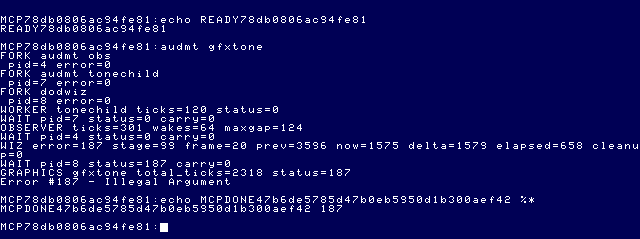
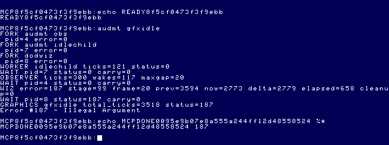

# Daggorath audio research

Research date: 2026-09-26. **No Daggorath audio backend implemented.** Initial source archaeology is followed by the isolated public-API multitasking experiments in §§10–14. Those experiments generated a bounded SS.Tone; they did not install a waveform engine or interrupt handler.

## Findings and evidence boundaries

The cartridge has **23 dispatch IDs**, including two wizard-creature IDs sharing a generator, plus **two IRQ-driven mechanisms** outside that table: heartbeat and wizard fade buzz. The heartbeat toggles the single-bit output. The other effects use the six-bit DAC; calling all of them “1-bit cassette sound” would be inaccurate. Their character depends on instruction timing, envelopes, irregular noise updates and foreground/IRQ interactions.

The most promising low-CPU alternative is the Speech/Sound Pak, but it would provide an **approximation**, not automatically a more faithful rendition. Neither an EOU Pak service nor a safe asynchronous DAC service has been validated by this research. Existing `SS.Tone` source is a blocking tone generator, not a general queued audio API.

Evidence classes used below:

- **Source:** instructions, tables and callers inspected in the identified checkouts or read-only EOU extracts.
- **Measured:** existing original-cartridge frame trace from the completed timing investigation. It records video/flags/PC, **not audio samples or every DAC write**.
- **Proposal:** future design or feasibility inference; not an implemented or live-tested capability.

References:

- Original [Daggorath checkout](/Volumes/SEDONA/Projects/daggorath-reference), commit `a94326f00ebb16a106b540c58bc2ccf5f7b66dac`. Paths/labels below are relative to it. This is the available reconstructed assembly reference; comments are not assumed more authoritative than instructions.
- [Current port](../../apps/daggorath/) and [Wizard M1 report](DAGGORATH_WIZARD_M1.md); [earlier archaeology](../reference-projects/DAGGORATH.md).
- [Source precedence/navigation](../source-index/README.md), [sound index](../source-index/SOUND.md), [runtime matches](../source-index/RUNTIME_MATCHES.md).
- [Official upstream checkout](/Volumes/SEDONA/Projects/nitros9-reference), commit `f470fa52eb172b59b22c1b722074998cb42de9b1`, particularly `level2/coco3/modules/snddrv_cc3.asm` and `vtio.asm`. Matching module names/editions do not establish a source/runtime identity.

`MCP/Documents/` and `DOCS_INDEX.md` were unavailable in this checkout. Hardware verification therefore used primary manual material hosted externally and the pinned MAME implementation, identified below. No unverified hardware programming is proposed as an application API.

## 1. Hardware and generator architecture

### Output paths

| Mechanism | Exact original path | Behavior and ownership implications |
|---|---|---|
| Foreground effects | `SOUNDS.ASM:SOUNDX → SNDTAB → generator → SNOUT` | `SNOUT` multiplies the sample by `SNVOL`, masks with `$FC`, writes `$FF20`; six upper bits drive the DAC. `SOUNDX` clears the DAC on return. |
| Wizard buzz | `COMMON.ASM:CLK20` | Complements `NOISEV`, shifts it left twice and writes PIA1 port A, `$FF20`, once per video IRQ while `NOISEF` is set. This bypasses `SNVOL`. |
| Heartbeat | `COMMON.ASM:CLK30` | Every `HEARTR` video ticks, reads PIA1 port B at `$FF22`, XORs bit 1 and writes it back. Separate single-bit sound output; not a DAC waveform loop. |
| Routing/setup | `ONCE.ASM:COMINI, IRQSYN`; definitions `CD.ASM:PIA$0, PIA$1` | Programs `$FF01/$FF03` selection controls, `$FF21` cassette motor/control, `$FF23` DAC sound enable/control, and PIA1 data direction. Port B also carries video state. Whole-register startup writes belong to the bare-metal cartridge, not an OS-9 application. |

The [Tandy Technical Reference, III: PIA, D/A, Sound Output and Cassette Interface](https://www.bighole.nl/pub/mirror/homepage.ntlworld.com/kryten_droid/coco/coco_tm_s3.htm) identifies DAC bits `$FF20[7:2]`, a distinct single-bit sound line, sound-source selection and a cassette recording circuit connected to the DAC. The game does not implement cassette-file encoding to make these effects. The manual cautions about mixing the single-bit and selected analog sources; software concurrency is not proof of an ideal linear analog mix.

[MAME 0.289 `coco.cpp`](https://github.com/mamedev/mame/blob/mame0289/src/mame/trs/coco.cpp), `pia1_pa_changed`, `pia1_pb_changed` and audio-mux handling, corroborates the separate one-bit output, DAC/cassette-output connection and selectable cartridge audio. This models the installed emulator; it does not prove identical analog response on every physical CoCo.

### Shared synthesis rules

All 23 dispatch effects below are **synchronous foreground calls**, use `$FF20`, and share scratch state (`SNVOL`, `SNDRND`, envelopes/counters). They are not reentrant or independently overlapping voices. `SOUNDI` supplies full gain `$FF`; `SOUNDX` accepts caller gain in B.

`SNOISE` uses shift/add feedback on a 16-bit value, then `INCB`. That final increment does not propagate carry into A. Preserve the instructions and seed if reproducing the sequence; do not substitute a generic random generator or assume mathematical white noise. This state is distinct from the game `RANDOM` call deciding whether a walking creature makes a sound.

`SNWAIT` decrements X to zero. `SNWT1K` sets **X=$1000**, despite its name. Delays include call, sample-generation and IRQ work. `SNENV/SNENVA` use a 16-bit envelope and multiplication; the envelope advances on synthesis operations, not a separate real-time clock. A faster loop changes pitch **and** envelope duration.

`COMSWI.ASM:SWISER` enables IRQ handling for these calls. Blocking effects stop the foreground game operation, while `COMMON.ASM:CLOCK` can continue clock, heartbeat, display and queue work. “Blocking” therefore does not mean interrupts are disabled. IRQ time also perturbs effect timing. A faithful port must preserve intentional action ordering without blocking the whole operating system.

### How to read the duration column

The catalog gives **source-exact work counts**, not invented milliseconds. A pulse-pair is one high/low cycle; an output is one successful sample write before envelope termination. Let `W(n)` denote the elapsed execution of `SNWAIT` with X=n. For example, SQUEAK has delay contribution `2 × sum(W(n), n=1..32)`, plus synthesis/control/interrupt overhead. A fixed CPU rate alone is insufficient to turn every catalog entry into a verified duration.

The source uses 6809 instructions. Its SAM display-update routine stops before the CPU-rate registers (`COMMON.ASM:SAM`); it does not provide per-effect clock calibration. Original slow-CoCo instruction timing is the historical baseline, while our measured cartridge reference ran on the documented MAME `coco3h` setup. Native HD6309 execution, different clock rates and OS interrupts must not be assumed cycle-equivalent. Absolute Hz/ms for every effect remains a capture/calibration task.

## 2. Complete source-derived sound-event catalog

Caller codes below resolve to these exact source locations:

- **C:** `CRETUR.ASM:CMOV20` (creature announces attack, full gain), and `CWLK20..CWLK90` (walking creature). Walking sound requires maximum row/column distance ≤8 and minimum ≤2, then a random-bit test; gain is `255 − 31 × max_distance`. It precedes the requested screen update.
- **O:** `PATTK.ASM:PATT10`: held object's class plus `SNDOBJ=12`. This dispatch is not restricted to a sword.
- **U:** `PUSE.ASM`: lighting a torch (`A$TORC`), drinking (`A$FLAS`), using a scroll (`A$SCRO`).
- **R:** `PINCAN.ASM` explicit `A$RING` invocation.
- **W:** `MISC.ASM:WIZI20`, entered after fade-in and before fade-out through `WIZIX/WIZOX`.

All waveform routines in the following table are in **`SOUNDS.ASM`**. Names in the event column follow `SNDTAB` and actual callers, not inferred monster folklore. Hardware, gain, blocking, speed and overlap rules in §1 apply to **every row**.

| ID / symbol | Generator | Actual event/callers | Waveform, pitch and modulation | Duration/termination in source units |
|---|---|---|---|---|
| 0 `A$SQK0` | `SQUEAK` | Spider; C | High/zero pulse sweep; decreasing wait raises pitch | 32 pulse-pairs, X=32..1 |
| 1 `A$RTL0` | `RATTLE` | Viper; C | Bursts of noise updates separated by long held sample | 10 × (192 noise outputs + `W($1000)`) |
| 2 `A$ROR0` | `GROWL` | Stone giant 1; C | Noise; attack increment `$0300`, decay decrement `$0040`; waits `$F0` then `$60` | 85 attack outputs + 1,023 decay outputs |
| 3 `A$BEP0` | `BEOOP` | Blob; C | High/zero pulses with increasing delay, falling pitch | 16 pairs; X=$500..$7D0, step 48 |
| 4 `A$KLK0` | `KLANK` | Knight 1; C | Two counter-controlled toggles, reloads `$AF/$36`; decay `$60` | 682 envelope/output events; counter timing determines wall time |
| 5 `A$ROR1` | `GRAWL` | Stone giant 2; C | Growl attack `$0200`; otherwise same decay/waits | 127 attack + 1,023 decay outputs |
| 6 `A$RTL1` | `PSSST` | Scorpion; C | Same burst generator as RATTLE | 2 × (192 outputs + `W($1000)`) |
| 7 `A$KLK1` | `KKLANK` | Knight 2; C | Impact counters `$32/$12`; decay `$60` | 682 envelope/output events |
| 8 `A$PSHT` | `PSSHT` | Wraith; C | Same burst generator as RATTLE | 192 outputs + `W($1000)` |
| 9 `A$ROR2` | `SNARL` | Balrog; C | Growl attack `$0100`; otherwise same decay/waits | 255 attack + 1,023 decay outputs |
| 10 `A$SQK1` | `BDLBDL` | Wizard creature 1; C | Eight noise-selected rising chirps, then double explosion | Each chirp starts at X=1..127; then KABOOM; seed-dependent duration |
| 11 `A$SQK2` | `BDLBDL` | Wizard creature 2; C | Same generator, not a second distinct stored waveform | Same variable-duration recipe as ID10 |
| 12 `A$FLAS` | `GLUGLG → MSQUEQ` | Flask; O, U | Four rising pulse sweeps | 4 ×128 pairs =512 pairs |
| 13 `A$RING` | `PHASER → MSQUEK` | Ring; O, R | Ten shorter rising sweeps | 10 ×64 pairs =640 pairs |
| 14 `A$SCRO` | `WHOOP` | Scroll; O, U | Long rising pulse sweep | 256 pairs, X=256..1 |
| 15 `A$SHIE` | `CLANG` | Shield; O | Impact counters `$64/$24`; decay `$60` | 682 envelope/output events |
| 16 `A$SWOR` | `WHOOSH` | Sword; O | Noise attack `$80`, then CHUCK decay `$A0` | 511 attack +409 decay outputs |
| 17 `A$TORC` | `CHUCK` | Torch; O, U | Noise with immediate attack and decaying envelope `$A0` | 409 outputs |
| 18 `A$KLK2` | `KLINK` | Creature hit; `PATTK.ASM` after hit test | Alternating noise shifted right and noise with bit7 forced; decay `$60` | 682 output events |
| 19 `A$KLK3` | `CLANK` | Player hit; `CRETUR.ASM:CMOV20..30`, before damage handling | Impact counters `$19/$09`; decay `$60` | 682 envelope/output events |
| 20 `A$THUD` | `THUD → BOOMER` | Wall collision; `PTURN.ASM`, explicit `A$THUD` | Noise sample held for progressively longer X delays | 104 outputs, X=$80..$14E step 2 |
| 21 `A$EXP0` | `BANG → BOOMER` | Creature killed; `PATTK.ASM`, after redraw and before power absorption | Falling noise-update rate; five samples at each X | 128 ×5 =640 outputs; X=$50..$14E step 2 |
| 22 `A$EXP1` | `KABOOM → BOOMER` | Wizard appearance/disappearance; W; also tail of BDLBDL | Two descending-rate noise bursts with inter-burst wait | 104 outputs + `W($1000)` +512 outputs |

`SWCHAR.ASM:THUDD` supplies `($0080,$0001),($0050,$0004)`; `BANGD` supplies `($0050,$0005)`. These are delay/repetition values, not recorded sample data.

Two source-comment traps matter for reproduction:

1. RATTLE comments say count “+1,” but the implemented counts are 10, 2 and 1. Its gap does **not** clear the DAC: the last sample is held.
2. The impact commentary describes a detuned sixth harmonic. The actual implementation toggles low seven bits and the high bit on different countdowns. Its measured spectrum cannot be replaced by that phrase; synthesis work on either toggle also delays the other counter.

### The two IRQ mechanisms

| Event | Source/callers | Waveform and duration | Gameplay/overlap |
|---|---|---|---|
| Heartbeat | `COMMON.ASM:CLK30`; `HUPDAT.ASM:HUPDAX`; enable in `PLOOK.ASM:INIVUX`; disable in `MISC.ASM:WIZIX` | `$FF22` bit1 changes state every J=`HEARTR` video ticks. Edge cadence `Fvideo/J`; complete square period `2J/Fvideo`. Continues while enabled, rather than a finite dispatch effect. | `HEARTF/HEARTS` control the small/large status heart on the same event. `COMPLR.ASM:HSLOW2` also uses HEARTR for recovery scheduling. IRQ edges can occur during foreground DAC effects. |
| Wizard fade buzz | `COMMON.ASM:CLK20`; `MISC.ASM:WIZIX/WIZOX/WIZZES` | DAC alternates approximately at half the video IRQ rate (source calls it 30 Hz). WIZZES assigns fade B to NOISEV **before rendering**; IRQ alternates six-bit levels B and `63−B`. Difference `abs(63−2B)` explains soft B=32 and loud B=0. | Enabled only for fade portions in the normal intro. Finite duration is the fade loop's elapsed rendering/IRQ time. Shares DAC with foreground effects, so simultaneous writes would interfere rather than form separate voices. |

The heartbeat header gives `J = 64P/(P+2D) −19`. The repeated-subtraction instructions increment the quotient even on the final borrow, so in the ordinary positive, non-overflow domain they produce `floor(64P/(P+2D))+1−19`. Keep the actual algorithm and edge cases when porting health behavior. Do not replace it with a smooth audio-only pulse rate and inadvertently change recovery/fainting behavior. `WIZIX0`, used for the introduction, skips the heartbeat-disable prologue of `WIZIX`.

No separate ordinary footstep, inventory-menu jingle or speech engine was found in this dispatch/caller survey. Movement can trigger a creature sound or collision THUD; those are the verified events. Wizard drawing also appears outside the intro: `HUPDAT.ASM` death, `PATTK.ASM` ending and `PINCAN.ASM` ring-related sequence call the shared wizard routines.

## 3. Wizard synchronization: retain the verified visual schedule

Sources: `ONCE.ASM` intro around `WIZIN0/WIZOUT`, `MISC.ASM:WIZIX/WIZOX/WIZZES`, `COMMON.ASM:CLK20`, and the retained [original timing CSV](assets/daggorath-timing/original-timing.csv) with its [capture script](assets/daggorath-timing/capture-original.lua). CSV columns are frame, machine time, display base, VCTFAD, NOISEF, UPDATE, PC; there is no header.

Time zero below is **first visible wizard**, original frame102 at 1.700726650 emulator seconds. Tick spacing in this trace is approximately 16.688 ms. Flag observations are frame-quantized, not sample-accurate audio measurements.

| Original frame / relative tick | Observation | Future synchronization requirement |
|---|---|---|
| 84 / −18 (~−0.300s) | First initialized NOISEF-on sample; rendering first wizard frame has begun | Buzz has a pre-roll before first visible geometry. Preserve it on a black screen if reproducing onset, without shifting the measured first-visible-to-blank schedule. |
| 102 / 0 | First visible fade frame | Buzz already active; do not treat this as the original audio onset. |
| 102..395 / 0..293 | Fade-in; B progresses32,30,…,0 | Apply amplitude/phase changes on original drawing boundaries. Visual presentation timestamps alone do not locate every original NOISEV write. |
| 395 /293 (~4.890s) | Full wizard; NOISEF off | First KABOOM follows fade-in. Source orders it before message production. |
| 479 /377 (~6.291s) | Full message frame | The preceding84ticks include sound and message work, **not a measured pure KABOOM duration**. |
| 641 /539 (~8.995s) | Messages cleared | WIZOX calls second KABOOM before starting fade-out buzz. |
| 719 /617 (~10.297s) | NOISEF on again | Explosion has returned; initial B=0 fade-out rendering starts. |
| 741 /639 (~10.664s) | Fade-out B=0 redraw | Visually duplicates the full wizard; no need to insert an extra changed frame. |
| 760 /658 (~10.981s) | First visibly reduced fade-out frame | Continue softening buzz with B=2,4,…,30; source assigns level before each draw. |
| 1012 /910 (~15.186s) | Last fade frame; NOISEF off | Stop buzz generation. The original flag-clear does not itself write DAC zero; model residual level/DC behavior separately from sustained tone. |
| 1014 /912 (15.219595841s) | Final blank | End of measured visual sequence. |

There is **no original music or speech in this intro path**: it is fade buzz, explosion, messages/hold, explosion, fade buzz. Creature `BDLBDL` is not the intro's wizard sound recipe.

The port's `apps/daggorath/src/main.c` already includes sound-time allowances in absolute visual deadlines. Its current `sound_event()` is a no-op: calls after first presentation, full wizard, message clearance and cleanup are merely placeholders. They lack pre-roll, fade-level updates and the second buzz start. They must not be presented as a complete audio abstraction.

**Future rule:** prepare/queue audio ahead of its deadlines and share the existing timeline. Never append a blocking explosion duration to the existing waits. Preserve all 35 presentations and logical frame content. Existing port measurement was 928 ticks/15.486606295s versus original912ticks/15.219595841s; audio work must not hide or amplify that known difference. Add a DAC-write/NOISEV trace and audio recording in a later implementation pass to resolve sub-frame onset, phase and exact explosion duration. No such recording was made here.

## 4. Faithful CoCo backend under NitrOS-9

| Approach | Assessment |
|---|---|
| Copy original loops into the application | Rejected as the default. They write shared PIA registers, assume private scratch/clock behavior and occupy the CPU. IRQ jitter changes sound; masking IRQs to fix it would damage scheduling, input and cancellation. |
| F$Sleep between audio edges/samples | Suitable for coarse event scheduling, not waveform generation. The verified EOU tick is approximately 1/60s; audio edges and noise samples need much finer spacing. Absolute deadlines avoid accumulating sleep error, but do not increase resolution. |
| Separate audio process | Can keep the UI caller from blocking, but shares the same CPU and device ownership. Moving a busy loop to another process does not create an audio clock or eliminate jitter. Useful as a queue/service client only. |
| OS-managed IRQ/FIRQ service | Plausible faithful-backend foundation, **not yet validated**. Requires an identified timer/interrupt source, resident system-mapped state, bounded handler, proper OS registration, resource arbitration and cleanup. Do not replace the cartridge's private IRQ vector inside an OS-9 application. |
| Existing EOU SS.Tone | Useful evidence for routing preservation and finite tones; not the original noise/sweep engine and not asynchronous playback. No claim that it can implement this catalog faithfully. |

A faithful service must arbitrate the DAC with terminal bell, joystick conversion and other users, and preserve control state. Heartbeat writes require safe ownership of a port containing unrelated signals. Process-local pointers are not automatically valid in an interrupt's task mapping. FIRQ's register-saving model and any GIME timer use require a separate ABI/hardware audit before implementation; this research does not establish an available timer allocation.

An HD6309 does not make copied timing loops faithful by itself. Use measured original edge/sample schedules or a calibrated synthesis clock, while yielding CPU outside bounded service work. Test emulated audio separately from real hardware: MAME's routing/filtering and a physical CoCo/Pak's clock and analog components can differ.

### EOU and upstream examples actually inspected

| Source and provenance | Verified behavior | Reuse / limitation |
|---|---|---|
| `/dd/SOURCECODE/ASM/SOUNDRV/SounDrv.asm`, `DrvPlay.asm`; Allen C. Huffman/Sub-Etha, 1994/95, V1.02 | SCF Write masks samples and writes `$FF20`; interrupts remain enabled. Client uses I$Read/I$Write. Historical comments report roughly 8kHz/choppy output. | Driver/client separation is useful. There is no demonstrated rate-controlled queue; historical comments are not this target's benchmark. Open/close routing writes are not a complete captured-state restore contract. |
| `/dd/SOURCECODE/ASM/NITROS9/SCF/snddrv_beta6.asm`; Kevin Darling, later Boisy/EOU Curtis Boyle changes | `SS.Tone=$98`: X high byte volume, low byte duration; Y tone 1..4095, converted to delay4096−Y. `ToneLoop/SendByte` generates DAC pairs while VTIO decrements `G.TnCnt`. | Blocking co-driver with routing restoration. Similar name does not make it Huffman's SounDrv. It is not a noise sequencer. |
| Upstream `level2/coco3/modules/snddrv_cc3.asm: setstt, ToneLoop, SendByte`; `vtio.asm:G.TnCnt` handling | Same important blocking-loop/countdown architecture; source edition 4. | Maintained comparison source, not proof of exact loaded EOU binary equivalence. |
| `/dd/SOURCECODE/ASM/PLAY/play.a: JustPlay`, CPU tests/delay table | 6809/6309 and hardware variants; direct DAC/MMU handling, interrupt masking in playback path | Shows why CPU/rate handling matters. Its direct `$FFA9` changes and masked playback are not a safe foreground multitasking pattern to copy. |

## 5. Tandy Speech/Sound backend

### Capabilities and interface evidence

The [Speech/Sound programming manual](https://tlindner.macmess.org/wp-content/uploads/2006/09/sscmanual.pdf), pp10–13,16–18,24–26 and Appendix B, documents reset `$FF7D`, command/status `$FF7E`, per-byte busy checking, eight 64-byte sound buffers (concatenatable), event durations and direct PSG-register programming. Status bits are active-low; sound/speech activity can lag command submission. Duration is event spacing; a final tone needs an explicit silence event. The PSG has three tone channels, shared noise and a shared envelope. Tone period uses `clock/(16×period)`; the manual contains inconsistent numeric examples, so do not copy their printed numerator blindly. The absolute timer-base unit needs verification.

The [MAME 0.289 SSC device](https://github.com/mamedev/mame/blob/mame0289/src/devices/bus/coco/coco_ssc.cpp) independently identifies TMS7040 control, AY8913 sound, SP0256 speech, RAM and clock configuration. Its `ff7d_read` status handling and sound-activity filter show that “sound active” is an amplitude/activity detector, **not a queue-completed acknowledgement**. Quiet intervals and command-start latency make it unsuitable as the sole completion fence.

Buffered controller playback can free the CoCo CPU between loads. A driver still needs bounded busy polling, explicit stop/silence, ownership and a calibrated timeline. Channel polyphony is limited by shared noise/envelope resources. Neither the speech synthesizer nor the sound-event buffer is a general arbitrary-PCM output channel.

The [service-manual scan and appended compatibility bulletin](https://tlindner.macmess.org/wp-content/uploads/2006/09/speechsoundcartridge.pdf), PDFpp27–28, reports real Pak problems at CoCo3 high speed and discusses E-clock-derived PSG/controller clocks. That appended material is a later modification note, not a Tandy guarantee. Real-hardware clock/compatibility must be identified independently; do not assume our emulated Pak validates an unmodified physical one.

### Proposed effect mappings — approximations, not tested patches

| Original family | Plausible Pak mapping | What would change |
|---|---|---|
| SQUEAK/WHOOP/PHASER/GLUGLG/BEOOP | Tone period sequences and explicit amplitude/stop events | Sweep steps, duty behavior and delay curve require fitting; startup latency must be measured. |
| CLANG/KLANK/KKLANK/CLANK | Two tones with programmed decay | Original unequal bit weights, coupled counters and detuning are not automatically reproduced by equal PSG voices. Consumes two of three tone channels. |
| RATTLE/PSSST/PSSHT | Noise bursts with held/quiet intervals | PSG noise sequence/spectrum differs; original held DAC level is not necessarily literal silence. |
| GROWL/GRAWL/SNARL/WHOOSH/CHUCK | Noise plus stepped amplitude envelope | One shared noise generator/envelope constrains overlap; original nonlinear quantization and irregular sample clock differ. |
| KLINK | Tone mixed with noise and decay | Broad character plausible; original alternating sample construction differs. |
| THUD/BANG/KABOOM | Noise-period descent and amplitude shaping, two bursts for KABOOM | Needs captured reference fitting; source decreases noise-update rate, not just pitch of a periodic tone. |
| BDLBDL | Eight source-selected sweeps plus KABOOM recipe | Preserve source random choices and logical duration; do not substitute arbitrary wizard music. |
| Heartbeat | Short pulse/percussion approximation or retain separate one-bit backend | May lose characteristic edge/thump; heart/recovery timing must remain game-owned. |
| Wizard buzz | Low tone with fade-controlled amplitude, timed with two explosions | Source waveform level, phase resets and analog response differ. PSG low-frequency range must be checked against the measured desired buzz. |

The canonical slot 2 Pak's presence establishes hardware topology, **not a verified OS-9 audio interface or concurrent bus-routing policy**. Before implementation, verify access and audio selection without disturbing slot 4 disk I/O. Do not invent a guest device name or assume an old SSC driver is installed. Speech allophones are optional future enhancement, not original Daggorath fidelity.

## 6. Samples and future OPL3

### Sample feasibility

Short captured or host-synthesized effects could preserve more waveform character than PSG patches. They still need a rate-controlled DAC service; calling I$Write on an arbitrary historical driver does not establish sample timing.

Planning arithmetic, **not benchmarks or a chosen format**:

- At8,000 one-byte samples/s, a 1.3s effect is 10,400bytes; the 15.2196s intro is about 121,757bytes, before code, buffers and graphics.
- Packing six-bit samples reduces storage to 6,000bytes/s at that rate, but adds unpacking work. It does not reduce interrupt frequency by itself.
- A hypothetical 80-cycle sample service at 8kHz consumes 640,000cycles/s, about 36% of a 1.79MHz CPU **before** other OS and rendering overhead. A real handler must be measured;80cycles is only a budgeting example.

The 2MB machine does not give a process a flat2MB address space. Use bounded buffers and an audited mapping/streaming mechanism; do not graft PLAY's MMU writes into the app. Full-intro streaming also competes with storage and risks underruns. Separate reusable buzz/explosion recipes are more practical than a monolithic recording, and heartbeat cannot be baked into one fixed gameplay soundtrack.

Later capture must retain sample rate, machine clock, gain, seed, route/filter and provenance. A recording from MAME is an emulator reference, not a physical analog measurement. Sample mixing and resampling carry CPU cost; clipping multiple effects changes character. No sample player or capture was implemented here.

### Mega Mini MPI / YMF262

The manufacturer's [Mega Mini manual](https://thezippsterzone.com/wp-content/uploads/2018/12/MEGAmini-manual.pdf) documents OPL3 access in virtual slot 5, `$FF50/$FF51` and `$FF52/$FF53` register/data pairs, `$FF54` reset, and selectable audio routing. It also describes a timer/interrupt facility, but its bare-metal interrupt examples are **not** an OS-9 application API.

An eventual backend could interpret the same semantic events as FM/percussion patches, leaving original logic unchanged. It would be an enhanced rendering, not bit-accurate reproduction of the DAC algorithms. A separately verified OS driver would own MPI selection, register timing, routing and any interrupt service, cooperating with disk/Pak users. No Mega Mini hardware was exercised; installed slot discovery below did not establish a matching topology. Do not make it a prerequisite for Wizard audio or assume multiple cartridge outputs mix automatically.

### Game Master Cartridge (GMC)

John Linville's [Programming the Game Master Cartridge](https://docs.google.com/document/d/17JzrNqIHZaFmtHEeFSevpkJtbWOn2-2EjxMB2cQlxsY/edit), sections Sound Generation/System Notes, identifies SN76489AN output at **$FF41**, separate ROM-bank control at **$FF40**, SCS/MPI selection and cartridge audio routing. The write-only chip exposes no readable status; writes require 32 oscillator cycles (8µs with the recommended 4MHz oscillator). Preserve disk-slot selection and respect write spacing. The guide's old `games_master` MAME name is superseded by `gmc` in this installation.

The [TI SN76489AN data sheet](https://computers.baffa.tec.br/pages/datasheet/76489.pdf), Operation §§1–4, specifies three 10-bit tone generators and one noise generator with selectable periodic/white feedback and attenuation. Noise can use fixed divisors or tone 3's output, coupling those resources. There is no autonomous amplitude-envelope sequencer; software changes attenuation for fades. From the documented formula `f=clock/(32*n)`, 4MHz and n=1023 give a lowest ordinary tone of **122.19Hz**. A straight tone-register mapping cannot reproduce the original approximately 30Hz wizard buzz. Periodic-noise or host-gated alternatives require separate waveform validation, not a claim of equivalence.

[MAME 0.289 `coco_gmc.cpp`](https://github.com/mamedev/mame/blob/mame0289/src/devices/bus/coco/coco_gmc.cpp) confirms `scs_write` offsets0/1 and a 4MHz SN76489A. Its speaker route is direct in the emulator; physical cartridge mux behavior still needs hardware validation. Installed read-only `-listslots/-listdevices` discovery confirms `gmc` and the4MHz sound device. No GMC boot/audio test was performed.

**Fit:** plausible chirps, ring sweeps, metallic two-tone effects and noise bursts. Finite sounds require host-scheduled pitch/attenuation changes and explicit mute; a sustained tone is independent of the CPU, but an entire effect is not automatically queued. It offers simple register-level synthesis and low steady-state CPU use, at the cost of host scheduling, coarse attenuation and a distinctly different noise/tone character. No validated EOU GMC service was found. ROM-bank features are unrelated to this audio proposal and should remain untouched.

### CoCo PSG (YM2149)

The manufacturer's [CoCo PSG manual](https://thezippsterzone.com/wp-content/uploads/2018/05/coco-psg-users-manual.pdf), pp2,4–5,11, specifies **$FF5E register select / $FF5F data**, control **$FF5D**, and SCS gating. Clock selection is2MHz or1MHz. Control bits also govern writes, flash programming, autostart and gameports: blindly writing a clock byte is unsafe. Its extra 512KB RAM and 512KB flash are cartridge-banked storage, not an audio DMA engine or automatically usable OS-9 process memory.

The [manufacturer's hardware description](https://thezippsterzone.com/2018/05/08/coco-psg/) identifies three channels and explains board revisions and audio routing. The [Yamaha YM2149 data sheet](https://www.ym2149.com/ym2149.pdf), register/functional descriptions, supplies the tone/noise/shared-envelope model. This is a close relative of the Speech/Sound Pak's AY, with different envelope behavior; it is not the Pak's controller/protocol.

**Fit:** the same broad PSG approximations as §5, with direct register control and no SSC command parser/buffer. Hardware tones/envelope continue independently; sweeps, event transitions and stop deadlines remain host responsibilities. With a 12-bit tone period and the AY/YM tone formula, effective 2MHz gives a minimum 30.525Hz, while 1MHz permits 15.263Hz; the latter can place a tone close to the reference buzz. These are calculated range checks, not listening tests or proof of identical phase/amplitude.

A concrete emulator discrepancy needs resolution before pitch calibration: [MAME 0.289 `coco_psg.cpp`](https://github.com/mamedev/mame/blob/mame0289/src/devices/bus/coco/coco_psg.cpp) constructs YM2149 with `1_MHz_XTAL` and changes pin26 for the control bit, despite comments/manual describing2MHz/1MHz. Installed `-listdevices` reports **YM2149 SSG @1.00MHz**. Do not silently assume the hardware clock table describes effective emulated pitch. Check the chip model's divider behavior and measure output in a later test before declaring this a defect or compensating.

No resident-font-style enumeration analogy applies: PSG registers are device state, and reading them alone does not establish ownership. A future service must serialize register-select/data pairs, preserve shared mixer/gameport bits and arbitrate SCS with disk I/O. The cartridge's RAM/flash is not needed for initial sound effects and should not be changed.

### Mega Mini MPI OPL3: role in the comparison

In addition to the interface above, the manufacturer's [OPL3 programming article](https://thezippsterzone.com/2018/12/01/programming-the-opl3-chip-with-the-color-computer/) explains 18 two-operator channels, programmable attack/decay/sustain/release, waveform/feedback and key-on/off. The host schedules notes and changes; the chip synthesizes them. Register access has timing requirements even on a faster CPU.

**Fit:** richer independently enveloped metallic impacts, growls and explosions, with more room for future layering than either PSG. These would be designed FM patches, not translations that preserve Daggorath's irregular DAC samples. It is the strongest enhanced-sound candidate here, but adds patch design and unverified OS-9/hardware integration. Generic YMF262 support in an emulator does not establish a Mega Mini MPI topology. This installed CoCo MPI slot listing did not expose a Mega Mini/OPL3 option; no configuration was changed.

### MIDI Pak and DriveWire MIDI

**Neither is a sound generator by itself.** A MIDI backend needs both a transport and an identified receiving synthesizer/patch bank. Keep these separate in the design so a Pak and DriveWire can carry the same event-to-MIDI mapping.

#### MIDI Pak

[MAME 0.289 `coco_midi.cpp`](https://github.com/mamedev/mame/blob/mame0289/src/devices/bus/coco/coco_midi.cpp) explicitly models **Rutherford Research MIDI Pak**, with stated MIDI Maestro compatibility: MC6850 ACIA at **$FF6E–$FF6F**,500kHz ACIA clock, MIDI input/output/thru and cartridge interrupt routing. Installed discovery lists `midi` and these devices. This identifies the emulated model; it is not a claim that every cartridge called “MIDI Pak” has the same register map. No actual output endpoint, receiving synth or EOU Pak driver was verified.

The [MIDI Association electrical specification](https://midi.org/wp-content/uploads/wpforo/default_attachments/1709416667-ca33-MIDI-10-Electrical-Specification-Update.pdf) specifies 31.25kbaud and 320µs per serial byte. Thus a full three-byte message takes 0.96ms on a DIN link, before device response, software queuing or audio buffering. Sparse effect events are inexpensive; streaming every original DAC transition over MIDI is not a viable equivalence strategy.

An OS-owned ACIA service could queue messages while Daggorath continues rendering. It must bound transmit waits, preserve device/interrupt ownership and resolve address conflicts for the exact installed hardware. A hardware UART reduces byte-timing work, but does not create a sample-accurate end-to-end completion acknowledgement. Do not borrow a generic RS-232 descriptor without verifying MIDI baud/framing and binary handling.

#### DriveWire MIDI

Verified upstream paths at the recorded commit:

- `level1/modules/scdwvdesc.asm`: `Addr=14` names the descriptor **MIDI** and disables line-oriented control characters/echo relevant to binary use.
- `level1/modules/scdwv.asm:Write`: sends virtual-port command plus character through the DW write entry; the actual length is2 bytes despite an adjacent3-byte comment.
- `defs/midi.d`: note/control definitions, All Notes Off and named instrument/target constants. These definitions do not prove a transport is loaded or a synthesizer supports a given patch.

The [EOU transport inventory](../architecture/NITROS9_TRANSPORT_INVENTORY.md) found `SCF/midi_scdwv.dd` among available modules. Library availability is not runtime readiness; the frozen target has not been verified with `/MIDI` plus a functioning DW4 MIDI server in this pass. The [DriveWire project's GUI documentation](https://sourceforge.net/p/drivewireserver/wiki/The_DriveWire_GUI/) exposes output-device selection, internal synth, soundbank loading and translation profiles. These are real configuration concepts, not evidence of an active server on this machine.

**Proposed path:** binary `I$Open/I$Write/I$Close` on a verified `/MIDI` path → `scdwv/dwio` and the selected transport → DW4 → selected software or external synth. Use ordinary Write, not line-oriented output. First verify descriptor/driver versions, server version, transport, synth identity and audio latency without changing canonical media. Bitbanger, UART and Becker builds have different transport costs; do not transfer performance claims between them. DriveWire offers a real-CoCo path with a host, as well as possible emulator transport; neither route was activated here.

DriveWire offloads synthesis to the host but adds transport/server/audio-buffer jitter. Shared DW traffic can affect timing. A guest write returning successfully means data was handed to that stack, not that a note started or finished audibly. Do not assume timestamped scheduling exists in the verified guest-to-server path. Measure latency before considering deadline compensation.

#### Mapping original effects to MIDI

- A fixed, documented custom synth patch or soundbank could expose source-derived explosion/chirp/impact samples or synthesis recipes as note-triggered effects. This can preserve more character than arbitrary General MIDI instrument names, but requires distributing/identifying that bank and calibrating its envelopes and gain.
- Generic synth/percussion programs offer portable **approximations** for hits and explosions; growls, wizard buzz and heartbeat have no verified standard patch mapping. Do not claim that sending “explosion” or a percussion note guarantees the original sound.
- Pitch bend and controllers can drive sweeps/levels where the target patch supports them. Channel-wide controls, bend range and receiver polyphony need explicit capabilities; MIDI channels are not a promise of independent voices or identical instruments.
- Use owned channels, tracked note-offs and a bounded cleanup/panic strategy. Global All Notes Off can interfere with another client; scope cleanup to owned channels and verify release/sustain behavior. Upstream `defs/midi.d` provides the relevant named constant, not a guarantee of instant silence on every receiver.
- MAME restoration does not rewind a physical synthesizer or external DW4 audio engine. Cancel/reinitialize external notes and invalidate outstanding tokens on emulator epoch change. Replaying a save state without this could leave stuck or duplicated sounds.

### Backend comparison and priority

| Backend | Generates waveform independently? | Effect scheduling burden | Original-character prospect | Availability established here |
|---|---|---|---|---|
| Faithful DAC/one-bit | No, requires service | High-rate bounded generation plus events | Highest potential after capture/calibration | Hardware known; safe async EOU service unverified |
| Speech/Sound | Yes; buffered controller sequences | Load/command latency, finite-stop validation | AY approximation | Canonical Pak present; guest service unverified |
| GMC | Yes, sustained tone/noise | Host sweeps/envelopes/mute; no status | Good simple effects;30Hz tone limit is a constraint | Installed MAME `gmc`; no EOU live test |
| CoCo PSG | Yes, tone/noise/envelope | Host events; register-pair arbitration | Flexible AY-family approximation | Installed `ccpsg`; clock discrepancy unresolved |
| Mega Mini OPL3 | Yes, FM/envelopes | Host patch/events/key-off | Strong enhanced backend; not DAC-equivalent | Manufacturer documentation; no installed CoCo topology proven |
| MIDI Pak + chosen synth | Synth-dependent | Guest queue + wire + receiver latency | Custom bank potentially close; generic patches approximate | Installed `midi` interface only |
| DriveWire MIDI + chosen synth | Host/external synth | Guest/DW queue + server/audio latency | Same target-dependent prospects | Upstream `/MIDI` source and EOU library evidence; no live route |
| Samples to CoCo DAC | No independent DAC clock | Service/streaming, underrun management | Potentially close to captured reference | No player implemented |

**Recommendation with these alternatives included:** retain the original capture/timeline as the common standard. Evaluate the already-canonical Speech/Sound route first for minimum configuration disturbance, but keep **GMC and CoCo PSG as explicit peer synthesis backends**, not variants hidden behind the SSC protocol. CoCo PSG is especially worth a later measured comparison once its effective clock is understood. MIDI Pak and DriveWire should share a MIDI renderer with separate transports and a pinned synth/bank profile. Mega Mini OPL3 remains the enhanced FM path. None justifies changing the canonical machine during this archaeology task.

## 7. Proposed backend-neutral interface

**Design only.** Keep source-derived event decisions separate from device synthesis and from the game scheduler.

```text
original-derived gameplay / wizard timeline
    -> semantic event + source ID + timing/gain/context
    -> audio service contract
       -> faithful CoCo edge/sample service
       -> Speech/Sound approximation
       -> GMC / CoCo PSG synthesis
       -> MIDI renderer -> MIDI Pak or DriveWire -> identified synth/bank
       -> sample service
       -> future OPL3 enhancement
       -> silent fallback
```

Proposed concepts, not a committed C ABI:

| Operation/data | Purpose |
|---|---|
| `open(requested_policy) -> capabilities` | Report available backend, fidelity grade, channel/shared-resource limits, latency, stop support and timing resolution. |
| `submit(event) -> token` | Event kind/context, original dispatch ID where applicable, gain0..255, source noise seed/state or deterministic recipe, target time and allowed lateness. |
| `heartbeat(period_ticks, enabled, phase)` | Persistent stream driven by original health logic. Keep visual heart and recovery scheduling in gameplay. |
| `wizard_buzz(fade_level, enabled, phase, target_time)` | Preserve original B-level semantics and explicit start/stop rather than burying it in a generic beep. |
| `poll(token)` | Distinguish accepted, started, finished, unavailable, late/underrun, failed and cancelled. Queued is not audible; sound-active is not completed. |
| `cancel_all()` / `close()` | Bounded silence, release ownership, restore captured routing; safe on errors and handled cancellation. |

Use semantic names such as `creature_cue(kind, range_gain)`, `object_action(class)`, `creature_hit`, `player_hit`, `wall_collision`, `creature_death`, `wizard_explosion`. Retain original IDs for traceability without exposing `$FF20` or PSG registers to game logic. Backend noise generation must not consume the gameplay RNG.

There are two timing contracts:

1. **Original action fence:** where the cartridge blocked foreground progress until an effect returned, gameplay can wait on a logical deadline/state transition while OS-9 runs other processes. This preserves combat/order/timing intent without requiring the backend to busy-wait.
2. **Presentation/audio fence:** actual playback completion/underrun is observable separately. A slower backend must not silently extend a premeasured Wizard deadline or a health/recovery interval. Define late/drop/truncate behavior explicitly and report it.

Default fidelity mode should serialize the original foreground sound lane, with heartbeat and wizard streams governed by their original enables. Extra hardware voices do not authorize new gameplay overlap. An enhanced mixing policy can be explicit later. Save/restore would also need service/queue reconciliation: host-side playback queues and physical cartridge state cannot be assumed to rewind with a MAME save state.

## 8. Recommended first audio milestone

Start with **Wizard-only synchronized audio**, leaving gameplay and enhanced music out of scope:

1. Capture original DAC writes/NOISEV and audio for the two fade sections and KABOOM on the same controlled cartridge setup. Resolve exact periods, explosion duration and the pre-roll; retain hashes, clocks and source labels.
2. Validate a minimal OS-owned Speech/Sound transport and its busy/start/stop timing on disposable development media. Do not install a speculative driver in canonical EOU media. If no safe transport is available, report that concrete blocker before pursuing driver infrastructure.
3. Implement only the semantic Wizard operations with an explicitly labelled **Pak approximation** and silent fallback. Preload bounded sequences; calibrate against the capture. Keep a faithful DAC/sample backend as a separate follow-up, not a promise of equivalence.
4. Verify the existing 35 visual presentations and 512×192 viewport remain unchanged; measure the full sequence against the 912-tick reference. Test normal exit, handled cancellation, transport failure and timeout; silence and restore Term, then require the normal MCP status handshake and a healthy strict shell command.

The Pak is proposed first for independent generation and lower CPU demand, not because it is intrinsically superior. If captured comparison shows unacceptable loss of the wizard buzz/explosion character, retain silent mode and prioritize the bounded OS-managed faithful service instead of calling the approximation faithful.

## 9. Inspection method and integrity

Additional read-only installed-build discovery (no ROM/media launch):

```sh
MAME=/Applications/Emulators/Ample.app/Contents/MacOS/mame64
"$MAME" coco3h -ext multi -listslots
"$MAME" coco3h -ext multi -ext:multi:slot1 gmc -listdevices
"$MAME" coco3h -ext multi -ext:multi:slot1 ccpsg -listdevices
"$MAME" coco3h -ext multi -ext:multi:slot1 midi -listdevices
```

These commands inspect hypothetical devices; they do not alter the canonical launch configuration. Outputs and downloaded programming references were kept under `/private/tmp/daggorath-audio/`.

Read-only source searches followed sound dispatches, all `ISOUND/SOUNDS` callers, PIA/DAC writes, NOISEF/HBEATF, and the port's timing hooks. During the initial archaeology, only read-only MAME discovery ran. The later disposable-media boots and public-API probes are documented in §13. EOU examples were copied **out** using:

```sh
OS9=/Users/magneto-optimus/Documents/Coding/toolshed-2.2/build/unix/os9/os9
"$OS9" copy media/63SDC-MCP-DEV.VHD,SOURCECODE/ASM/SOUNDRV/SounDrv.asm /private/tmp/daggorath-audio/SounDrv.asm
"$OS9" copy media/63SDC-MCP-DEV.VHD,SOURCECODE/ASM/SOUNDRV/DrvPlay.asm /private/tmp/daggorath-audio/DrvPlay.asm
"$OS9" copy media/63SDC-MCP-DEV.VHD,SOURCECODE/ASM/PLAY/play.a /private/tmp/daggorath-audio/play.a
"$OS9" copy media/63SDC-MCP-DEV.VHD,SOURCECODE/ASM/NITROS9/SCF/snddrv_beta6.asm /private/tmp/daggorath-audio/snddrv_beta6.asm
```

CR-normalized temporary text copies were inspected. Manuals and pinned MAME source were downloaded into the same temporary directory. Original symbols were rebuilt with `lwasm --format=raw --symbol-dump=/private/tmp/daggorath-audio/symbols.asm --output=/private/tmp/daggorath-audio/original.rom DAGGORATH.ASM`, with the reference directory as the working directory and **all outputs outside it**. No original source was edited.

Canonical media SHA-256, verified identical before/after:

| Media | SHA-256 |
|---|---|
| `63SDC.VHD` | `db2f0f444073d3b88a3610a63ec9f7d2e2dd4299347181faa6b2b2aa9637de2c` |
| `63SDC-MCP-DEV.VHD` | `4c6bdc0cd2f68aa57a9c75f75f15fe429f30926aa522917dd8d14aa1b9ae622e` |
| `63EMU.DSK` | `9a51adb8656b9f003c7f822352c291487362f1b4c43aac1a16672d5d2bcb4c40` |

Changes are this research document and curated measurement fixtures/evidence. Daggorath/MCP implementation source, canonical media and reference repositories remain unchanged; no commit. The follow-up MCP suite passed 115/115; local-link and whitespace checks passed. Temporary runtime and disposable media remain under ignored MCP/work/audio-mt/.

## 10. Multitasking requirement and OS-9 service architecture

This section supersedes any reading of the earlier feasibility tables that would permit sacrificing OS-9 scheduling for waveform fidelity. **Multitasking remains operational. No cartridge IRQ replacement, long interrupt mask, elevated-priority spin loop, or permanent system-state synthesis loop is an acceptable normal application backend.** A faithful waveform is not sufficient if other processes stop making useful progress.

### Preemption: what survives and what fails

A normal process's registers, stack and mapped private memory are restored when it resumes; preemption alone does **not** discard its oscillator counter or noise seed. The hardware output, however, holds its last programmed level while another process runs. An original-style DAC loop therefore acquires stretched samples/half-cycles, phase error, clicks and changes in pitch/envelope duration. A single-bit heartbeat edge can arrive late and then be followed by a compressed interval if software tries to catch up. If another sound, joystick or routing user touches the shared PIA, even the held level/control state is no longer owned by the first process. Saving CPU registers is not saving exclusive ownership of a peripheral.

Instruction-count timing expands with scheduling delays; deadline-based timing instead forces a late/drop/skip decision. Neither recovers samples that were not emitted. User-process priority changes cannot establish a hard audio clock and can starve peers. Moving the same loop to a child protects game control flow only; it does not remove CPU occupancy, hardware contention or audio jitter.

A system-state co-driver can be worse: it may service IRQs yet return to its own loop without scheduling another user process. Upstream `level2/modules/kernel/krn.asm:S.SysIRQ/FastIRQ/DoneIRQ` and `snddrv_cc3.asm:ToneLoop` establish this distinction; the live `SS.Tone` measurement below demonstrates its practical consequence in EOU. Keeping the time-of-day clock alive is not a multitasking success criterion.

### Per-effect classification

Classification letters refer to the requested alternatives: **A** ordinary process; **B** bounded critical section; **C** cooperating process; **D** IRQ/FIRQ service; **E** timer/background service; **F** hardware offload; **G** another verified mechanism. “Candidate” is conditional on service validation, not permission to install a handler. A is appropriate for *semantic event submission* for every row, but generally not for generating its waveform. C likewise means event/queue ownership unless backed by a suitable device service.

| Original ID/mechanism | A/B: waveform generation | C: cooperating process | D/E: faithful service prospect | F/G and asynchronous-semantic rule |
|---|---|---|---|---|
| 0 SQUEAK | A preemptible loop distorts sweep; B must not encompass the effect | Queue and source recipe | Sample/edge timer candidate | PSG/GMC sweep approximation. Keep creature cue/action fence. |
| 1 RATTLE | Noise timing/gaps change; no whole-effect B | Queue burst recipe | Timed DAC candidate | Noise hardware; retain walking/attack caller order. |
| 2 GROWL | CPU-derived attack/decay unsuitable in A/B | Queue envelope | Timed DAC candidate | Noise/envelope offload; creature fence. |
| 3 BEOOP | Long pulse holds are not a justified critical section | Queue sweep | Edge timer candidate | Tone sweep; creature fence. |
| 4 KLANK | Coupled countdown pitch changes under preemption | Queue impact | Sample/edge service candidate | Two-tone approximation; creature fence. |
| 5 GRAWL | Same issue as GROWL | Queue envelope | Timed DAC candidate | Noise/envelope; creature fence. |
| 6 PSSST | Same burst issue as RATTLE | Queue recipe | Timed DAC candidate | Noise bursts; creature fence. |
| 7 KKLANK | Same coupled-counter issue as KLANK | Queue impact | Sample/edge service candidate | Two-tone approximation; creature fence. |
| 8 PSSHT | Even the shortest burst has no measured safe B budget | Queue recipe | Timed DAC candidate | Noise burst; creature fence. |
| 9 SNARL | Attack/decay rate depends on CPU work | Queue envelope | Timed DAC candidate | Noise/envelope; creature fence. |
| 10/11 BDLBDL | Variable-length chirps plus explosion rule out an unbounded B | Preserve noise state and sequence in service | Timed DAC candidate | Synth recipe or source-derived samples; wizard-creature fence. |
| 12 GLUGLG | Repeated sweeps are not safe audio-rate A timing | Queue four sweeps | Timed DAC candidate | PSG/GMC; preserve use/attack sequencing. |
| 13 PHASER | Ten sweeps must not monopolize CPU | Queue recipe | Timed DAC candidate | Synth/MIDI patch; preserve ring operation sequencing. |
| 14 WHOOP | Preemption changes sweep curve | Queue recipe | Timed DAC candidate | Synth sweep; scroll/use ordering retained. |
| 15 CLANG | Two counter oscillators require a stable clock | Queue impact | Sample/edge service candidate | Two tones/FM patch; object-action fence. |
| 16 WHOOSH | Envelope advances with sample work, so A stretches it | Queue envelope | Timed DAC candidate | Noise/envelope or sample; attack fence. |
| 17 CHUCK | Shorter than WHOOSH does not certify a safe B duration | Queue envelope | Timed DAC candidate | Noise/envelope; torch/action fence. |
| 18 KLINK | Alternating tone/noise samples require timed output | Queue impact | Timed DAC candidate | Noise+tone/FM/sample; preserve hit feedback ordering. |
| 19 CLANK | Counted oscillators unsuitable as foreground timing | Queue impact | Sample/edge service candidate | Hardware impact; sound precedes damage operation in source. |
| 20 THUD | Descending update rate still preemption-sensitive | Queue recipe | Timed DAC candidate | Noise/sample; collision response fence. |
| 21 BANG | Long noise-delay sequence cannot be a B section | Queue recipe | Timed DAC candidate | Explosion patch/sample; preserve redraw → sound → power absorption. |
| 22 KABOOM | Two bursts and pause must not occupy a critical section | Queue two-burst event | Timed DAC candidate | Offload/sample; Wizard timeline already reserves its duration. |
| Heartbeat | A can schedule *requests*, not guarantee edge timing; B only a validated bounded service register update | Own persistent rate/enable state, not a spin loop | Tick-driven OS service is a closer fit than audio-rate sampling; exact PIA arbitration still unverified | Pulse offload is approximate. Health/recovery/status remain game-owned. Already asynchronous in original. |
| Wizard buzz | Process toggling at tick boundaries inherits dispatch jitter | Own level/phase/deadline state | Bounded video-tick service candidate; no arbitrary FIRQ needed merely to reach 30Hz | PSG tone or external patch; already asynchronous, retain pre-roll and fade synchronization. |

**B is not currently certified for any complete original effect.** Small register transactions or queue-index updates may require bounded exclusion inside an OS service, but their worst-case time, frequency and cumulative load must be measured. “Short” is not defined by how short an effect sounds. No universal microsecond budget has been established for this EOU build.

**G:** the existing public `SS.Tone` is verified to generate a finite tone, but the measured scheduling stall makes it unsuitable for multi-second responsive effects. No currently verified public PCM/one-bit queue API emerged from this research. A MIDI service with a loaded custom soundbank could move source-derived samples off the CoCo, but that is a distinct target-dependent mechanism, not proven here.

### What may become asynchronous?

Heartbeat and buzz were already IRQ-driven and should remain independent streams. For all 23 foreground IDs the source intentionally *orders* work around a synchronous call, even if the author's perceptual reason for every delay cannot be proved. Preserve that observable ordering initially:

- Walking creature cue precedes `NEWLUK`; combat cue/hit precedes subsequent damage or power work.
- Object-use and ring paths must not advance their next logical operation merely because an offload chip accepted a command.
- Wizard explosions are asynchronous playback against already measured visual deadlines; do not wait for the audio backend a second time.

Represent a blocking cartridge call as a **logical game-action fence**: a state/deadline that suspends the next dependent game operation while the OS and unrelated presentation/input tasks can run. Keep simulation clock, health/recovery timers and audio transport completion separate. Only relax a particular fence after comparing gameplay behavior; “all sounds asynchronous” would silently speed up actions and alter overlap.

## 11. Cooperating process and IPC proposal

An audio process is useful as a **queue manager and device client**. For offloaded hardware it can sleep between events while synthesis continues. For faithful DAC it still requires an independently timed OS service; the process itself is not a hard-real-time source.

Source evidence: upstream `level1/modules/kernel/ffork.asm`, `fsend.asm`, `fsleep.asm`, `level1/modules/pipeman.asm`; EOU indexed `ASM/NITROS9/KERNEL/{ffork,fsend,ficpt}.asm` and `ASM/NITROS9/PIPE/{pipeman_beta6,pipeman_named}.asm`. See [pipes](../source-index/PIPES.md) and [processes/signals](../source-index/PROCESSES_SIGNALS.md). These source variants are not assumed interchangeable with the loaded EOU modules.

| IPC option | Established pattern | Decision/remaining verification |
|---|---|---|
| Anonymous pipe, inherited path | F$Fork inherits standard paths; PipeMan transfers buffered streams, sleeps/wakes blocked peers and handles close | Preferred prototype: parent-owned service with two framed streams for commands/replies. Verify actual EOU pipe creation/duplication, EOF and cancellation behavior first. |
| Named pipe | Separate indexed `pipeman_named.asm` variant | Not assumed available simply because PipeMan is loaded; do not make it the first dependency. |
| F$Send/F$Icpt | Pending signal and intercept/wakeup mechanism | Use for cancellation/wakeup, not event payloads. `fsend.asm` has a pending-signal slot and `E$USigP`; repeated events are not a reliable queued message stream. |
| Shared/data module ring | Potential OS module/memory technique | Not selected initially: writable mapping, lifetime, synchronization and task visibility need explicit ABI validation. No unverified shared pointer or kernel-memory writes. |
| SCF device/service request | Driver path with read/write/status operations | Appropriate eventual hardware boundary; requires a defined bounded queue and cleanup contract. A synchronous SetStat loop is not magically asynchronous because it is a driver. |

Suggested fixed-size/versioned records: request ID, semantic event, original ID, gain, absolute target/deadline, deterministic seed/recipe, flags; replies acknowledge accepted/started/completed/cancelled/late/unavailable separately. Binary I$Read/I$Write, bounded lengths, partial-transfer handling and one writer per pipe avoid relying on newline parsing or unverified atomic multi-writer writes.

**Backpressure is part of gameplay behavior:** a full pipe can block its writer. Use a bounded pending queue, a documented coalescing rule for replaceable heartbeat/buzz levels, and a controlled policy for nonreplaceable impact events. Do not assume POSIX `O_NONBLOCK` or a supported `SS.Ready/SS.SSig` contract: this inspected upstream PipeMan's GetStt/SetStt stubs alone do not establish those semantics. Test a stalled/dead consumer before choosing pipe capacity or a request timeout design. A separate reply path must not deadlock against a full request path.

The parent creates and reaps the child (`F$Fork/F$Wait`). Service EOF/client-loss handling stops owned voices and releases devices. Signal handlers should set flags and return using the verified intercept convention; perform ordinary I/O/cleanup outside the handler. Uncatchable termination cannot be solved by a process-local cleanup handler: driver last-close/ownership teardown or a supervised service must cover it. Keep child errors observable without letting a lost audio service freeze the game indefinitely.

## 12. Interrupt/timer lifecycle: research boundary

**No interrupt handler was installed by this task.** `F$IRQ` means registration in OS-9's IRQ polling mechanism; it is not a public shortcut for installing a CPU fast-interrupt handler. The upstream internal label `FIRQ` in IOMan names the F$IRQ syscall implementation and should not be confused with the hardware FIRQ vector.

Established sources at upstream commit `f470fa52eb172b59b22c1b722074998cb42de9b1`:

- `level1/modules/ioman.asm:FIRQ, IRQPoll`: system-only registration, poll packet/status mask/priority, routine/static-memory pointers, removal and poll-table errors.
- `level2/coco3/modules/joydrv_6551M.asm:Init, Term, IRQSvc`: register service before enabling its source; bounded initialization exclusion; remove through F$IRQ during termination; preserve/restore condition state. This is a hardware-specific example, not an audio driver to copy wholesale.
- `level1/modules/dwio.asm:InstIRQ`: uses F$IRQ with a VIRQ packet, then F$VIRQ. Its retry-on-uninitialized-clock behavior is source evidence, not a bounded-retry policy to import.
- CoCo Level II branch of `level2/modules/clock.asm:SvcIRQ, SvcVIRQ, F.VIRQ`: video tick decrements timer packets, marks expiry and services polling. This supports coarse periodic background work, **not an audio-rate timer merely because it is called VIRQ**. Other platform branches in this file have different clocks.
- `level2/modules/kernel/krn.asm:FIRQVCT, IRQVCT, KrnFasterClrXxxx, S.SysIRQ`: task/DP mapping and IRQ paths are kernel-owned. The default cross-FIRQ vector points to crash handling. H6309 conditional paths use a different saved-register context from assumptions about a simple 6809 RTI.

Before any faithful-service implementation:

1. Identify the actual loaded kernel/clock recipe and available interrupt source. Do not appropriate GIME timer, CART IRQ or FIRQ from another driver.
2. Define resident module/static-buffer ownership in the system mapping; copy/validate client data before interrupt use. No application-stack pointers in a handler.
3. Define exact entry/exit register, stack, DP, MMU and condition-code contracts for that dispatcher and CPU mode. A polled service is not a standalone hardware-vector routine.
4. Register before enabling; acknowledge only owned interrupt flags. Keep the handler bounded, nonblocking and free of file I/O/allocation. Separate interrupt work from process-side queue management; protect only the minimum shared state.
5. On last close/error: prevent new requests, stop/acknowledge the source, silence owned output, unregister, drain pending callbacks, then free memory. Restore only owned state so another driver's later changes are not overwritten.
6. Test init failure after each acquisition, poll-table-full, cancellation, uncatchable client death, service restart, repeated open/close and save-state epoch change **in isolation**, before attaching Daggorath.

An audio-rate IRQ can still consume unacceptable CPU or latency even with interrupts technically enabled. Measure maximum handler time, interrupt frequency, nesting behavior, time spent excluded and peer progress. FIRQ is not approved merely because it might be faster. Hardware offload remains preferable when it meets perceptual needs with substantially lower scheduling interference.

## 13. Live multitasking measurements

### Test boundary and reproducibility

This follow-up used a **temporary research coordinator**, not a Daggorath backend. It invokes the existing public `SS.Tone` service and the unchanged Wizard; it contains no PIA writes, interrupt masks, priority changes or interrupt installation. Canonical VHD/DSK/state files were not attached or modified. Booted private copies, attached a fresh read-only artifact floppy before DOS, loaded modules, and created a **private** `audio_mt_ready` checkpoint only after a visibly idle shell. Every measured experiment began with successful `os9_restore_ready` on that checkpoint.

The initial system-volume attempt encountered ENOSPC before audio execution; its missing-state/readiness failures were not counted as measurements. Research runtime was moved to ignored `MCP/work/audio-mt/` on the project volume. A premature private checkpoint during `load` was also correctly rejected, then replaced after observing the idle prompt. For the second artifact image, MAME was stopped and cold-booted; no old checkpoint was used across the disk change.

Retained fixtures and evidence:

- [First coordinator](assets/daggorath-audio-multitasking/probe-v1.c), [graphics coordinator](assets/daggorath-audio-multitasking/probe-v2.c), [v2 module header](assets/daggorath-audio-multitasking/module.asm).
- [Measurement/provenance record](assets/daggorath-audio-multitasking/measurements.json), including exact structured MCP run results.
- [Idle baseline](assets/daggorath-audio-multitasking/idle.png), [tone scheduling result](assets/daggorath-audio-multitasking/tone.png), [Wizard overlap failure](assets/daggorath-audio-multitasking/gfxtone.png), [graphics-phase snapshot](assets/daggorath-audio-multitasking/graphics.png).

Build uses CMOC's verified OS-9 convention and unchanged `apps/daggorath/src/os9.c` clock/sleep/intercept/SetStat adapters. The read-only clock adapter is EOU-specific, not a portable public high-resolution clock. It checks the initial packet against F$Time, and uses kernel seconds/ticks thereafter. The parent forks a distinct observer process; the observer requests one-tick sleeps for about300 ticks, then prints wake count and largest observed gap. The parent waits/reaps children. The CPU-load case performs only clock reads/arithmetic for 120 ticks, with normal scheduling enabled.

```sh
cmoc --os9 -O0 --add-os9-stack-space=1536 -Iapps/daggorath/src \
  -o MCP/work/audio-mt/build2/audmt \
  docs/apps/assets/daggorath-audio-multitasking/probe-v2.c \
  apps/daggorath/src/os9.c \
  docs/apps/assets/daggorath-audio-multitasking/module.asm
```

The executed build used the identical fixture bytes at `MCP/work/audio-mt/probe.c` and `build2/module.asm`; v1 omitted the explicit header and used its first fixture. ToolShed ident accepted both CRCs. V1: 3745bytes, CRC`A78725`; v2: 4471bytes, CRC`D781A6`, module `audmt`, edition1, Ty/La`11`, At/Rv`81`. Unchanged Wizard build: 19809bytes, CRC`FD6C50`, edition1. The full build command/tool versions and source hashes are in the record.

The first image came from the normal host staging CLI. A second **fresh, never-booted** staging image received `dodwiz` via ToolShed copy without replacement, guest read/execute attributes and a second module-ident check, before read-only host permissions were restored and before its cold boot. Its supplementary hash is recorded; the original stager's pre-addition image hash alone must not describe that two-module image.

### Results

Tick-to-second figures below use nominal60Hz and are approximate. Host MCP elapsed time includes natural keyboard entry plus a separate marker handshake and must not substitute for effect duration. These are individual controlled observations, not a statistical latency distribution.

| Experiment | Parent/worker operation | Observer result | MCP result |
|---|---|---|---|
| `audmt idle` | Timed sleep:120 ticks | 300 ticks,285 wakes, max gap 4 ticks (~67ms) | Completed,000, shellReady=true |
| `audmt tone` | `SS.Tone`, X=`$1078` (volume 16,duration 120), Y=3800; returned after 120 ticks | 300 ticks,176 wakes, max gap 122 ticks (~2.03s) | Completed,000, shellReady=true |
| `audmt busy` | Ordinary process clock-read/arithmetic loop:120 ticks,807iterations | 300 ticks,207 wakes, max gap 8 ticks (~133ms) | Completed,000, shellReady=true |
| `audmt gfxidle` | Fork unchanged `dodwiz`, observer and delayed idle worker; worker slept121 observed ticks | Observer300 ticks,120 wakes, max gap 19 ticks; coordinator total977 ticks | Graphics departure/return; completed 000 |
| `audmt gfxtone` | Fork same Wizard and observer; worker waits120 ticks then calls same tone; tone itself returned000 after 120 ticks | Observer301 ticks,70 wakes, max gap 123 ticks (~2.05s) | Graphics returned; completed with **187**, shellReady=true |

**The graphics/audio case is a failed coexistence test.** Its coordinator reported1467 total ticks, but the elapsed clock value, early application return and MCP wall time do not establish a valid full-sequence playback duration. Do not report it as a successful24.45s Wizard run or claim a measured frame count/drift. The public tone worker returned000 and the observer returned normally; the remaining child (Wizard) supplied187. The exact reason was not traced in that run. The follow-up in §15 reproduces 187 with and without tone and identifies the Wizard wall-clock discontinuity guard; the original run’s exact operands were not recorded. No code or test expectations were changed to hide the failure.

The two-second observer stall during the tone is independently clear in both audio experiments. Together with the inspected system-state loop, it rules out this long-tone path as a scheduler-friendly background backend. The idle graphics run's19-tick maximum also shows existing rendering competes for scheduling time; this experiment does not certify a hard real-time graphics loop even without sound.

After the failed overlap, strict `date` and `procs` both completed 000 with shellReady=true; MAME stopped successfully. Thus error recovery returned to a usable shell, but **recovery is not proof that audio met responsiveness requirements**.

### What was and was not measured

- **Effect duration:** finite public tone returned after 120 guest ticks. Original23effect durations remain source-loop counts until a faithful service/reference capture exists.
- **Peer progress:** directly measured by a separately forked observer, with large audio-associated scheduling gaps. The busy-loop control retained substantially more peer progress.
- **CPU occupancy:** no cycle profiler or per-process CPU-percentage facility was used. Wake deficits are a responsiveness measure, not an exact utilization percentage. Source establishes continuous synthesis work during the tone; do not convert that into a fabricated CPU percentage.
- **Graphics impact:** live failure with unchanged Wizard plus a delayed tone, compared with successful idle-worker baseline. Full per-frame presentation timing remains unmeasured in this audio experiment. The 187 follow-up is in §15; 187 is not evidence that SS.Tone itself returned an error.
- **Audio stability under preemption:** no DAC waveform/audio recording was collected and no original busy-loop synthesis was installed. The ordinary-process control demonstrates scheduling gaps relevant to a hypothetical process oscillator, not measured pitch distortion. The system-state tone avoided user-process preemption by delaying peers; that is precisely why it is unacceptable as a normal long-effect solution. Audibility/spectral fidelity is not claimed from a successful SetStat return.

## 14. Backend selection under the multitasking constraint

The proposed process is a coordinator, not a justification for moving an unsafe waveform loop out of the game. Use the hardware capabilities and availability evidence in §§5–6 with these scheduling consequences:

| Backend | CPU/scheduling | Latency and overlap | Recovery / portability |
|---|---|---|---|
| Faithful DAC/one-bit | Process loops are jitter-prone; long system loops rejected. Bounded service still needs measured CPU/IRQ budget | One shared DAC plus one-bit path; no free independent voices. Tick service may suit heartbeat/buzz, not all samples | Hardest ownership/cleanup; portable only with an OS-compatible device service and CPU/clock calibration |
| Speech/Sound | Hardware synthesis and buffered sequencing can permit sleeping | Start/busy latency and shared noise/envelope; three tone channels; finite end needs explicit silence | Canonical MAME device, physical clock caveats; no EOU service validated; stop/ownership contract required |
| GMC | Sustained tone/noise offloaded; software envelopes/sweeps consume event-rate work | Three tones plus shared noise; limited low-tone range; host event jitter remains | MAME model exists; physical write spacing/routing; no readback status, so keep shadow state and explicit mute |
| CoCo PSG | Tone/noise/envelope hardware; process sleeps between updates | Three tones, shared noise/envelope; effective emulator clock unresolved | MAME model exists; serialize register pairs, preserve controls and avoid flash/bank writes |
| Mega Mini OPL3 | FM/envelopes offloaded; event/patch setup on host | More independent channels; host key timing and patch behavior require calibration | Physical device documentation; no matching installed-MAME topology proven. Own routing, key-offs and reset policy |
| MIDI Pak | UART transfer plus remote synthesis; a queued OS driver can yield | Wire serialization plus receiver latency; receiver defines voices, envelopes and release | Installed MIDI interface model; synth not configured. Owned-note cleanup and external-state reconciliation required |
| DriveWire MIDI | Device/transport and server overhead; host synthesis offloaded | Queue/server jitter and shared DW traffic; synth-dependent polyphony | Source/library evidence, no live route. Disconnects/save restores require a remote panic/reinitialization policy |

**Revised preferred direction:** a cooperating process with bounded IPC and hardware-offload backends is the normal-OS-9 candidate. Faithful DAC/one-bit remains a reference goal and a separately gated service investigation. Do not pick the measured blocking `SS.Tone` implementation merely because it is already installed. If an independently timed faithful service cannot meet both fidelity and peer-progress criteria, retain a documented approximation/offload option or silence; never defeat the scheduler.

Before choosing a default backend, measure it with the same observer plus graphics workload, record event onset/end and maximum peer gaps, then capture audio to quantify jitter. Include queue saturation, disconnected device/server, process death, repeated start/stop and cancellation. Compare baseline distributions, not only average run time; agree a responsiveness budget before accepting a backend. No interrupt lifecycle or faithful-backend performance gate has been passed by this research.

## 15. Status 187 follow-up: Wizard rejects a restored wall-clock jump

### Finding and evidence boundary

**The reproduced 187 originates in `dodwiz`, at `sample_clock()`'s
`delta > 300` guard. `SS.Tone` returns 000.** The research coordinator
propagates the Wizard child's exit status; Shell+ and the MCP status handshake
report it correctly. The same failure occurs with an idle worker instead of
the tone worker. This is a wall-clock/save-state interaction exposed by the
experiment, not evidence of an invalid tone request or a graphics-resource
failure.

The original §13 run did not record the failing instruction or clock operands.
Those historical operands cannot be recovered from its screenshot. The follow-up
reproduces the same externally visible failure, directly locates its producer,
and establishes a sufficient cause with a no-tone control. It does not pretend
the original uninstrumented run contained this additional evidence.

### Error definition and process attribution

Read-only ToolShed export of the actual development VHD's `/dd/DEFS/os9.d`
confirms the Level II windowing error block starts at `ORG 183`:
`E$IWTyp`, `E$WADef`, `E$NFont`, `E$StkOvf`, then **`E$IllArg = 187 / $BB`,
“Illegal argument.”** Official upstream `defs/os9.d`, lines 1244–1249 at
`f470fa52eb172b59b22c1b722074998cb42de9b1`, agrees. This is not an audio-specific
error code. The Wizard also deliberately uses 187 for incompatible clock data
or an excessive clock jump (`apps/daggorath/src/platform.h`, `main.c`, `os9.c`).

The final diagnostic coordinator preserves the original operations and records
F$Fork's returned A (PID), plus F$Wait's A (terminated PID), B (child status),
and carry (wait failure). ABI provenance: upstream
`level1/modules/kernel/ffork.asm` and `fwait.asm`. Its result was:

| Process / operation | PID | Result |
|---|---:|---|
| `audmt obs` | 4 | 000; wait carry clear |
| `audmt tonechild`: `I$SetStt SS.Tone`, X=$1078, Y=3800 | 7 | 000 after 120 clock ticks; wait carry clear |
| `dodwiz` | 8 | **187**; wait carry clear |
| Coordinator | — | Propagated child status 187 |
| Shell+/MCP | — | Completed, statusText `187`, shellReady=true, no timeout |

The Wizard printed after cleanup:

```text
WIZ error=187 stage=99 frame=20 prev=3596 now=1575 delta=1579 elapsed=658 cleanup=0
WAIT pid=8 status=187 carry=0
```

Stage 99 is an instrumentation label placed **inside the existing excessive-delta
branch**; it is not a new failure condition. Frame index is zero-based. Screen
creation, mapped-buffer preparation and earlier frame presentation succeeded.
No clock-range validation error was reported. Cleanup returned 000.



### Why the clock jumps

The Wizard's current timer is **not monotonic**. `os_clock()` reads the EOU
physical-block-0 calendar/countdown packet at $28–$2E through F$CpyMem, validates
its initial calendar against F$Time, and computes:

```text
tickOfMinute = second * 60 + 60 - D.Tick
elapsedDelta = (now - previous) modulo 3600
reject elapsedDelta > 300
```

Initial F$Time agreement verifies the calendar packet, not monotonicity. Ordinary
59→0 second rollover works. A later RTC correction does not.

Both indexed EOU `/dd/SOURCECODE/ASM/NITROS9/CLOCKS/clock.asm` (around lines
189–205) and current upstream `level2/modules/clock.asm:SvcVIRQ` decrement
D.Tick, increment D.Sec, and call Clock2's GetTime when D.Sec reaches 60.
EOU `clock2_messemu.asm:GetTime/getval` reads the Disto RTC and rewrites D.Time,
including seconds. Prior [runtime matching](../source-index/RUNTIME_MATCHES.md)
identifies Clock (517 bytes, edition 9, CRC 972B38) and Clock2 (118 bytes,
edition 1, CRC 6CF198); the stored binaries match the indexed artifacts, while
source-to-binary relationships remain probable rather than rebuilt proof.

The canonical SCII `rtime` device instantiates MSM6242. MAME 0.289 saves its
three **control** bytes `m_reg[3]`, tick state and last-update time, but does not
register the inherited seven **calendar** values `m_register[7]` for saving.
The base RTC interface does not register them either. Consequently a state
restore can rewind guest RAM and RTC elapsed-time bookkeeping without rewinding
the RTC calendar to the same instant. Source: [Disto RTC topology](https://github.com/mamedev/mame/blob/mame0289/src/devices/bus/coco/meb_rtime.cpp),
[MSM6242 save/restore implementation](https://github.com/mamedev/mame/blob/mame0289/src/devices/machine/msm6242.cpp),
[MSM6242 fields](https://github.com/mamedev/mame/blob/mame0289/src/devices/machine/msm6242.h),
[RTC interface fields](https://github.com/mamedev/mame/blob/mame0289/src/emu/dirtc.h),
and [RTC calendar implementation](https://github.com/mamedev/mame/blob/mame0289/src/emu/dirtc.cpp).

A passive MAME frame observer read only those seven RAM bytes. In the final tone
reproduction it recorded:

| Observation | MAME emulated seconds | Guest calendar / countdown |
|---|---:|---|
| Before minute refresh | 168.849270448 | 11:31:59, D.Tick=1 |
| Following frame | 168.865958601 | 11:32:26, D.Tick=60 |

That is **1,561 apparent ticks in one ~16.7 ms video frame**. The Wizard's own
less frequent samples measured 1,579 ticks (~26.32 seconds), exceeding its
five-second guard. This was not a 26-second CPU stall. A separate idle trace
also observed a 1,022-tick discontinuity with no audio running.

### Controlled reproduction and counterexamples

All tests used private copies under ignored `MCP/work/audio-mt/`; canonical
VHDs/floppy and `nos9_ready_v2` were never mounted or overwritten. Instrumented
modules were installed on a **new disposable artifact floppy before cold boot**.
No old checkpoint was used with changed disk bytes.

1. Cold boot; load the diagnostic `audmt` and `dodwiz` from `/d1` separately;
   inspect the idle native Term prompt.
2. Observe guest second 40, then save private `audio_mt_ready`.
3. Let 25 seconds pass and save a separate private `audio187_rtc_advanced`.
   MSM6242's normal pre-save callback refreshes its calendar. This deliberately
   supplies a reproducible RTC/calendar offset; it does not write guest memory
   or patch the RTC. The pause controls experimental conditions, not completion
   detection.
4. Begin each experiment with `os9_restore_ready` of the matching private
   checkpoint; run the unchanged `audmt gfxtone` workload with graphics allowed.
5. Restore again and run `audmt gfxidle`: same observer and Wizard, but a sleeping
   worker and **no SS.Tone call**.
6. Run strict `date`, then stop MAME cleanly.

| Final experiment | MCP status | MCP elapsed / prompt returned | Observation |
|---|---|---|---|
| Wizard + tone | **187** | 20,170 / 14,566 ms | Wizard timing guard; tone 000; cleanup 000 |
| Wizard + idle worker | **187** | 20,152 / 14,560 ms | Same Wizard guard; RTC refresh jumped to second 46 |
| Strict `date` afterward | **000** | 6,471 / 865 ms | Shell healthy |

Both failing runs returned `completed:true`, `commandCompleted:true`,
`timedOut:false`, `shellReady:true`, `displayDepartures:1`,
`consoleReturned:true`, `executionState:"COMPLETE"`. **187 is the child
application status, not an MCP transport error.**



Earlier repetitions of the original binary and diagnostic builds passed when
no large correction occurred during playback, including tone and no-tone runs
launched at measured guest second 48 after clock resynchronization. A restart
or minute boundary alone does not guarantee failure: placement of the refresh
relative to restore, handshake and application execution matters. This explains
why simple repeats initially passed. The earlier ~2-second SS.Tone scheduling
gap remains a valid separate observation; it is below the 300-tick guard and
is not the cause identified here.

### What is and is not implicated

- **Failing operation:** Wizard `sample_clock()` arithmetic/guard, not a failed
  I$SetStt, allocation or graphics command.
- **Tone arguments/driver:** valid Y=3800 and successful status 000; no-tone
  reproduction establishes that SS.Tone is unnecessary for this failure.
- **Graphics/window/path ownership:** the reproduced branch is independent of
  these operations; graphics had already been established and cleanup succeeded.
  This is not a claim that every possible concurrent graphics interaction is safe.
- **Concurrency:** the tone changes scheduling and can change when a boundary
  is encountered. The clock discontinuity also occurs at idle, so concurrency
  is not required to create it.
- **Harness/save states:** repeated state restoration exposes non-coherent
  wall-clock state. The coordinator's propagation and MCP's separate `%*`
  handshake correctly report the Wizard's error; it is not stale shell status.
- **Resources:** no allocation/path failure was observed at the failing point.
- **Production implication:** a future timing change needs a verified monotonic
  source or an explicit discontinuity policy. Do not simply remove the guard,
  increase its threshold, or use calendar jumps as elapsed animation time.
  This task implements no timing fix, audio backend, interrupt hook or scheduler
  change. SS.Tone remains a research probe, not the production audio design.

### Reproducibility, instrumentation limitations and checks

Curated evidence:

- [Exact MCP results, clock events, build commands, fingerprints and hashes](assets/daggorath-audio-multitasking/error187/evidence.json).
- [Research-copy instrumentation diff](assets/daggorath-audio-multitasking/error187/instrumentation.patch): preserves production guards and rendering; records failure stage and F$Wait results. **Do not apply to production source.**
- [Passive clock observer](assets/daggorath-audio-multitasking/error187/clock-trace.lua): appended only to the isolated runtime's copied bridge, globally retained to avoid notifier garbage collection; reads RAM and writes a host trace only.
- [Controlled reproduction driver](assets/daggorath-audio-multitasking/error187/reproduce.mjs): uses the existing isolated client on loopback port 5971. Requires the cold-booted, loaded diagnostic modules and native idle Term prompt described above.

Diagnostic Wizard: **21,300 bytes, CRC 2BCD70, edition 1**. Final coordinator:
**4,602 bytes, CRC 668D43, edition 1**. Both are type/language $11,
attributes/revision $81, with ToolShed-valid CRCs; CMOC 0.1.90, lwtools 4.22,
ToolShed 2.2. Original Wizard geometry, frame data, deadlines, guard and cleanup
logic were retained. Diagnostic printing affects exact scheduling; these runs
are fault-localization evidence, not timing-fidelity benchmarks.

An early diagnostic build stored the fork PID before restoring CMOC's U frame
pointer and printed invalid PID 255 values. Those PID prints are excluded from
attribution. The final build restores U before storing A; its screenshots map
PID 4/7/8 explicitly. An initial bulk-load attempt also yielded 216, and a
checkpoint with an already-custom MCP prompt failed readiness; both were setup
failures excluded from the successful final cold-boot procedure. No existing
unit tests or production behavior were changed to accommodate these issues.

Exact read-only guest-source extraction commands (run from repository root):

```sh
OS9=/Users/magneto-optimus/Documents/Coding/toolshed-2.2/build/unix/os9/os9
"$OS9" copy media/63SDC-MCP-DEV.VHD,DEFS/os9.d MCP/work/audio-187/eou-os9.d
"$OS9" copy media/63SDC-MCP-DEV.VHD,SOURCECODE/ASM/NITROS9/CLOCKS/clock.asm MCP/work/audio-187/clock.asm
"$OS9" copy media/63SDC-MCP-DEV.VHD,SOURCECODE/ASM/NITROS9/CLOCKS/clock2_messemu.asm MCP/work/audio-187/clock2_messemu.asm
```

Before/after canonical hashes are identical:

| Media | SHA-256, before = after |
|---|---|
| `63SDC.VHD` | `db2f0f444073d3b88a3610a63ec9f7d2e2dd4299347181faa6b2b2aa9637de2c` |
| `63SDC-MCP-DEV.VHD` | `4c6bdc0cd2f68aa57a9c75f75f15fe429f30926aa522917dd8d14aa1b9ae622e` |
| `63EMU.DSK` | `9a51adb8656b9f003c7f822352c291487362f1b4c43aac1a16672d5d2bcb4c40` |

Full MCP suite: **115 passed, 0 failed**. `npm run build` passed. The initial
sandboxed test invocation failed before tests because tsx could not create its
IPC socket; the permitted rerun completed normally. Production MCP/Daggorath
source and external references were not modified. The copied runtime bridge
was restored after MAME stopped. Local asset links, explicit whitespace checks
(including untracked evidence), and `git diff --check` passed. All 15 previously
fingerprinted application/media files remained unchanged. No commit.
