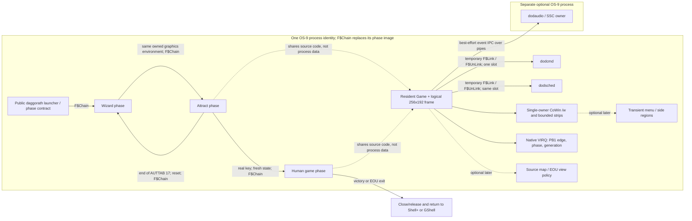

# Dungeons of Daggorath EOU: strategic master plan

**Status: CURRENT, ratified architecture direction, 2026-10-01.** This is a reviewed roadmap, not an implementation or an acceptance report. Product choices marked OPEN QUESTION remain undecided. The uncommitted M2/M3 work is deliberately left intact. Recheck this plan after each architecture decision; retain milestone reports as evidence rather than silently treating their interim assumptions as current.

## Reading contract and evidence

Every behavioral claim below carries one of four labels. **SOURCE/CARTRIDGE** means the pinned recovered source or a specified source-built cartridge capture establishes it. That source-built 8 KiB ROM is reproducible, but is not independently authenticated as a retail cartridge dump. **CURRENT EOU** means present source, tests, or a named live run establishes it; a host test alone is not live target proof. **PROPOSED EOU** is a design or target, not an implemented feature. **OPEN QUESTION** needs source, target, or product evidence. A proposal never silently becomes a statement about the original.

The recovered original is read-only `/Volumes/SEDONA/Projects/daggorath-reference` at `a94326f00ebb16a106b540c58bc2ccf5f7b66dac`. Labels such as `ONCE.ASM:DEMO10` below refer to that exact tree. EOU facts come from [Attract M1](DAGGORATH_ATTRACT_M1.md), [Wizard M1](DAGGORATH_WIZARD_M1.md), [Combat M1](DAGGORATH_COMBAT_M1.md), [Level II modularization](DAGGORATH_LEVEL2_MODULARIZATION.md), [heartbeat acceptance](DAGGORATH_HEARTBEAT_AV_SYNC.md), [presentation architecture](DAGGORATH_PRESENTATION_ARCHITECTURE.md), [color research](DAGGORATH_PRESENTATION_COLOR_RESEARCH.md), [M2 visual review](DAGGORATH_ATTRACT_VISUAL_M2.md), [audio catalog](DAGGORATH_AUDIO_CATALOG.md), and the [NitrOS-9 source index](../source-index/README.md). The unfinished M3 evidence is preserved in the uncommitted `DAGGORATH_DYNAMIC_PRESENTATION_M3.md`; it is not a dependency of this checkpoint. The indexed EOU source, installed-module observations, and pinned upstream checkout `f470fa52eb172b59b22c1b722074998cb42de9b1` have different evidentiary roles; the index explains their precedence. `MCP/Documents/` and `DOCS_INDEX.md` are absent in this checkout, so no missing manual is claimed as authority. Selected [original/EOU comparison images](DAGGORATH_ATTRACT_VISUAL_M2.md#curated-comparison-frames) and the [M1 source-built recording](DAGGORATH_ATTRACT_M1.md#audio-and-timing-relationships) are review evidence, with their capture limits.

## 1. Executive assessment: what was built and what remains

| Stage | Established result | Boundary still open |
| --- | --- | --- |
| Reconstruction | **CURRENT EOU:** Imported original font, vectors, maze and packed OCB/CCB semantics into a 256×192 logical renderer; verified Wizard M1 and gameplay fixtures. | The normal interactive game does not yet cover every source command or ending. |
| Gameplay foundation | **CURRENT EOU:** Combat M1, Bag/EXAMINE, source level-two `DGNGEN`/`CBIRTH`, creature movement/CMOV20, heartbeat rate and audio semantic events are exercised by focused tests. | Level transitions, magic, map, death and victory need complete integrated human-play acceptance. |
| Multitasking/memory | **CURRENT EOU:** `dodcmd` and `dodsched` are one-slot callable overlays with retained nonmapping loads; `dodsched` owns normal logical scheduling. | Scheduler module is exactly 8,192 bytes; callback ABI and module lifetimes remain high-risk seams. |
| Presentation | **CURRENT EOU:** One process owns type-5 CoWin graphics; 512×32 maximum routine strips and cached 32×7 heart images reconcile native generations. | Normal four-row transcript and map are incomplete; lit renderer performance and optional-audio blocking remain visible. |
| Autonomous demonstration | **CURRENT EOU:** `doddemo` runs source-derived level two and AUTTAB 1–10 through Stone Giant attack and ordinary Combat M1. M2 fixes intro glyph placement and a mapped-text lifetime defect; M3 advances native-heart presentation during scheduler waits. | `doddemo` begins at welcome, stops at command 10, and is a bounded runner rather than the final attract controller. M3 audio concurrency is unresolved. |

The cartridge's pre-command-10 RNG `75 65 19 → 203 transitions → F1 94 D4` depended partly on IRQ opportunities during variable bare-metal `VIEWER/PUPDAT` execution. **CURRENT EOU:** the portable scheduler reproduces explicit waits, queue order, and gameplay rules, not incidental renderer CPU time. That cartridge RNG checkpoint is reference-only for the portable trajectory. The independent Combat M1 golden fixture at `F1 94 D4` remains exact. See [Attract M1](DAGGORATH_ATTRACT_M1.md) and [Level II modularization](DAGGORATH_LEVEL2_MODULARIZATION.md#portable-scheduler-policy-and-activation-boundary).

**PROPOSED EOU:** Finish a keyboard-first Level 0 human game and its source-defined pressure before adding menus or colors. Treat the accepted heartbeat visual gate as a hard cross-cutting constraint. Separate a faithful complete game from optional EOU enhancements so polish cannot indefinitely defer completeness.

**Ratified decision hierarchy:** (1) reproduce source/game semantics; (2) preserve recognizable cartridge choreography; (3) replace hardware-incidental blocking and timing with Level II-native behavior where semantics permit; (4) add optional EOU enhancements only after faithful behavior is stable; (5) optimize only measured bottlenecks. Milestone-local implementation choices must not silently replace this project-wide order.

## 2. Source lifecycle and the intended player journey

**SOURCE/CARTRIDGE:** `ONCE.ASM:DEMO/COMINI/DEMO10` initializes RAM, queues and objects, enters autonomous mode, synchronizes on IRQ, fades in `WIZ1`, emits the two welcome strings, waits twice, fades out, blanks, sets level 2 and DEMDAT, presents the complete map, waits twice, then initializes the dungeon view and heartbeat (`PLOOK.ASM:INIVUX`). `HUMAN.ASM:PLAY20–PLAY99` feeds the 17 AUTTAB commands through the normal character processor with a source `WAIT` before each word; after the table it waits twice and jumps back to `DEMO`. `COMMON.ASM:CLK50` polls for a depressed key during autonomous mode and redirects execution to `GAME`, whose `COMINI/GAME10` creates a fresh normal level-0 game at `(16,11)`. It does not continue the demo's state.

**SOURCE/CARTRIDGE:** `HUPDAT.ASM:DEATH` displays crescent Wizard and death text, then waits in a loop; a subsequent key reaches `GAME` through the IRQ autonomous-key path. `PATTK.ASM:ENDGAM` follows the plain-wizard kill with a scripted Wizard challenge and a new upper-level dungeon; killing the evil Wizard invokes the ring riddle. `PINCAN.ASM:WINNER` displays star Wizard/victory text and loops forever. The original ROM has no OS-9 process exit; a finished EOU must define a platform-native exit while preserving the recognizable sequence.

**CURRENT EOU:** Separate `dodwiz` plays Wizard then closes its own window. `doddemo` opens its own window, begins at welcome, uses the real level-two initialization, overlays, scheduler, heartbeat and optional audio, and exits cleanly after AUTTAB command 10. `dodgame` starts normal level 0 and accepts human input on its private `/w` path. No one public launch yet joins these phases, loops the full table, or interrupts attract into a fresh human game. The [live `proba → probeb → proba` F$Chain proof](DAGGORATH_ATTRACT_M1.md#disposable-eou-graphics-chain-proof) reused a single graphics path and CoWin buffer, but also proved that each phase must rebuild process-local data, `SS.MpGPB` mappings and signal interception.

**PROPOSED EOU:** Ship one public `daggorath` entry module whose chainable phases own one graphics environment at a time: Wizard/opening → looping attract → fresh human game → death/restart or victory → clean return. A small launcher/controller **role** coordinates phase and path contracts; it need not remain as a second resident process. Prefer `F$Chain` at coarse phase boundaries over a persistent parent plus concurrent graphics writers. The future Wizard phase must reuse the existing renderer after adapting ownership; `doddemo` should remain an acceptance runner until the attract controller is proven, then share its game engine rather than becoming the public program. All chain targets must reinstall signal handling and reconstruct mappings; ownership of the one graphics path must be explicit. This is a design recommendation, not a verified complete chain implementation.

The diagram shows proposed phase composition; `dodcmd`, `dodsched`, the native heartbeat and current CoWin presenter exist now. No mapped callback may outlive `F$UnLink`, and `dodcmd` and `dodsched` must never occupy the eighth DAT slot simultaneously.

## 3. Opening, attract loop and chronological event contract

| Phase / source boundary | Source timing and work | Heart, audio, and interruptible input | Current / proposed disposition |
| --- | --- | --- | --- |
| `DEMO → COMINI` | Reset RAM, source queues/TCBs, objects; set autonomous flag (`ONCE`). | `CLK50` tests a key each IRQ in autonomous mode. | **CURRENT EOU:** exact demo state initialization; **PROPOSED EOU:** chain phase must reset the complete state. |
| `DEMO10 → WIZIN0` | `WIZ1` fade/vector work, opening text, two explicit `WAIT`s, `WIZOUT`, blank/SYNC (`ONCE`, `MISC`). | `CLK20` opening buzz; `WIZI20` requests explosion; heartbeat not yet the dungeon's active visual. | **CURRENT EOU:** `dodwiz` separate and partly silent; integrate via the phase contract. |
| `GAME20/GAME40` | `PREPAR`, level 2 generation, DEMDAT objects, complete `MAPPER`, two `WAIT`s and two `SYNC`s. | Scheduler is deliberately slept for demo map hold; autonomous key still routes to fresh game. | **CURRENT EOU:** PREPARE and demo init; full original map hold and transition need end-to-end proof. |
| `GAME50 → INIVU` | Source forward view, status, prompt, scheduler entry. | Native heartbeat starts with source rate/phase meaning. | **CURRENT EOU:** logical view/heartbeat exist. |
| `PLAY30–PLAY50`, commands 1–17 | Expand each word; `WAIT` per word (`MISC.ASM:WAITX` executes 81 `SYNC` iterations); feed normal `HUMAN`; CR dispatch; scheduler runs between tasks. | Creature tasks, torch, health and sound continue according to queue; key aborts autonomous phase. | **CURRENT EOU:** runner executes 1–10; **PROPOSED EOU:** complete 11–17 through ordinary game semantics. |
| `PLAY20` table end | Two explicit `WAIT`s, then `JMP DEMO`. | Reset and repeat unless a key redirected to `GAME`. | **CURRENT EOU:** bounded clean exit; **PROPOSED EOU:** genuine indefinite attract loop. |

**SOURCE/CARTRIDGE:** AUTTAB in `TOKEN.ASM` is exactly: 1 EXAMINE; 2 PULL RIGHT TORCH; 3 USE RIGHT; 4 LOOK; 5 MOVE; 6 PULL LEFT SHIELD; 7 PULL RIGHT SWORD; 8 MOVE; 9 MOVE; 10 ATTACK RIGHT; 11 TURN RIGHT; 12 MOVE; 13 MOVE; 14 MOVE; 15 TURN RIGHT; 16 MOVE; 17 MOVE. **CURRENT EOU:** the accepted bounded runner stops after command 10 and displays the real post-kill state. **PROPOSED EOU:** do not emulate the cartridge's variable 6809 rendering duration to force its incidental RNG trajectory; preserve explicit waits, source queue work, presentation boundaries and interrupt opportunities in portable logical time. A visually readable dwell is allowed only as a presentation choice that does not mutate game/RNG state.

## 4. Four-row primary text and keyboard-first human play

**SOURCE/CARTRIDGE:** `COMDAT.ASM:TXTPRI` defines 32 columns × four eight-pixel rows; `COMTXT.ASM:TXTCR` advances by 32 cells; `TXTSER.ASM:TXTCHR/TXTSCR` scrolls after the 128th cell; `CLRPRI` clears/homes. Five-pixel glyph strokes occupy seven rows inside eight-pixel cells. The EXAMINE region (`TXTEXA`, y0–151) and status (`TXTSTS`, y152–159) are distinct.

| Primary row | Logical y | Source behavior | Current EOU |
| ---: | ---: | --- | --- |
| 0 | 160 | First retained primary row; clear resets it. | M2 attract renderer supports it. |
| 1 | 168 | First welcome line follows leading source CR. | M2 welcome placement correct; normal play currently uses this for current result. |
| 2 | 176 | Second welcome line begins with **three literal dots**. | M2 glyph/punctuation support; ordinary transcript still missing. |
| 3 | 184 | Last primary row; overflow scrolls rows 1–3 upward and clears this row. | Current human input is rebuilt here; no persistent four-row message history. |

`MISC.ASM:PROMPX` uses its own **CR then dot** prompt convention. **SOURCE/CARTRIDGE:** there is no fabricated leading dot before welcome line 1; the three dots on line 2 are text data. `MISC.ASM:PREPAX` puts `PREPARE!` in `TXTEXA` at cell `(12,9)`, logical `(96,72)`, not in the four-row primary area. **CURRENT EOU:** uncommitted M2 corrects those positions and punctuation; normal `game_render_with_progress` still rebuilds one current message at y168 plus editable input at y184. **PROPOSED EOU:** model a persistent four-row cursor/transcript with source clear, CR, scroll, echo and prompt semantics. Keep its text state in resident/process-owned data; rendering should be a pure view. Verify combat and object messages over multiple commands, not only sparse welcome frames.

**SOURCE/CARTRIDGE:** `COMMON.ASM:CLK50/KBDPUT/KBDGET` polls one keyboard character on each IRQ and pushes it into a **32-byte circular ring with no overflow check**; equal head/tail denotes empty, so only 31 unread positions are unambiguous before overwrite ambiguity. `HUMAN.ASM:PLAYER/PLAY10` drains available characters, schedules again one jiffy later when empty, discards keys while faint, uppercases accepted letters, maps non-alpha to space except CR/backspace, echoes immediately, edits with backspace, and dispatches only on CR through `PARSER`. The line buffer stops at `LINEND`; no source command history is established. Scheduler and creature work continue while the human thinks or types. `COMMON:CLK50` treats a key during autonomous play as a fresh `GAME` restart, not a command typed into the demo.

**CURRENT EOU:** `game_input()` polls the game-owned `/w` with `SS.Ready`/one-byte `I$Read`; `main.c` drains up to 32 bytes per foreground iteration, uppercases ASCII, has a 31-character line plus CR/backspace, and updates the small UI area per character while the native heartbeat continues. It is not an exact implementation of the source ring, `LINEND`, all parser abbreviations, or retained transcript. Audio IPC and long rendering can still delay character servicing; live human timing coverage is narrower than demo state coverage.

**PROPOSED EOU:** use the OS/SCF input queue as the producer, a bounded game-owned input ring as the consumer, and foreground `PLAYER` consumption at the source logical cadence; define overflow visibly and safely instead of reproducing unchecked source overwrite. Never block the source scheduler waiting for a complete line, and do not pause creatures merely because the player is typing. Process attract interruption separately from the human command buffer. Test type-ahead during redraw, creature attack, audio, map and backspace. **OPEN QUESTION:** exact live CoWin queue behavior and source `LINEND` effective capacity require a targeted comparison before locking maximum type-ahead acceptance.

## 5. Feature-completeness matrix and shortest playable path

The source command table is `DTABAS.ASM:CMDXXX`; its fifteen entries include the cassette-specific `ZLOAD/ZSAVE`. The matrix distinguishes a tested subsystem from a complete integrated game. “Level 1” in user-facing roadmap means the **first playable dungeon**; source internal level index begins at **0**. `COMDAT.ASM:CMTTAB` has five 12-type rows for level indices **0–4**; `NEWLVL.ASM`, `PCLIMB.ASM`, `PATTK.ASM` and `PINCAN.ASM` define progression/endgame branches. A source row count alone is not proof of all five EOU levels being playable.

| Original feature | CURRENT EOU / tests | Missing dependency and proposed milestone |
| --- | --- | --- |
| Wizard, welcome, PREPARE, repeat/interrupt | Separate Wizard; M2 welcome/PREPARE; bounded demo 1–10 live. | Chain controller, 11–17, key transition, reset; opening milestone. |
| 256×192 perspective, status, heart | Source-derived geometry; type-5 512×192 viewport; heartbeat deterministic live acceptance. | M3 starvation closure, performance/human visual review. |
| Four-row retained text and prompt | M2 intro rows; ordinary input current message only. | Resident text cursor/scroll and command echo milestone. |
| Parser, partial words, error paths | Generated token subset and command adapters, focused tests. | Complete `PARSER`/`DTABAS` contract and human input tests. |
| Movement, turn, look | General paths and AUTTAB prefix exercised. | Level-0 full-room/blocked-route and real play acceptance. |
| Combat, creature attacks | Combat M1 exact fixture; source-order CMOV20 scheduler and demo Giant battle. | Complete creature types, all damage/faint/death outcomes. |
| Bag, objects, EXAMINE | PULL/STOW/GET/DROP/EXAMINE overlay tests; packed OCB references. | All object verbs and special cases across all levels. |
| Torches, health, heartbeat | Torch/HSLOW/BURNER/HUPDAT scheduler work; VIRQ heartbeat. | Long human runs, depleted/damaged/faint paths. |
| `USE` objects and magic (`REVEAL`, `INCANT`) | Torch `USE` subset; no general complete magic path. | Source object/ring/scroll/flask semantics and endgame. |
| Level generation 0–4, vertical travel | Level-2 demo init exact; normal level-0 init; source CMT rows known. | CLIMB, rebuilt-level state, all level fixtures; human Level 0 then complete game. |
| Top-view map / scrolls | Demo map source studied; no integrated human map renderer/trigger. | Vision/Seer scroll, source lifetime, keyboard route, map acceptance. |
| Faint, death, restart | Source behavior audited; partial health state and current game death exit. | Fade/text/restart choreography and fresh-game reset. |
| Plain/Evil Wizard, Omega ring, victory | Source branch known, not integrated. | Remaining magic, late-level encounters, ending. |
| Cassette ZLOAD/ZSAVE | Original cassette routines present; no EOU persistence. | Decide source-compatible vs optional file save; versioned state format. |
| Sound/effects | Semantic catalog and optional SSC service; native heartbeat independent. | Nonblocking submission, session ownership, source-vs-SSC listening review. |

**PROPOSED EOU, shortest path:** after heartbeat/audio concurrency and text/input, complete all source actions and hazards needed for a *human-playable first dungeon* with honest level exit/death, keyboard map if reachable, continuous scheduler, and clean OS-9 lifecycle. Then expand to other CMT rows, magic/endgame, and the full attract table. Avoid treating command-10 demo success as evidence that the whole original game is done.

## 6. Heartbeat: the non-negotiable cross-cutting contract

**SOURCE/CARTRIDGE:** `COMMON.ASM:CLOCK/CLK30–32` decrements `HEARTC`; on zero it reloads from `HEARTR`, toggles PIA1 PB1, and, if `HEARTF` is enabled, complements `HEARTS` and writes the small/large two-cell glyph pair at `TXTSTS` columns 15–16. `HUPDAT.ASM:HUPDAX` computes the next rate from power/damage; it does not reschedule the in-progress countdown. `PLOOK.ASM:INIVUX` enables the status and heartbeat after initial view. `PUSE.ASM:USC210` turns off the visual heart in map mode while the electrical heartbeat can continue. The original source couples memory writes to an edge; exact optical scanout delay is not established by source inspection.

> **33.34 ms is a presentation-latency gate, not heartbeat cadence.** `HEARTC`/`HEARTR` determine the source heartbeat period; one verified healthy state has `HEARTR=46` jiffies, about 767 ms at nominal 60 Hz. The 33.34 ms gate bounds the time from an authoritative native generation becoming due to completion of its matching visible presentation under the defined workload. One VIRQ authority owns countdown/rate, PB1 sound edge, `HEARTS` phase and visual generation. There is no independent visual-heart timer.

**CURRENT EOU:** native VIRQ is the sole audio-edge, phase and generation authority. Foreground graphics reconciles the latest generation through cached/preinitialized heart images, a 32×7 write, 512×32 bounded strips, and service checkpoints in rendering. No GFX2 runs in VIRQ. The completed heartbeat milestone's deterministic workload passed the unchanged **33.34 ms edge-to-completed-presentation gate**, with zero obsolete/superseded generations; see [final acceptance](DAGGORATH_HEARTBEAT_AV_SYNC.md). Uncommitted M3 extends this reconciliation into `doddemo` scheduler waits and scene preparation. M3's long optional-audio wait remains **unaccepted** as a live dynamic-visibility path. The two statements are not contradictory: the committed gameplay architecture passed its bounded gate; the newer demo/audio composition exposes another foreground blocking boundary.

**PROPOSED EOU acceptance:** preserve the native cadence/waveform and same authoritative generation; every supported active generation must either complete within **33.34 ms** or a failure must be diagnosed, never hidden by gate relaxation. Require no obsolete generation, no VIRQ graphics, correct healthy/damaged rate transitions, map-specific visual enable semantics, zero callbacks after teardown, normal and cancellation cleanup, and actual Term/GShell workload evidence without host BEL contamination. Track sound edge, native generation, heart PutBlk completion, and scanout separately. A copied frame or screenshot timestamp alone cannot prove the visual gate. Optional audio must never hold the only foreground presentation process through an unbounded drain.

## 7. Optional SSC audio: separate session, asynchronous presentation

**CURRENT EOU:** game and demo emit source-semantic event IDs. `audio_present_optional()` lazily forks `/d1/dodaudio` via pipes, sends `CATALOG_PLAY`, synchronously waits for a reply, sends `DRAIN`, waits again, and disables the service for the rest of the process if startup/IPC fails. Gameplay/RNG/heartbeat propagation precedes optional audio. `dodaudio` owns the SSC backend and service lifecycle; the native PB1 heartbeat is independent. The catalog has 23 foreground effects; Wizard fade buzz and heartbeat are separate paths. The uncommitted M3 controlled replay found a 4.247-second same-frame hold without service and 11.245 seconds with service at the command-9 `GRAWL` boundary; `backend_drain()` may poll for 180 OS ticks. This is evidence of an EOU IPC/presentation stall, not a source gameplay wait or a failure of the scheduler order.

**PROPOSED EOU:** review a bounded event queue with one outstanding protocol exchange and a foreground nonblocking/pollable completion path (or a dedicated IPC pump with proven ownership). The game records semantic events after committing state; presentation continues regardless of the child's progress. Define ordering, overflow, cancellation, stop/shutdown, child reap and failure latch. A submitted `PLAY` must not require the game to wait through `DRAIN`; do not silently alter the established audio test contract. Measure queue submission and reply latencies on real EOU before selecting protocol details. SSC use remains optional and cannot affect combat, RNG, heartbeat rate, or process exit status.

**PROPOSED EOU audio-concurrency contract:** before changing protocol or tests, specify queue depth; FIFO ordering and priority; which effects may overlap versus must serialize; whether repeated events may coalesce; queue-full and stale-event behavior; cancellation at death, restart and `F$Chain`; service failure; shutdown/reaping; and whether a semantic sequence such as `WHOOSH → KLINK → BANG` must be accepted atomically or preserved through another explicit mechanism. A full optional-audio queue must never block gameplay for an effect's duration. Equally, becoming asynchronous must not silently drop required semantic events: any intentional coalescing, replacement or rejection must be defined, observable and tested. The exact policy remains an **OPEN QUESTION** for the Audio Concurrency milestone, based on source order, SSC limits and EOU IPC measurements.

**OPEN QUESTION:** whether the installed EOU SSC/SndDrv path can remain enabled for a full Daggorath audio session with silence/effect control inside the service, rather than toggling S/SC for each recipe, needs source/hardware and live ownership proof. Do not infer it from a catalog test. A later audio-fidelity pass should align `GRAWL`, `WHOOSH → KLINK → BANG` and other source `SOUNDS.ASM` event choreography with cartridge capture and SSC playback, while preserving intentional enhanced timbre as a product choice.

## 8. Dungeon, status and dynamic visibility

**CURRENT EOU:** logical source pixels remain 256×192 (6,144 bytes). The type-5 `640×200×2` CoWin path horizontally expands the 512×192 game viewport at physical `(64,4)`, reserving 64 pixels on each side. One process owns graphics. Routine work uses no strip taller than 512×32, with heartbeat reconciliation between strips and during expensive logical drawing. Status is logical y152–159; the primary text region starts y160. A completed source frame is reconciled before presentation to prevent stale-heart restoration. The [presentation investigation](DAGGORATH_PRESENTATION_ARCHITECTURE.md) measured prepared full 512×192 transfer around 31 ms and small 32×7 transfer around 4–5 ms; its CPU-side 1×→2× expansion and process-memory copy were roughly 183 ms and 136 ms in the reported probe. These are different stages and not all reducible by 6309 CPU optimization.

**CURRENT EOU M3:** CCB 18 / Stone Giant 2 contributes no visible pixels in AUTTAB commands 1–5, four at 6, is occluded at 7, contributes two at 8 and six at 9 before the same-cell attack; the isolated renderer comparison counts only pixels lost when that CCB is removed from a copy. Sparse host snapshots can miss those states. The accepted bounded demo uses ordinary renderer, `dodsched` CMOV20, `dodcmd` Combat M1, native heartbeat and optional `dodaudio`; it does not paint a creature independently.

**PROPOSED EOU:** treat logical game changes and presentation completion as separate measured events. Show each meaningful state after a source logical boundary; keep live heart/status updates independent of unfinished dungeon strips; avoid tearing, stale strips and partial old/new scenes. Preserve source wait and scheduler time while allowing render wall time to vary. First remove implementation stalls (especially audio), then measure lit render, strip expansion, memory copies, GFX2, overlay link and actual visual completion before choosing any 6809/6309 optimization.

## 9. Map, color and optional EOU windowing

**SOURCE/CARTRIDGE map:** `ONCE.ASM:GAME40` displays the full demo map. `PUSE.ASM:USC100/USC200/USC210` selects `MAPPER` when a Vision or Seer scroll is used; `MAPFLG` controls whether features/objects/creatures appear. `MAPPER.ASM` describes black passage, white wall, blue door and red secret-door meanings, and draws player/object/creature marks. `COMPLR.ASM:LUKNEW` refreshes map mode on its `Q.TEN` schedule. `HUMAN.ASM:HMAN10` restores the forward view and prompt upon the next processed input character. There is also a debugging `QMAP` macro, not an established ordinary player hotkey. **OPEN QUESTION:** exact artifact-color appearance and a standalone player key for map are not established; do not invent one from modern expectations. Map duration is until the next input/view change, while source scheduler time continues; source `HEARTF` is cleared for map but `HBEATF` is not.

**CURRENT EOU:** no integrated human-play map presentation. **PROPOSED EOU:** first support the faithful `USE`-scroll/keyboard command route in the same owned window, with source marker rules and map-to-view restoration. A later optional menu or separate window can expose it only after confirming Level II memory, graphics ownership and real-time scheduler behavior. A separate map must not make the original keyboard path unavailable or freeze gameplay accidentally.

**CURRENT EOU color:** type 5 is 1 bpp, 80 physical bytes/scanline, and a 512×32 strip is 2,048 bytes. **PROPOSED EOU research candidate:** documented type 7 is `640×200×4`, 160 bytes/scanline and a corresponding strip is 4,096 bytes, still one mapped 8 KiB GP block. The [bounded color investigation](DAGGORATH_PRESENTATION_COLOR_RESEARCH.md) found EOU `ESC $16` palette escape returning `E$UnkSvc 208`; type 7 was recognized, but the correctly sized live candidate did not yield a trustworthy successful graphical status. Therefore four-color support is **not accepted**. Future research must determine a working palette control/driver path, full-buffer/strip timings, pixel equality and cleanup on the installed EOU module before production conversion. Intended semantic accents are black background, white/neutral primary geometry, red heart/life/danger, and blue map/magic/navigation. Do not simulate them with NTSC artifact color in RGB or broadly colorize all surfaces.

**Ratified mode rule:** even if type 7 succeeds, retain type-5 `640×200×2` monochrome as a supported faithful presentation mode, regression oracle and fallback where palette/type-7 handling is unsuitable. Four-color accents cannot replace monochrome testing or become a prerequisite for the complete game.

**PROPOSED EOU UI:** keep gameplay keyboard-first. Investigate `TITLE/MENU/ITEM`, a transient mouse menu, help/settings, optional map/inventory in 64-pixel side regions or a full-screen `/w`, and explicit pause/quit only after the faithful command path works. Live transient overlays must preserve heartbeat and scheduler; modal help/configuration may intentionally pause; alternate map/inventory presentation is a third class. The existing side regions are reserved, not a mandate to fill them. Do not let menu/window experiments change the one-owner graphics contract without review.

**OPEN QUESTION — EOU UI architecture:** no sidebar or multi-window arrangement is preselected. A later design study must compare (1) the original-style single gameplay window plus transient menu, (2) optional sidebar, (3) separate map/help/inventory windows, and (4) a hybrid where active play remains visually faithful while preferences/help are outside it. Compare each against DAT slots, CoWin buffer ownership, heartbeat and strip latency, keyboard/mouse behavior, actual screen area and source visual fidelity before choosing.

## 10. Level II memory, modules and ABI budget

Fresh **CURRENT EOU host builds from this unchanged working tree** on 2026-10-01, using the repository build scripts, gave valid ToolShed CRCs. Sizes are build facts, not a claim of a new live playthrough. `doddemo` matches the M3 candidate SHA; module bytes and OS-9 data requests are distinct from physical allocation granularity.

| Module / role | Bytes; CRC; SHA-256 | Data request | Program/data blocks and headroom |
| --- | --- | ---: | --- |
| `dodgame`, normal resident | 25,376; `456B98`; `30f50a923430bbad8a70eeba4ea70769d4fdee66f59024cd2db3141fca0a85b6` | 11,088 | 4+2 blocks; 5,344 bytes below 30,720 resident policy; 7,392 below next 32,768 boundary; 5,296 raw bytes below data block boundary. |
| `dodcmd`, temporary command | 7,004; `C3B942`; `fbf2424f991afe7610a815113b1084372afa495272587be187b9a1872726b946` | module-local call/stack only | 1 temporary block; 1,188 bytes before 8,192. |
| `dodsched`, temporary scheduler | 8,192; `DA8721`; `82deac540cd172f9fdd99d26b2a6989c3d8193265ad60b8b2ded35d594bff6b0` | 52-byte persistent scheduler state is **caller-owned**, inside process data | Exactly 1 temporary block; **zero module byte headroom**. |
| `doddemo`, bounded acceptance runner | 22,045; `C88CB0`; `4f852198e1da18da3b2e306c36262d8ca53b6d21dd55c27c9234a0b4b5cfa1d7` | 10,875 | 3 program + 2 data blocks; own CoWin mapping. Not the final public lifecycle. |
| `dodwiz`, separate Wizard M1 | 22,739; `8C7FA5`; `7539da8dee4c4de0e29106a292d49229c949eea3bad1e48b9989f1d00e357bef` | 7,855 | 3 program + 1 data blocks; currently opens/closes its own window. |
| `dodaudio`, optional child | 9,426; `FFD70A`; `28addc0bd752d23a24ae9fbce8c882608cdbab89fb0a5a52a5b7038748cec321` | 2,142 | Separate process: 2 program + 1 data blocks before its own I/O mappings; does not consume `dodgame`'s eighth slot. |

Normal `dodgame` graphical map is **4 program + 2 data + 1 CoWin = 7/8** logical 8 KiB blocks. A command or scheduler call temporarily maps exactly one of `dodcmd`/`dodsched` into the eighth, giving **8/8**. Each is retained physically by `F$NMLoad` without occupying a logical slot, then `F$Link → ABI call → F$UnLink`; release on cleanup uses `F$UnLoad`. One link services a complete scheduler foreground boundary, not one task. `Game`, RNG, frame, heartbeat, object/creature data and the 52-byte scheduler queue state remain caller-owned across unlink/relink. `dodaudio` is a separate optional process with pipes, not a shared DAT overlay.

**CURRENT EOU ABI lessons:** live Level II `P$PModul` and process DAT image, not linker offsets alone, establish a module's actual logical address. A dynamically mapped `dodsched` callback into resident stack-checked CMOC C needs resident `Y` restoration **and** position-independent runtime target resolution. A `dodcmd` callback's target was already loader relocated but still needs resident `Y`; all `DagOverlayServices` use the resident-context-safe gateway. An overlay-owned text pointer must be copied before `F$UnLink`. [Level II modularization](DAGGORATH_LEVEL2_MODULARIZATION.md#live-level-ii-relocation-and-reverse-callback-correction--2026-09-30) records the verified mapping method and failures. Host-only ABI tests missed these target effects.

**PROPOSED EOU memory policy:** retain the four-block core/two-block data/one mapped CoWin/one shared overlay slot until measured features require a reviewed revision. No future map, menu, magic or controller state may assume a second free slot during command/scheduler execution. `dodsched` at exactly 8,192 bytes is an immediate placement risk; plan a coherent extraction or module split **before** adding scheduler behavior, not a silent 8 KiB boundary crossing. The `dodwiz` and demo modules are coarse chain-phase candidates, not code to fold into `dodgame`. Data modules are candidates only after their mapping/lifetime costs are measured. Separate audio process memory does not make synchronous audio safe for presentation.

**Active architectural constraint — zero scheduler headroom:** no new scheduler-owned production behavior may be added to `dodsched` until a scheduler placement/split review creates **measured** module headroom. Any future scheduler semantic requirement triggers that review *before implementation*; the one-block gate remains 8,192 bytes. Possible remedies to evaluate, not commitments, include moving a genuinely resident-owned primitive back into `dodgame` if its budget permits, separating scheduler orchestration from another subsystem, using source-derived data tables where code now repeats behavior, or another reviewed overlay arrangement. Preserve the one-free-DAT-slot model unless a separate memory/ownership review proves a replacement.

## 11. Optimization and responsive pacing policy

**SOURCE/CARTRIDGE:** explicit PLAYER/WAIT and queue countdowns are part of game pressure. Bare-metal renderer instruction time produced extra IRQ opportunities and affected some source RNG checkpoints; portable EOU does not model that incidental cost. **CURRENT EOU:** bounded strips preserve heartbeat visibility; the architectural probe attributed roughly 183 ms to horizontal expansion, 136 ms to a process-memory copy, and 31 ms to prepared full GFX2 transfer in one measured configuration. The M3 optional-audio hold is seconds, dwarfing micro-optimizations. Overlay link/unlink, map, input-to-pixel, menu and real uninstrumented lit-render distributions are not yet characterized to a finished-game budget.

| Metric | Current evidence / policy | PROPOSED EOU target or next measurement |
| --- | --- | --- |
| Native-heart edge → completed heart write | Accepted fixed **33.34 ms** gate; exact source and conditions in heartbeat report. | Keep the same hard gate through human play, demo, creature load and optional audio; no busy wait or IRQ graphics. |
| Input echo / type-ahead | Human main loop sends small UI updates, but no robust live distribution under all workloads. | Measure key arrival → visible glyph; initial target p95 ≤ one source jiffy **after the foreground can service the queue**, then tighten based on real OS-9 scheduling. Never stop scheduler time to fake responsiveness. |
| Simple command → first stable result | No general live response distribution. | Instrument parse, overlay, logical render and strips separately; set an empirical p95 budget after baseline, with a provisional human-review goal below 0.5 s for non-lit/simple actions. Source WAIT remains intact. |
| Full dungeon redraw | Historical six-strip flip median ~352 ms, plus separate logical draw; instrumented lit draw has reached multi-second intervals. | Measure clean uninstrumented dark/lit/creature distributions and perceived continuity; remove avoidable EOU stalls, then set exact budget. Do not interpret strip transfer time as whole redraw time. |
| Map/menu invocation | No accepted production implementation. | Measure request → first complete map/menu frame and heartbeat continuity before setting final limits; provisional sub-second human-review target. |
| Audio submission | Current PLAY/reply + DRAIN/reply can hold seconds. | Queued submission should return promptly without waiting for effect completion; target ≤ one video tick of foreground work once service is ready, subject to measured IPC capacity and failure behavior. |

**PROPOSED EOU implementation policy:** CMOC C for maintainable rules, narrow 6809 assembly for OS-9/module gateways and measured hotspots, and optional HD6309-native paths only when they improve a demonstrated CPU cost while a 6809 fallback remains exact. Candidates include framebuffer expansion/copy (`TFM`, `LDQ/STQ` after verified CPU/OS support), vector rasterization, glyph/map blits, and table walks. GFX2 blocking, scheduler descheduling and audio drain cannot be fixed by optimizing C loops. Every assembly path needs a baseline, byte/state/frame equivalence, target build/disassembly review, 6809 fallback and live improvement. **CURRENT EOU compiler risk:** CMOC 0.1.90 `-O2` once generated a CMT index compare that clobbered the computed address's low byte by loading a loop counter into `B`; the source-equivalent cached-count form fixed the target result. This was a proven target-only generated-code defect, not a general claim about every CMOC indexed expression. Inspect generated assembly for similarly complex hot expressions when symptoms differ between host and 6809; see [exact generated-code evidence](DAGGORATH_LEVEL2_MODULARIZATION.md#auttab-demo-completion-and-target-only-cmt-code-generation-finding--2026-09-30).

## 12. Testing, visual/audio acceptance and integrity

| Evidence layer | What it can establish | What it cannot establish alone |
| --- | --- | --- |
| Original source + source-built cartridge | Rules, data, explicit timing, repeatable visual/audio reference with provenance. | Retail-dump identity or portable EOU response time. |
| Source-derived host tests | Game/OCB/CCB/RNG/queue/frame assertions, command and cleanup logic. | CMOC-generated 6809 correctness, DAT relocation, live CoWin/SndDrv behavior. |
| CMOC target tests and module checks | Compiler/codegen, ABI layout, generated bytes, OS-9 header/CRC, reproducibility and block sizes. | Graphical user experience or correct lifecycle in a live process. |
| Live EOU/MAME acceptance | Real guest status, mapped modules, VIRQ/GFX/SSC interplay, shell return and timing under known workload. | Human perception from sparse screenshots or perfect real-hardware behavior. |
| Dense original ↔ EOU capture and human review | Choreography, transient heart/creature visibility, typography and audio impression. | Exact internal state without independent instrumentation. |

**Policy:** state-changing rule edits require source-backed host fixtures; overlay/compiler/ABI edits also require target-generated-code/module checks and a live Level II boundary test; VIRQ/GFX/SSC/window edits require exact-build live runs; visual/audio fidelity claims require dense paired capture and human review. A milestone cannot be called visually or audibly faithful solely because state-based tests pass. Keep artifact hashes, module CRC, guest status, process/path cleanup, no active FDC, canonical-media hashes/permissions, docs links and `git diff --check` as appropriate gates. Never change an existing test expectation without source proof and explicit human approval under [AGENTS.md](../../AGENTS.md).

**PROPOSED EOU deterministic replay/test driver:** retain the proven value of *known initialization + known RNG + recorded commands/events → exact authoritative trajectory* after `doddemo` ceases to be the main development runner. Drive the **normal production game rules** through a narrow input/event seam; never fork a second game engine or patch expected state. Support all levels, 6809/6309 equivalence, visual/audio choreography, historical-quirk regression and real-hardware acceptance where practical. Keep the replay driver development/test infrastructure unless a later product decision explicitly exposes it to players. A live replay must still prove it used the production `dodcmd`, `dodsched`, heartbeat and renderer paths claimed by that test.

**Acceptance tiers:** (1) MAME CoCo 3/6809; (2) MAME 6309 configuration for relevant paths; (3) physical CoCo 3/6809; (4) physical CoCo 3/6309 where available; (5) physical S/SC-equipped CoCo 3 for enhanced audio. Host/source fixtures remain appropriate for most intermediate semantics, but release and major heartbeat, keyboard/type-ahead, CoWin performance, SSC and 6309 milestones need the applicable physical tier. If physical equipment is unavailable, report that tier as pending rather than relabel MAME evidence as hardware acceptance.

Lessons already paid for: host tests passed while CMOC/6809 target code did something else; module-relative symbols are not live CPU addresses; the process DAT and `P$PModul` must validate debugger breakpoints; mapped-to-resident CMOC callbacks need explicit context; graphics-owning applications cannot be judged by an ordinary Shell+ prompt waiter; sparse screenshots missed Giant/heart states; MAME/MCP BEL and disposable disk/trace failures were observer artifacts until independently separated from guest behavior. The correct response to an uncertain observer is to verify the observer, not change gameplay.

## 13. Failure ownership and packaging contract

| Subsystem | Mandatory or optional | PROPOSED EOU failure and cleanup contract |
| --- | --- | --- |
| Phase controller / owned graphics path / buffers | Mandatory for a graphical phase | Preserve actual OS-9 status; close only owned paths/buffers, restore invoking window, do not report `000` on failed startup. Chain phases reestablish local mappings and signal intercept. |
| `dodsched` and native heartbeat/VIRQ | Mandatory during gameplay | Failed load/link/call/close or VIRQ setup must stop safely with nonzero status; no gameplay continuation with a missing scheduler; zero callbacks after teardown. |
| `dodcmd` | Mandatory for commands it implements | A failed overlay operation must not report command success or leave the eighth DAT slot mapped; pointer results copied before unlink. Startup policy for a missing retained command module needs an explicit launch contract. |
| `dodaudio` / SSC | Optional presentation | One failure disables/tears down optional service for that process, reaps child, releases SSC; gameplay/RNG/heartbeat and final game status remain authoritative. |
| Future map/menu/data resources | Required only when invoked | Own and free temporary CoWin/data modules; preserve one-slot invariant and avoid stale borrowed pointers. |

**CURRENT EOU:** apparent historical status-000 “successes” were sometimes incomplete harness observation or a control-flow boundary before AUTTAB; later byte-validated DAT debugging identified real callback defects. Future acceptance must capture child status and exact failing operation, not infer success or failure from a screen transition. Normal EXIT and Shift-BREAK cleanup paths are part of the product contract, as are GShell and Term return, strict post-run shell health, and no orphaned child. Forced OS-9 termination may not run normal cleanup and should be documented rather than promised away.

**PROPOSED EOU packaging:** expose only `daggorath` (final name subject to product choice) as the public command/AIF. Bundle required phase modules, `dodcmd`, `dodsched`, native heartbeat and graphics assets; detect/installable optional `dodaudio` separately. Validate module identity and compatibility at startup with actionable errors. A user should not need to know DAT slots, retained load references, or `doddemo`. `doddemo` remains a development/acceptance runner unless a later controller deliberately reuses its engine; `dodwiz` survives as source-derived Wizard implementation but should become a chainable phase rather than a separate visible launch. 6309 detection, SSC detection, save files and optional UI must not prevent a faithful 6809 keyboard-only install.

## 14. Source fidelity, historical quirks and intentional modes

For each change, record: source instruction/data; semantic result; hardware accident; EOU equivalent; tests/live proof; intentional divergence. Preserve gameplay rules, packed object/creature state, commands, explicit waits, heartbeat and recognizable graphics/sound ordering. Do not preserve incidental cartridge renderer CPU time merely to reproduce one RNG seed, unchecked buffer corruption, or a blocking file/audio architecture just because the cartridge lacked an OS. Do not silently correct a source quirk either. **OPEN QUESTION:** a verified retail-cartridge bug inventory does not yet exist; the rows below are source-observable risks or quirks, not a claim that multiple original gameplay defects have been authenticated.

| Candidate quirk/defect | Evidence and classification | Proposed handling |
| --- | --- | --- |
| Unchecked 32-byte keyboard ring overflow | `COMMON.ASM:KBDPUT/KBDGET` explicitly has no overflow check. Clearly unsafe implementation consequence; exact user-observable overwrite behavior under stress unmeasured. | Safe bounded EOU queue; document overflow policy and test under pressure. Research before calling it an original gameplay bug. |
| Renderer-time IRQ/RNG drift | Original autonomous capture vs source timing study. Hardware/timing-dependent recognizable behavior, not a deterministic gameplay rule. | Preserve original capture as reference; use portable scheduler, no RNG padding or command-number delay table. |
| Map framebuffer write annotation | Recovered `MAPPER.ASM:MAPP22` says `STB ,Y` and notes “2022 original was 0,Y.” This is an edited-source observation, **not** proof of a retail defect. | Research provenance before classification; do not use this comment alone to justify a compatibility switch. |
| Source cassette persistence | `DTABAS:ZLOAD/ZSAVE`, `PZTAPE.ASM`, `COMMON:SAVE/LOAD` implement tape transfer. This is a feature, not a bug. | Define EOU persistence separately; avoid falsely claiming the original had no save. |
| End loops, death key reset | `PINCAN:WINNER` loops; `HUPDAT:DEATH` loops until IRQ key redirect. Recognizable cartridge lifecycle, but no OS exit. | Keep scenes/choreography; add explicit, clean EOU exit/restart behavior with review. |

**PROPOSED EOU modes:** default “Daggorath EOU” is faithful rules and keyboard play with safe OS behavior. A strict “Original/Faithful” option should exist only for verified player-visible differences that matter, not every implementation detail. Color accents and enhanced SSC audio can be detected optional presentation preferences after they work; 6809/6309 should be an automatic exact-results implementation choice, not a gameplay mode. **OPEN QUESTION/product decision:** corrected historical bugs default vs opt-in original behavior requires a verified bug inventory first.

## 15. Persistence policy

**SOURCE/CARTRIDGE:** cassette `ZLOAD/ZSAVE` and raw game-memory transfer are present in `DTABAS.ASM`, `PZTAPE.ASM` and `COMMON.ASM:SAVE/LOAD`; filenames and tape block format are source-specific. This does not establish a convenient modern save menu. **CURRENT EOU:** no integrated save/resume for the full human game.

**PROPOSED EOU:** first decide whether to carry source-command semantics on EOU file storage and whether a separate optional resume convenience is desirable. A robust snapshot must version and validate authoritative `Game` (including logical level, maze, packed OCB/CCB, hands/bag and three-byte RNG), caller-owned 52-byte scheduler queue/timers, native heartbeat rate/phase/countdown policy, player text/view mode, and object/module ABI version. Do **not** serialize raw process pointers, GP buffer mappings, VIRQ handles, audio child paths or overlay addresses; reconstruct those after load. Optional resume should not become the default way to avoid the original challenge. File I/O must preserve heartbeat/resource cleanup and avoid canonical-media writes.

## 16. Working-tree audit and commit disposition

This review observed the existing uncommitted tree; it did **not** edit, stage, revert or commit it. The tracked modifications are `src/gameplay/demo.c`, `game.c`, `game.h`, `overlay-host.c`, and three C fixtures (`test/demo_runner.c`, `test/overlay_host.c`, `test/scheduler_attract.c`). Untracked files are `test/demo_heartbeat.c`, `test_attract_layout.py`, `test_demo_heartbeat.py`, the two M2/M3 reports, M2 curated assets, and unrelated `snap/` (paths relative to `apps/daggorath/` unless under `docs/apps/`). `demo.c` and `test/demo_runner.c` contain both M2 and M3 hunks; the files are **not** a clean one-file-per-milestone split.

| Disposition | Evidence | Recommendation for the next implementation/commit session |
| --- | --- | --- |
| **M2: retain, review for a separate checkpoint** | Source welcome y168/y176, literal punctuation, PREPARE cell `(12,9)`, font mapping; mapped overlay text copied before unlink; focused tests and accepted exact-build run through command 10. | Stage only M2 hunks/files/tests/report and a small correctly labeled screenshot set. Review composite provenance, especially the pre-fix corridor image, before committing. Keep Wizard omission explicit. |
| **M3: retain but not architecturally complete** | Progress callback during `DOD_SCHED_PLAYER_WAIT`, render/strip reconciliation, Giant visibility assertions, candidate replay through 1–10. | Do not call dynamic presentation complete while optional `PLAY/reply + DRAIN/reply` stalls the foreground. Resolve audio concurrency with a separately approved protocol/test contract and fresh live heartbeat/visibility acceptance, then checkpoint M3. |
| **Disposable/unrelated: exclude** | `/private/tmp` probes and `snap/` are not source milestones. | Do not stage private harnesses, raw captures, generated binaries or unrelated `snap/`; leave the existing work intact during this strategic review. |

## 17. Risk register

| Risk | Evidence | Impact | Mitigation | Architecture-review trigger |
| --- | --- | --- | --- | --- |
| `dodsched` capacity | Exactly 8,192 B today. | Any growth may demand second DAT block. | Profile/split coherent scheduler-owned behavior before new features. | First byte over 8,192 or a planned new scheduler feature. |
| Resident/data growth | `dodgame` 25,376 B; data 11,088 B; only one DAT slot free in normal graphics. | Fifth program/third data block loses overlay slot. | Enforce 30,720 resident policy and two-data-block gate; build reports. | New feature erodes policy margin materially or data reaches 16,384. |
| `dodcmd` growth | 7,004 B, 1,188 B to boundary. | Command features could require second block. | Plan module segmentation/resource data separately. | Magic/map/endgame work exceeds one block. |
| Reverse callback ABI | Live Y/relocation defects, mapped-text use-after-unlink. | Target-only crash/corruption. | Gateways, byte-validated DAT tests, copy outputs before unlink. | New callback/service pointer or ABI version. |
| CMOC target codegen | Proven CMT compare clobber under 0.1.90 `-O2`. | Host green/target wrong. | Inspect generated assembly around complex expressions; target fixtures. | New target-only state divergence. |
| Audio IPC starvation | M3 4.247/11.245 s static frame. | Heart/dynamic visuals and input feel frozen. | Reviewed queued/pollable service contract; keep audio optional. | Any >33.34 ms heart generation under optional audio. |
| GFX2/CPU render cost | ~31 ms full transfer and large logical/expansion intervals. | Sluggish human play, possible stale frames. | Measure stage distributions; bounded dirty regions and later targeted optimization. | Human review finds repeated objectionable redraw or heart gate fails. |
| Type-7/palette uncertainty | Palette escape 208; no accepted type-7 live completion. | Feature may require driver work/another presentation contract. | Separate research milestone, preserve type 5. | Palette path cannot be proven on installed EOU. |
| SSC hardware/session ownership | Current optional service and per-effect drain; session S/SC policy unproven. | Audio conflict, latency or cleanup leak. | Source/live ownership audit before session-level change. | Concurrent audio failure or menu preference work. |
| Human input drift | Current SCF polling differs from source IRQ ring/PLAYER. | Easier or harder game, lost type-ahead. | Command-boundary/time tests and human play. | First complete Level 0 acceptance. |
| Attract phase complexity | Wizard/demo separate windows; F$Chain resets local state/mappings. | Flicker, lost resource/signal, failed key transition. | Coarse chain contract and disposable lifecycle proof before joining. | Phase integration begins. |
| Canonical divergence/feature creep | EOU menus/color/save could change original feel. | Never-finished faithful game. | Keyboard-first complete-game gate before enhancements; tagged decisions. | Any proposed convenience alters timing/rules. |
| Observer false attribution | Host BEL/SndDrv contamination and sparse/delayed frames occurred. | Incorrect production fixes. | Byte-verify guest artifact and observer; correlate state with dense frames. | Live trace contradicts host tests or user observation. |

## 18. Dependency-aware roadmap from this checkpoint

Each milestone produces a reviewable user result and a distinct acceptance record. Ordering is a recommendation; do not silently implement any item merely because it appears here.

| Order / milestone | Why now; source/architecture dependency | Visible result and acceptance gate | Risk / human review |
| --- | --- | --- | --- |
| 1. **Checkpoint clean M2** | Source text and overlay-lifetime correction already has exact-build evidence; separate mixed `demo.c` hunks. | Welcome/PREPARE placement and no `LLXX/HHH`, AUTTAB 1–10 status 000; reviewed curated composites. | Stage carefully; **human visual review** before milestone claim. |
| 2. **Checkpoint ratified master plan** | Architecture direction and open product choices now have one current reference. | Reviewed document with explicit M2/M3 boundaries, memory gate and dependency order. | Documentation-only; no production behavior is implied. |
| 3. **Heartbeat + Audio Concurrency M3** | Optional synchronous client is the first known live presentation starvation. Requires reviewed queue/backpressure and test-contract decisions. | Native generation presentation **≤33.34 ms** with SSC present/absent, no obsolete/superseded generations; visible Giant transitions and exact cleanup. | IPC ordering/child ownership; **human audio/visual review**. |
| 4. **Four-row interactive transcript + type-ahead** | Needed before natural human play or authentic attract interruption; source TXTPRI/HUMAN. | CR-dot/scroll/clear, partial tokens/backspace, typing while creatures and heart continue. | Parser capacity and CoWin queue; **human usability review**. |
| 5. **Public launcher / F$Chain controller skeleton** | Establish the final public lifecycle **before** expanding Level 0 human play. It may initially chain to existing phase implementations. | One public launch, explicit graphics/path and signal ownership, correct fresh human-game entry and clean failure/exit; no claim that Wizard/attract is complete. | DAT, CoWin and process-local reset; **live lifecycle review**. |
| 6. **Human-playable first dungeon (source level 0)** | Work now occurs under the intended public lifecycle; implement all actions actually required/reachable in that level. | A human starts fresh without fixtures or demo injection, types naturally under real-time creature pressure, navigates Level 0, encounters/fights creatures, manipulates reachable objects/actions, sees correct heartbeat/audio, invokes source-required map behavior where available, dies/restarts, and reaches the legitimate next-level transition boundary. | Missing commands, timing and transitions; **mandatory extended human play review**. |
| 7. **Wizard + full repeating attract** | Controller and human-game transition are stable; reuse `dodwiz` and the production demo engine. | Wizard → welcome → PREPARE → AUTTAB 1–17 → repeat, real key begins a fresh human game, clean return. | Phase/choreography reset; **human visual/audio review**. |
| 8. **Map fidelity** | Source scroll/map view must work during human play; the Level 0 subset may have been pulled into milestone 6. | Full source marks, mode/heart rule, next-input return, no scheduler/input freeze. | Color claims remain conditional; **visual review**. |
| 9. **Complete original gameplay** | Level 0 contracts and transition machinery are stable. | All five CMT level indices, creatures, objects, magic/rings, death and final Wizard/Omega ending; source fixtures + human campaign. | `dodcmd`/`dodsched` size; **human play review**. |
| 10. **Source vs SSC audio fidelity** | Async service and full event paths are stable. | Event ordering and listening comparisons for GRAWL/WHOOSH/KLINK/BANG and remaining catalog; no game-state dependence. | Session S/SC ownership; **human listening review**. |
| 11. **Type-7/four-color research** | Complete mono baseline offers exact frame oracle. | Proven palette/control path, acceptable strip timing and semantic pixel tests; retain type-5 as supported mode regardless. | Installed driver may not support required palette; **human visual decision**. |
| 12. **EOU menu/sidebar/window design and optional implementation** | Keyboard-first complete game is stable; no window arrangement is preselected. | Compare four candidate layouts and only then build approved transient/modal/alternate views without heartbeat regression. | DAT/window resources; **product and usability review**. |
| 13. **Measured 6809/6309 optimization** | Stable frame/state oracle and performance distributions identify real CPU bottlenecks. | Exact fallback equivalence, reproducible modules, measurable responsiveness improvement. | Compiler/ABI/CPU mode; **target and human review**. |
| 14. **Packaging, persistence decision, release** | Feature and mode policy settled. | One public launcher, versioned media/install, optional audio detection, all lifecycle and applicable MAME/physical-hardware gates. | Save compatibility and OS resource cleanup; **release review**. |

Map and text are coupled to Level 0; if a source-level feature is essential to finish its first dungeon, pull the narrowly needed portion into milestone 6 without treating later full-map polish as done. Audio concurrency precedes broader visual acceptance because the current optional client can hold the only presenter for seconds. The first five checkpoints are **M2 → master plan → heartbeat/audio M3 → text/type-ahead → controller skeleton**, followed by human-playable Level 0 and complete Wizard/attract integration.

## 19. Definition of done

**Minimum complete faithful game:** one public 6809-compatible launch; source-derived Wizard/welcome/PREPARE; indefinitely repeating, key-interruptible AUTTAB; fresh human game with real-time keyboard input and four-row prompt/transcript; all five source level indices, renderer, creatures, objects, magic, combat, map, progression, death/restart, Wizard/ring victory; authoritative native heartbeat with unchanged 33.34 ms visual gate in supported live workloads; clean mandatory overlay/graphics/VIRQ lifecycle; optional audio cannot affect rules; reproducible/CRC-valid modules; source-backed target and live EOU acceptance plus human play. An ending that simply exits instead of showing the source scene is not complete.

**Enhanced EOU release:** all of the above plus any approved semantic color accents, optional SSC audio fidelity/session control, keyboard-preserving menu/sidebar/help, optional versioned save/resume, and measured 6309 acceleration with exact 6809 fallback. None of these optional enhancements is allowed to become an indefinite blocker for the minimum faithful game. Apply the physical-hardware acceptance tiers above to release and major hardware-sensitive milestones where equipment is available; otherwise mark the physical tier pending. MAME-only proof must be labeled emulated acceptance, not silently called physical-hardware proof.

## 20. Documentation maintenance

This file is the **CURRENT** architectural roadmap. [Attract M1](DAGGORATH_ATTRACT_M1.md), [M2](DAGGORATH_ATTRACT_VISUAL_M2.md), [heartbeat](DAGGORATH_HEARTBEAT_AV_SYNC.md), [Level II](DAGGORATH_LEVEL2_MODULARIZATION.md), [audio](DAGGORATH_AUDIO_M3.md), and [color research](DAGGORATH_PRESENTATION_COLOR_RESEARCH.md) remain detailed committed evidence, with historical intermediate measurements preserved. The uncommitted M3 report remains separate until its own acceptance. Future documents should carry an explicit `CURRENT`, `HISTORICAL`, `RESEARCH`, or `SUPERSEDED` status and link to the current decision; do not delete or reword their raw evidence during roadmap updates. A new architecture decision should update this plan's budget/risks and add an evidence link rather than copying entire traces here.

## 21. Human/product decisions, in priority order

The source answers rules and choreography; these are genuine choices about a finished EOU product. Recommendations below are **PROPOSED EOU**, not silent approvals.

| Decision | SOURCE/CARTRIDGE and technical consequence | Recommendation for human choice |
| --- | --- | --- |
| Default correction policy | Source has unchecked input-ring behavior and at least one later source edit annotated in MAPPER; verified player-visible historical bug list is incomplete. | Prefer safe corrected behavior by default **after each bug is proven**, with an Original option only when the difference is recognizable and meaningful. Approve a bug-by-bug policy, not a blanket switch now. |
| Color when type 7 works | Cartridge map comments distinguish semantic colors; current RGB type 5 is mono and palette control is unproven. | Default restrained black/neutral/red/blue accents only after live driver proof and visual review; retain faithful mono option. |
| Enhanced SSC audio | Original native heartbeat and 1-bit/DAC recipes differ from optional SSC hardware; source event ordering is fixed. | Offer enhanced SSC when detected, with an authentic/quiet preference; never delay gameplay for it. Decide default after listening comparison. |
| EOU menu/sidebar presence | Source is keyboard-command-first; mouse/sidebar are new platform affordances. | Keep keyboard game the default; make transient menus and side panels optional conveniences, not required controls. |
| Save/resume | Original has cassette ZLOAD/ZSAVE, but a quick OS-9 resume system changes challenge and compatibility obligations. | Decide source-command adaptation first; make extra snapshot resume an explicit optional convenience if desired. |
| Victory/death exit behavior | Cartridge loops/screens and key restart have no process return. | Preserve scene/keypress cadence, add an explicit clean EOU exit path; choose whether victory stays until input or offers a timed return. |
| 6309 acceleration | Original program is 6809; EOU often runs 6309 native, but behavior must be equal. | Automatically select a proven faster path when available, always retain exact 6809 fallback; do not expose CPU choice as gameplay mode. |

**Next decision gate:** approve the ordering and the scope of the first human-playable dungeon, then separately review the M3 audio protocol change. The existing uncommitted M2/M3 source remains untouched until its own implementation/commit session.
