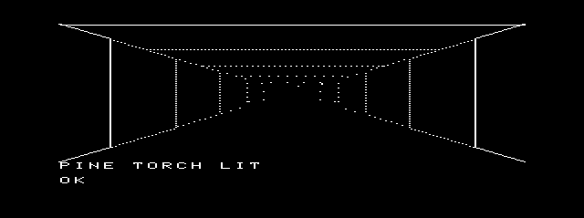
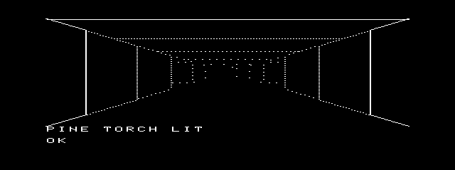
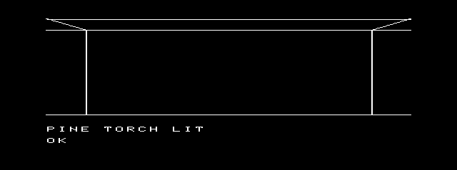
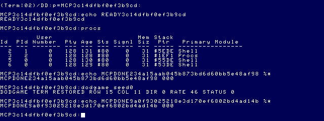

# Daggorath Gameplay M1 — source archaeology and scope gate

## Status

The bounded application builds, but **live acceptance remains incomplete**.
The keyboard investigation disproved the earlier lost-E diagnosis: the matrix,
EOU VTIO queue and application read all contain E. Re-rendering the lit dungeon
on every key delayed the complete `MOVE` frame beyond the harness's 15-second
observation limit. That observation limit was not a guest-input completion signal.

The user approved a UI-only input-row reuse correction. Existing gameplay/parser,
vector data, heartbeat, MCP behavior and the 120-second execution deadline remain
unchanged; four new exact-frame equivalence tests pass. The corrected live run
then restored Term with **status 187 after USE LEFT**, before navigation. This
separate production failure is the current stop gate; it is not concealed by a
fixture change or a favorable-timing retry. See the investigation below.

## Evidence and provenance

Original source: external read-only checkout
`/Volumes/SEDONA/Projects/daggorath-reference`, commit
`a94326f00ebb16a106b540c58bc2ccf5f7b66dac`.
All `.ASM` paths and labels below are relative to that checkout.
`MCP/Documents/` and `DOCS_INDEX.md` are absent in this checkout; no manual
verification is claimed. The findings below come from inspected original source.

Existing port references:

- [Wizard graphics/lifecycle](DAGGORATH_WIZARD_M1.md)
- [Audio M1](DAGGORATH_AUDIO_M1.md), [Audio M2](DAGGORATH_AUDIO_M2.md),
  [native heartbeat and resident timing limits](DAGGORATH_AUDIO_M3.md)
- [Original program archaeology](../reference-projects/DAGGORATH.md)
- [NitrOS-9 source precedence/navigation](../source-index/README.md)

## Original initialization trace

| Stage | Source/labels | Observed behavior |
|---|---|---|
| Normal game entry | `ONCE.ASM: GAME → COMINI` | Clears RAM, copies `RAMDAT`, creates original system task records. Bare-metal stack/PIA/SAM/interrupt setup must not be copied into a normal OS-9 process. |
| Object initialization | `ONCE.ASM: CINI40`; `OBIRTH.ASM: OBIRTH/OCBFIX`; `DTABAS.ASM: OMXTAB` | Creates the distributed objects and marks them creature-owned. This precedes level creation. |
| Player start | `ONCE.ASM: GAME10`; `COMDAT.ASM: RAMDAT` | Row 16, column 11, level 0; direction remains cleared, i.e. north per `CRETUR.ASM: STPTAB`. Clearing the high byte of initialized `PPOW` leaves power 160. Damage is initially zero. |
| Level creation | `ONCE.ASM: GAME20`; `NEWLVL.ASM: NEWLVX` | Chooses creature/vertical-feature tables, clears CCBs, creates maze, initializes creatures, attaches creature-owned objects. |
| Player bag | `ONCE.ASM: GAME30`; `COMDAT.ASM: GAMDAT` | Creates a wooden sword and pine torch, marks both player-owned/revealed, and links them into the bag. Does not light the torch. |
| First view/heartbeat | `ONCE.ASM: GAME50`; `PLOOK.ASM: INIVUX` | Clears status/text, calculates heart rate, increments `HEARTC`, enables visual/audio heartbeat flags, draws status, selects `VIEWER`, updates view. |
| Interaction | `ONCE.ASM: GAME50`; `HUMAN.ASM: PLAYER/HUMAN` | Prints prompt and enters the original scheduler. Input processing builds the original command line and dispatches parsed commands. An OS-9 input adapter must not import the bare-metal scheduler. |

### Why the initial dungeon is dark

1. `COMINI` clears `PTORCH`, `PRLITE`, and `PMLITE`. The inspected `RAMDAT`
   initialization does not supply a lit torch or player light.
2. `GAME30` only creates and bags the `GAMDAT` objects; normal `GAME40` skips
   the autoplay map branch and enters `GAME50`.
3. `PUPDAT.ASM: PUPSUB` starts with player light and adds torch light only when
   `PTORCH` is nonzero. Initial regular and magical light are therefore zero.
4. `VCTLST.ASM: SETFAX/SFAD10` calculates light minus 7 minus range. At range
   zero this is -7; `BLE SFAD30` stores fade `$FF`. `VCTLSX` immediately returns
   for that fade. Farther ranges are also dark.

This suppresses dungeon vectors; it does not imply that the status line or
command text is blank. Merely porting navigation would not produce the requested
visible initial/turned/moved dungeon geometry.

### Minimal illumination dependency

The correct retrieval command is **PULL**, not GET. `PGET.ASM: PGET` searches
the current cell; `PPULL/PULL10/PULL14` searches the bag, removes the matching
object from its linked list and puts it in the selected hand.

`PUSE.ASM: PUSE/PUSE12` recognizes the torch class, stores its OCB pointer in
`PTORCH`, calls `PSTOW0` to return it to the bag and clear the hand, invokes
`A$TORC`, then updates the view. `DTABAS.ASM`'s pine-torch record supplies
timer/light data. `COMPLR.ASM: BURNER` subsequently ages that torch once per
minute. These are object interactions beyond initialization.

`A$TORC` is not one of the three implemented SSC semantic effects. It must not
be replaced with SQUEAK/WHOOP/PHASER. If the torch path is approved, its missing
sound must be documented rather than adding an unauthorized audio effect.

## Maze, randomness, and initial entities

`DGNGEN.ASM: DGNGEN` creates a 32×32 byte map with 500 carved cells, then
70 regular and 45 secret doors. Directional features are packed into two bits
each. Preserve this representation and the byte arithmetic.

The level seed comes from overlapping three-byte windows in `LVLTAB`, indexed
by `LEVEL`, not by `LEVEL * 3`. Level zero begins with `$73,$C7,$5D`.
`RANDOM.ASM: RANDOX` performs eight feedback shifts of the three-byte seed and
returns `SEED`. Its exact carry/byte order matters.

After maze generation, `DGEN90` advances the RNG using `SECOND`; a zero byte
still executes the decrementing loop 256 times. This affects subsequent entity
placement. A deterministic test must control this value as well as the maze
seed. A fixed maze seed alone is insufficient for a complete initial-view
comparison.

`NEWLVX` creates creatures through `COMCRE.ASM: CBIRTH`, then attaches objects
to them. Creature initialization allocates original movement task records;
retaining initialized entities does not authorize enabling full AI in this
milestone. That separation needs an explicit implementation boundary.

## Navigation and rendering dependencies

- `PTURN.ASM: PTURN/PREVU`: left/right/around update direction modulo four
  and regenerate the view. The file also contains original turning animation.
- `PTURN.ASM: PMOVE/PSTEP`: forward movement calls `CRETUR.ASM: STEPOK`.
  That routine checks the destination boundary and whether its map byte is
  `$FF`; it is not a generic “any nonzero wall bit blocks movement” rule.
- A blocked move invokes `A$THUD`, which is also outside the implemented SSC
  effect set. Do not substitute an unrelated effect.
- `PMOV90` adds `(POBJWT arithmetic-shift-right 3) + 3` to damage even after
  a blocked attempt, then calls `HUPDAT`. Navigation changes heartbeat state.
- `HUPDAT.ASM: HUPDAX` uses 24-bit arithmetic and an increment-before-borrow
  division loop. At initial power 160/damage zero its resulting rate is 46,
  not the 45 obtained by blindly translating the comment's formula.
- `COMPLR.ASM: HSLOW` recovers damage on a heart-rate-dependent schedule.
  `HUPDAX` also contains faint/recovery/death paths. A permanent damage clamp
  or removal of recovery would silently change navigation semantics.
- `VIEWER.ASM: VIEWER/SETSCL/DRAWIT` visits forward cells, architecture,
  creatures, side peeks, vertical features and floor objects. It uses fixed
  radix-7 scales, lighting and `VCTLST.ASM` vector-list control codes.
  The Wizard's predecoded unity-scale segments are not a complete dungeon
  renderer.

The intended presentation remains logical 256×192 → physical 512×192 at
(64,4). Scaling belongs in the existing presentation boundary; neither original
geometry nor the side regions should change.

## Memory and runtime I/O planning — not measured port results

Original allocations in `CD.ASM` include:

| Allocation | Source size |
|---|---:|
| `MAZLND` | 1,024 bytes |
| `CCBLND` | 32 × 17 = 544 bytes |
| `OCBLND` | 72 × 14 = 1,008 bytes |
| `TCBLND` | 38 × 7 = 266 bytes |
| `EMPHND` | 14 bytes |
| One logical framebuffer | 6,144 bytes |

These are source allocations, not a proposed C layout or total process size.
Original pointer-bearing records use two-byte addresses. A port must explicitly
preserve their meaning rather than substitute host pointers. Code, assets,
initialized data, BSS, mapped presentation buffers, stack and remaining 64K
space require an actual link/map report after the scope gate is resolved.

The traced cartridge initialization/navigation/view path consumes resident
code/data; it does not require tape/disk loading. This is source evidence, not
a live proof that a future OS-9 binary performs no disk I/O. Stage and preload
all necessary modules before heartbeat activation. The production
`src/audio/native_heartbeat.h` lifecycle and Audio M3's resident-only timing
limit remain mandatory. Any observed active rb1773 dependency is a stop gate.

## Approved scope and current implementation

The user approved minimal original torch commands. The application preserves the
dark startup and accepts `PULL LEFT TORCH`, `USE LEFT`, `TURN LEFT`, `TURN RIGHT`,
`TURN AROUND`, `MOVE`, and `LOOK`. `EXIT` is the explicit OS-9 extension.
This is an exact-word adapter, not a port of the complete original parser.

### Source tree

- `apps/daggorath/src/gameplay/game.{c,h}`: original-derived state, maze/RNG,
  mandatory object/creature initialization, selected commands, recovery/torch
  aging, lighting, scaled vector rendering and a minimal source-font text UI.
- `apps/daggorath/src/gameplay/main.c`: owned graphics, cooperative polling,
  native heartbeat lifecycle, cancellation and cleanup.
- `apps/daggorath/src/gameplay/input.c`: public SCF input/status/options adapter.
- `apps/daggorath/src/gameplay/module.asm`: `dodgame` module identity.
- `apps/daggorath/import_gameplay.py`: assembles the pinned reference into private
  build output and extracts only selected data into `game_data.h`. Original ROM
  executable code is not embedded in the application.
- `apps/daggorath/build_gameplay.py`: build and provenance record.
- `apps/daggorath/test_gameplay.py`, `test_gameplay_lifecycle.py`,
  `test/gameplay*.c`, `test/fixtures/gameplay-original.json`: new checks.
- Existing presentation gains only `screen_path()` to expose its owned path.

No production Wizard, heartbeat driver, SSC recipe, audio service or MCP behavior
was changed. No SSC service is started: none of the selected command paths calls
one of its three implemented effects. Consequently this application does not
acquire or disturb another program's SSC ownership. Torch/thud remain silent.

### Source fidelity and explicit boundaries

OCBs remain 14-byte records and CCBs 17-byte records. Big-endian link words retain
original OCBLND address tokens; one adapter translates them to process-local
storage. The controlled cartridge capture showed that `GAME10` leaves B=11,
which is preserved across the SWI calls into `GAME30`: the two initial player
objects have level byte 11. The implementation preserves this otherwise easily
missed behavior, rather than assigning them level zero.

Production startup uses the observed OS-9 seconds value for the original
post-maze RNG perturbation. `dodgame seed0` explicitly selects deterministic zero
for tests. LVLTAB and the polynomial algorithm remain unchanged.

Mandatory creature placement and ownership links are present; creatures are
stationary because AI/combat are excluded. All initial objects are player- or
creature-owned, and no supported command drops an object, so the floor-object
renderer has no reachable matches in this slice. The renderer includes initial
creature, architectural and vertical-feature vectors. The font is original-derived;
status text is an isolated port UI, not the original STATUS/TXTSER implementation.
Turns/moves update directly without original transition animations. Faint/recovery
state is retained, but its visual fade sequence is not yet ported; death returns
to OS-9 rather than launching the original death/Wizard sequence.

The game yields through `F$Sleep` while polling public `SS.Ready` and consumes
available bytes with `I$Read`. The native driver owns heartbeat timing; changing
rate preserves its countdown. Graphics resources and module loading precede
heartbeat claim; activation precedes the first dungeon presentation, corresponding
to INIVUX. No gameplay routine opens files or performs disk I/O.

SCF source provenance: upstream `defs/scf.d` PD.EKO/PD.PAU offsets and
`level1/modules/scf.asm` SetStat options handling, plus
`level2/coco3/modules/vtio.asm: GSReady`. Commit remains the identified upstream
`f470fa52eb172b59b22c1b722074998cb42de9b1`. Only the newly owned /w options
are changed; Term is not repurposed. Normal exit and handled errors/signals release
heartbeat before closing graphics. Signal 0 and arbitrary OS failure retain the
limits of the existing resource ownership infrastructure.

### Independent state comparison

The recovered cartridge was assembled with lwasm and run without any disks under
MAME 0.289/coco3h. Normal keyboard entry reached GAME; a read-only PC-qualified
GAME50 tap requested physical RAM capture on the next video frame. The successful
capture did not force PC or write guest RAM. Earlier forced-PC/premature captures
were rejected and are not reference fixtures.

The original fixture matches:

- all 1,024 maze bytes;
- all 1,008 object-storage bytes;
- all 544 creature-storage bytes.

The captured creature arrangement matches post-maze SECOND=2 uniquely among
0..255; this value was inferred by comparison, not directly sampled at DGEN90.
The fixture records that limitation. Its original ROM hash and source commit are
checked during tests. A separate live `dodgame seed0` physical-RAM observation
also matched all three host-model tables byte-for-byte, after explicit word-width
index fixes for CMOC. Host compiler success alone was insufficient: CMOC had
narrowed byte/literal arithmetic in indexing expressions.

### Build and memory evidence

```sh
python3 apps/daggorath/build_gameplay.py --out MCP/work/gameplay-m1/final-build
python3 apps/daggorath/test_gameplay.py
python3 apps/daggorath/test_gameplay_lifecycle.py
```

Current artifact: `dodgame`, edition/revision 1/1, program/6809 object,
reentrant/read-only. ToolShed reports size **17,869 bytes**, CRC **FD372A (Good)**,
data requirement **10,326 bytes**. This identity includes the latest owned-window
echo correction, live-verified in the partial synchronized trial below. Build manifests contain
exact CMOC/lwasm/lwlink commands, tool versions and source hashes.

The current linker map reports 15,396 code bytes,
2,422 read-only data bytes, 6 writable initialized bytes, and 8,790 BSS bytes.
Its Game state was 2,604 bytes and logical framebuffer 6,144 bytes. Stack request
is 1,536 bytes. The presentation maps a 12,288-byte GP buffer, occupying two 8K
logical blocks. Module/data allocation rounding therefore matters: three module
blocks, two data/stack blocks and two mapped GP blocks leave at most one 8K block
before other mappings/OS reservations. This is a planning bound, not measured
free heap. Recheck mapping headroom during final live acceptance. Full-game
assets/state must not be assumed to fit without a new measured budget.

### Live evidence so far — not acceptance

Disposable copies of the development VHD and boot DSK were used, with a freshly
formatted/sealed staging floppy. Canonical media were not mounted for these runs.
The program and `dhbpack` were preloaded before launch. The current production
MCP rejects `coco_type` while `os9_run` is active. A test-only private MAME
natural-keyboard queue supplies interactive input without changing production MCP.
The desktop UI tool listed MAME but could not attach to its application.

The initial multi-command test did not synchronize on command consumption. Its
screenshots showed incomplete/interleaved input, and its final MCP response was:

```json
{
  "command": "dodgame seed0",
  "completed": false,
  "status": null,
  "timedOut": true,
  "shellReady": false,
  "outcome": "timeout",
  "elapsedMs": 120019,
  "executionState": "AWAITING_TERM",
  "timeoutReason": "console_not_returned"
}
```

The guest subsequently printed `DODGAME TERM RESTORED ROW 16 COL 11 DIR 0
RATE 46 STATUS 0`. This is **not** a successful MCP completion handshake.
During the 7,331 recorded heartbeat callbacks, the largest callback interval was
17.005 ms; there were zero accesses to FDC registers $FF48–$FF4B between first
and last callbacks. These are preliminary-run measurements, not final acceptance.

That run also exposed automatic SCF echo at the screen's upper-left, outside the
reserved central viewport. The current adapter turns off echo and page pause on
its owned path while preserving other options, including interrupt/quit characters.
The corrected input-harness plan is to send one key at a time and observe expected
game-state transitions before proceeding. Approval was requested under AGENTS.md's
test-setup rule; completion, status, heartbeat and teardown criteria are unchanged.

### Earlier regression status and remaining gates (superseded below)

Six new source/fixture tests and four new lifecycle checks pass. All 148 preexisting
Daggorath renderer/Wizard/audio checks and all 115 MCP tests passed before the
latest SCF echo correction; TypeScript build passed. The earlier corrected-index
artifact reproduced byte-for-byte in two independent output directories. The follow-up below records their repeated results.

At that earlier pause, outstanding: synchronized live torch/turn/legal and blocked movement, corresponding
screenshots and view/state agreement, repeated execution, handled cancellation,
normal MCP status 000, subsequent strict date/pwd, final teardown timing and FDC
analysis, final reproducibility/module identity and final media hashes. Original
cartridge-versus-port rendered-frame comparison is also not yet complete.

No commit has been made. Gameplay M2 recommendations are deferred until these
M1 acceptance gates pass; combat/AI, full parser, side panels, save games and new
sound effects remain outside this implementation.

### Checks at the earlier approval pause

The FD372A artifact reproduced byte-for-byte in two output directories. The
ten new gameplay checks pass after the owned-window echo correction.
`git diff --check`, explicit new-file whitespace checks, and all six local
documentation links pass. MAME was stopped cleanly.

All three canonical files retain their pre-test SHA-256 and permissions:

| Media | SHA-256 |
|---|---|
| `63SDC.VHD` | `db2f0f444073d3b88a3610a63ec9f7d2e2dd4299347181faa6b2b2aa9637de2c` |
| `63SDC-MCP-DEV.VHD` | `4c6bdc0cd2f68aa57a9c75f75f15fe429f30926aa522917dd8d14aa1b9ae622e` |
| `63EMU.DSK` | `9a51adb8656b9f003c7f822352c291487362f1b4c43aac1a16672d5d2bcb4c40` |

The stock VHD remains mode 0444. No commit was made.


## Earlier synchronization follow-up — 2026-09-26 (loss diagnosis superseded)

### Observable boundaries and limits

The test uses the production `dodgame seed0` artifact, without guest-side test
markers. A private MAME observer reads physical RAM, locating the unique complete
1,024-byte initialized maze and then the adjacent `Game` fields at the offsets
established by `game.h` and the build. In this run its physical base was `$0E02C`.
It reads row, column, direction, torch/hand links, lighting, rate and damage.
No memory or hardware register writes are made by the observer.

A host build of `src/gameplay/game.c` plus `src/original/logical.c` renders expected
frames from the same deterministic source state. Each MCP snapshot must match
that entire 512×192 presentation exactly, after binary pixel decoding. This
MAME snapshot is 640×239 with the presentation at snapshot `(64,26)`; the extra
22 vertical pixels are the captured display border. Guest presentation remains
`(64,4)` within the 640×200 graphics area.

The harness uses these boundaries:

1. **Initial view:** complete expected dark frame, initial RAM state and drained
   host natural-keyboard queue.
2. **Input accepted:** post only the current command text, without Enter; require
   the complete expected input-line frame and a drained keyboard queue.
3. **Command/view completed:** post Enter only after step 2; require the complete
   next expected frame, empty rendered input line and source-derived RAM state.
4. **Next command:** only after step 3. No fixed inter-command sleeps decide
   readiness. Short polling intervals only bound observation overhead.
5. **Exit/Term:** planned to verify the complete `EXIT` input before Enter, then
   require the unchanged graphics-aware `os9_run` fresh-prompt/unique-marker/final-
   prompt protocol. This gate was **not reached**.

A visible complete frame is an observed UI boundary, not proof that every internal
SCF/VTIO operation has returned. Likewise, MAME's empty natural-keyboard queue
proves completion of host posting, not consumption of every key by the guest.
That distinction remains material to the failure below. The harness does not
claim a verified instruction-level input-idle signal.

Earlier private instruction-fetch/write observers did not establish a usable
boundary and were discarded. Their assumptions about high-bit module-name
termination, placement and cross-file Lua serialization were corrected or removed;
those trials are not acceptance evidence. One restored diagnostic trial returned
187 with Term restored; its operation of origin was not isolated, so it is not
attributed to input or teardown. The final trial called `date` before launch to
synchronize the restored EOU clock, following the prior RTC/save-state findings.

Private reproducibility files are in `MCP/work/gameplay-m1-acceptance/`:
`live-ui.py`, `capture.lua`, `game.so`, the build manifest/listings, exact MCP
`results.jsonl`, and raw tick/FDC traces. These temporary files are not curated
Git assets. Only the concise evidence linked below is retained under this document.

### Source-derived state and echo results

| Boundary | Observed row/column/direction | Other observations | Result |
|---|---|---|---|
| Initial | 16 / 11 / north (0) | dark, hand=0, torch=0, rate=46 | Exact full-frame and RAM match |
| `PULL LEFT TORCH` | 16 / 11 / north (0) | hand=`$0E95`, torch=0, dark | Full input observed; Enter accepted; exact resulting frame/RAM match |
| `USE LEFT` | 16 / 11 / north (0) | hand=0, torch=`$0E95`, lit=1 | Full input observed; Enter accepted; exact resulting frame/RAM match |
| `MOVE` input | Still 16 / 11 / north (0) | Host queue drained; rendered input is `MOV` | Failed input boundary; Enter deliberately **not sent** |

The planned continuation was legal `MOVE` to (15,11,north), `TURN RIGHT` to east,
blocked `MOVE` at the east wall, `TURN LEFT` to north, and `EXIT`. No movement,
turn, blocked-movement or exit result is claimed: none of those commands reached
execution in this synchronized trial.

The missing-input snapshot differs from the source-rendered `MOVE` frame only in
the final E: **36 bright pixels**, within presentation-local rectangle
`x=50..59, y=184..190`. The rest of the complete view matches. After the 15-second
input-boundary limit, the input still reads `MOV`; row/column/direction remain
unchanged. The harness neither injects a replacement E nor accepts a shortened
command. No timeout was increased.

The owned-window `SS.Opt` correction disables SCF echo (`PD.EKO`) and page pause
(`PD.PAU`) while preserving other options. In this trial the application renders
the input once in the central logical UI; there is no duplicate upper-left echo.
The failed-input snapshot contains **zero bright pixels outside the viewport**.
This is verified for this run, not a cancellation/relaunch lifecycle claim.

- [Initial dark dungeon](assets/daggorath-gameplay-m1/initial-dark.png)
- [Illuminated initial dungeon after USE LEFT](assets/daggorath-gameplay-m1/initial-lit.png)
- [Failure: MOVE posted, MOV displayed](assets/daggorath-gameplay-m1/move-missing-e.png)
- [Recorded source-state boundaries](assets/daggorath-gameplay-m1/input-states.json)

### Heartbeat and I/O — partial failed trial only

[Timing evidence](assets/daggorath-gameplay-m1/partial-timing.json) covers MAME
199.104036715–368.689033574 seconds, including the stopped-on-failure interval:

- 10,163 native callbacks; rate 46 throughout; no driver faults.
- 221 expected and 221 observed native PB1 edges; no missed deadlines.
- Callback intervals: 16.654077–16.714978 ms (spread 0.060901 ms).
- Heartbeat edge intervals: 767.631296–767.681023 ms (spread 0.049727 ms).
- Zero FDC `$FF48..$FF4B` accesses between first and last callbacks.
- No new guest disk operation was introduced after heartbeat activation.

This does **not** establish zero callbacks after guest teardown: the guest was
still active when the unsuccessful trial was stopped through `coco_stop`.
`rb1773` entry points were not independently instrumented; the evidence is the
FDC access trace, not a claim of complete module-level runtime-I/O tracing.

### MCP completion and stop gate

The unchanged 120,000-ms operation expired while the harness was stopped at the
failed input boundary. This is **not a measured teardown delay**: `EXIT` was never
sent. [Exact MCP request/response](assets/daggorath-gameplay-m1/failed-run-response.json):

```json
{
  "command": "dodgame seed0",
  "completed": false,
  "commandCompleted": false,
  "status": null,
  "statusText": null,
  "timedOut": true,
  "shellReady": false,
  "outcome": "timeout",
  "phase": "command",
  "elapsedMs": 120030,
  "outputComplete": false,
  "allowGraphics": true,
  "displayDepartures": 1,
  "consoleReturned": false,
  "executionState": "AWAITING_TERM",
  "marker": "MCPDONE0770c84330fe11651594d3fbffb1a469",
  "error": "deadline exceeded during command",
  "timeoutReason": "console_not_returned"
}
```

MAME subsequently stopped successfully (`coco_stop`: `{"ok":true}`). Following
the requested stop rule, production input/gameplay code was not altered and
assertions were not weakened. The earlier dropped-E diagnosis is superseded by the instruction-level trace below.
Normal status 000, handled cancellation 003, guest resource teardown, zero
post-removal callbacks, subsequent strict shell commands, and repeated execution
are **not accepted**. No claim of a completed navigation run is made.

### Regression and artifact verification at this stop

- Gameplay: **10/10** (6 source/fixture tests plus 4 lifecycle checks).
- Existing Daggorath: **148/148** — renderer 22, playback 19, presentation 2,
  Wizard lifecycle 5, Audio M1 36, Audio M2 27, semantic heartbeat 20,
  native-heartbeat ownership 17. These are host regressions, not a new live Wizard run.
- MCP: **115/115**; TypeScript build succeeds.
- Reproducible build: byte-identical to the staged FD372A artifact.
- `dodgame`: 17,869 bytes; edition 1; type/language `$11`; attributes/revision
  `$81`; data size 10,326; ToolShed reports CRC **FD372A (Good)**.
- SHA-256: `4ab31702cd94effa05386736f9d3f8bd3426d08c7e21d037adf20e99e54cb089`.
- Build command: `python3 apps/daggorath/build_gameplay.py --out MCP/work/gameplay-m1-acceptance/repro-build --os9 /Users/magneto-optimus/Documents/Coding/toolshed-2.2/build/unix/os9/os9`.
- No production source changed in this follow-up. Canonical media retain all
  hashes and permissions listed above (stock 0444, development VHD 0644, DSK 0664).
- Whitespace and local-link verification are recorded with the final task report.

The next action is to isolate the input-loss boundary using the preserved failed
trial, including keyboard delivery/scan timing versus the lit-scene per-character
redraw. Do not conceal it by resending missing keys or calling this run successful.
No new gameplay, Wizard connection, side panels, sounds, MCP changes or commit.

## Keyboard investigation and approved UI correction — 2026-09-26

### Retracted diagnosis: delayed rendering, not a lost E

The earlier snapshot proves only that `MOV` was visible at the harness's
15-second cutoff. It does **not** prove that E was lost. Read-only instrumentation
of the unchanged FD372A artifact shows the following first lit `MOVE` trial:

| Boundary | MAME time (seconds) | Evidence |
|---|---:|---|
| Empty application input/read loop | 354.179143488 | Input length 0, clean frame |
| M enters VTIO | 354.304952809 | Character 77 |
| M returned to `game_input` | 354.314222146 | Application length before append 0 |
| O enters VTIO | 354.455132273 | Character 79 |
| V enters VTIO | 354.605368169 | Character 86 |
| E matrix press | 354.738610441 | Row 0 = 223, shift row 6 = 127 |
| E enters VTIO | 354.755558249 | Character 69 |
| Matrix release / natural-keyboard queue empty | 354.788674901 | All rows 255; empty=true, posting=false |
| O returned to application | 358.497099630 | Length 1, `M` before append |
| V returned to application | 362.675161975 | Length 2, `MO` before append |
| E returned to application | 366.841108811 | Length 3, `MOV` before append |
| Complete `MOVE` frame/readiness | 371.017646940 | Length 4, input `MOVE`, dirty=0, key=0 |

All four bytes reach the application in order. E spends approximately 12.086
seconds buffered before the application reads it. Completing all four redraws
requires approximately 16.839 emulated seconds. The old 15-second view deadline
expires first. This is a **harness observation error amplified by redundant UI
redrawing**, not a demonstrated MCP, matrix, SCF or parser byte-loss defect.
No replacement E was injected; Enter was withheld during this diagnostic.

[Concise input trials and matrix/queue/VTIO/application timeline](assets/daggorath-gameplay-m1/input-investigation.json)
retains 15 completed trials: eight dark and seven lit, **63 requested characters,
zero lost or reordered characters**. These include repeated MOVE, TORCH, MMMM,
EEEE and the dark MOVEE control. The final lit MOVEE is **excluded**: all five
characters entered VTIO, but the application returned 187 after reading its first
M. It is not counted as a successful stress trial.

### Evidence at the input boundaries

- **MCP/bridge:** baseline controls use actual `coco_type` with `pressEnter=false`.
  Its response acknowledges posting, not guest consumption. A private copy of
  `cmd_type` subsequently logs before/after `post_coded` without changing behavior.
- **MAME:** inspected the exact `mame0289`
  [natural-keyboard implementation](https://github.com/mamedev/mame/blob/mame0289/src/emu/natkeyboard.cpp),
  notably `choose_delay` and `timer`. The matrix backend defaults to 50-ms normal
  phases and 200-ms CR phases; modifier/key/release phases are asynchronous.
  Queue removal does not acknowledge a guest `I$Read`. See also the official
  [Lua input API](https://docs.mamedev.org/luascript/ref-input.html).
- **EOU input:** `/dd/SOURCECODE/ASM/NITROS9/SCF/vtio_beta6.asm` documents its
  keyboard merge and implements IRQ scanning, `ClickChk/L0411`, `Read/bumpdon`
  and `GSReady`. The 128-byte ring uses `V.EndPtr`, `V.InpPtr` and `ReadBuf`.
  `SS.Ready` reports buffered availability; it does not mean that the program's
  redraw has finished. Matching upstream examples are
  `nitros9-reference/level2/coco3/modules/vtio.asm`,
  `defs/cocovtio.d` and `level1/modules/scf.asm` at `f470fa52`.
  Source relationships do not alone prove an identical installed module.
- **Runtime:** taps witness actual installed VTIO enqueue, buffer-store and consume
  instructions (PCs `$A93C`, `$A94D`, `$A663` in these runs). Unrelated writes at
  the same logical addresses under other MMU mappings are excluded. Device
  statics are identified from actual enqueue operations, not assumed physical RAM.
- **Application:** build-specific instruction witnesses record the byte returned
  from `game_input`, its prior buffer length and text, and the clean-loop boundary.
  Common error-check byte sequences initially produced false matches; the final
  observer also matches the preceding call sequence. Only the validated program
  base is accepted. No guest-memory or hardware writes are used for observation.
- **Parser:** `game_command` is called only after CR. No CR was sent in the delayed
  MOVE diagnostic. Thus there was no parser truncation or terminator replacing E.
- **Echo:** owned-window `SS.Opt` preserves other options while disabling
  `PD.EKO`/`PD.PAU`; the application draws its input. Initial/torch input frames
  match the complete source-rendered image, without duplicate upper-left echo.

### Synchronization contract and approved correction

The private acceptance harness requires a fresh observation at the actual clean
main-loop boundary: successful input call, key=0, dirty=0, exact expected input
bytes/length, expected game fields and drained natural-keyboard queue. It then
compares the entire viewport against a host render before sending Enter or the
next command. One overall **120,000-ms `os9_run` deadline remains unchanged**;
short polling intervals do not establish readiness. Slower, one-character posting
with this boundary successfully delivered both original torch commands in the
baseline investigation. Arbitrary per-character waits are not the fix.

The user explicitly approved a UI-only correction after the redraw cost was
measured. `main.c` now distinguishes a full scene/message redraw from input-only
editing. A full render with an empty input line saves its seven underlying input
rows (224 bytes); `game_render_input` restores those rows and draws the new line.
Shortening/clearing input therefore also restores any underlying dungeon pixels.
A command or relevant game-tick change still requests the full original renderer.
Presentation, geometry, font data, parser, gameplay timing rules and heartbeat
semantics remain unchanged. There are no MCP production changes.

Four **new** equivalence tests compare every byte of the 6,144-byte logical frame
against fresh full renders for dark, lit, moved and turned scenes, including
incremental input, repeated E/M, deletion, empty input and 31-character input.
Existing assertions/mocks were not changed. The correction adds 224 data bytes;
`dodgame` data size is now 10,550 bytes. It does not add another full framebuffer.

The remaining heartbeat-disabled/redraw-suppressed controls and post-correction
stress/navigation/cancellation acceptance are not claimed complete: the live
production failure below is a stop gate. Dark-versus-lit controls already isolate
the large scene-render cost; neither is described as a no-redraw control.

### New live stop gate: status 187 after USE LEFT

The private environment was cold-booted from **copies** of both EOU media files.
A fresh artifact floppy was built by the verified `os9-stage` host CLI. The
unchanged native heartbeat pack was added while MAME was stopped, before mounting;
the disposable floppy was then made read-only again. A new private checkpoint
with these exact media attachments established `os9_restore_ready`; modules were
loaded before heartbeat activation. No canonical state or media was changed.

The corrected run uses `os9_run({command:"dodgame seed0", timeout_ms:120000,
allow_graphics:true})`. Initial frame/RAM and `PULL LEFT TORCH` pass. All eight
`USE LEFT` input bytes also pass exact frame verification. CR changes the actual
state to hand=0, torch=`$0E95`, lit=1. Immediately afterward the application exits
187 and restores Term. The harness stops rather than accepting this as successful
navigation. No MOVE/turn/blocked-movement result is claimed for this run.

[Exact corrected-run MCP response](assets/daggorath-gameplay-m1/ui-correction-status187.json):
completed=true, status=187, statusText="187", timedOut=false, shellReady=true,
consoleReturned=true, elapsedMs=39660, commandPromptMs=34053. This is a completed
MCP operation reporting a guest failure, not a transport timeout. EOU `os9.d`
(`ORG 183` error block, `E$IllArg`) and upstream `defs/os9.d` identify 187 as
**Illegal argument**. The numeric code alone does not identify its caller.

[Heartbeat/FDC evidence](assets/daggorath-gameplay-m1/ui-correction-timing.json):
754 callbacks; zero driver faults; 17/17 expected native PB1 edges at rate 46;
callback interval 16.673074–16.714979 ms; zero FDC accesses while active. The
teardown observer records error=187, not a missing key. This proves neither normal
000 acceptance nor cancellation 003 acceptance.

### Regression, artifact and remaining acceptance

- All **162 Daggorath checks** pass: 14 gameplay (the unchanged ten plus four new
  exact-frame checks) and the existing 148 Wizard/renderer/audio/heartbeat checks.
- All **115 MCP tests** pass; TypeScript build passes. These are host regressions,
  not a newly completed live Wizard/audio acceptance run.
- Two independent builds produce identical `dodgame`: **18,013 bytes**, edition 1,
  type/language `$11`, attributes/revision `$81`, data size 10,550;
  ToolShed CRC **64B763 (Good)**.
- SHA-256: `53b31b756c2f1144c0c14675717bd6e1ef6293a1618c0e503caef4a9a77f5499`.
- Build: `python3 apps/daggorath/build_gameplay.py --out MCP/work/gameplay-input-trace/final-build`;
  repeat output: `MCP/work/gameplay-input-fixed/repro-build`. `build.json` records
  exact CMOC/lwasm/lwlink versions, source hashes, command and module identity.
- New test: `python3 apps/daggorath/test_gameplay_input_render.py`.

Outstanding: isolate the new 187 operation, then rerun full illuminated navigation,
post-correction stress, normal 000, cancellation 003, repeated execution and their
cleanup/shell-health criteria. Do not treat a run timed to avoid the failure as a
fix. No MCP execution timeout, gameplay/parser, original vectors/data, sound backend or MCP
implementation was changed. No commit was made.


### Bounded follow-up: 187 cause remains unverified

A private observer was extended to record nonzero writes to the main error local
and its clock locals; production code was not changed. A manual repeat deliberately
posted USE LEFT's Enter at observed guest second 57.08. Its full lit scene completed
4.106 seconds after the application read CR and it **did not return 187**. A later
explicit EXIT returned normally. Thus minute rollover alone is not established as
the cause of the first failure. The first failed run did not have the error-store
instrumentation, so its exact failing operation cannot be recovered from that trace.
Candidates in the intervening loop include the clock validation/elapsed-tick guard;
these remain hypotheses, not a diagnosis or authorization to change them.

The follow-up [read-only local-state evidence](assets/daggorath-gameplay-m1/bounded-clock-control.json)
records E/X/I/T reads in order and a complete lit `EXIT` frame. From the first E
read to completed EXIT rendering is **1.011600 seconds**; individual input-only
renders take approximately 234–246 ms, rather than approximately 4.18 seconds
per key. Enter is sent only after full input readiness; teardown error=0.
[Restored Term after the manual diagnostic](assets/daggorath-gameplay-m1/diagnostic-restored-term.png)
shows the application's STATUS 0 message. This is not a replacement for the required
normal graphics-aware MCP/navigation acceptance or cancellation test.

Two follow-up **diagnostic harness** limits were also exposed: a read of the
non-atomically published JSON file could see an empty/truncated file, and one
20-second startup observation ended before graphics setup reached the read loop.
They are not evidence of guest byte loss. Resuming only after the validated guest
boundary left all byte/state predicates intact. An abandoned earlier diagnostic
MCP operation hit its unchanged 120-second deadline; its late manual EXIT is not
counted as a successful MCP completion. These trials do not hide or resolve the
separate first 187 failure.

For the first corrected 187 run, the final callback was at 295.778494131 seconds;
teardown began at 295.782419213. There were **zero later callbacks** through the
last recorded frame at 374.864523362. The normal-return control also removed the
registration; final MAME shutdown is performed only after returning to Term.
Canonical media SHA-256 and permissions match the earlier table: stock 0444,
development VHD 0644 and boot DSK 0664. Local-link and whitespace checks pass.

**Historical gate at the end of that investigation:** identify the operation returning 187 under the failing conditions,
then repeat the original navigation/cancellation/stress acceptance. Do not silently
relax the elapsed-tick guard, pick favorable clock timing, raise the MCP deadline,
or call the complete Gameplay M1 milestone accepted.

## Status 187 investigation — 2026-09-26/27

### Finding and scope

An unchanged **18,013-byte dodgame, CRC 64B763** reproduced 187 with a
read-only instruction/data observer. The failing operation was the application's
`main.c` **`delta > 300` guard**, after an RTC/save-state calendar discontinuity.
The kernel recorded **PID 3, parent PID 2, module address $A000, status 187**.
The separate MCP marker returned `187`; the transport completed successfully.
`USE LEFT`, rendering, native-heartbeat cleanup and graphics cleanup were not
returning that error in this reproduction.

This resolves the origin of the reproduced failure. The earlier single-USE
failure did not record its error-store PC; its clock trace supports the same
explanation but is not retroactively an instruction-level proof. At its Enter
boundary (291.665740 emulated seconds), the surrounding video sample was
minute 15, second 58, tick 60. At failure (295.782419), it was minute 16,
second 3, tick 53. Roughly 4.12 real emulated seconds therefore looked like
approximately **306–307 calendar-derived ticks**, above the 300-tick guard.

No parser/gameplay, heartbeat, graphics, MCP, or timing-guard production code
was changed during this investigation. In particular, the guard was not relaxed
or bypassed. A restored shell's prompt handshake verifies shell readiness; it
does **not** verify that its calendar is a monotonic elapsed-time source.
This remains a limitation of the calendar-based Gameplay/Wizard timing adapter.
An aged checkpoint can still cause a deliberate, safely cleaned-up 187.

### Passive instrumentation and process ownership

The observer runs only in an ignored, isolated MCP runtime. It matches the
linked module header and compiler-listing instruction bytes, rather than
assuming a fixed process load address. It records all `main` error/result stores,
`os_clock`'s seven-byte F$Move packet, parser results, completed rendering,
input-ready boundaries, heartbeat callbacks and FDC reads/writes. No emulated
RAM, register or hardware writes are used for instrumentation.

For process attribution, it observes the kernel's `FExit` store to `P$Signal`
and reads `P$ID`/`P$PID` from that descriptor. The observed instruction sequence
matches the Level II branch of upstream
`level1/modules/kernel/fexit.asm` (`STB P$Signal,X; LEAY P$PID,X`). EOU
`/dd/DEFS/os9.d` and upstream `defs/os9.d` agree on the descriptor fields and
`E$IllArg=187`. A write-tap record's `returnCode` is the byte being stored;
its sampled `error`/`result` local may still hold the preceding value.

Shell+ PID 2 owns the foreground game, PID 3. Gameplay M1 neither forks nor
waits for children. `dodaudio` is not launched; the native heartbeat is a
kernel-owned device/driver, not a separate process. The observer and coordinator
are host programs. They cannot consume an OS-9 child through a generic F$Wait.
Subsequent echo/date/pwd processes may reuse PID 3; the trace distinguishes
those by module address and operation boundaries, not by PID alone.

### Exact reproduced boundary

| Emulated time | Observation |
|---:|---|
| 192.785244 | F$Move succeeds: guest 21:41:55, tick 12; timer value 3348 |
| 192.789528 | Complete second `USE LEFT` plus CR received |
| 192.790417 | Parser returns `GAME_INVALID=2`: left hand is already empty |
| 196.971289 | `screen_present` returns 0; unknown-command frame completed |
| 196.988578 | F$Move succeeds: guest **21:43:30**, tick 60; timer value 1800 |
| 196.988832 | `$AD6B` (`_main+$1E6`) stores 187 from the elapsed-tick guard |
| 197.000092 | Native-heartbeat close returns 0 |
| 197.031107 | Graphics close returns 0 |
| 197.180891 | Kernel FExit records dodgame PID 3 / parent 2 / status 187 |

The unsigned minute-wrap computation is `3600 - 3348 + 1800 = 2052` ticks,
although only 4.203334 emulated seconds elapsed between the clock samples.
The guard ran before the next command or input poll. It was not an I$GetStt,
I$SetStt, I$Read, graphics, parser, or heartbeat-driver error.

The underlying save-state boundary is already source-verified in
[the Wizard/SS.Tone clock investigation](DAGGORATH_AUDIO_RESEARCH.md#controlled-reproduction-and-counterexamples):
EOU Clock refreshes `D.Time` through Clock2 at the minute boundary, while the
MAME 0.289 MSM6242 state omits the inherited RTC calendar. RAM restoration can
therefore restore an older guest calendar without the matching RTC calendar.
The current trace verifies the discontinuity directly; it does not infer it
merely from that earlier result. The EOU source is
`/dd/SOURCECODE/ASM/NITROS9/CLOCKS/clock.asm`, `SvcVIRQ`/Clock2 GetTime call,
and `clock2_messemu.asm`. Source/runtime matching limitations remain those in
[Clocks](../source-index/CLOCKS.md). `MCP/Documents/` and `DOCS_INDEX.md` remain
absent; no claim of a locally checked manual is made.

### USE LEFT and error-source audit

`daggorath-reference/PUSE.ASM:PUSE` uses `PARHND`, requires a held object,
selects a torch with `STX PTORCH`, then calls `PGET.ASM:PSTOW0`: prepend the
object to `BAGPTR`, clear the hand, and update the view. The original `ISOUND
A$TORC` call is deliberately omitted in M1; it is not an unimplemented syscall
being reached. The port's approved `PULL LEFT TORCH` / `USE LEFT` subset
contains the required initialization, object, bag, hand and lighting behavior.
After the first use, a repeated `USE LEFT` is correctly invalid because the
left hand is empty; it does not extinguish the torch or produce OS-9 error 187.

| Site | Can generate/propagate an OS-9 error? |
|---|---|
| `main`: argument validation | Deliberate 187 for invalid invocation |
| `main`: elapsed-time guard | Deliberate 187 for delta >300; **observed cause** |
| `game_command` / `game_tick` / logical rendering | Pure application state/pixels; parser results 0–3 are not OS-9 errors |
| `os_clock` | F$Move/F$Time errors; deliberate 187 for invalid seconds/tick or initial public-time disagreement |
| `os_sleep` | Invalid 0/65535 argument gives 187; this loop passes 1; F$Sleep error propagates |
| `game_input` | I$GetStt SS.Opt/SS.Ready, I$SetStt SS.Opt and I$Read errors; empty SS.Ready 246 is expected and handled |
| Window/presentation | I$Open/I$Write/I$GetStt/I$SetStt; deliberate 187 if queried mode, dimensions or mapped size differ; short-write error separately checked |
| Native heartbeat client | Deliberate 187 for invalid ownership/rate API usage; driver syscall errors propagate |
| DHeartbeat driver | 187 for invalid rate/resume/PIA acquisition configuration; callback fault is separately observable; no fault in these runs |
| Cleanup | Heartbeat release/close, Term selection, F$ClrBlk, buffer release and window close can fail; first application error retained |
| Signal handling | Signal 2/3 is recorded and cleaned up; not converted to 187 |

### Harness corrections, not production fixes

- Readiness JSON is now atomically published with a temporary file plus rename;
  partially written JSON cannot be interpreted as a ready boundary.
- Readiness requires the actual input loop, completed rendering, key zero,
  expected line/state and an empty natural-keyboard queue. All 6,144 logical
  bytes are compared to the source-derived host renderer after commands.
- A premature private checkpoint was rejected by `os9_restore_ready` while a
  module load was still executing. It was replaced only after observing idle
  Term. No failed readiness attempt was counted as acceptance.
- A combined diagnostic `load` returned 207 (process memory full). The fixture
  returned to separate module loads; no module attributes or memory limits changed.
- The cancellation fixture sent `{ESC}` but asserted 003. The observed Quit 002
  was correct for that input. With explicit user approval, only its input was
  changed to Ctrl-C `$03`, matching upstream `defs/scf.d:C$INTR` and the earlier
  Gameplay harness. Live tracing then proved that MAME natural keyboard has no
  mapping for that control byte: it posted but never reached VTIO. That trial
  hit the unchanged 120-second deadline; the next run was correctly rejected
  because MCP readiness had expired. Neither is counted as acceptance.
  A separate trial presses actual **Shift-BREAK**, which VTIO
  `ChTable` maps to ETX `$03`. Its 003 and cleanup assertions are unchanged.
  The isolated input helper uses MAME [digital input fields](https://docs.mamedev.org/luascript/ref-input.html#i-o-port-field),
  holds SHIFT before BREAK, and releases both after eight video frames. This
  is keyboard stimulation, not an emulated-memory patch or production bridge change.

### Reproduction matrix and functional acceptance

The restored-state controls reuse one private checkpoint with identical,
unchanged backing images. The cold control starts a new MAME process, loads the
modules before heartbeat activation, creates/instantly restores a matching
private checkpoint for the MCP shell handshake, and then runs consecutive
commands without rewinding RAM again. Canonical `nos9_ready_v2` is untouched.

A separate 150-second calendar-continuity observation did **not** find 65
uninterrupted seconds: it saw RTC corrections and transient calendar fields
around minute refresh, including during preloading. This failed diagnostic is
retained, not presented as a successful readiness check. It establishes why
“wait a fixed delay” or even “cold boot” must not be advertised as a universal
monotonic-clock guarantee. Actual application clock samples and guard outcomes
are recorded for each control below. No favorable launch-second rule or larger
MCP timeout was introduced.

| Control | Result |
|---|---|
| A: stop after `PULL LEFT TORCH` | 000 |
| B: one `USE LEFT`, then EXIT | 000; lit frame matches |
| C: repeat `USE LEFT`, aged restored epoch | 187, explicit elapsed-time guard; parser result 2 and rendering 0 |
| C: repeat `USE LEFT`, cold-control session | 000; second use displays UNKNOWN COMMAND, retains selected torch |
| D: navigation without USE | 000; legal/blocked movement and orientation agree |
| E: USE with heartbeat output frozen, diagnostic only | 000; existing freeze API used; no production behavior changed |
| F: USE with no foreground SSC | All production controls meet this condition: no dodaudio child, no SSC event calls |
| G: full lit navigation, restored checkpoint | 000, 66,457 ms including MCP handshake |
| G: full lit navigation, fresh cold-control checkpoint | 000, 62,349 ms including MCP handshake |

The diagnostic `dognohb` changes only `native_heartbeat_enable`'s operation
from resume `$93` to the already verified freeze `$94`, plus its distinct
module name. Claim/rate/release remain exercised, and the callback still runs
with `enabled=0`; it never toggles PB1. It is **not** the production artifact or
a proposed fix. Its module is 18,013 bytes, CRC E92A69, and stays on a disposable
floppy. The production artifact remains CRC 64B763.

The complete lit navigation sequence is:

| Input | Result | Row / column / direction | Torch / hand |
|---|---|---|---|
| Initial `seed0` | dark, initialized maze | 16 / 11 / 0 | none / empty |
| PULL LEFT TORCH | OK | 16 / 11 / 0 | none / OCB $0E95 |
| USE LEFT | OK, lit | 16 / 11 / 0 | OCB $0E95 / empty |
| MOVE | OK, legal | 15 / 11 / 0 | selected / empty |
| TURN RIGHT | OK | 15 / 11 / 1 | selected / empty |
| MOVE | BLOCKED | 15 / 11 / 1 | unchanged |
| TURN LEFT | OK | 15 / 11 / 0 | unchanged |
| EXIT | OS-9-only extension; clean exit | 15 / 11 / 0 | resources released |

Each captured input line and completed scene matched the independently compiled
original-derived logical renderer byte for byte (6,144 bytes; then exact 2x
horizontal expansion). Character editing reused the approved underlay; no
geometry, parser or command semantics changed. SCF echo remains disabled only
on the owned graphics path; the application renders one copy in its input row.






### Cancellation, repeatability and resident timing

The final physical Shift-BREAK trial observed `os_signal_value()` returning 3
at emulated time 284.285425, then kernel FExit PID 3 / parent 2 / status 3 at
284.473771. Both cleanup operations returned 0. MCP returned `completed:true`,
`status:3`, `statusText:"003"`, `timedOut:false`, `shellReady:true`,
`consoleReturned:true`, `executionState:"COMPLETE"` in **39,083 ms**.
The following strict `date` and `pwd` returned 000. The callback count stayed
unchanged through both commands.

A new `dodgame seed0` then launched **without restoring a state**, accepted
EXIT and returned 000 in **27,959 ms**, followed again by date/pwd 000. This
checks live ownership after cancellation rather than erasing leaked resources
with a restore. The earlier restored-state repeat also returned 000.

| Resident run | Callbacks | Expected / observed PB1 edges | Largest callback interval | Faults / active FDC accesses / callbacks after teardown |
|---|---:|---:|---:|---|
| Full cold-control navigation | 2,168 | 49 / 49 | 16.820579 ms | 0 / 0 / 0 |
| Cold repeated USE | 1,258 | 28 / 28 | 16.810521 ms | 0 / 0 / 0 |
| Heartbeat-frozen diagnostic | 847 (enabled=0) | 0 / 0 | 16.855778 ms | 0 / 0 / 0 |
| Physical-key cancellation | 770 | 17 / 17 | 16.820578 ms | 0 / 0 / 0 |
| Relaunch after cancellation | 124 | 3 / 3 | 16.714420 ms | 0 / 0 / 0 |

Intervals cluster around the measured 16.688-ms video period; the largest
observed excess is approximately 0.133 ms for production navigation/cancellation
(and 0.168 ms for the frozen-output diagnostic). No resident two-tick callback gap or
missed countdown edge was observed. The error-187 reproduction also released
its registration; cleanup returned 0 and no later callback occurred before its
completed prompt/status handshake. These are measured MAME resident-condition
results, not a new real-hardware guarantee. Startup allocation/loading is outside
the active interval; the FDC taps cover `$FF48..$FF4B`. No foreground SSC event
is part of Gameplay M1, and no audio child needs reaping.

### Regression, unchanged artifacts and evidence

All **162 Daggorath checks** passed, running every script separately (plain
unittest discovery is not sufficient for the script-style suites):

| Suite | Checks |
|---|---:|
| Original-derived rendering | 22 |
| Audio M1 protocol/backend + client/IPC + service | 19 + 10 + 7 |
| Audio M2 semantic + backend/channel + recipe/timer | 11 + 11 + 5 |
| Audio M3 source-semantic heartbeat | 20 |
| Native heartbeat ownership/client | 17 |
| Gameplay source/data + input rendering + lifecycle | 6 + 4 + 4 |
| Wizard lifecycle + cached rendering + presentation | 5 + 19 + 2 |

The **115 MCP tests**, TypeScript build, reproducible Gameplay build, module
CRC, whitespace and local-document-link checks passed. Existing assertions
were not relaxed. No production source changes were made in this investigation;
the previously approved input-row redraw correction remains in place.

Production module: **dodgame**, type/language `$11`, attributes/revision `$81`,
edition 1, size **18,013**, data **10,550**, entry `$000D`, CRC **64B763 (Good)**.
SHA-256:
`53b31b756c2f1144c0c14675717bd6e1ef6293a1618c0e503caef4a9a77f5499`.
The fresh CMOC 0.1.90 / lwtools 4.22 build is byte-identical to the entering
artifact. Build command:

```sh
python3 apps/daggorath/build_gameplay.py \
  --out MCP/work/gameplay-187-resolution/repro-build
```

The [build record](assets/daggorath-gameplay-m1/status187/build.json) includes
exact compiler arguments and source hashes. MAME was stopped cleanly after the
final health checks. All three canonical media SHA-256 values and modes match
[before](assets/daggorath-gameplay-m1/status187/media-before.json) and
[after](assets/daggorath-gameplay-m1/status187/media-after.json); the stock VHD
remains 0444. Only disposable images/checkpoints were used.

Curated reproducibility evidence:

- [Exact MCP structured results, command states, process exits and timing](assets/daggorath-gameplay-m1/status187/results.json), including the failed harness trials.
- [Instruction-level 187 reproduction](assets/daggorath-gameplay-m1/status187/reproduced-187.json).
- [Observer and physical keyboard stimulus](assets/daggorath-gameplay-m1/status187/observer-and-input.lua) and [linked instruction sites](assets/daggorath-gameplay-m1/status187/trace-sites.json).
- [Navigation/003 acceptance harness](assets/daggorath-gameplay-m1/status187/navigation-harness.py). These are preserved experiment scripts: their private runtime paths, shared host-renderer library and module staging must be prepared as described above; they are not new MCP tools.
- [Failed calendar-continuity observation](assets/daggorath-gameplay-m1/status187/clock-continuity.json).
- [Diagnostic frozen-heartbeat build provenance](assets/daggorath-gameplay-m1/status187/nohb-provenance.json).
- [All Daggorath suite exit results](assets/daggorath-gameplay-m1/status187/regression-results.json) and [final validation summary](assets/daggorath-gameplay-m1/status187/checks.json).

**Conclusion:** the unexplained 187 is now an identified elapsed-clock guard
failure, with independent kernel process attribution. Functional navigation,
normal/cancelled teardown and immediate repeatability pass in the recorded
controls. This does **not** certify arbitrary aged save states as clock-safe.
A future elapsed-time source independent of RTC calendar corrections is the
appropriate way to remove that remaining timing limitation; silently accepting
the jump, weakening the guard or changing torch semantics is not.
