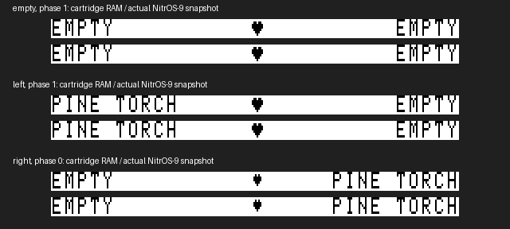
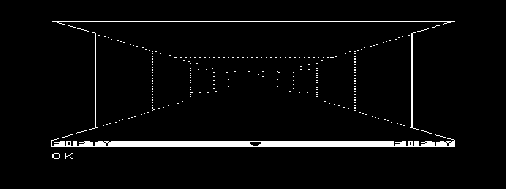

# Daggorath Gameplay M2 — original status display

## Scope and evidence

M2 restores the original hand names and two-cell heart within the existing
256×192 logical framebuffer. Presentation remains 512×192 at (64,4) on one
owned 640×200 type-5 graphics screen. The 64-pixel side strips remain empty.
No map, menu, combat, new audio effect, MCP change, or canonical-media installation
is included.

Source precedence: [index](../source-index/README.md), verified EOU runtime,
and pinned source. `MCP/Documents/` and `DOCS_INDEX.md` are absent in this checkout;
this report does not claim a new manual verification. Original paths below are
in `/Volumes/SEDONA/Projects/daggorath-reference`, commit
`a94326f00ebb16a106b540c58bc2ccf5f7b66dac`. The external upstream checkout is
`/Volumes/SEDONA/Projects/nitros9-reference`, commit
`f470fa52eb172b59b22c1b722074998cb42de9b1`; both remain read-only.

## Source archaeology

| Original source / labels | Verified behavior carried into M2 |
|---|---|
| `STATUS.ASM: STATUX, SPACES` | Clear 15 character cells on each side; left starts at column 0, right area at 17. Right name begins at column `32-nameLength`. |
| `STATUS.ASM: OBJNAM, COPY$, M$EMPT` | Empty pointer displays EMPTY. Revealed object gets adjective + space + generic name; unrevealed object gets generic only. Read actual OCB type/class/reveal fields. |
| `TOKEN.ASM: ADJTAB, GENTAB`; `EXPAND.ASM: EXPANX, GETFIV` | Packed five-bit names. COPY$ skips the first expanded byte (token class; see PARSER.ASM:PARS20). Import directly from the assembled pinned source. |
| `COMTXT.ASM: TXTDPB`; `SWCHAR.ASM: SWCTAB, SPCTAB` | Seven rows per character. Ordinary glyph rows are five bits shifted left two; special heart glyphs are seven literal bytes per cell. XOR with the text inverse byte. |
| `COMDAT.ASM: TXTSTS, STSVDB`; `CLEAR.ASM: CLRSTX, CLEAR` | Status pixel extent is **y=152..159**, x=0..255, 256 bytes. TXTSTS has a two-row text capacity, but STSVDB clears only eight scanlines. Do not confuse text capacity with the visible strip. |
| `COMDAT.ASM: TXTPRI, PRIVDB`; `CLEAR.ASM: CLRPRX` | Primary text begins at y=160. The port's message at y=168 and input at y=184 remain outside the status strip. |
| `COMMON.ASM: CLK30` | On countdown expiry, toggle PB1, reload HEARTR, and—if HEARTF is enabled—complement HEARTS and draw the matching glyph pair at columns 15–16, preserving the text cursor. |
| `PLOOK.ASM: INIVUX` | Clear status and primary regions, calculate health/rate, initialize HEARTC to 1, enable visual and audio heartbeat, draw status. |
| `PGET.ASM: COMUPD, PPULL`, `PUSE.ASM` | Hand/object changes update status. The already-supported torch operation moves the real OCB token between bag, selected hand and torch state. |
| `HUPDAT.ASM: HUPDAX, HUPD30, HUPD42`; `PUSE.ASM: USC210` | Health changes rate; fainting has separate view fades. Scroll/map mode disables HEARTF. Those unported display modes are not added by M2. |

Level-zero `VDGINV=0` gives an inverse strip: filled background, complemented
glyph bits. No modern icon or reconstructed lettering is used. Heart cells are
logical x=120..135, y=152..158; row 159 remains filled. The small heart's ink
bounds are x=127..131, y=153..157; large heart x=126..132, y=153..158.
These map to physical x=304..335 for the two cells, y=156..162, entirely inside
the faithful viewport.

## Implementation

- `import_gameplay.py` extracts original adjective/generic tables and SPCTAB
  alongside existing vectors/font data, recording original source hashes.
- `gameplay/game.{c,h}` owns one actual left-hand token (`hand`) and one right-hand
  token (`rightHand`). `game_render_status` reads those OCBs directly. The
  right-hand forms `PULL RIGHT TORCH` / `USE RIGHT` mirror the existing left-hand
  torch subset; no general parser or separate UI inventory was introduced.
- `gameplay/main.c` redraws the status strip on phase changes while retaining
  dungeon/input pixels. Enter can trigger a full scene; ordinary editing retains
  the M1 underlay optimization. Full rendering resamples phase before presentation.
- `audio/native/driver.asm` latches one phase byte on the existing PB1 edge.
  GetStat `$90` returns it in saved B, atomically with existing A/X/Y state.
  Acquisition initializes phase zero; freeze holds it; resume does not reset it.
  The callback performs no drawing, OS call, allocation, or process-memory access.
- `native_heartbeat_query` returns phase and rejects an old driver whose unchanged
  function byte `$90` would otherwise masquerade as a large heart. Rebuild and
  preload the accompanying `dhbpack`; do not mix old driver and new gameplay.

The added phase latch follows the **existing** audio edge, not an independent
wall-clock approximation. Native output sequencing, rate/countdown semantics,
SSC recipes, IPC and ownership are unchanged. Driver statics grow by one byte.
The extra instructions execute after the PB1 write, within the existing bounded
saved-CC bracket.

### Refresh limitation

The phase and pixels are source-derived; visual delivery is cooperative. A
full C dungeon redraw delays screen presentation and may skip intervening heart
shapes. M2 does not claim cartridge-identical interrupt-time screen refresh.
Heart-only updates still expand/present the existing image; they do not recompute
vectors. A later bounded presentation update could reduce latency without drawing
inside the interrupt handler. Faint/death transitions and map-mode HEARTF control
retain the previously documented M1 limitations.

## Controlled cartridge comparison

The pinned recovered cartridge was assembled with lwasm and run in installed
MAME 0.289/coco3h, 2M, explicitly RGB, with **no disks**. Natural keyboard input
entered the game, then `PULL LEFT TORCH`, `STOW LEFT`, `PULL RIGHT TORCH`.
A PC-qualified read-only tap gates capture on `STATUX` returning at `$C608`.
Both `$1000` and `$2800` framebuffer status regions must agree. No RAM, PC or
original source patches create the reference state.

The first attempt caught a partly written initial right-hand name. That fixture
was rejected; the user approved correcting the capture gate. The user also
approved giving the host ctypes frame an explicit 6,144-byte size instead of its
implicit extra NUL. Equality assertions were not loosened.

All **six 256-byte status strips** match exactly: empty/left torch/right torch,
small and large heart. [Reference fixture](../../apps/daggorath/test/fixtures/status-original.json)
retains source/ROM identity and raw regions. The [comparison](assets/daggorath-gameplay-m2/status-comparison.png) pairs decoded cartridge RAM with the actual MCP screenshot, enlarged vertically for inspection. All three pairs match all 4,096 binary pixels. The [original MAME snapshot](assets/daggorath-gameplay-m2/original-left-hand.png) retains colored edge artifacts in legacy video despite the explicit RGB configuration; its thresholded screenshot is not pixel-identical to the binary graphics presentation. We do not alter original geometry to compensate. The exact claim is framebuffer-bit equality, not identical host color filtering.

The complete logical frame remains
subject to M1's intentional message/input and scene limitations; status equality
is not a claim that the entire game has been ported.

## Memory budget and future architecture

Numbers below distinguish linked bytes, per-process storage, mapped graphics and
system-owned storage. The target has 2 MB physical RAM; it does **not** provide a
flat 2 MB C address space.

The build requests 1,536 additional stack bytes. The module data request includes
static data, runtime bookkeeping and stack reservation; do not add the stack twice.
The 6,144-byte logical image and 224-byte input underlay are in BSS. The mapped
12,288-byte expanded image is separate from BSS and consumes logical mapping
space while mapped. The owned 640×200 monochrome display has 16,000 pixel bytes
plus OS metadata/block rounding, separate from the Get/Put buffer.

### Recommendations (design only)

1. Keep tightly coupled dungeon/state/parser logic in the main module until a
   measured limit justifies splitting it. Linking files into one module does not
   itself provide overlays or a larger address space.
2. Reentrant code can share physical module pages, with per-process writable
   state. `level1/modules/kernel/flink.asm` documents link counts and E$ModBsy
   for non-shareable modules. Sharing does not remove a caller's logical mapping
   requirement; do not mark stateful modules shareable to evade ownership.
3. Immutable vectors/text catalogs are candidates for data modules, linked only
   when needed. Pair F$Link/F$Load with F$UnLink and account for mapped blocks.
   Avoid pointers into a module after unlink. Preload resident heartbeat assets;
   demand-loading from the HALT floppy during heartbeat remains outside the
   verified timing guarantee.
4. Separate optional UI processes provide distinct logical address spaces.
   The game remains sole authority for mutable game state; messages carry values
   and stable object IDs, never another process's pointers.
5. F$MapBlk/F$ClrBlk are established Level-II mechanisms; upstream
   `level2/modules/kernel/fmapblk.asm` searches a free DAT range and can fail when
   no logical mapping fits. Extra physical RAM does not eliminate this limit.
   Prefer these public ownership mechanisms and short-lived mappings over custom
   MMU register writes. M2 adds no extended-memory manager.
6. Future pressure: complete creature/object art, parser tables, sound clients,
   full gameplay code, simultaneous frame/cache buffers, map exploration and UI.
   Wizard currently remains a separate program; do not combine its cache with
   gameplay without measuring the resulting mapped working set.

### Optional native windows, CLEAR and menus (not implemented)

Recommend an optional Map process/window and an Inventory/Status process/window,
with the faithful Game window primary. The 64-pixel side strips can eventually
show quick-glance summaries; they are not the only home for auxiliary features.
A loaded map may remain allocated and immediately available while not foreground.

Upstream `level2/coco3/modules/vtio.asm` at L01FF/L0208 handles CLEAR/SHIFT-CLEAR
and walks the device/window list. The existing
[window feasibility research](WINDOW_MANAGER_FEASIBILITY.md) establishes DWSet,
Select and owned-window cleanup. Selecting a window is not a process fork or a
transfer of another process's stdin. A future integration test must verify these
behaviors against our frozen EOU runtime; M2 does not claim live auxiliary-window
acceptance.

Suggested state transport: bounded, versioned snapshots over the already-used
OS-9 pipe/child lifecycle, with sequence number, game-instance ID and explicit
end-of-session. Coalesce updates for inactive views so a slow reader cannot block
the game. A dedicated helper can hold the newest snapshot and sleep until work;
an inactive window need not redraw continuously. Label stale/disconnected views
rather than silently showing old state after a restart. Signals notify or cancel;
they are not a substitute for a structured payload. See the verified
[audio IPC](DAGGORATH_AUDIO_M1.md) and [PipeMan index](../source-index/PIPES.md).

Shared data modules would need a separately verified synchronization and lifetime
contract; they are an alternative, not an implemented shortcut. No EOU-specific
named-pipe variant is assumed interchangeable with the running PipeMan.

The game owns children it creates, records each PID, sends shutdown, and reaps the
correct child. An independent view's survival policy must be explicit. Each view
owns/closes its own paths/graphics resources. Future menu actions can open/close
Map or Inventory and coexist with CLEAR switching. Public Multi-Vue facilities
(`SS.WnSet`, `SS.MnSel`) and recovered MVKit plumbing merit a separate prototype;
MVKit is not required, and no menu or auxiliary window is implemented here.

## Validation record

Current artifact identities, live results, memory measurements and regression
counts follow. The approved lifecycle mock correction closes the final host-test gate.

### Final build budget

| Allocation / section | Bytes | Accounting |
|---|---:|---|
| `dodgame` module | 19,497 | Header, linked content, name and CRC; execution offset 13 |
| Code section | 16,509 | Includes C runtime/helpers and platform calls |
| Read-only data | 2,937 | Includes imported vectors, names, font and heart data |
| Entry/start section | 18 | Separate from code count |
| Initialized writable data | 6 | Linker sections; within data request |
| BSS | 9,022 | Includes all static game/frame buffers and runtime bookkeeping |
| Module data request | 10,558 | Includes data/stack request; not an extra allocation on top of BSS |
| Requested extra stack | 1,536 | Build option, not measured peak usage |
| Game structure | 2,606 | Maze 1,024; OCBs 1,008; CCBs 544; seeds 3; scalar flags/values 27 |
| Logical framebuffer | 6,144 | One original 256×192 bit image, inside BSS |
| Input underlay | 224 | Seven original input rows, inside BSS |
| Command input | 32 | Main's stack array; exact-word adapter, not full parser |
| Native heartbeat client | 2 + 6 | Path ownership plus query snapshot; in data/BSS |
| SSC client in gameplay | 0 | Foreground audio service is not invoked by this gameplay slice |
| Get/Put pixel payload | 12,288 | Separately mapped; 512×192 bit image |
| Owned display pixels | 16,000 | System graphics allocation, not a C heap/framebuffer |
| Native driver static request | 44 | Includes SCF base; phase adds one byte |

Live ready-boundary samples put process Y at `$0000`, module base at `$A000`,
C frame U at `$29F2`, sampled S at `$29C0`, and mapped pixel pointer at `$6020`
with length `$3000`. The buffer occupies two 8K mapping slots (including its
header), code occupies three, and low data requires two. This accounts for seven
of eight slots; the remaining `$4000..$5FFF` region is **at most** an 8K mapping
opportunity, not a verified contiguous free heap. The hardware DAT value there
alone does not establish allocator ownership. Code padding and low-data rounding
slack are not interchangeable with free mapping slots.

The stack sample is at the input boundary, **not** a stack high-water mark during
nested rendering/library calls. No claim of measured maximum stack usage is made.
Before combining Wizard, full gameplay and optional assets, measure stack depth
and F$Mem/F$MapBlk availability explicitly. Preserve the current resource-failure
paths rather than assuming the spare physical RAM makes allocations infallible.

### Reproducible build and module identity

```sh
python3 apps/daggorath/build_gameplay.py --out MCP/work/gameplay-m2/build
python3 apps/daggorath/build_heartbeat.py --out MCP/work/gameplay-m2/heartbeat
```

CMOC 0.1.90, lwasm/lwlink 4.22; CMOC `--os9 -O0 --intermediate --verbose
--add-os9-stack-space=1536`. The [build record](assets/daggorath-gameplay-m2/gameplay-build.json)
contains the exact complete command, source hashes, imported-data provenance,
tool versions and output hash. The [driver record](assets/daggorath-gameplay-m2/heartbeat-build.json)
records its defs/assembly inputs. ToolShed identifies each module and validates CRC.

| Module | Bytes | CRC |
|---|---:|---|
| dodgame | 19,497 | BCD0BD |
| DHeartbeat | 577 | DDB214 |
| dhb | 39 | BF478C |
| dodaudio | 5,571 | ABB59D |
| dodsnd | 9,710 | CC26DC |
| dodwiz | 19,822 | A75809 |

`dodgame` is edition 1, type/language `$11`, attributes/revision `$81`, entry 13,
data request 10,558. [Full identities and hashes](assets/daggorath-gameplay-m2/module-identities.json)
are retained. Two independent output directories produced byte-identical gameplay,
heartbeat pack, SSC modules and Wizard artifacts. `dodaudio` and `dodsnd` also
match the existing verified Audio M3 binaries exactly.

### Live acceptance

The [exact launch command](assets/daggorath-gameplay-m2/launch-command.txt) uses
canonical hardware with private copies of both writable EOU media and a fresh
read-only artifact floppy. The stock VHD is never mounted. Cold boot, an immediate
private ready-state save/restore handshake, then separate resident module loads
precede gameplay. No aged checkpoint is restored between normal, cancellation
and repeated runs. `dodaudio` is **not** preloaded; its established owner forks it
normally in the SSC coexistence harness.

Input is synchronized to the compiled main loop's successful one-tick sleep return,
with dirty=0, error=0, key=0, expected command/state and an empty natural-key queue.
The [passive observer](assets/daggorath-gameplay-m2/observer.lua) checks linked module
bytes/header before interpreting stack/data offsets; it does not patch guest RAM.
The [navigation harness](assets/daggorath-gameplay-m2/live.py) checks every typed
line and settled scene against the original-derived logical renderer, accepting
only the exact small or large source heart bitmap. No extra input echo was added.

| Action | Verified settled state / display |
|---|---|
| Launch `dodgame seed0` | Row 16, col 11, north; both EMPTY; original heart visible |
| `PULL LEFT TORCH` | Left `$0E95`, right 0, torch 0; PINE TORCH on left |
| `USE LEFT` | Both hands empty; selected torch `$0E95`; illuminated view |
| `PULL RIGHT TORCH` | Left 0, right `$0E95`, torch 0; PINE TORCH right-justified |
| `USE RIGHT` | Both hands empty; torch `$0E95`; illuminated view restored |
| `MOVE` | Row 15, col 11, north |
| `TURN RIGHT` | Same location, east |
| `MOVE` | Blocked; same location/orientation |
| `TURN LEFT` | Same location, north; status survives redraw |
| `EXIT` | Normal resource teardown, fresh Term prompt/status handshake, 000 |

[Exact MCP responses](assets/daggorath-gameplay-m2/live-results.json): final normal
operation **90.966 s / 000**; Shift-BREAK cancellation **42.804 s / 003**;
subsequent repeated launch **28.862 s / 000**. These are end-to-end MCP times,
including input/setup and final marker handshake, not animation durations.
All used the unchanged 120-second execution deadline and `allow_graphics:true`.
Following each, strict `date` and `pwd` returned 000; callback count remained
unchanged throughout those commands after teardown.





[Initial status](assets/daggorath-gameplay-m2/normal-initial-dark.png) ·
[Restored Term](assets/daggorath-gameplay-m2/normal-term.png)

### Heartbeat and audio regression

| Final run | Callbacks | Native edges | Largest callback gap (ms) | Status |
|---|---:|---:|---:|---|
| Navigation | 3,680 | 82 | 16.928 | 000 |
| Cancellation | 992 | 22 | 16.754 | 003 |
| Relaunch | 178 | 4 | 16.716 | 000 |
| SQUEAK coexistence | 1,017 | 339 | 16.970 | 000 |
| WHOOP coexistence | 1,016 | 339 | 16.875 | 000 |
| PHASER coexistence | 1,047 | 349 | 16.869 | 000 |

[Trace measurements](assets/daggorath-gameplay-m2/heartbeat-analysis.json) show
no two-video-tick callback gaps, no driver faults and **zero `$FF48..$FF4B` FDC
accesses** between first and last callback in each resident run. SSC tests used
the existing corrected child-owning `hbtest` harness at rate byte 3, the normal
semantic API and unchanged dodaudio. No production sound recipe changed.
[Audio/Wizard MCP responses](assets/daggorath-gameplay-m2/audio-regression.json)
include subsequent strict shell health. Wizard returned 000 in 22.826 s end-to-end;
its separate program has no heartbeat registration. This is a functional audio
regression, not a new PCM-fidelity measurement.

### Complete validation after approved mock correction

- **172 application checks passed**, including all seven new status checks and
  three phase-query checks, original frame/cache/presentation tests, audio M1/M2/M3,
  native ownership checks and existing gameplay state/input checks.
- The user approved adding the missing `native_heartbeat_query` mock. Its
  signature exactly matches the production header; it asserts an open handle,
  initializes the result deterministically, reports active/enabled ownership and
  returns success with phase/fault zero. It does not simulate waveform/countdown
  behavior. All four original cases and assertions remain unchanged: normal 000,
  cancellation 003, write failure 245, and open failure 250. **All four pass.**
- The complete 13-script Daggorath suite was rerun from fresh test processes and
  temporary build directories, including Gameplay M1/M2, Wizard, audio M1/M2/M3,
  native heartbeat, frame cache and presentation checks. No production source
  changed during this approved fixture correction.
- Complete MCP suite: **115 passed, 0 failed**. `npm run build` passed.
- Gameplay, heartbeat, SSC and Wizard were each rebuilt into two fresh output
  trees under `MCP/work/gameplay-m2-approved-validation/{a,b}`. All seven output
  files (including the combined heartbeat pack) are byte-identical between builds
  and match the previously live-tested artifacts. ToolShed CRC checks passed.
  [Fresh build identities](assets/daggorath-gameplay-m2/approved-validation.json).
- `git diff --check` and local-link checks passed.
  [Complete fresh test log](assets/daggorath-gameplay-m2/tests.log).
- Live evidence above belongs to the preceding M2 acceptance run; no new emulator
  run was needed for a host-only mock correction. Production-source SHA-256 values
  and rebuilt binary identities were checked unchanged.
- [Before](assets/daggorath-gameplay-m2/media-before.json) /
  [after](assets/daggorath-gameplay-m2/media-after.json) SHA-256 hashes and modes
  match for stock VHD, development VHD and boot DSK. Stock remains mode 0444.
- MAME stopped cleanly. No source/media/reference repository commit was made.

Recommended Gameplay M3 scope: first improve cooperative status refresh during
long scene calculations and measure peak stack/mapping headroom; then select one
small source-derived gameplay addition. Keep auxiliary windows, menu bar and
Wizard integration as separately accepted work. M2 does not claim that those
systems—or cartridge-identical visual heartbeat cadence during full redraw—exist.
