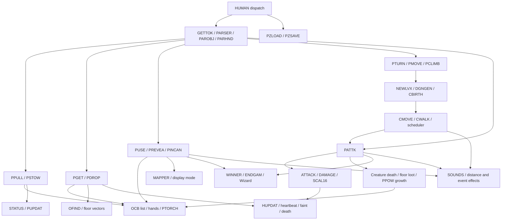
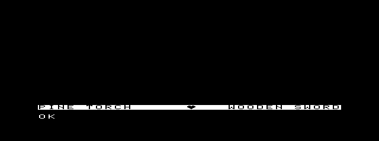
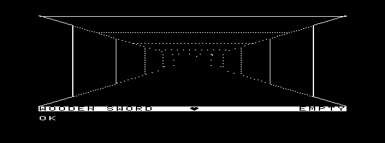
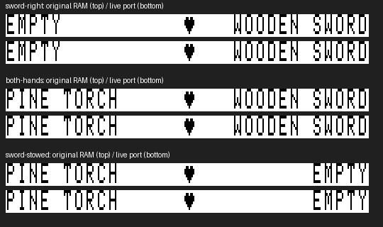

# Daggorath Gameplay M3 — reversible bag/hand manipulation

## Evidence and scope selection

Read [source precedence](../source-index/README.md), [M2](DAGGORATH_GAMEPLAY_M2.md),
and the existing gameplay, Wizard and audio reports first. Original source paths
below are relative to the read-only `/Volumes/SEDONA/Projects/daggorath-reference`,
commit `a94326f00ebb16a106b540c58bc2ccf5f7b66dac`. Upstream references use
`/Volumes/SEDONA/Projects/nitros9-reference`, commit
`f470fa52eb172b59b22c1b722074998cb42de9b1`. `MCP/Documents/` and `DOCS_INDEX.md`
are absent; no new manual verification is claimed.

M3 selects **general bag PULL and STOW**, including original generic/specific
noun and hand parsing. This is a closed, reversible operation on actual original
OCBs, reachable with the starting wooden sword and pine torch. It introduces no
new persistent state, random draws, health calculation, sound event or runtime
I/O. It does not select combat simply because creatures are already initialized.

## Remaining-game dependency graph



Arrows express source dependencies, not a claim all displayed systems are ported.
The original software task scheduler is not the NitrOS-9 scheduler.

### Trace and approximate scope

Scope below means source-level implementation burden, not a fabricated linked-byte
estimate. Counts of state structures refer to the existing original-derived port.
Except the explicit cassette commands, these paths use resident original ROM/RAM;
there is no original filesystem demand-loader to copy into the port.

| Subsystem | Original labels, callers and state | Dependencies / approximate scope / presentation and audio |
|---|---|---|
| Parser/vocabulary | `HUMAN.ASM:HMAN50/HMAN60`; `PARSER.ASM:GETTOK/PARSE0/PAROBJ/PARHND`; `TOKEN.ASM:CMDTAB/DIRTAB/ADJTAB/GENTAB`; `DTABAS.ASM:DISPAT` | Shared lexical layer, four packed catalogs. Full dispatch would expose every unported command. Only PULL/STOW are newly dispatched here. |
| Bag/hands **selected** | `PGET.ASM:PPULL/PULL10/PULL12/PULL14/PSTOW/PSTOW0/COMUPD`, called from dispatch and torch USE | Two short list operations + noun/hand parse; BAGPTR, PLHAND, PRHAND, PTORCH, 14-byte OCB links/type/class. STATUS/PUPDAT; no sound/weight/RNG/I/O. |
| Floor get/drop | `PGET/PGET10/PGET30/PDROP/WUPDAT`, `COMCRE.ASM:OFIND/FNDOBJ`, `VOBJ.ASM` | Owner/location/level and OBJWGT, health update; six floor vector lists and VIEWER traversal. Coherent next slice, but larger than reversible bag operations. |
| Movement | `PTURN.ASM:PTURN/PMOVE/PSTEP/STEPOK`, dispatch; PROW/PCOL/PDIR, maze | Existing bounded adapter; original directional MOVE and wipe transitions remain deferred. Exertion feeds HUPDAT. No new M3 movement semantics. |
| Creatures / AI / encounters | `NEWLVL.ASM:NLVL30/CBIRTH`; `CRETUR.ASM:CMOVE/CWALK/SHIELD/STEPOK`; CCBs, TCBs, CMXLND | Initialization already present; recurring scheduled movement needs shared RNG order, collision, object pickup, player encounters and attack. CWLK20..92 emits distance-attenuated sounds and requests redraw. Not an isolated visual animation. |
| Combat/player and creature damage | `PATTK.ASM:PATTK/ATTACK/DAMAGE/SCAL16`; `CRETUR.ASM:CMOV30`; PLRBLK, CCB defense/power/damage, held OCBs | Hit probability, signed/fixed-point arithmetic, darkness, ring charges, shield defense, loot, creature removal, HUPDAT. Weapon SOUNDS, KLINK, explosion; cannot claim a small complete combat slice without these. |
| Torches/use | `PUSE.ASM:PUSE12`; `COMPLR.ASM:BURNER`; PTORCH, OCB fuel/light/magic | Existing torch selection and burn subset preserved. Original torch sound A$TORC remains missing; visual operation already works silently. No new sound trigger in PULL/STOW. |
| Other use | `PUSE:UFL100/UFL200/UFL300/UFL900/USC100/USC200`; power/damage, reveal/type, DSPMOD | Flask effects, scroll maps, display modes, A$FLAS/A$SCRO. Starting bag has no such usable objects. Requires floor acquisition or combat before meaningful ordinary play. |
| Rings / reveal | `PREVEA:PREVEA/PREV00`; `PINCAN:PINCAN/WINNER`; `PATTK` charge handling | Reveal thresholds and OCBFIL; INCANT requires full adjective match (FULFLG), secret type and ring class; ring sound, Omega victory. Do not substitute prefix-only PULL parsing for INCANT. |
| Swords/shields | `PATTK` and `CRETUR:SHIELD`, `DTABAS:ODBTAB` | M3 can carry the starting sword but does not activate attacks/defense. Their power/armor effects belong with combat. No fictitious equip bonus added. |
| Levels/generation | `PCLIMB`, `NEWLVL:NEWLVX/NLVL10..50`, `DGNGEN`, `COMCRE:CBIRTH/FNDCEL` | Vertical features, multi-level creature matrix, scheduler reset, redistribution, per-level inversion and preserved ownership. Much larger than just changing a level number. |
| Experience/scoring | `PATTK` after creature death | PPOW grows by creature power divided by eight and saturates; this inspected path is power progression, not an invented separate XP/score subsystem. |
| Faint/death | `HUPDAT:HUPDAX/HUPD30/HUPD42/HUPD90` | Rate/recovery subset exists; original fades/death Wizard, input suppression and ending differ from current clean-exit adapter. Requires lifecycle-aware sequence integration. |
| Victory/endgame | `PATTK:ENDGAM`, `PINCAN:WINNER`, `MISC` Wizard routines | Wizard transitions/messages, special objects/levels and original terminal loops. Separate from ordinary creature damage; no Wizard-to-game coupling in M3. |
| Remaining sounds | `SOUNDS.ASM`, call sites in `CRETUR`, `PATTK`, `PUSE`, `PINCAN` | See [sound catalog](DAGGORATH_AUDIO_RESEARCH.md). Existing SSC SQUEAK/WHOOP/PHASER are not automatically appropriate for bag operations. Missing effects remain an audio milestone. |
| Persistence | `PZTAPE:PZLOAD/PZSAVE/FILNAM`, cassette entry paths | Explicit tape dependency. Not enabled; any proposed replacement with live RBF/FDC activity must stop for the runtime-I/O gate. |

Alternatives deferred: creature movement is coupled to encounter combat and RNG/task
ordering; combat reaches loot and endgame; reveal alone is not meaningful with the
already-revealed starting equipment; GET/DROP needs floor rendering and weight.
EXAMINE adds a second original text view but less new mutable game behavior than
reversible bag/hand operations.

## Implementation and source semantics

`apps/daggorath/import_gameplay.py` imports original command/direction catalogs,
adjective/generic class bytes and original token IDs. The first expanded byte is
**class**, as `PARSER:PARS20` reads from STRING+1; M2's prose incorrectly called it
minimum abbreviation length. Names/font/status pixels are unchanged.

`gameplay/game.c` adds private bounded lexical helpers and bag dispatch:

- Original uppercase five-bit alphabet; HUMAN's nonletter-to-space conversion.
  Up to 32 token characters (CD.ASM:TOKEN/TOKEND); no heap, static parser state,
  random calls or host/OS dependencies.
- Unique prefixes across the **whole** original table. Two matches fail. An exact
  match does not override a competing prefix. Generic first, then adjective plus
  a generic of the same class; specific matching uses OCB type, generic uses class.
- LEFT/RIGHT only through original DIRTAB. Empty/occupied hand errors leave state
  unchanged. Missing/mismatched objects do not mutate state.
- PULL removes the first matching bag item by updating the predecessor link or
  bag head; its stale next pointer is deliberately retained, matching PULL14.
  Pulling the active torch clears PTORCH. STOW prepends the held OCB and clears
  the hand. Neither changes owner, weight, fuel, damage, rate or RNG.
- Unconsumed line suffix is ignored, matching HUMAN:HMAN70. This is not shell
  command sequencing. Full original command dispatch is **not** implemented.
- Existing TURN/MOVE/LOOK/torch USE adapters remain bounded; EXIT is still handled
  only in the platform main loop. No claim of complete original parser parity.

No rendering, heartbeat, audio, driver, MCP or media implementation changes.
STATUS reads the same real hand tokens, now including WOODEN SWORD. The original
logical framebuffer, raster, status glyphs and 512×192 presentation at (64,4)
remain unchanged. Full command redraws retain M2's cooperative visual-heart delay.

## Memory architecture and future windows

M3 uses stack-local parser scratch (33-byte token plus scalar/pointer locals), no
new persistent object copies. Preserve original 16-bit OCB tokens independently
of host pointers. Existing Game state remains 2,606 bytes. The ownership boundary
is suitable for future value snapshots, not shared mutable application pointers.

Follow [memory/MMU research](../source-index/MEMORY_MMU.md) and upstream
`level2/modules/kernel/fmapblk.asm`, `fmem.asm`, plus
`level1/modules/kernel/flink.asm`: more physical RAM does not enlarge the process
logical map. Reentrant modules share physical code, not writable state; data
modules still require logical mapping; F$Link/F$UnLink ownership must be paired.
A filesystem overlay after heartbeat activation violates the current I/O gate.
Preloaded optional modules may become useful when measurements justify their
mapping/lifecycle cost; many tiny modules would add overhead without solving the
shared-state coupling. Custom MMU paging is not justified by this slice.

Keep core mutable game/parser/combat state together for now. Immutable art/catalogs
are plausible data-module boundaries; existing audio remains a separate owner;
future Map and Inventory/Status applications can have separate process spaces and
bounded versioned snapshots containing instance ID, sequence and stable object IDs.
They must not dereference stale bag links as an independent authoritative list.
STOW order is meaningful: snapshots should retain order, hand assignment and active
torch identity. Do not block gameplay on an inactive auxiliary window's reader.

Normal CLEAR window switching and future menu commands remain a design direction,
not implemented or newly live-verified here; see [window research](WINDOW_MANAGER_FEASIBILITY.md)
and upstream `level2/coco3/modules/vtio.asm:L01FF/L0208`. The faithful Game remains
primary; optional Map/Inventory windows are separate from the reserved 64-pixel
quick-glance strips. No new window, menu or side-panel content is added.

## Validation

Build, live results and final measurements are recorded below after acceptance.

### Build and memory delta

```sh
python3 apps/daggorath/build_gameplay.py --out MCP/work/gameplay-m3/build
python3 apps/daggorath/build_gameplay.py --out MCP/work/gameplay-m3/repro-build
python3 apps/daggorath/build_heartbeat.py --out MCP/work/gameplay-m3/heartbeat
```

CMOC 0.1.90, lwasm/lwlink 4.22; `--os9 -O0 --intermediate --verbose
--add-os9-stack-space=1536`. [Exact build command and source hashes](assets/daggorath-gameplay-m3/gameplay-build.json).
ToolShed validates `dodgame`: edition 1, type/language 11, attributes/revision 81,
entry 13, data request 10,558; **20,680 bytes / CRC 5D9C42**.
Two independent builds are byte-identical.

| Allocation | M2 bytes | M3 bytes | Delta / interpretation |
|---|---:|---:|---|
| Module | 19,497 | 20,680 | +1,183 |
| Code section | 16,509 | 17,337 | +828, including replacement of torch-only PULL |
| Read-only data | 2,937 | 3,292 | +355 |
| Initialized writable data | 6 | 6 | 0 |
| BSS | 9,022 | 9,022 | 0 |
| Data request (includes reserved stack) | 10,558 | 10,558 | 0 |
| Extra reserved stack | 1,536 | 1,536 | Compiler option, not peak usage |
| Game / logical framebuffer / input underlay | 2,606 / 6,144 / 224 | same | Already included in BSS |
| Expanded GP pixel payload | 12,288 | 12,288 | Two separately mapped 8K blocks with header |
| Owned screen pixel payload | 16,000 | 16,000 | System allocation, not another process-local C array |
| New persistent subsystem state | 0 | 0 | OCB list/hand fields reused |

[Linker section totals](assets/daggorath-gameplay-m3/memory-sections.json).
Compiler listing allocates 48 local bytes for bag_command, 2 for token, 4 for
classify; called sequentially, with no recursion. Arguments, saved registers,
compiler stack checks and callers are additional. This is a measured static frame
budget, **not** an interrupt-inclusive stack high-water measurement.

Live input boundary remains module base `$A000`, Y=0, U=`$29F2`.
Code still takes three 8K slots; data two; GP mapping two. Thus the same seven of
eight logical slots are accounted for. M3 consumes 1,183 bytes of existing code
rounding slack; the final possible 8K mapping region remains only an opportunity,
not a verified free heap/allocation promise. No physical-2MB headroom claim.

System modules remain separate: dodaudio 5,571/CRC ABB59D (non-shareable owner),
dodsnd test client 9,710/CC26DC, DHeartbeat 577/DDB214 with 44-byte statics,
dhb 39/BF478C, combined pack 616; separate Wizard 19,822/A75809.
No new helper runs during gameplay. [CRC/reproducibility identities](assets/daggorath-gameplay-m3/module-identities.json).

### Live setup and deterministic scenario

[Actual launch](assets/daggorath-gameplay-m3/launch-command.txt): canonical coco3h,
2M, RGB, MPI SSC slot 2 / SCII+rtime slot 4, bridge; **private copies** of both
writable EOU media plus a fresh read-only artifact floppy. Stock never mounted.
Cold boot, immediate private `hb_ready` save/restore with post-load readiness
handshake, then separate `/d1/dhbpack` and `/d1/dodgame` loads. No aged checkpoint
restore between tests. Test processes begin with fresh clock synchronization.

[Passive observer](assets/daggorath-gameplay-m3/observer.lua) validates linked
module header/instruction bytes at the successful main-loop sleep return. It
requires dirty/error/key zero, exact input/state, and empty natural keyboard queue
before the [harness](assets/daggorath-gameplay-m3/live.py) sends the next command.
It reads state; it does not patch program RAM. All settled screenshots match the
entire expected 6,144-byte logical image expanded 2× horizontally, with one exact
source heart phase. Completion requires the normal MCP fresh-prompt/unique-status
handshake, not just the observer's ready boundary.

| Command | Settled state |
|---|---|
| Initial seed0 | (16,11), north, bag sword→torch, both hands empty, dark |
| `P R W SW` | Right sword `$0E87`, bag torch `$0E95` |
| `P L P T` | Left torch `$0E95`, right sword `$0E87`, bag empty |
| `S R` | Right empty, bag sword, left torch unchanged |
| `USE LEFT` | Hands empty, torch selected, bag torch→sword, illuminated |
| `P L SWORD` | Left sword, active torch remains in bag, illuminated |
| `MOVE` | (15,11), north, sword retained; existing exertion/recovery applies |
| `TURN RIGHT` | (15,11), east; source-derived state agrees with rendered view |
| `EXIT` | Heartbeat removed, graphics/Term restored; status 000 |

[Exact responses](assets/daggorath-gameplay-m3/live-results.json) and
[observed input/state/frame records](assets/daggorath-gameplay-m3/live-states.json).
Normal run: **76.288 s / 000**. Handled Shift-BREAK while carrying sword:
**32.597 s / 003**. Relaunch, PULL RIGHT TORCH / STOW RIGHT / EXIT:
**36.876 s / 000**. Each followed by strict `date` and `pwd` returning 000;
no callbacks occurred during those post-teardown commands. All used the unchanged
120,000-ms `os9_run` timeout with `allow_graphics:true`.





[Restored Term](assets/daggorath-gameplay-m3/term.png).

### Independent original-cartridge comparison

An isolated, diskless MAME executes the assembled pinned recovered cartridge;
[launch](assets/daggorath-gameplay-m3/original-launch.json),
[read-only capture](assets/daggorath-gameplay-m3/capture-original.lua).
It enters the game normally and types the same original abbreviated commands.
Capture waits for original STATUX return and stable hand state, both heart phases;
no RAM/register/PC patch manufactures the comparison.

**Eight snapshots match exactly:** initial empty, right sword, both hands,
then STOW RIGHT leaving left torch, each in both heart phases. Bag/left/right/torch
pointers and all 28 bytes of the starting two OCBs agree. All 256 status bytes
agree in both original display buffers and the port's logical renderer.
The [permanent fixture](../../apps/daggorath/test/fixtures/bag-original.json)
records source commit, ROM hash, commands and original bytes. This is not a claim
that the whole unported game matches or that legacy RGB filtering equals the
CoCo3 graphics output.



### Performance and heartbeat

[Measured Enter enqueue → first settled presented frame](assets/daggorath-gameplay-m3/performance.json):
dark sword PULL 0.919 s, torch PULL 1.102 s, STOW 0.768 s; illuminated USE
4.623 s, illuminated sword PULL 4.824 s, MOVE 4.540 s, TURN RIGHT 2.887 s.
These include keyboard acceptance, game work, redraw/presentation and sleep-return
boundary; they are **not isolated parser CPU timings**. Full lit redraw remains
the dominant known cost. No claim of improved visual-heart latency: it can still
skip shapes while the cooperative process renders. Native output stays scheduled.

| Run | Callbacks | Heart edges | Largest callback interval |
|---|---:|---:|---:|
| Normal | 2,793 | 62 | 16.990 ms |
| Cancellation | 363 | 8 | 16.732 ms |
| Relaunch | 634 | 14 | 16.742 ms |

[Trace analysis](assets/daggorath-gameplay-m3/heartbeat-analysis.json): zero
callback gaps spanning two video ticks, zero driver faults, **zero FDC accesses**
between first/last resident callback. Bag operations change no damage/rate;
existing movement and recovery continue to use the original health calculation.
No callback persists after final removal. No long interrupt mask, audio busy loop,
new timer, runtime load or filesystem call was introduced.

### Audio/Wizard and complete regression

Existing corrected, child-owning `hbtest` uses the normal semantic audio API;
dodaudio is forked normally, never preloaded or marked shareable for the harness.
Gameplay M3 itself introduces no foreground sound call, because original PULL/STOW
has none. [Exact audio/Wizard responses](assets/daggorath-gameplay-m3/audio-regression.json):

| Regression | Status | Callbacks / edges | Largest callback interval |
|---|---|---|---|
| SQUEAK + native heartbeat | 000 | 1,017 / 339 | 16.867 ms |
| WHOOP + native heartbeat | 000 | 1,005 / 335 | 16.808 ms |
| PHASER + native heartbeat | 000 | 1,041 / 347 | 17.057 ms |
| Separate Wizard | 000 | No heartbeat registration | 22.897 s MCP operation |

No faults/two-tick gaps/active FDC accesses in these resident heartbeat trials;
no callbacks after teardown through each following `date`/`pwd`. These are
functional regressions of unchanged audio, not new PCM fidelity measurements.
Wizard's operation duration includes startup and status framing; it is not a
new measurement of the 15-second animation itself.

[Complete test log](assets/daggorath-gameplay-m3/tests.log):

- **185 Daggorath checks passed**: render 22; Audio M1 36, M2 27, semantic
  heartbeat 20, native heartbeat 17; Gameplay M1 state 6, input 4, lifecycle 4;
  M2 status 7 and phase query 3; **M3 bag/parser/cartridge 13**; Wizard lifecycle 5,
  cached frames 19, presentation 2. All 14 test scripts ran from fresh processes.
- New tests include occupied/empty hands, head/tail unlink, retained link bytes,
  repeated transfer cycles, exact original OCB/status fixture,
  unique/ambiguous prefixes, generic/adjective class validation, absent objects,
  invalid directions, ignored suffixes, nonletter conversion and faint rejection.
- The user approved correcting one new expectation: `PULL L P TORCH` succeeds
  because PINE is the sole adjective beginning P. It moved into the successful
  prefix case; all actual ambiguity/mutation assertions remain. Existing M1/M2
  test assertions, fixtures and lifecycle mocks were unchanged.
- Complete MCP suite **115 passed / 0 failed**; `npm run build` passed.
- Gameplay, native driver/descriptor/pack, audio service/client and Wizard rebuilt
  into independent directories; all seven artifacts compare byte-for-byte and
  ToolShed validates their module CRCs. System artifacts retain M2 identities.
- `git diff --check` and local documentation-link/whitespace checks passed.
- [Before](assets/daggorath-gameplay-m3/media-before.json) /
  [after](assets/daggorath-gameplay-m3/media-after.json) canonical-media hashes and
  modes are identical: stock 0444, development VHD 0644, boot floppy 0664.
  Stock was never mounted; application installation used disposable media only.
- MAME stopped cleanly. No MCP source, audio production code, reference repository,
  canonical media or commit changed.

### Limits and recommended M4

This is a small authentic equipment-management slice, not combat. General USE,
DROP/GET, directional MOVE, full command dispatch, AI, encounters, levels and
endings remain unported. Existing torch sound omission, faint/death adapter and
visual-heart latency remain explicit M1/M2 limitations. Stack high-water and
allocator-confirmed mapping headroom still need measurement before major growth.

Recommend **resident floor-object GET/DROP + original floor rendering** for M4:
PGET/PDROP, OFIND/FNDOBJ, OBJWGT/WUPDAT and VOBJ/FWDOBJ drawing, with exact
source-derived placement/ownership and health effects. It creates a reversible
playable loop from M3's actual starting objects without requiring creature AI or
combat. Trace its full dependencies before implementing; preserve the runtime-I/O
gate and measure code/map growth. Do not bundle map windows, inventory UI, audio
recipes, combat or custom paging into that slice.
