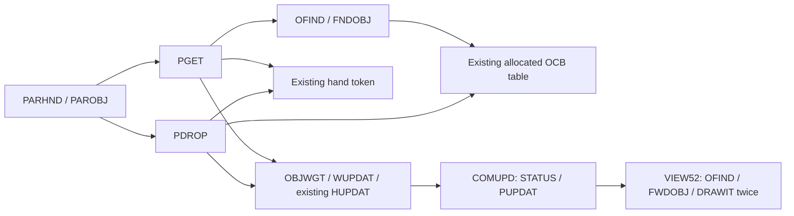
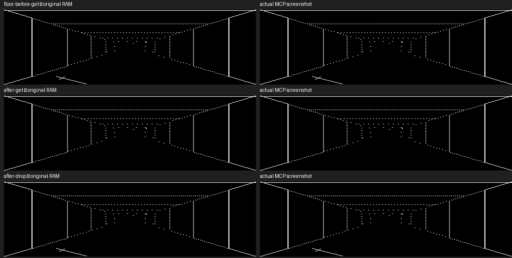
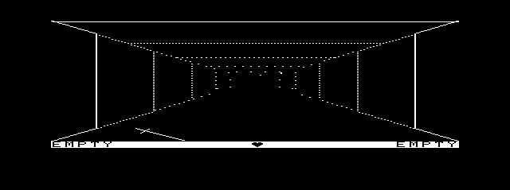

# Daggorath Gameplay M4 — original floor objects, GET and DROP

## Sources and dependency gate

Baseline: [Gameplay M3](DAGGORATH_GAMEPLAY_M3.md), dodgame 20,680 bytes,
CRC 5D9C42. Follow [source precedence](../source-index/README.md) and the existing
M1/M2 gameplay, audio and [reference research](../reference-projects/DAGGORATH.md).
Original paths below are relative to the read-only
`/Volumes/SEDONA/Projects/daggorath-reference`, commit
`a94326f00ebb16a106b540c58bc2ccf5f7b66dac`. `MCP/Documents/` and
`DOCS_INDEX.md` remain absent; source and controlled runtime comparisons supply
this task's evidence, not a claimed new manual verification.

**The dependency gate is satisfied.** GET/DROP uses the existing parser, packed
OCBs, hand state, weight, existing health calculation and redraw. It needs no
creature execution, combat, new damage algorithm, new use effect, randomness,
level transition, tape, filesystem, or runtime module load. Current gameplay is
level zero; M4 does not pretend to support transitions by inventing a new level
system. Weight affects the already-ported subsequent movement exertion.



| Original source / labels | Verified responsibility |
|---|---|
| `HUMAN.ASM:HMAN50/HMAN60/HMAN70`; `DTABAS.ASM:DISPAT`; `TOKEN.ASM:CMDTAB` | Dispatch GET/DROP, then discard unconsumed input suffix. |
| `PARSER.ASM:GETTOK/PARSE0/PAROBJ/PARHND/CMDERR` | Existing unique-prefix, generic or adjective+generic matching; left/right hand; error text `???`. |
| `PGET.ASM:PGET/PGET10/PGET20/PGET22/PGET24/PGET30` | Require empty hand; scan current-cell floor objects; first matching type/class becomes held; increment owner from zero; add class weight. |
| `PGET.ASM:PDROP/WUPDAT/COMUPD` | Require nonempty hand; clear hand; owner=0, location=current row/column, level=current level; subtract class weight; health/status/view update. |
| `COMCRE.ASM:OFIND/OFIND9/FNDOBJ/FIND10/FIND99` | Ascending allocated OCB order, level match, row/column match and owner zero. No floor linked-list traversal. |
| `DTABAS.ASM:GENXXX/OBJWGT/FWDOBJ` | Class order flask/ring/scroll/shield/sword/torch; weights 5/1/10/25/25/10; class-specific vector lists. |
| `VIEWER.ASM:VIEW40/VIEW52/VIEW60/DRAWIT/SETSCL/NORSCL` | Draw objects after vertical features and before testing forward obstruction; per-cell range scale; magic then regular light passes. |
| `VCTLST.ASM:SETFAX/VCTLSX`; `COMSWI.ASM:SWISER` | First SETFAX consumes MAGFLG; second uses regular light. SWI register restoration permits drawing the same list twice. |
| `VOBJ.ASM:FFLASK/FRING/FSCROL/FSHIEL/FSWORD/FTORCH` | Original floor geometry, imported without replacement artwork. |
| `PUPDAT.ASM:PUPSUB/PUPDAX` | Calculate regular/magic light from player/active torch; generate alternate view and request presentation. |
| `HUPDAT.ASM:HUPDAX`; `PGET.ASM:WUPDAT` | Recompute existing condition/rate after weight change; GET/DROP itself adds no damage and changes no power. |

## Authoritative state and exact transitions

There is **no new floor inventory**. The existing 72×14-byte OCB storage and
allocated count (65 at initialization) remain authoritative. Tokens retain original
OCBLND addresses; host pointers are only a translation boundary.

Floor membership means OCLVL=0, OCOWN=0, matching OCROW/OCCOL. Search stops at
allocated count, not storage capacity. FNDOBJ visits records in address order;
OCPTR is not a floor link. A dropped object's old next-link bytes remain intact,
just as the source leaves them. Following such a stale link as a floor chain would
be a bug. Bag membership still follows BAGPTR/OCPTR; hand ownership is the hand
token. Owner 1 is player-owned; nonzero creature ownership is excluded by OFIND.

**GET:** empty selected hand → first matching unowned object in the current cell
and level → hand token assigned, owner incremented, weight added. Row/column,
level, next-link, fuel, light, reveal and type bytes remain unchanged. GET neither
stows nor automatically uses an object. No visibility/light requirement exists
in PGET: a player can GET a correctly named object in darkness.

**DROP:** nonempty selected hand → clear that hand, owner zero, current location,
level zero → subtract class weight. It does not choose a random location, specify
an orientation, alter bag links, clear fuel/reveal, or automatically light a torch.
An active torch resides in the bag under the existing USE path; PULL clears its
active designation before it can be dropped. DROP does not add another torch rule.

Weight arithmetic keeps Word wrap; DROP follows byte NEG then signed extension,
GET uses unsigned byte class weight. Existing health and heartbeat APIs are reused;
there is no second rate/countdown calculation or damage subsystem.

## Parser and messages

Import original T.GET/T.DROP IDs and dispatch them through the M3 parser.
Examples: `GET LEFT SWORD`, `G R W SW`, `DROP LEFT`, `D R`.
Generic ambiguity (`S` matches several classes), adjective/class mismatch,
unavailable object, wrong direction, occupied GET hand and empty DROP hand fail
without mutation. Full vocabulary is used for ambiguity, but unported commands
remain unavailable. There is no convenience pickup, automatic bag insertion or
modern parallel command grammar.

`game_message` returns source CMDERR's `???` for failed GET/DROP and no success
message for successful GET/DROP. The text renderer uses original CD.ASM:I.QUES
($1D) from the already-imported SWCTAB font. Placement remains the bounded port's
message row; full original scrolling command history is not ported. Other commands
retain their existing M1/M3 adapter messages. EXIT remains the isolated OS-9
extension. No parser/lifecycle test expectation is changed to accommodate M4.

## Floor rendering

`import_gameplay.py` adds FWDOBJ's six vector lists and OBJWGT. `game.c` scans
matching OCBs in each VIEWER cell and performs the original two draw passes:
magic light first, regular light second. Rendering remains additive original
vector pixels with original dotted fading, centroid/range scaling and clipping.
Objects are drawn after architecture, creatures/peeks and vertical features;
VIEW60 then stops traversal at a forward wall/door. Objects are not individually
occlusion-tested or position-randomized. Multiple objects of one class overlap
because the source gives them the same class silhouette. All headings use those
view-relative class coordinates, not an object-facing field.

The world remains original-derived state → logical 256×192 → physical 512×192
at (64,4) on the owned 640×200 screen. No font, vector or physical side strip is
redesigned. Editing still restores only the input underlay; expensive complete
redraw occurs on command/state change. The existing cooperative visual-heart
refresh limitation remains explicit.

## Audio and runtime I/O

PGET/PDROP/WUPDAT/COMUPD has **no SOUNDS/ISOUND invocation**. Do not attach
SQUEAK/WHOOP/PHASER merely as UI feedback. Existing torch-use sound omission remains
outside M4; no new sound is required for GET/DROP state correctness.

All new tables/code are resident. No OS file call, module load, disk write, tape
operation or rb1773 change is introduced after heartbeat activation. Tests use a
fresh artifact floppy and private EOU copies; canonical images are never used for
application installation. Native heartbeat code is unchanged.

## Future boundaries

Floor records now expose useful inventory/map facts: stable object ID, owner,
level, location, type/class/reveal and ordered bag/hand assignment. A future
Inventory/Status or Map process must consume versioned value snapshots from the
game's authority, not create an independent mutable object list or dereference
another process's OCB pointers. Reveal semantics also constrain which names a map
should display. No full-map discovery policy is introduced here.

Keep optional Game/Map/Inventory windows and normal CLEAR switching as future
work. The 64-pixel strips remain reserved for optional quick-glance summaries;
no menu or window is added. See [window feasibility](WINDOW_MANAGER_FEASIBILITY.md).
Continue the M3 module/process guidance and [MMU research](../source-index/MEMORY_MMU.md):
resident core state first; immutable art/data may later become linked data modules;
optional UI can have its own process space. Disk-backed overlays would cross the
runtime-I/O gate. No custom MMU manager or tiny-module split is justified by M4.

## Validation record

Final live comparisons, lifecycle, performance, memory and regression results follow.

### Build identity and memory

```sh
python3 apps/daggorath/build_gameplay.py --out MCP/work/gameplay-m4/build
python3 apps/daggorath/build_gameplay.py --out MCP/work/gameplay-m4/repro-build
python3 apps/daggorath/build_heartbeat.py --out MCP/work/gameplay-m4/heartbeat
```

CMOC 0.1.90, lwasm/lwlink 4.22; `--os9 -O0 --intermediate --verbose
--add-os9-stack-space=1536`. [Full command/source hashes](assets/daggorath-gameplay-m4/gameplay-build.json).
ToolShed validates **dodgame 21,714 bytes / CRC AF5C54**, edition 1, type/language
11, attributes/revision 81, entry 13, data request 10,558. Independent builds
match each other and the staged/live module byte-for-byte. Comment-only provenance
updates were rebuilt and verified against that same live binary.

| Allocation | M3 | M4 | Delta |
|---|---:|---:|---:|
| Module | 20,680 | 21,714 | +1,034 |
| Code | 17,337 | 18,252 | +915 |
| Read-only data | 3,292 | 3,411 | +119 |
| Initialized writable data | 6 | 6 | 0 |
| BSS | 9,022 | 9,022 | 0 |
| Data request including reserved stack | 10,558 | 10,558 | 0 |
| Extra stack reservation | 1,536 | 1,536 | 0 |
| Game structure | 2,606 | 2,606 | 0 |
| OCB storage (inside Game) | 1,008 | 1,008 | 0 |
| Logical frame / input underlay (inside BSS) | 6,144 / 224 | same | 0 |
| Separately mapped GP pixel payload | 12,288 | 12,288 | 0 |
| System-owned screen pixels | 16,000 | 16,000 | 0 |

[Section totals](assets/daggorath-gameplay-m4/memory-sections.json).
The shared object-handler stack-local frame grows from 48 to 51 bytes; the message
helper has a separate 35-byte local frame and runs after the command returns.
Arguments, saved registers, compiler checks and nested calls are additional.
These listing measurements are not a runtime stack high-water guarantee.

Live module base remains `$A000`, Y=0, main U=`$29F2`. Three 8K code slots,
two low-data slots and two GP slots remain accounted for. The same possible eighth
slot is not a verified free heap; code rounding slack shrinks by 1,034 bytes.
2MB physical RAM does not imply a larger flat process address space. Current
growth does not justify overlays, custom paging or new helper processes.

System allocations remain separate and unchanged: DHeartbeat 577 bytes/CRC DDB214,
44-byte driver statics; dhb 39/BF478C; combined pack 616; non-shareable dodaudio
5,571/ABB59D, test client dodsnd 9,710/CC26DC; separate Wizard 19,822/A75809.
[All identities/reproducibility hashes](assets/daggorath-gameplay-m4/module-identities.json).
Gameplay does not launch an SSC helper for GET/DROP.

### Independent original reference

[Diskless original MAME launch](assets/daggorath-gameplay-m4/original-launch.json)
and [capture script](assets/daggorath-gameplay-m4/capture-original.lua) use the
pinned assembled cartridge, natural keyboard input and read-only taps. No source,
PC, register, RAM, object or RNG patch creates a reference state.

The first capture incorrectly treated background redraw/instruction reads as
proof that a command had completed. It recorded some new OCB state with the old
scene. The user approved correcting the fixture gate. Final capture observes
**HMAN99's actual STU LINPTR write** after the command handler, with U=LINBUF,
expected hands/owner/weight, an empty natural-key queue and UPDATE cleared. It
reads the completed active FLIP buffer. No state/pixel assertion was relaxed.
Initial capture also waits for the pending display update to finish.

[Permanent reference fixture](../../apps/daggorath/test/fixtures/floor-original.json)
contains source/ROM identity, deduplicated original bytes and nine states:
initial, torch hand, lit, sword held, floor before GET, after GET, STOW, PULL,
and DROP again.

- Bag/left/right/torch/weight words and all 28 bytes of the two player OCBs
  match sequential port execution **exactly** across all nine states.
- The complete original 256×152 dungeon region **and** 256×8 status strip
  match exactly when rendering the captured original world and heart phase.
  Captured autonomous creature positions are inputs to this rendering comparison;
  this does not claim that the port implements original creature AI.
- Actual MCP screenshots for floor-before-GET, after-GET and after-DROP match
  all **77,824 physical dungeon pixels** against doubled original RAM. The sword
  contributes 36 logical pixels in bounds x=53..83, y=135..150 for this view,
  mapping to physical x=170..231, y=139..154. This is original FSWORD geometry.
- The primary command-history region remains the bounded port UI, not original
  scrolling history. Legacy video color filtering is not used as a binary oracle.
  No unexplained dungeon/status pixel discrepancy remains in these references.



### Live scenario and lifecycle

[Exact launch command](assets/daggorath-gameplay-m4/launch-command.txt) preserves
coco3h/2M/RGB, SSC slot 2, SCII+rtime slot 4 and the MCP bridge. Both writable EOU
media are **private copies**, plus a fresh read-only artifact floppy. Stock is
never mounted. Cold boot → immediate private hb_ready save/restore readiness
handshake → separate `/d1/dhbpack` and `/d1/dodgame` preloads → resident gameplay.
No aged ready state is restored between runs.

[Observer](assets/daggorath-gameplay-m4/observer.lua) checks the compiled module
header/instruction signature and successful main-loop sleep-return boundary.
[Harness](assets/daggorath-gameplay-m4/live.py) requires dirty/error/key zero,
expected input/state and an empty key queue before proceeding; every settled
frame is checked exactly against the logical renderer, with either exact original
heart phase. It never modifies emulated memory. Main-loop input-row reuse remains
unchanged. Full MCP return still requires fresh Term prompt/status framing.

The initial authentic world contains creature/player-owned items, not a fabricated
starter floor pickup. We create the first encounter by dropping the actual starting
sword, then retrieve it through original GET. No new random placement or debug
spawn is added.

| Action | Source-derived state |
|---|---|
| seed0 / `P L T` / `USE LEFT` | (16,11), north; active pine torch in bag, lit |
| `P R SW` | Right hand `$0E87`, owner 1, carried weight 35 |
| `D R` | Both hands empty; sword owner 0, level 0, (16,11), weight 10; visible |
| `G R W SW` | Right `$0E87`, owner 1, weight 35; floor sword disappears |
| `S R` | Sword prepended to bag; right empty |
| `P L SW` | Same sword in left; bag retains active torch |
| `D L` | Same floor owner/location/weight as first DROP; sword reappears |
| `MOVE` | Player (15,11); dropped sword remains (16,11), not carried along |
| `TURN RIGHT` | Player faces east; ordinary navigation still works |
| `EXIT` | Heartbeat/audio ownership and graphics cleaned up; Term restored; 000 |

[Exact responses](assets/daggorath-gameplay-m4/live-results.json) and
[state/frame records](assets/daggorath-gameplay-m4/live-states.json): normal
**107.823 s / 000**, handled Shift-BREAK after DROP **39.845 s / 003**, repeated
launch/PULL/DROP/GET/EXIT **40.678 s / 000**. Each used the unchanged 120-second
`os9_run` deadline with `allow_graphics:true`; following strict `date` and `pwd`
returned 000. These operation times include startup/input/teardown/status framing.
No callback occurs during the following shell checks after removal.



[Hand/status after GET](assets/daggorath-gameplay-m4/after-get.png) ·
[Restored Term](assets/daggorath-gameplay-m4/term.png).

### Heartbeat, I/O and performance

| Gameplay run | Callbacks | Native edges | Largest callback interval |
|---|---:|---:|---:|
| Normal round trip/navigation | 4,251 | 93 | 16.969 ms |
| Cancellation | 544 | 12 | 16.998 ms |
| Relaunch | 760 | 17 | 16.962 ms |

[Analysis](assets/daggorath-gameplay-m4/heartbeat-analysis.json): zero two-video-tick
gaps, zero driver faults, zero `$FF48..$FF4B` FDC accesses between first/last
resident callback. [Countdown verification](assets/daggorath-gameplay-m4/countdown-check.json)
checks 4,250 / 543 / 759 consecutive transitions respectively: decrement or
source-rate reload, **zero mismatches**. Teardown leaves zero later callbacks.
No busy-loop audio, long interrupt mask or new timing infrastructure was added.

[Enter enqueue → first presented-ready boundary](assets/daggorath-gameplay-m4/performance.json):
DROP RIGHT **4.874 s**, GET RIGHT **4.757 s**, DROP LEFT **4.924 s**;
lit PULL **4.790–4.824 s**, USE **4.674 s**, MOVE **4.206 s**, TURN **2.804 s**.
These include input acceptance, execution, rendering and presentation—not isolated
parser CPU cost. Compare M3's lit PULL 4.824 s: no material regression is shown in
this scenario, but full redraw remains slow. Floor scans are bounded by allocated
OCBs per visible cell, and occupied cells add original vector passes. Larger piles
or longer views may cost more; this is not a worst-case performance claim.
Visual heart refresh can still be delayed during redraw while native heartbeat
continues on time. No fidelity-changing optimization was made.

## Final regression and media verification

All **200 Daggorath checks** passed from fresh test processes: 22 rendering,
36 Audio M1, 27 Audio M2, 20 semantic heartbeat, 17 native heartbeat,
13 M3 bag, 15 M4 floor, 6 Gameplay M1, 4 input rendering, 4 gameplay lifecycle,
7 status rendering, 3 heartbeat-phase query, 5 Wizard lifecycle, 19 playback/cache,
and 2 presentation checks. Existing assertions were retained. The only approved
reference-fixture correction was the completed-command capture gate described above.
The complete MCP suite passed **115/115**; `npm run build` passed.
See [complete test/build log](assets/daggorath-gameplay-m4/tests.log).

Additional [live regressions](assets/daggorath-gameplay-m4/audio-regression.json):

| Command | MCP elapsed time | Status | Native callbacks | Maximum callback interval |
|---|---:|---|---:|---:|
| `hbtest squeak` | 33.834 s | 000 | 1,003 | 16.859 ms |
| `hbtest whoop` | 33.692 s | 000 | 1,015 | 16.820 ms |
| `hbtest phaser` | 34.335 s | 000 | 1,042 | 16.844 ms |
| `dodwiz` | 22.807 s | 000 | Not enabled by standalone Wizard | — |

These are functional/lifecycle regressions, not new PCM fidelity measurements.
The SSC recipes and native heartbeat implementation are unchanged. Each run was
followed by successful strict `date`/`pwd`; callback counts remained stable after
teardown. The three audio runs recorded zero two-tick callback gaps, driver faults,
and active FDC accesses. Wizard returned from graphics through the normal separate
status-marker handshake.

Two independent builds matched for all seven checked artifacts: `dodgame`,
`DHeartbeat`, `dhb`, `dhbpack`, `dodaudio`, `dodsnd`, and `dodwiz`.
[Module identities and CRC validation](assets/daggorath-gameplay-m4/module-identities.json)
record the results. Final `dodgame`: **21,714 bytes, CRC AF5C54, edition 1**.
No production MCP, audio, heartbeat, or external reference source was changed.

MAME stopped cleanly (`coco_stop`: `{"ok":true}`). All three canonical media
SHA-256 hashes and permissions are exactly unchanged:
[before](assets/daggorath-gameplay-m4/media-before.json) /
[after](assets/daggorath-gameplay-m4/media-after.json).
The stock VHD remains mode 0444. Live work used private media copies and a disposable
artifact floppy; no application was installed into either canonical VHD.

## Limitations and recommended Gameplay M5

This remains a level-zero, non-combat milestone. Initial creature-owned objects are
not made collectible by inventing creature death; the acceptance scenario drops the
real starter sword. Floor state is authoritative OCB state, with no extra inventory
model. Whole-scene comparisons use independently captured original world state;
they do not imply creature simulation is implemented. The full original command
history UI is still absent. Expensive full redraws can delay the visible heart even
when native heartbeat callbacks remain on schedule.

The +1,034-byte module growth with unchanged process data allocation does not yet
justify overlays, shared modules, cooperating state owners, or a custom MMU manager.
The memory budget above records the actual allocation limits rather than promising
unmeasured free memory.

Recommend a bounded M5 source/dependency trace of the original `EXAMINE` path
(`PEXAM`/`EXAMIN`) for room/bag inspection, preserving authoritative object state
and original presentation. Gate implementation on its actual dependencies before
adding effects, creatures, or new display windows. Inventory/Map windows and side
strips remain later consumers of the same state, not duplicate owners.
