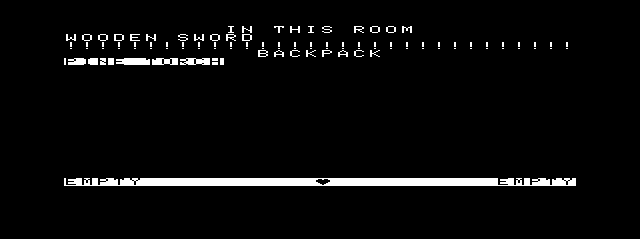
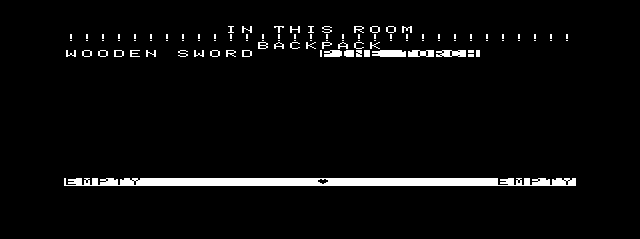
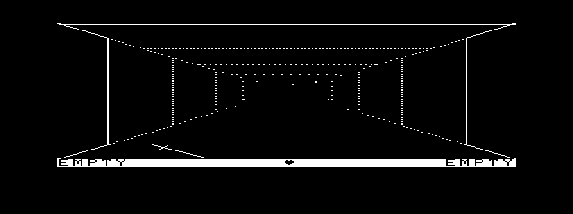
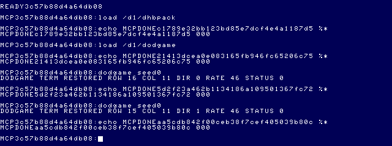
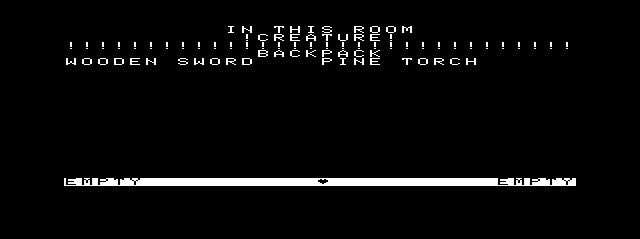

# Daggorath Gameplay M5 — original EXAMINE

Implementation and host/cartridge validation: 2026-09-27.
**EOU EXAMINE live acceptance passed using the corrected private bridge.**
No commit; no MCP, audio, heartbeat, media or reference-source changes.

## Source and dependency gate

Normative source is `/Volumes/SEDONA/Projects/daggorath-reference` at
`a94326f00ebb16a106b540c58bc2ccf5f7b66dac`. Original cartridge frames outrank the
Hunerlach/gondur C interpretation. See the
[semantic crosswalk](../reference-projects/DAGGORATH_C_CROSSWALK.md),
[original archaeology](../reference-projects/DAGGORATH.md), and
[source precedence](../source-index/README.md).
`MCP/Documents/` and `DOCS_INDEX.md` are absent; the statements below are sourced
to identified ASM and observed cartridge output, not newly verified manual claims.

| Source path / labels | M5 responsibility |
|---|---|
| `TOKEN.ASM:CMDTAB`, `PARSER.ASM:PARSE0`, `HUMAN.ASM:HMAN70/HMAN99` | Unique verb prefix; handler return discards trailing input. |
| `PEXAM.ASM:PEXAM` | Set DSPMOD=EXAMIN, call PUPDAT; no argument parsing. |
| `PEXAM.ASM:EXAMIO/EXAMIN/EXAM10..99` | Room header, optional creature marker, floor scan, separator, bag header/list. |
| `PEXAM.ASM:PRTOBJ/PCRLF` | Original OBJNAM, paired columns, CRLF, inverse active-torch name. |
| `COMCRE.ASM:OFIND/FNDOBJ/CFIND` | Ascending OCB floor scan and active CCB presence, read only. |
| `STATUS.ASM:OBJNAM/COPY$` | Existing revealed/generic object-name selection reused. |
| `COMDAT.ASM:TXTEXA`, `CD.ASM:I.EXCL/I.CR` | 32×19 character area, single alternate screen, inverse initially zero; codes 27/31. |
| `TXTSER.ASM:TXTCHR`, `COMTXT.ASM:TXTXXX/TXTDPB/TXTCR/TXTSCR` | Seven-row packed glyphs, cursor advance, immediate scrolling at 608 characters. |
| `PLOOK.ASM:PLOOK`, `PUPDAT.ASM:PUPDAX/PUPSUB` | LOOK restores VIEWER; display persists until explicitly changed. |

EXAMINE has no sound, random-number, damage, movement, level-change, disk or AI
call. CFIND reads initialized records without running CMOVE. All dependencies fit
M5: existing name/font data and object state, a bounded text writer, display mode,
and an active-creature read check. No new major subsystem was required.

## Exact command and output semantics

- `EXAMINE` and its unique prefixes (including `E`) select examination mode.
- There is **no distinct EXAMINE BAG/LEFT/RIGHT/object handler**. These trailing
  words are ignored by the original handler/command flush. They still show both
  room and backpack. M5 does not invent qualifier validation or convenient pickup.
- `LOOK` and its unique prefix restore dungeon mode. Other successful inventory
  operations refresh the current mode; they do not implicitly return to VIEWER.
- Failed verb recognition retains the existing command adapter. Valid EXAMINE
  prints no success message. Empty lists print no invented “EMPTY” line.
- Hands are shown in the unchanged status strip; EXAMINE does not list held items
  in the backpack or floor section.

Within the logical 256×152 top area (32 columns ×19 rows):

1. Cursor starts at character offset 10: `IN THIS ROOM`, then original CR.
2. If CFIND succeeds, add 11 to the cursor, print `!CREATURE!`, then CR.
   There are no creature names, counts, pluralization or ordering list.
3. Scan allocated OCBs in ascending original address order. Require owner zero,
   current row/column, current level (the port remains level zero). Print the
   original revealed adjective/name or generic class. There is no floor chain.
4. After the first name of a pair: cursor=`(cursor+16)&$FFF0`; after the second,
   CR rounds down to the next 32-character row. An odd final floor item gets CR.
5. Print 32 original exclamation glyphs as separator. Add 12 to cursor and print
   `BACKPACK`, then CR.
6. Traverse BAGPTR/P.OCPTR, preserving actual linked order. Highlight only the
   PTORCH name using inverse seven-row glyphs; restore inverse zero immediately
   after its name. No duplicate display inventory is allocated.

TXTDPB writes seven scanlines, leaving the eighth unchanged. A printable character
advances one column; CR advances to the next row even at column zero. After each
OUTCHR, reaching 608 characters scrolls exactly one eight-scanline row and clears
the final row with current inverse fill. The code mirrors this ordering, including
name tabbing. A 72-record synthetic bag tests scrolling and a guard beyond the
6,144-byte framebuffer; it is a bounds/layout stress test, not a claimed natural
cartridge inventory.

The status strip at y=152 remains unchanged. The existing port input/message area
below it remains a known adapter: M5 does not implement the entire original command
history. Pixel equivalence claims below cover the complete 4,864-byte examination
area; they do not claim full original lower-screen command history equivalence.

## Implementation and C-lineage comparison

[game.c](../../apps/daggorath/src/gameplay/game.c) adds:

- `game_display_command`: full original CMDTAB classification for EXAMINE/LOOK.
- `game_render_examine`: authoritative floor/bag traversal and read-only CFIND.
- Small `ExamineText` cursor/inverse/pair context and source-derived glyph/scroll
  operations. No heap, additional frame, new inventory list or host floating point.

[main.c](../../apps/daggorath/src/gameplay/main.c) owns display mode, matching
DSPMOD's UI purpose without changing the packed Game structure. Mode changes only
after a successful command. Existing input-row and heartbeat-only framebuffer
reuse remains active; command completion redraws the selected mode. LOOK requires
an authentic dungeon redraw; no second cached dungeon frame was introduced.

`import_gameplay.py` imports T.EXAM/T.LOOK from the assembled original symbol map.
No original vector, coordinate, font, audio recipe or animation data was edited.

Linux reference `4ab53f4b4478df028d14a403fc03d9ff5266cde1`:
`Player::PEXAM` → `Viewer::EXAMIN/PRTOBJ/PCRLF` follows the same room/floor/bag
structure, including creature presence and active torch highlighting. It was a
readability aid. Its expanded `TXB`, host indexes/-1 sentinel, GL text/highlight and
host display pipeline were not copied. N uses original packed OCB address tokens,
zero sentinel and original glyph bits. The existing source already draws some
initialized creature silhouettes; M5 adds no creature graphics or dynamic behavior.
The crosswalk's “no active creature rendering” should not be read as absence of
those static initial-state silhouettes.

## Cartridge references and host validation

[Original launch](assets/daggorath-gameplay-m5/original-launch.json) is diskless;
[read-only capture script](assets/daggorath-gameplay-m5/capture-original.lua) uses
natural keyboard commands, actual HMAN99 command-return writes, empty keyboard
queue and UPDATE clear, then reads the completed active FLIP buffer. No original
memory/register/PC patches create the inventory reference states.

[Permanent fixture](../../apps/daggorath/test/fixtures/examine-original.json)
contains 13 EXAMINE captures with ROM identity, commands, player state and hashed,
deduplicated original world/frame bytes:

- initial examination: empty floor, wooden sword then pine torch in bag;
- PULL sword; DROP; GET right; STOW; PULL;
- both hands occupied/empty bag;
- one then two floor objects (sword precedes torch by OCB order);
- GET torch; USE LEFT; EXAMINE BAG with inverse active torch;
- LOOK followed by EXAMINE again.

[Initial examination](assets/daggorath-gameplay-m5/original-initial-examine.png) ·
[two floor objects](assets/daggorath-gameplay-m5/original-two-floor-objects.png) ·
[active torch](assets/daggorath-gameplay-m5/original-active-torch.png).

All 13 **entire 256×152 areas match byte-for-byte**. Bag/hand/torch/weight words and
both starter OCB records match before captured world bytes are supplied solely for
rendering comparison. Original AI continues running; copying its observed world
into the host rendering oracle is not a claim that the port implements that AI.
All 13 captures have no creature in the player's room. A separate bounded
240-emulated-second natural-arrival experiment did not obtain a creature-presence
capture; no false runtime comparison is claimed for that case.

[11 new tests](../../apps/daggorath/test_examine.py) cover exact headers/spacing,
qualifier behavior, prefixes/LOOK, empty bag/held items, object round trips,
multiple-object ordering, seven-row inverse torch, full 32-slot CFIND with active
flag, read-only state/RNG/damage/links, scrolling bounds, and cartridge state/frames.
The read-only creature test deliberately uses slot31, beyond current initialized
creatureCount, and proves inactive records do not report presence.

All 200 pre-existing Daggorath checks plus these 11 passed. Existing assertions and
fixtures were unchanged. The full MCP suite passed 115/115; `npm run build` passed.
The first sandboxed MCP test launch was blocked by tsx's IPC socket permission;
it passed with the required local IPC permission. Independent builds of dodgame
are byte-identical. Six unchanged audio/heartbeat/Wizard artifacts also reproduce
their M4 bytes exactly; [module/CRC results](assets/daggorath-gameplay-m5/module-identities.json).

## Build and memory

[Exact build provenance](assets/daggorath-gameplay-m5/build.json): CMOC 0.1.90,
lwasm/lwlink 4.22, OS-9 `-O0`, 1,536 extra stack bytes. Reproduce:

```sh
python3 apps/daggorath/build_gameplay.py --out MCP/work/gameplay-m5/build
python3 apps/daggorath/test_examine.py
```

ToolShed: **dodgame 23,209 bytes, CRC 40A61A (Good), edition1, type/language11,
attributes/revision81, entry13, data10,558**.

| Allocation | M4 | M5 | Delta |
|---|---:|---:|---:|
| Module | 21,714 | 23,209 | +1,495 |
| Code | 18,252 | 19,716 | +1,464 |
| Read-only data | 3,411 | 3,442 | +31 |
| Initialized writable data | 6 | 6 | 0 |
| BSS | 9,022 | 9,022 | 0 |
| Data request including reserved stack | 10,558 | 10,558 | 0 |
| Extra stack reservation | 1,536 | 1,536 | 0 |
| Game / object storage | 2,606 / 1,008 | same | 0 |
| Logical frame / input underlay | 6,144 / 224 | same | 0 |
| Separately mapped GP payload / system screen | 12,288 / 16,000 | same | 0 |

[Linker section totals](assets/daggorath-gameplay-m5/memory-sections.json).
Main's local frame grows 50→52 bytes for mode/temporary state; examination uses
bounded stack context and a 32-byte name scratch, not a BSS text buffer. This is
not a measured runtime stack high-water claim. The module remains within three
8K blocks, leaving 1,367 bytes of rounding slack before the next code block.
M4's three-code/two-data/two-GP accounting remains the planning baseline; M5 live execution observes module base $A000 and data base $0000; the complete
DAT map was not independently audited. A possible eighth slot is not free heap.

Common gameplay remains C with explicit Byte/Word state; no 6309 instruction was
added. Future optimized text/presentation backends may use a replaceable interface
with a functionally equivalent 6809 implementation. Dual builds are not implemented.
No overlay, data-module split or custom MMU manager is justified solely by this
bounded addition, but the shrinking three-block code slack should be tracked.

## Live acceptance

### Private setup corrections

The first private EOU launch used the observer-only Lua fragment as the entire
script, removing the TCP MCP bridge. This was a private setup error, before any
application execution. With explicit approval, the harness now copies the complete
production `MCP/scripts/bridge.lua` byte-for-byte and appends the observer inside a
separate Lua `do ... end` scope. The 23,726-byte production prefix retains keyboard,
snapshot, text-console, tracked state-load/post-load and epoch functionality.
Graphics-aware execution remains in the unchanged private compiled MCP server.
[Construction hashes](assets/daggorath-gameplay-m5/bridge-construction.json)
record the prefix identity. The [observer fragment](assets/daggorath-gameplay-m5/observer.lua)
and [live acceptance harness](assets/daggorath-gameplay-m5/live-acceptance.py) are
retained for reproducibility; the fragment must be appended, never used alone. The corrected bridge connects and cold-boots EOU.

A second private Python setup error used `view` for both the selected renderer and
screenshot bytes. It raised `UnboundLocalError` at the initial pixel comparison.
After explicit approval, only the screenshot local was renamed `pixels`. Exact
pixel/state/lifecycle assertions were retained. That interrupted trial was exited
normally with status 000. Neither issue required production changes.

Testing uses private boot/VHD copies plus a fresh disposable artifact floppy.
A new private `hb_ready` save followed the cold boot; immediate restore returned
`ready=true`, `loadCompleted=true`, `shellVerified=true`, post-load epoch 1.
Resident `load /d1/dhbpack` and `load /d1/dodgame` returned 000. Subsequent cases
run consecutively without restoring an aged state or resynchronizing time mid-run.

### Normal deterministic sequence

`P L T; USE LEFT; P R SW; D R; E; G R W SW; E; S R; EXAMINE BAG;
P L SW; D L; E; LOOK; MOVE; TURN RIGHT; EXIT`

These are separately injected interactive commands, not a Shell+ command chain.
Each character line and completed state is observed at the qualified main-loop
sleep-return boundary; dirty/error/key must be zero, input/length must match,
and MAME's natural keyboard queue must be empty. There are no fixed readiness
sleeps. Every pre-Enter and completed screenshot matches the full 6,144-byte host
logical renderer after 2x horizontal presentation, allowing exactly one of the two
source heart phases. The EXAMINE scene renderer independently matches all 13
cartridge oracle frames/states in the regression suite.

The sword moves floor → right hand → bag → left hand → floor, with weight
10 → 35 → 10. EXAMINE BAG retains original ignored-operand semantics and displays
both room and backpack; the active torch is inverse. LOOK restores dungeon mode;
MOVE reaches (15,11), TURN RIGHT sets direction 1. Status hands/heart remain exact.

[Exact MCP response](assets/daggorath-gameplay-m5/normal-response.json): status
000, completed/shellReady true, one graphics departure, console returned,
105,837 ms total, fresh command prompt at 100,260 ms, followed by the separate
unique status marker. The unchanged 120-second timeout was respected.
[States and pixel checks](assets/daggorath-gameplay-m5/normal-states.json).
[Subsequent strict date/pwd](assets/daggorath-gameplay-m5/normal-health.json) both
returned 000, with zero further heartbeat callbacks.






### Measured response cost

The passive trace measures from Enter enqueue to fully rendered next-input
readiness, including input delivery, not just rasterization. EXAMINE took
1.369–1.469 emulated seconds; text-mode GET/STOW/PULL/DROP took 1.385–1.486 s.
LOOK took 4.673 s; lit full redraws took 3.054–5.208 s depending on the view.
Host EXAMINE wall measurements were 1.415–1.499 s. This confirms the existing
full-redraw limitation; no rendering semantics were changed to improve it.
[Per-command timing](assets/daggorath-gameplay-m5/normal-performance.json).

### Creature presence and cancellation

A separate ordinary-navigation run begins with `E`, then MOVE ×4, TURN LEFT,
MOVE ×7, TURN RIGHT, MOVE ×4, and `E` at (8,4). The initialized, non-moving CCB
there produces `!CREATURE!`. All route screenshots match the source-derived host
renderer; the host read-only EXAMINE check preserves the complete model and CCB
bytes. No guest memory was patched and no creature AI was added. This live result
validates the port's bounded path against inspected CFIND semantics; it does not
claim an additional original-cartridge creature oracle among the 13 captured frames.


[Creature MCP result](assets/daggorath-gameplay-m5/creature-response.json): 000 in
96,538 ms; [state/pixel evidence](assets/daggorath-gameplay-m5/creature-states.json).
[Following date/pwd](assets/daggorath-gameplay-m5/creature-health.json) both 000.

Cancellation runs `E; P L SWORD; D L`, then the established physical SHIFT+BREAK
interrupt chord. [MCP result](assets/daggorath-gameplay-m5/cancel-response.json)
is 003 in 37,401 ms, completed/shellReady true, Term returned. Both
[following strict commands](assets/daggorath-gameplay-m5/cancel-health.json)
return 000 and callback count remains unchanged after teardown.

### Repeated lifecycle and heartbeat

Repeated launch after cancellation and creature navigation runs `E; P R SW; D R;
G L SW; EXIT`, with exact frame/state checks and [status 000 in 42,650 ms](assets/daggorath-gameplay-m5/repeat-response.json).
[Following date/pwd](assets/daggorath-gameplay-m5/repeat-health.json) both return 000.
All four final runs return through graphics teardown, Term restoration and the
normal separate unique-marker handshake. Each harness asserts callback count is
unchanged throughout both post-exit shell commands. Repeated resident launch works;
no stale heartbeat/graphics ownership or E$IllArg 187 was observed.

| Case | Callbacks | Edge deadlines | Maximum callback interval | Status |
|---|---:|---:|---:|---:|
| Normal | 4,575 | 100 | 16.9994 ms | 000 |
| Cancellation | 640 | 14 | 16.9686 ms | 003 |
| Repeated | 944 | 21 | 16.8021 ms | 000 |
| Creature route | 4,072 | 105 | 16.8424 ms | 000 |

Every case has **zero missed video-tick intervals, zero countdown violations,
zero driver faults, zero heartbeat-active rb1773/FDC accesses**, and zero callbacks
after final removal. The native callback is observed before decrement: each next
remaining count equals previous remaining−1, or the prior rate after an edge.
Rates change through the existing movement/recovery semantics without resetting
the countdown. Maximum observed callback jitter above the approximately 16.688 ms
video period is 0.311 ms. The fixed floppy-I/O limitation is unchanged.
[Machine-readable heartbeat analysis](assets/daggorath-gameplay-m5/heartbeat-analysis.json).

The actual resident main module base is $A000 and data Y is $0000
([read-only observation](assets/daggorath-gameplay-m5/memory-observation.json)).
This confirms successful resident execution with the unchanged data/BSS allocation;
it is not a complete new DAT-map audit.

### Audio regression clock discontinuity

The first additional `hbtest squeak` control returned 187. Attribution is separate
from M5 gameplay: the console identifies observer PID 4 returning 187, SSC worker
PID 7 returning 000, and its dodaudio child PID 8 returning 000. The coordinator
propagated the observer status. Native heartbeat query faults stayed zero, and
final close returned 000. [Exact result/process evidence](assets/daggorath-gameplay-m5/audio-regression-first.json)
and [console](assets/daggorath-gameplay-m5/audio-regression-first.png) are retained.

The passive common clock trace records 00:24:59/tick1 at emulated 798.226285305 s,
then 00:25:05/tick59 at 798.242973459 s. `os_clock()` represents these as 3599 and
301 modulo 3600: a **302-tick discontinuity in one video frame**.
The observer in `src/audio/harness.c:40–45` rejects `gap>300` with AUDIO_BAD (187).
This is strong evidence for its explicit discontinuity guard, consistent with the
process attribution; the exact return instruction was not tapped. It is not an
SSC child failure and not evidence of a M5 EXAMINE defect. It occurred after cold
boot and continuous execution, so it is not simply labelled an aged-save-state
failure. The existing RTC-based measurement limitation remains.
[Raw adjacent clock observations](assets/daggorath-gameplay-m5/observer-clock-anomalies.json).

The unchanged controls are repeated only after the passive clock shows seconds
10–15 following a rollover, leaving a bounded window before the next minute
refresh. [Synchronized control script](assets/daggorath-gameplay-m5/audio-regression.py).
No return-code guard or lifecycle assertion is changed, and the failed
trial remains reported. All synchronized controls passed: SQUEAK 000 (33.934 s), WHOOP 000
(33.901 s), PHASER 000 (34.412 s), and Wizard 000 (23.060 s including graphics
launch/return and the marker handshake). Every control is followed by strict
`date` and `pwd` returning 000 and an unchanged post-teardown callback count.
The three audio cases respectively record 1,016/1,015/1,041 callbacks, maximum
intervals 16.903/16.970/16.865 ms, and zero deadline/countdown/fault/FDC violations.
Wizard uses its unchanged intro lifecycle and does not enable gameplay heartbeat.
[Exact regression MCP results](assets/daggorath-gameplay-m5/audio-regression.json).
These successful bounded controls do not remove the documented RTC discontinuity
limitation or claim an audio waveform requalification.

## Future windows and M6

The floor scan exposes current room object identity/location/owner; bag traversal
exposes inventory ordering and active torch; existing hand/weight/power state can
feed later character/status views. Creature presence is only a room-local Boolean,
not map knowledge or a list of identified monsters. Future Inventory/Map/Status
windows or 64-pixel strips must consume authoritative state and preserve undiscovered
information rules. No extra /w windows, CLEAR-switching UI or duplicated model was
added here.

Provisional dependency-driven M6 recommendation: trace **REVEAL** against original
PREVEA/OCBFIL, power thresholds, generic/revealed naming and state preservation,
then decide a bounded implementation gate. It appears smaller than combat/AI or
level transitions, but this is a next-source-trace recommendation, not an approval
to import the C port's reveal cheat or Vision-scroll exception. M5 live acceptance
must finish before declaring this milestone complete.

## Final validation record

The complete host rerun passed **211 Daggorath checks** (including all four M1
lifecycle cases, M1–M5 gameplay, Wizard, and Audio M1/M2/M3) and **115 MCP tests**.
`npm run build` and `git diff --check` passed. No production source was changed
during this acceptance/correction pass. All seven independently rebuilt artifacts
are byte-identical ([reproduction hashes](assets/daggorath-gameplay-m5/final-repro.json));
module identification reports good CRCs. `dodgame` remains **23,209 bytes,
CRC 40A61A, edition 1, Ty/La $11, At/Rv $81**, with data allocation 10,558 bytes,
BSS 9,022 bytes and initialized writable data 6 bytes unchanged.

Canonical SHA-256 hashes and permissions are unchanged
([before](assets/daggorath-gameplay-m5/media-before.json),
[after](assets/daggorath-gameplay-m5/media-after.json)); the stock VHD remains 0444.
All emulator boot/install activity used private copies and disposable staging media.
No commit was made.

Final documentation check: 52 local references across the M5 report, application
README and provenance file resolve. Whitespace check passes. The private MAME
process was stopped cleanly after successful final shell checks.
