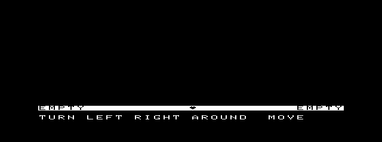
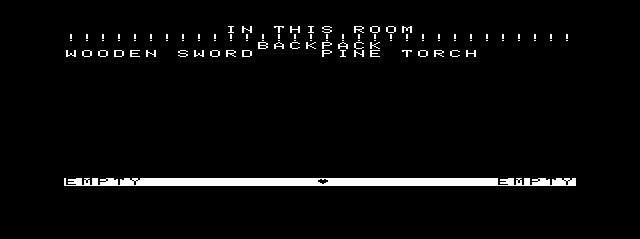
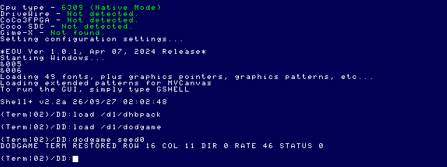

# Dungeons of Daggorath Gameplay Milestone 6

M6 activates bounded original-derived creature scheduling and movement in `dodgame`. It deliberately stops before combat. The implementation is in the current source tree; the original reference is the read-only checkout `/Volumes/SEDONA/Projects/daggorath-reference` at commit `a94326f00ebb16a106b540c58bc2ccf5f7b66dac`. The C/Linux lineage is used only as a readability cross-check, following [the crosswalk](../reference-projects/DAGGORATH_C_CROSSWALK.md) and [source-index precedence](../source-index/README.md).

## Scope and source trace

The original execution path is `COMCRE.ASM:CBIRTH` (allocate/init a CCB, choose its initial room, and queue `CMOVE`) → `CRETUR.ASM:CMOVE` → `CMOV10` object pickup → `CMOV20` same-cell attack gate → `CMOV50..62` axis-aligned player sight/path test → `CMOV70..78` randomized relative movement/backstep → `CWALK`/`STEPOK`/`CFIND` → `CMOV90/92/98` timer reschedule. `VIEWER.ASM` calls `CFIND` for creature visibility; `COMCRE.ASM:CFIND` rejects unused records through `P.CCUSE`. CCB field offsets are in `CD.ASM` (`P.CCTMV` +6, `P.CCTAT` +7, `P.CCOBJ` +8, `P.CCUSE` +12, type +13, direction +14, row +15, column +16). `PEXAM.ASM` remains the source for the existing read-only EXAMINE path.

M6 implements the movement-relevant portions of `CMOV10..19`, the pre-attack portion of `CMOV20`, line-of-sight checks in `CMOV50..62`, `MOVTAB` decisions from `CMOV70..78`, `CWALK` and the `STEPOK` boundary, and movement countdown rescheduling from `CMOV90/98`. The exact stop is before `CMOV20`'s attack/sound/shield/damage body. A same-cell creature sets a private `combatPending` scheduler flag and reloads its attack countdown; no attack, damage, creature damage, death, or combat sound occurs.

```text
CBIRTH / authentic initialized CCBs
                 │
                 ▼
       Q.TEN movement deadline
                 │
        inactive? ├── yes: ignore
                 ▼
    object pickup (CMOV10..19)
          │             │
          │ picked      └── none
          ▼                     │
      reschedule                ▼
                       same player cell?
                          │ yes └── M6 STOP (CMOV20)
                          │ no
                          ▼
              axis sight / randomized MOVTAB
                          ▼
                 STEPOK + CFIND
                          ▼
              update original CCB position
                          ▼
                    Q.TEN reschedule
```

## Port mapping and state

| Original 6809 source | C/Linux reference used as Rosetta Stone | NitrOS-9 implementation |
|---|---|---|
| `CRETUR.ASM:CMOVE`, `CMOV10..19` | `Creature::CMOVE` | `src/gameplay/creature.c:move_one`, `pickup` |
| `CMOV20` | `Creature::CMOVE` attack branch | `combatPending` gate and attack countdown only; attack body omitted |
| `CMOV50..62`, `CMOV70..78`, `MOVTAB` | `Creature::CMOVE`/`CWALK` | `see_player`, deterministic MOVTAB sequence, `walk` |
| `CWALK`, `STEPOK`, `COMCRE.ASM:CFIND` | `Creature::CWALK`, `Dungeon::STEPOK` | `walk`, `step_ok`, `occupied` |
| `COMCRE.ASM:CBIRTH`; `CD.ASM` CCB offsets | `Creature::CBIRTH` and expanded host records | existing 32×17-byte records in `Game.creatures`; no simplified creature records |
| `RANDOM.ASM:RANDOX` | `RNG::RANDOM` | existing `game_random`; tests retain the exact 24-bit state transition |
| `COMMON.ASM:CLK40`, `ROLTAB`, `Q.TEN` | C timer emulation (not normative) | drained 60 Hz VIRQ ticks, then 6-tick/100 ms simulation steps |
| `VIEWER.ASM:CFIND` pass | `Viewer::CMRDRW` | existing logical renderer; creature lookup now requires active `CCUSE` |

The additional `CreatureScheduler` stores only 32 movement countdowns, 32 attack countdowns/stop flags, and one 60 Hz phase byte. It is separate from `Game`, whose established 2,606-byte layout remains unchanged. The C lineage has expanded records, index links, host-width arithmetic and configurable timing options; those are not imported as authority. M6 uses the original 8-bit counter wrap (`0` means 256), original CCB array order and `CCUSE`, original three-byte RNG, and original movement table. `test/gameplay_creature.c` checks the concrete seeded transition `73 C7 5D → 72 73 C7`, movement from `(16,18)` to `(16,17)`, object ownership transfer, inactive-slot behavior, and the same-cell combat gate without damage.

## Timing and NitrOS-9 scheduling

`COMMON.ASM:CLK40` visits `JIFQUE` every jiffy; `ROLTAB` first rolls the jiffy at 6, then schedules `Q.TEN`. Therefore Q.TEN is 10 Hz (one unit per six 60 Hz video callbacks), not once per 60 callbacks. The first M6 test draft incorrectly asserted 60-frame cadence. With explicit approval, those new cadence assertions were corrected to 6 frames; production now accumulates six VIRQ ticks per movement deadline.

The existing heartbeat driver counts video callbacks on its already-installed VIRQ. Private GetStat `$95` atomically reads and clears the count. M6 drains it from the foreground process, advances simulation by elapsed callbacks, and returns to `F$Sleep`; it adds no interrupt service and performs no continuous busy wait. A new simulation epoch discards setup ticks before the run loop. Slow graphics redraw is no longer the simulation clock: elapsed video callbacks are collected while rendering/input handling is busy and consumed on the next loop. No arbitrary wall-clock timer was introduced.

The simulation does not advance while the process is genuinely asleep beyond elapsed VIRQ callbacks, and catches up elapsed callbacks after synchronous work. This preserves the periodic source cadence, though large single catch-up batches and scheduler preemption still merit measurement in a future profiling harness.

## Rendering, examination, and input

M6 does not add sprites or a second scene representation. Existing `VIEWER.ASM`-derived logical view generation consumes the same active CCB records moved by the scheduler. `game.c:creature` now requires the original in-use byte, so an inactive CCB cannot be rendered. Existing M5 EXAMINE also reads these records and remains read-only; there is no separately maintained AI model. The 256×192 logical screen and canonical 512×192, 2× horizontal presentation at `(64,4)` are unchanged.

The fidelity follow-up preserves the rendered dungeon image while editing a command. The accepted byte is uppercased/buffered, then only the 8-row status and 7-row command areas are expanded into the already-owned mapped GP buffer. This updates 15 of 192 rows (960 packed bytes versus 12,288 for a complete 512×192 one-bit buffer). It does **not** call `game_render` for ordinary command characters. The verified `PutBlk` request is still for the complete owned buffer; no partial-transfer command or unverified GFX API was introduced.

The live run began with the deterministic `seed0` initialization and the original dark starting room. After resident time, the EXAMINE view refreshed and displayed its creature-presence label. No guest CCB bytes were independently read in that live run, so the screenshot is an observed UI change, not proof of a cartridge-matched state transition. The bounded MCP snapshot set is below. It demonstrates the initial scene, initial EXAMINE, a later active scene, and Term restoration; it is not an exact original-cartridge pixel comparison.








The earlier `post_load_timeout` was produced by a 512K MAME process and is superseded by the verified 2 MB run below. It is an infrastructure mismatch, not an M6 failure. The current live evidence still does not establish every M6 acceptance gate.

## Live lifecycle results and limits

On a clean canonical `coco3h` start, the shell booted normally. The final disposable floppy was mounted on `flop2`; `/d1/dhbpack` and `/d1/dodgame` loaded, and `dodgame seed0` entered the 640×200 graphics screen. `EXAMINE` initially showed the deterministic room/object state; after resident time, the existing creature-presence label appeared in the EXAMINE view. `EXIT` returned to Term and printed exactly:

```text
DODGAME TERM RESTORED ROW 16 COL 11 DIR 0 RATE 46 STATUS 0
```

Then `date` printed `September 27, 2026`; `pwd` printed `/DD`; both returned to the Term prompt. These commands were typed directly and their output was observed in screenshots. They were not MCP `os9_run` status-marker responses.

A byte sent with the generic keyboard tool is not equivalent to the game's handled OS-9 interrupt. Prior M1 live work established the correct physical input as Shift-BREAK, which VTIO maps to ETX `$03`; the current `coco_type` MCP interface only posts natural-keyboard text and cannot generate that digital-key chord. Therefore M6 cancellation status 003 and its cleanup remain unverified in this session. The live M6 interval also had no FDC access counter or callback-jitter trace. Do not read screenshots or end counters as proof of those gates. No canonical disk image was written; only a disposable staging floppy was mounted.

## Heartbeat Audio/Visual Governor

The source couples the two phases directly. In original `COMMON.ASM:CLK30`, a zero `HEARTC` reloads `HEARTR`, toggles `P.PIIOB` with `BIT1`, and—when `HEARTF` enables the status flash—complements `HEARTS` and writes both heart glyphs with `TXTDPB` before leaving the same IRQ routine. `PLOOK.ASM:INIVUX` calls `HUPDAT`, increments `HEARTC` to force the initial flash, and enables the visual/audio flags. `HUPDAT.ASM` changes `HEARTR` without resetting the current `HEARTC`. The input task does not own a separate visual timer.

The native VIRQ callback remains the single governor. On an actual `$FF22` bit-1 output transition it toggles the driver's `phase` and increments `edgegen` in that callback. New private read-only GetStat `$96` returns callback fault in A, phase in B, and the 32-bit edge generation in Y:X under the same short interrupt-masked snapshot. The renderer only reads this state; it never advances a countdown. Gameplay records the generation used for each displayed status frame and samples again after `PutBlk`. If edges occurred during the transfer, it records the maximum generation/phase lag and schedules one refresh using the current phase—never replays missed heart frames.

The existing `$92` rate update still changes only the rate and preserves countdown; `$94` freezes countdown/phase, and `$93` resumes. `$96` does not mutate these values. Host tests cover register decode, read-only behavior, the 32-bit generation/phase pairing and callback fault reporting. During the 2 MB M6 run, edge/presented summaries were `814/814`, `89/89`, and `330/329`, each with maximum observed phase lag 1. The one-edge difference is consistent with a heartbeat edge becoming pending after the last displayed frame: the explicit `EXIT` path leaves the main loop before another presentation pass. This control-flow explanation is not a paired live trace and does not prove that no source deadline was missed. No callback-jitter trace or edge/tick correlation was captured.

The native heartbeat output and visible heart now observe the same VIRQ edge state. This establishes the source-equivalent phase relationship in the implementation; it does not prove the screen can be refreshed at every edge under a long GFX transfer, OS stall, or FDC HALT.

## Command Text Fidelity

Original source establishes input behavior, but an original cartridge timing measurement is unavailable in this repository session. `COMMON.ASM:CLK40` services keyboard `POLCAT` on the 60 Hz jiffy path (a 16.67 ms scan quantum at nominal video rate). `HUMAN.ASM:PLAYER` drains keyboard bytes and calls `HUMAN` for each; `HUMAN` sends a normal character to `OUTCHR`, appends it to `LINBUF`, then writes the cursor. `CD.ASM:I.BAR` is character `$1C`; `MISC.ASM:M$CURS` emits `I.BAR` followed by backspace, so the cursor is an underline over the insertion point. The port now draws that source-derived underline after ordinary characters and preserves it while rebuilding the command rows. Backspace erases it before editing; carriage return removes it before dispatch. `PLAYER` schedules one jiffy only after the input queue is empty (`PLAY99`). There is no source-defined typewriter delay between bytes already queued.

The former port loop imposed `F$Sleep(1)` after each consumed character and then called full-frame presentation. That could add one NitrOS-9 jiffy (16.67 ms) per character, independent of the host posting cadence. The corrected loop drains `SS.Ready`/`I$Read` bytes without sleeping between bytes that are already available, and requests their text update immediately. Once the queue is empty it returns to the existing one-tick cooperative sleep. A new host test feeds `MOVE\rEXIT\r` as guest-ready bytes and verifies eight per-character UI presents, no sleep while the queue is available, and only two full scene preparations (initial scene and command completion).

This is a source-faithful guest-side cadence rule, not an end-to-end millisecond claim. Host/MCP key injection, VTIO delivery, guest consumption, logical glyph rendering, and physical GFX transfer are separate stages. The repository now contains an exact reproducible original initialization fixture derived from the recovered cartridge build and MAME observation; it is not a retail ROM dump. The fixture metadata records MAME 0.289 `coco3h`, normal keyboard `GAME` entry, a `GAME50` opcode boundary followed by the next video frame, and physical RAM base `$70000`. `apps/daggorath/test_gameplay.py` compares all 1,024 maze bytes, 1,008 object bytes, and 544 CCB bytes against `game_init(..., 2)`; only post-maze `SECOND=2` among 0–255 matches the 544 creature bytes, and the fixture explicitly records that this value is inferred rather than sampled at `DGEN90`. This is an exact source/test reference, not a live CoCo process-memory comparison. The earlier `seed0` smoke run uses `SECOND=0`, so it is not the fixture's corresponding state. The acceptance follow-up below captures the actual clock-seeded default at `SECOND=2` and matches all three live tables.

## Presentation Timing: measured follow-up

The follow-up measures function boundaries in MAME emulated time using the exact linked module's map/listings. These are elapsed guest intervals, including intervening IRQ/OS work, not exclusive CPU-cycle counts or host wall-clock latency. Identical stack bus accesses within five microseconds are collapsed into one entry/return; raw heartbeat callbacks and output edges are never collapsed. [Per-frame evidence](assets/daggorath-gameplay-m6/acceptance/illuminated-frame-stages.json) retains six illuminated full redraws after `PULL LEFT TORCH` / `USE LEFT`.

| Stage | Measured illuminated sample | Boundary |
|---|---|---|
| Logical scene and message generation | 3,954.186–3,954.723 ms | `game_render` entry → return |
| Full 2× framebuffer packing | 186.530–187.623 ms | `screen_prepare` entry → return |
| Post-pack heartbeat snapshot, logical status/input work | 75.882–100.340 ms | Full packing return → `screen_prepare_ui` entry; this is a composite interval, not a separate glyph-only timer |
| UI-row packing | Approximately 85 ms | `screen_prepare_ui` entry → return |
| GFX2 presentation | 31.967–31.979 ms | `screen_flip` entry → return; includes its `PutBlk` write and wrapper |
| Full scene through completed presentation | 4,345.290–4,393.671 ms | `game_render` entry → corresponding `screen_flip` return |

Dark-scene generation in the first resident control took 419.118–423.780 ms. Ordinary character edits used the UI-only path; they did not invoke the full scene renderer. The measured illuminated scene, initial state and emulated-time clock are specified here; they are not an assertion that every view equals the older 4.8–4.9-second end-to-end observation. Logical scene generation dominates this sample. No rendering or production timing was changed during acceptance. The owned 512×192 presentation and original logical geometry remain unchanged.

## 2 MB / 512K Investigation

The earlier 512K observation was genuine: that MAME child had `-ramsize 512K`, even though `MCP/.env` specified `COCO_RAM=2M`. That process was stopped. The restarted MCP hosts were independently checked on macOS and had effective `COCO_RAM=2M`. MAME was then started through `coco3_mcp`; bridge status reported running PID `25448`, driver `coco3h`, and the expected `63EMU.DSK` in `flop1`.

Before M6 work resumed, the actual MAME process was inspected. Its full command line included:

```text
/Applications/Emulators/Ample.app/Contents/MacOS/mame64 coco3h -window -skip_gameinfo -natural -nomouse -mouse_device none -ext multi -ext:multi:slot1 [empty] -ext:multi:slot2 ssc -ext:multi:slot3 [empty] -ext:multi:slot4 scii -ext:multi:slot4:scii:meb rtime -ramsize 2M -rompath "/Users/magneto-optimus/Library/Application Support/Ample/roms" -autoboot_script /Volumes/SEDONA/Projects/CoCo3_MCP_Server_NOS9/MCP/scripts/bridge.lua -autoboot_delay 0 -snapshot_directory /Volumes/SEDONA/Projects/CoCo3_MCP_Server_NOS9/MCP/snapshots -state_directory /Volumes/SEDONA/Projects/CoCo3_MCP_Server_NOS9/MCP/states -statename %g -cfg_directory /Volumes/SEDONA/Projects/CoCo3_MCP_Server_NOS9/MCP/work/mame-cfg -flop1 /Volumes/SEDONA/Projects/CoCo3_MCP_Server_NOS9/media/63EMU.DSK -hard1 /Volumes/SEDONA/Projects/CoCo3_MCP_Server_NOS9/media/63SDC-MCP-DEV.VHD
```

This verifies `-ramsize 2M`, `coco3h`, MPI slot 2 `ssc`, slot 4 `scii` with SCII MEB `rtime`, `63EMU.DSK` as `flop1`, development VHD as `hard1`, and the MCP Lua bridge. The running config file selects RGB with `:screen_config=1`. On a fresh DOS-to-EOU boot in this session, the guest banner reported `Memory size 2048K` and `CPU type 6309 (Native Mode)`. Physical MAME RAM and the guest's reported 2048K therefore agree for this run. No VHD or floppy content was changed.

The initial `COCO 3 DOS V1.5 / OK` screen was Disk Extended Color BASIC ready, not a failed floppy attachment. Typing `DOS` entered the floppy-led NitrOS-9 boot and reached EOU Shell+. The banner's `DriveWire - Not detected`, `CoCo SDC - Not found`, and `Gime-X - Not found` are optional-device discovery messages; they do not contradict the verified MAME `-hard1` VHD attachment. The guest's option-3/hardware-clock startup configuration remains as documented in the canonical boot report.

`nos9_ready_v2` was restored successfully five times in the verified 2 MB session. Each restore reported `loadScheduled=true`, `loadCompleted=true`, and `shellVerified=true`; the final observed `postLoadEpoch` was 5. No replacement `nos9_ready_v3` was needed. The earlier timeout occurred in the mismatched 512K process. This does not establish that every possible MAME build/configuration can load this state.

## EXIT boundary investigation and completed lifecycle acceptance

**The earlier timeout did not demonstrate an EXIT/Term or marker defect.** `os9_run` retains an exclusive operation lease; a concurrent public `coco_type("EXIT")` is rejected as busy. In the failed automated attempt, EXIT was not delivered during the command. After timeout released the lease, manual EXIT could reach the game and return guest status 000, but the abandoned operation no longer performed its marker handshake. Do not classify that later synchronization state as a guest exit failure.

The corrected private harness appends [observer/input instrumentation](assets/daggorath-gameplay-m6/acceptance/observer.lua) to a **byte-identical complete production bridge**, SHA-256 `2f0942e478e5115fb11f5bd1becb727b40edd0f2f657e0867da715bd7993a789`. It retains keyboard, snapshots, state events and graphics-aware operation support. The [private host](assets/daggorath-gameplay-m6/acceptance/private-host.mjs) imports unchanged production `MCP/dist` controller/bridge/tool handlers; its HTTP interface is only a private acceptance wrapper, not a new MCP API. It uses byte-identical copies of the canonical development VHD, boot floppy and `nos9_ready_v2`, plus a disposable artifact floppy. The stock VHD is never attached. These handler responses are distinguished from final checks through the connected `coco3_mcp` below.

The [input harness](assets/daggorath-gameplay-m6/acceptance/input-harness.py) sends characters only after observing the real `game_input` loop, `dirty=0`, no error, the expected input buffer, `inputEmpty=1`, and an empty/non-posting natural-keyboard queue. It observes all four `EXIT` bytes in the guest buffer **before** sending Enter. This is state polling, not a fixed sleep. Digital input is stimulated inside the private MAME helper, so no competing public mutating tool is attempted while `os9_run` owns the lease. `coco_snapshot` remains available.

### Traced normal EXIT

The first fully instrumented normal run returned `completed=true`, `status=0`, `statusText="000"`, `shellReady=true`, `consoleReturned=true`, `timedOut=false`, `executionState="COMPLETE"`, in **30,685 ms**, with marker `MCPDONEe66c50db09eb771e3df5f483b76035f6`. Its ordered MAME-time observations were:

| Boundary | Emulated seconds | Evidence |
|---|---:|---|
| EXIT bytes accepted | 201.491298 | Guest buffer exactly `EXIT`, length 4, ready input loop |
| Enter posted | 201.524675 | Private keyboard event |
| Loop terminated / heartbeat close entered | 202.784661 | Key 13, buffer `EXIT`, error 0 |
| Heartbeat close returned | 202.796839 | Status 0; approximately 12.179 ms cleanup |
| Graphics/window close entered | 202.796868 | `screen_close` entry |
| Graphics/window close returned | 202.821719 | Status 0; approximately 24.851 ms cleanup |
| Main returned | 203.095348 | Return status 0 |
| Fresh Term prompt / separate marker issued | 203.160114 | Production `os9_run` sends `echo MCPDONE... %*` only after its fresh-prompt predicate |
| Standalone marker visible with idle console | 208.717269 | Physical 80×25 decoder observes `MCPDONE... 000` |
| Final prompt accepted / operation released | 208.733957 | `finish_run`: released, not invalidated |
| Host operation completed | 30,685 ms host elapsed | Structured `COMPLETE` result |

Term selection occurs inside `screen_close`; the ensuing supported console read and successful shell marker prove the operational return. Shell input ownership was not separately probed through private SCF internals: it is demonstrated by the newly executed marker and strict commands. Gameplay M6 does not start an SSC/dodaudio child; its audio teardown is the native heartbeat driver close, not an unobserved separate service phase.

The resident wider-watch repeat returned 000 in **39,700 ms**. The illuminated run completed 000 in **76,065 ms**, below the unchanged 120,000 ms execution limit. The exact fixture-matched default-clock run completed 000 in **39,145 ms**. These include initialization, deliberate resident observation, input and the marker exchange; they are not teardown-only durations. [Exact structured results](assets/daggorath-gameplay-m6/acceptance/execution-results.json) and [boundary evidence](assets/daggorath-gameplay-m6/acceptance/boundary-evidence.json) are retained.

### Real handled cancellation

The helper presses actual MAME **SHIFT**, presses **BREAK** two video frames later, and releases both after eight frames. It does not post raw `$03`. Provenance: EOU/upstream VTIO `ChTable` and `defs/scf.d:C$INTR`, together with the established physical-key trial in [Gameplay M1](DAGGORATH_GAMEPLAY_M1.md). The app's `F$Icpt` handler records signal 3 and the normal loop reaches the shared cleanup path.

The final wide-watch run returned `completed=true`, `status=3`, `statusText="003"`, `shellReady=true`, `consoleReturned=true`, `timedOut=false`, `executionState="COMPLETE"`, in **28,828 ms**, marker `MCPDONE87456dfc0b30adcbc33502c5fa9a8c39`. VIRQ removal, native audio release, graphics close and Term return completed. There were **zero observed heartbeat callbacks after removal**, including both subsequent strict `date` and `pwd` exchanges; each returned 000. An earlier independently instrumented physical-key run also returned 003 in 29,445 ms. Runs were repeated without a state restore between normal completion, cancellation and the illuminated run, demonstrating reuse without stale graphics/audio/VIRQ ownership.

[Illuminated measured view](assets/daggorath-gameplay-m6/acceptance/lit-measured.png) and [Term after physical cancellation and shell checks](assets/daggorath-gameplay-m6/acceptance/term-verified.png) are the new curated screenshots. No production code or timeout was changed to obtain these results.

## Exact live initial-state comparison

The [comparison harness](assets/daggorath-gameplay-m6/acceptance/comparison-harness.py) launches unmodified `dodgame` without `seed0`, after observing the existing guest clock naturally approach the chosen second. It does not set time, patch memory or add a seed option. At `game_init` entry the real validated clock value was **144 video ticks / SECOND=2**; a read-only capture at its exact linked return obtained all 2,606 `Game` bytes before creature scheduling began.

The [capture](assets/daggorath-gameplay-m6/acceptance/initial-state.bin) agrees with `apps/daggorath/test/fixtures/gameplay-original.json` for **every maze byte (1,024), OCB byte (1,008), and CCB byte (544)**. [Comparison metadata](assets/daggorath-gameplay-m6/acceptance/initial-comparison.json) records individual hashes, module identity and original ROM identity. This includes the actual 32×17-byte creature records, not just a presence label. The original fixture is the reproducible recovered-source cartridge capture described earlier; its SECOND=2 is inferred from exact bytes, whereas the port's parameter is directly observed. This proves the specified corresponding initialized tables; it does not claim complete emulated-machine equivalence or an original-versus-port trajectory match after arbitrary elapsed time.

## Live Q.TEN, heartbeat and runtime disk measurements

[Measured summaries](assets/daggorath-gameplay-m6/acceptance/timing-summary.json) use one common MAME-time clock, the actual native driver callback acknowledgement, `$FF22` bit-1 transitions, the linked scheduler `framePhase` reset inside `game_creature_advance`, and `presentedGeneration` stores. Symbol offsets come from the exact reproducible [module map](assets/daggorath-gameplay-m6/acceptance/observer-map.json), not guessed process addresses. The [analysis script](assets/daggorath-gameplay-m6/acceptance/analyze.py) preserves the counting method.

| Resident sample | VIRQ callbacks | Native edges | Callback gap min–max | Consumed simulation ticks / Q.TEN boundaries | Faults |
|---|---:|---:|---|---|---:|
| Dark `seed0`, broad disk watch | 820 | 18 | 16.561–16.828 ms | 752 / 125, remainder 2 | 0 |
| Fixture-matched default clock | 897 | 20 | 16.581–16.807 ms | 822 / 137 | 0 |
| Illuminated `seed0`, narrow WD watch | 2,915 | 64 | 16.602–16.760 ms | 2,567 / 427, remainder 5 | 0 |
| Final Shift-BREAK, broad disk watch | 148 | 4 | 16.662–16.714 ms | 90 / 15 | 0 |

`COMMON.ASM:CLK40/ROLTAB` defines Q.TEN every **six** video ticks. In the trace, each foreground scheduler reset consumes six drained ticks, with exact count/remainder agreement. The dark run's largest drain was 70 ticks; the illuminated run's largest was 388 ticks. Q.TEN *service* intervals ranged from approximately 2.423 ms during catch-up to **1,168.840 ms dark / 5,220.368 ms illuminated**. Therefore live foreground creature updates are **not uniformly 100 ms apart**. Tick accounting is preserved, but expensive drawing delays foreground service. This is the measured retained performance limitation; it is not hidden by changing scheduling or timeout.

Every observed native edge occurred on precisely the callback whose pre-decrement `remaining` was 1. In the 820-callback control these are offsets `0,46,92,...,782`; no expected edge or full video callback interval was missing. This establishes zero missed native heartbeat countdown deadlines **in the sampled resident intervals**, not a universal real-hardware guarantee. The driver reported zero faults.

Presentation is separate from audio deadlines. In the traced cancellation sample, the fourth edge occurred at 429.550782 s; the final presentation completed at 429.703368 s with generation 3, and cleanup began immediately afterward. All four physical edges were generated on schedule. This is a legitimate pending refresh at cancellation, with measured presentation lag one, rather than a missing audio edge. Other traced normal exits caught up completely. The older unpaired `330/329` report cannot be retroactively assigned an exact cause; these new paired measurements establish that this one-generation condition can occur without a missed heartbeat deadline. Do not call the UI zero-drift: it can lag one edge during rendering or exit.

### Disk activity and RTC distinction

The broad read/write watch covers `$FF40..$FF5A` plus `$FF74..$FF76`, enabled before heartbeat activation and retained through the driver's successful removal. Disk-specific addresses are the control latch `$FF40`, WD `$FF48..$FF4B`, SCII alternate `$FF58..$FF5A`, and normal `$FF74..$FF76`. Source: upstream `level1/modules/rb1773.asm` (`CtrlReg`, `WD_*`, `RW.Dat`, `RW.Ctrl`, `DPort`) and the verified SCII topology. **Actual accesses to those FDC/SCII disk registers were zero** in both broad-watch normal runs and the final cancellation interval. Native callback progress continues while the watch is active.

The broad cancellation watch also recorded **26 RTC bus accesses**, 13 writes to `$FF51` and 13 reads from `$FF50`, during the normal Clock2 update. These are **not disk I/O**. EOU `/dd/SOURCECODE/ASM/NITROS9/CLOCKS/clock2_messemu.asm` (`RTC.Base`, `GetTime/GetVal`) and upstream `level1/coco1/modules/clock2_messemu.asm` identify this index/data clock path. [Raw watched events](assets/daggorath-gameplay-m6/acceptance/disk-watch-events.json) are retained, including all RTC accesses; nothing was deleted to force a zero count. No 187 or missed heartbeat interval accompanied them.

No independent `rb1773` function-entry counter was installed, so this proves zero hardware disk/control accesses, not zero calls to a no-op GetStat/Term dispatch. The known floppy-I/O/heartbeat limitation is unchanged. All module loading occurred before heartbeat activation. No SSC effects or new gameplay were added.

### Reproducing the private acceptance setup

Use byte-identical media/state copies in a temporary directory and a freshly built disposable `flop2` containing `dhbpack` and `dodgame`. Preserve the **full** production bridge prefix and append the observer; its saved offsets apply only to the exact CRC/SHA module above. The retained scripts use `/private/tmp/m6-boundary` and HTTP port 5996 / bridge port 18806; prepare those paths or consistently adapt the private paths. Do not run the private and canonical MAME instances simultaneously.

Start through the private host's unchanged `coco_start` handler, attach the artifact via **`coco_mount_flop`**, then restore `nos9_ready_v2` and load `/d1/dhbpack` and `/d1/dodgame` separately. Require 000 for both loads before arming gameplay observations. An excluded setup attempt incorrectly addressed a nonexistent `coco_mount_disk` handler and tried loading before attachment; subsequent preload retries stalled before gameplay. A clean restart with attachment preceding the first restore loaded both modules successfully (10,485 / 14,543 ms). No gameplay result is inferred from those failed setup attempts, and no production change was made to accommodate them.

Run `input-harness.py resident`, `input-harness.py cancel`, `input-harness.py lit`, or `comparison-harness.py resident` as appropriate. Each `os9_run` retains the existing 120,000 ms deadline. Generated logs, runtime copies and private snapshots remain outside Git; only compact evidence/scripts and the two screenshots above are curated here.

## Memory and artifact

The current reproducible `dodgame` is 27,819 bytes, CRC `$99CECD (Good)`, ToolShed data size 10,668 bytes, with a 1,536-byte stack reservation. Two independent builds were byte-identical, SHA-256 `3f4391f34c5b7b6a4b560bb637a7a12493a5d421fb359cb62b41fe98852a251f`. ToolShed reports module `dodgame`, type/language `$11/$81`, edition 1, read-only/re-entrant, entry `$000D`. The native `DHeartbeat` driver is 701 bytes, CRC `$EF87D2 (Good)`; descriptor `dhb` is 39 bytes, CRC `$BF478C (Good)`.

The earlier smoke-test floppy combined `dhbpack` and `dodgame` with SHA-256 `add15273e0c20f402afe2d399e71f1ea62a6a8d6b5e11ad8509ddde16787b8ad`. The acceptance follow-up used a fresh disposable floppy, SHA-256 `8509d1f57dbf49a0fdd1cd3aee3aea8b08fb9c3deb69cb7f9b9d5b687420ae0c`; final ToolShed exports matched both fresh reproducible module byte streams exactly. Canonical EOU VHD and stock media were not used for installation. The owned 12,288-byte mapped graphics buffer and canonical screen dimensions are unchanged.

Exact build command is recorded by `apps/daggorath/build_gameplay.py`; it uses CMOC 0.1.90, lwasm/lwlink 4.22, OS-9 `-O0`, and `--add-os9-stack-space=1536`. Reproduce with:

```sh
python3 apps/daggorath/build_gameplay.py --out /tmp/dodgame-m6-a
python3 apps/daggorath/build_gameplay.py --out /tmp/dodgame-m6-b
```

## Final validation and remaining limits

- Daggorath: **18 scripts / 237 checks**, all passing from the beginning after the final live acceptance. Includes Gameplay M1–M6, all four existing gameplay lifecycle cases, Wizard, rendering/input/status, and Audio M1/M2/M3 regressions.
- MCP: **115/115**, no failures/skips. `npm run build` passed. The initial sandbox test invocation was blocked by tsx's local IPC pipe; the complete suite passed with that required local IPC permitted.
- Fresh independent builds were byte-identical for `dodgame`, `dodwiz`, `DHeartbeat`, `dhb`, `dodaudio`, and `dodsnd`; ToolShed CRC checks were Good. `dodgame`: 27,819 bytes, CRC `99CECD`; `dodwiz`: 20,087 bytes, CRC `F1BC32`; `DHeartbeat`: 701 bytes, `EF87D2`; `dhb`: 39 bytes, `BF478C`.
- `git diff --check` and local documentation-link checks passed after this report update.
- [Canonical hashes/permissions](assets/daggorath-gameplay-m6/acceptance/media-integrity.json) remain:

  | Media | SHA-256 | Mode |
  |---|---|---|
  | `63SDC.VHD` | `db2f0f444073d3b88a3610a63ec9f7d2e2dd4299347181faa6b2b2aa9637de2c` | `0444` |
  | `63SDC-MCP-DEV.VHD` | `4c6bdc0cd2f68aa57a9c75f75f15fe429f30926aa522917dd8d14aa1b9ae622e` | `0644` |
  | `63EMU.DSK` | `9a51adb8656b9f003c7f822352c291487362f1b4c43aac1a16672d5d2bcb4c40` | `0664` |

`nos9_ready_v2` remains byte-identical, SHA-256 `a0f4ee094db471c596b9ecb9826922f80d982d2571fe7e72672a255ebca2effa`. No replacement state was created. The private MAME/host were stopped cleanly. The connected canonical `coco3_mcp` then started PID 41838 with `-ramsize 2M`, restored v2 (`loadCompleted=true`, `shellVerified=true`, 6,194 ms), and strict `date` / `pwd` returned 000 in 6,452 / 7,352 ms. It is left at the healthy canonical Term shell.

The requested EXIT, real cancellation, initialized creature-state comparison, live six-tick accounting, sampled native deadlines, hardware disk watch and separate redraw-stage observations are now verified. Limits remain explicit: no combat/M7, no arbitrary original-versus-port long trajectory equivalence, no proof of uniformly timed foreground creature updates during heavy rendering, no universal zero-lag UI guarantee, and no independent count of every `rb1773` dispatch. No production MCP/gameplay code was changed during this acceptance follow-up. No commit was made.
