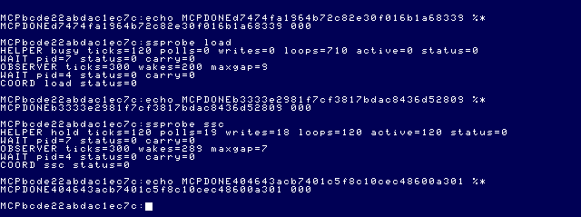
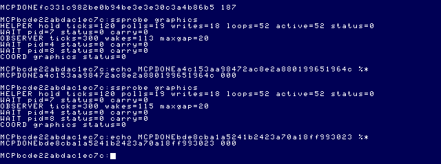
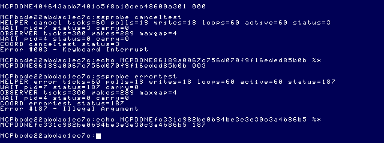

# Bounded NitrOS-9 Speech/Sound Pak probe

Date: 2026-09-26. **Result: autonomous SSC synthesis and cooperative guest
multitasking work in installed MAME 0.289 / Ample.** This is a disposable hardware
probe, not a Daggorath audio backend. No production Daggorath/MCP source, canonical
media or external repository was changed. No interrupt handler was installed.

## 1. Decision and evidence boundary

The helper sends 18 bytes, then sleeps while the AY sustains a tone. Actual MAME
PCM contains approximately **881 Hz** sound for **2.04 seconds**, repeated twice.
The independent observer's largest gaps are **8 and 7 ticks**, versus **124 ticks**
for `SS.Tone`. Signal-3 cancellation and injected error 187 both silence the chip;
two concurrent unchanged Wizard runs complete with status 000. Strict `date` and
`pwd` work afterward. All these are measured results, not inferred from writes.

SSC is suitable for the **first enhanced/offloaded Daggorath backend prototype**,
subject to ownership, calibrated pitch and reset-transient limitations below.
This does not establish cartridge fidelity or subjective speaker quality on a
physical CoCo. The evidence is captured emulator PCM, AY state, guest observers,
MCP completion/status and screenshots. No claim of listening through the user's
speakers is made.

Read alongside [audio research](DAGGORATH_AUDIO_RESEARCH.md),
[backend matrix](DAGGORATH_AUDIO_BACKEND_MATRIX.md),
[staging protocol](../architecture/NITROS9_ARTIFACT_STAGING.md), and
[source precedence](../source-index/README.md).

## 2. Verified hardware/API

`MCP/Documents/` and `DOCS_INDEX.md` are unavailable in this checkout. Primary
manufacturer documentation and identified source supply these facts:

- [Tandy Speech/Sound Cartridge Owner's Manual](https://tlindner.macmess.org/wp-content/uploads/2006/09/sscmanual.pdf),
  pp10–12, 16–25 and Appendix B.
- [MAME mame0289 SSC implementation](https://github.com/mamedev/mame/blob/mame0289/src/devices/bus/coco/coco_ssc.cpp):
  `device_add_mconfig`, `device_start`, `ff7d_read`, `ff7d_write`, controller port
  handlers and the sound-activity filter.
- EOU `/dd/SOURCECODE/ASM/NITROS9/SCF/sspak.asm`, `SpkOut`, `SWrite`, `BusyWait`,
  `SSWait`; inspected through a prior read-only ToolShed export.
- External official upstream `/Volumes/SEDONA/Projects/nitros9-reference`,
  commit `f470fa52eb172b59b22c1b722074998cb42de9b1`,
  `level1/coco1/modules/sspak.asm`, corresponding labels. Historical Bruce Isted
  speech-driver provenance; not proof of an installed EOU binary match.

| Interface | Verified behavior / use here |
|---|---|
| MPI | Existing `-ext multi -ext:multi:slot2 ssc`. MAME installs global `$FF7D–$FF7E` handlers; this probe never changes `$FF7F`, SCS/CTS selection or the slot-4 disk controller |
| `$FF7D` | Write 1 then 0 to reset/reinitialize the entire Pak; manual pp10,25. Used at acquisition and cleanup |
| `$FF7E` write | Controller command/data byte, **not** direct AY memory access |
| `$FF7E` read bit 7 | BUSY*, active low; wait for high before every byte or data may be lost |
| Bits 6/5 | Speech/sound activity, active low. Manual warns delayed validity after command submission; MAME sound activity is filtered audio activity, not a queue-empty acknowledgement |
| `$AF` | Direct AY register-number/value stream; `$FF` terminates it, manual pp24–25. Register 0 is explicitly in the table and example despite the prose's inconsistent “1–13” wording |
| AY synthesis | Three tone channels, noise generator/mixer and shared envelope period/shape; registers 0–13. This experiment uses only channel A, fixed amplitude and no noise/envelope |
| Controller buffering | Eight speech and eight sound buffers, 64 bytes each, with firmware load/execute commands (p12). Not exercised; autonomous AY tone is sufficient for this milestone |
| PIA routing | `SpkOut` clears `$FF01` bit 3, sets `$FF03` bit 3 and `$FF23` bit 3. Save these bits and restore them, preserving other current bits |
| Interrupts | MAME uses internal TMS7040/controller and speech-chip signaling. This polled host protocol requires no guest IRQ/FIRQ installation. No claim that a general OS-9 interrupt-sharing driver was validated |
| Stop | Reset silences all SSC channels and speech; valid only with exclusive Pak ownership. This is deliberately broader than a production channel-specific stop |

**Do not route this binary protocol through historical SSPak SCF `SWrite`:** it
strips bit 7 and filters control bytes. Its unbounded polling is also not reused.
The probe borrows only the identified PIA routing pattern. Shared joystick/audio
mux ownership remains a separate production requirement.

### Exact test packet

```text
AF 07 3F 08 00 09 00 0A 00 00 FE 01 00 07 3E 08 0C FF
```

Disable tone/noise outputs; zero A/B/C amplitudes; set channel-A period 254;
enable tone A only; set amplitude 12; terminate. Every byte is preceded by a
busy check and followed by a one-tick yielding sleep. A busy wait has at most 12
attempts, each yielding; it returns `E$NotRdy` (246) if the controller never
accepts data. The inter-byte sleep is conservative probe pacing, not an asserted
manufacturer minimum. Command upload is bounded; it is not audio-rate synthesis.

### Important MAME clock finding

Static `-listdevices` had reported AY near 1.789 MHz. Read-only inspection of
MAME's saved `m_unscaled_clock` fields found:

```text
0000.015,223,162 AY=1789772 CPU=894886
0000.449,115,149 AY=3579544 CPU=1789772
```

These are observations from a separate isolated clock check, not another sound
benchmark. MAME's SSC config derives its AY clock from its parent; the running
fast configuration is **3,579,544 Hz**. Period 254 therefore predicts
`3579544 / (16 * 254) = 880.7933 Hz`, agreeing with captured ~881 Hz.
The initial 440 Hz prediction from the static listing was wrong.

Source: MAME SSC `DERIVED_CLOCK(2,1)`;
[AY generator](https://github.com/mamedev/mame/blob/mame0289/src/devices/sound/ay8910.cpp)
`ay_set_clock` and tone counter/output;
[device clock saving/propagation](https://github.com/mamedev/mame/blob/mame0289/src/emu/device.cpp).
Lua has no verified `device.clock` property here; that attempted read yielded nil.
The successful diagnostic used exposed saved `0/m_unscaled_clock` items.
Do not assume a fixed 1.789 MHz note table or infer real-cartridge behavior from
this dynamic-clock emulator result. Calibrate/verify the physical board separately.

## 3. Probe and process architecture

Source: [probes/speech-sound](../../probes/speech-sound/README.md), principally
[ssprobe.c](../../probes/speech-sound/ssprobe.c). CMOC/6809 code runs on the HD6309
target without native-only optimization. It links the existing, **unchanged**
`apps/daggorath/src/os9.c` adapters for `F$Fork`, `F$Wait`, `F$Sleep`, `F$Icpt`,
`F$Send`, clock reads and the `SS.Tone` control experiment.

```text
Shell -> coordinator
          +-> independent observer: sleep/read clock for 300 ticks
          +-> helper: acquire -> upload -> sleep 120 ticks -> reset/restore -> exit
          +-> optional unchanged dodwiz graphics process
        <- F$Wait: each PID/status, then coordinator exit
```

The helper checks handled signals, yields through ordinary `F$Sleep`, and performs
**no AY writes during sustain**. It samples activity but does not manufacture the
waveform. No new `ORCC`/IRQ masking, IRQ/FIRQ hook, timer service or audio-rate loop
exists. `busy` is an explicit ordinary CPU-load control; `tone` is the previously
researched blocking `SS.Tone` control, neither is the SSC implementation.

The helper restores only the PIA routing bits it acquired and resets the Pak on
normal completion, handled signal and injected error. It refuses observed existing
busy/speech/sound activity before ownership. This check is **not an interprocess
lock** and does not detect every queued future effect. This bounded test has one
SSC client; it must not run alongside another SSC or joystick client.

CMOC 0.1.90 does not implement C `volatile`; this build intentionally uses `-O0`.
Generated assembly was inspected: every `$FF7E` poll is an actual `LDB`, writes
are actual `STB`, and both reset writes remain present. Changing compiler/options
requires another audit. This is research-level direct I/O, not a portable SCF
sound driver.

## 4. Reproducible build and disposable boot

```sh
python3 probes/speech-sound/build.py
# Equivalent tested compiler command (output/intermediate path may vary):
cmoc --os9 -O0 --intermediate --intdir=MCP/work/audio-ssc/build \
  --add-os9-stack-space=1536 -Iapps/daggorath/src \
  -o MCP/work/audio-ssc/build/ssprobe \
  probes/speech-sound/ssprobe.c apps/daggorath/src/os9.c \
  probes/speech-sound/module.asm

/Users/magneto-optimus/Documents/Coding/toolshed-2.2/build/unix/os9/os9 \
  ident MCP/work/audio-ssc/build/ssprobe
```

CMOC **0.1.90**, lwasm/lwlink **4.22**, ToolShed **2.2**.
[Exact build command, versions and source/artifact hashes](assets/daggorath-ssc-probe/build.json).
A second independent output directory produced a byte-identical module.

```text
Module: ssprobe      Size: $1515 / 5397
CRC: $22E7E2 (Good)  Header parity: $3A
Edition: 1          Ty/La: $11 (program / 6809 object)
At/Rv: $81          Exec offset: $000D
Data: $062E / 1582  Reentrant, read-only module
```

Stage with the existing `MCP/dist/os9-stage-cli.js`, pointing `--artifact` at the
absolute module path, `--output-root` at ignored `MCP/work/audio-ssc/staged`, and
`--os9` at the ToolShed executable above. The fresh resulting `artifact.dsk` also
received an unchanged, previously identified `dodwiz` via ToolShed **before any
mount**. `os9 attr <disk>,dodwiz -e -pe` set execute permissions; the image was
made host read-only. Wizard size 19809, CRC FD6C50; no production rebuild/edit was
needed. The final image hash is in [verification.json](assets/daggorath-ssc-probe/verification.json).
The original staging result's hash preceded adding Wizard and must not be used
as the final image identity.

Cold boot used new private copies of `63EMU.DSK` and `63SDC-MCP-DEV.VHD` under
ignored `MCP/work/audio-ssc/`; stock `63SDC.VHD` was never attached. Canonical
hardware, RGB and bridge were preserved. Mount the artifact as `flop2` (`/d1`),
enter BASIC `DOS`, wait for actual EOU shell, then separately:

```text
load /d1/ssprobe
load /d1/dodwiz
```

The isolated MCP process used copied current `dist` and bridge files, a private
bridge port and state directory. Only that **copy** of the bridge had a read-only
frame observer appended. MAME's wrapper appended `-wavwrite <private>/session.wav`
to the unchanged canonical launch arguments. It captured AY registers 0,1,7–10
and physical EOU clock bytes; no debugger memory writes were used.

## 5. Timing epoch and observer results

A new native-prompt `ssc_ready` checkpoint was made and immediately restored once
to establish the existing MCP shell handshake. No further restores occurred
throughout the sound/graphics benchmarks. **Immediate restore alone was still
insufficient:** the first minute rollover corrected the guest clock by 121 ticks,
contaminating the first CPU-load result (125-tick gap). The passive MAME trace
identified this at emulated 163.642567 s. That run is retained in raw MCP results
but **excluded from scheduling conclusions**. CPU load was rerun after correction.
No subsequent clock jump appeared; the clock-only diagnostic launches happened
after all sound measurements and are not part of this series.

The observer uses the same EOU-specific `F$CpyMem`/clock adapter as the prior
experiment: physical system clock `$28..$2E`, descending tick converted to elapsed
ticks modulo 3600. This is not advertised as a general monotonic API. For future
experiments synchronize across a rollover before benchmarking, or use a separately
verified monotonic measurement mechanism. Do not suppress clock-jump guards.

| Test | Observer ticks / wakes | Largest gap | Helper sustain / result |
|---|---|---:|---|
| Previous investigation reference | — | idle 4, CPU 8, SS.Tone 122 | Different session; contextual baseline |
| Fresh sleeping baseline | 300 / 281 | **5** | 120 ticks, 000 |
| CPU load, synchronized rerun | 300 / 200 | **9** | 120 ticks, 000 |
| SS.Tone | 300 / 171 | **124** | 120 ticks, 000 |
| SSC normal | 300 / 289 | **8** | 120 ticks, 120 yielding iterations, 000 |
| SSC repeat | 300 / 289 | **7** | 120 ticks, 120 yielding iterations, 000 |
| SSC handled cancellation | 300 / 289 | **4** | 60 ticks, 003 |
| SSC injected error | 300 / 289 | **4** | 60 ticks, 187 |
| SSC + Wizard, first | 300 / 113 | **20** | 120 ticks, 52 yielding iterations; all children 000 |
| SSC + Wizard, repeated | 300 / 115 | **20** | 120 ticks, 52 yielding iterations; all children 000 |

Text-mode SSC upload reported **19 ready polls, 18 bytes**. All 120 sustain
activity samples were asserted; concurrent graphics had 52/52 asserted samples.
A scheduled helper can miss an exact stop deadline: PCM lasted ~2.08 s with
Wizard versus ~2.04 s without. The AY continues independently while preempted;
there were no 10-ms silent gaps inside the measured tone intervals.

The figures measure **peer wakeup latency**, not CPU utilization percentages.
No CPU occupancy profiler was installed. Source/assembly establishes bounded
command work and sleeping sustain; the observer and concurrent graphics establish
progress. The 20-tick graphics gap is the combined workload, not a claim that SSC
alone causes it. Wizard completed normally twice; this task did not perform a
frame-by-frame Wizard cadence benchmark.



## 6. Captured audio: synthesis, duration and cleanup

MAME wrote four-channel 48 kHz PCM16. Zero-based **channel 1** correlates with the
SSC AY amplitude intervals. Channel 0 includes unrelated CoCo output/DC; simply
measuring whole-file nonzero samples would be misleading. Channel 1's tone has
strong odd harmonics, consistent with the programmed square-wave tone. The
read-only AY trace confirms period 254, mixer 62 and amplitudes `[12,0,0]`.

Analysis: [analyze_audio.py](../../probes/speech-sound/analyze_audio.py), NumPy,
10-ms AC-RMS blocks >100 PCM units, Hann-window FFT on interior sustain samples.
The longest-tone FFT bins are ~0.54 Hz wide; reported ~880.98 Hz is consistent
with predicted 880.793 Hz, not a claim of sub-bin frequency accuracy.

| Event order | Captured tone duration | Dominant frequency | AC RMS | Cleanup |
|---|---:|---:|---:|---|
| Normal | 2.04 s | ~880.98 Hz | ~2969 | silence |
| Repeat | 2.04 s | ~880.98 Hz | ~2969 | silence |
| Cancel | 1.03 s | ~880.74 Hz | ~2969 | silence |
| Injected error | 1.03 s | ~880.72 Hz | ~2971 | silence |
| Wizard concurrent, twice | 2.08 s each | ~880.85/880.86 Hz | ~2969 | silence |

All six cleanup windows (0.1–0.5 s after each tone) have **exactly zero SSC PCM**.
AY amplitude also returns to zero. Register-held durations are 2.03595 s normal,
1.03467 s cancel/error, and 2.06933 s with graphics, agreeing with the 10-ms audio
bins. The WAV timeline is continuous while emulated time rewound at the initial
restore; comparison uses frame order/offset, not raw absolute timestamps alone.

There is a short initialization/reset transient before each sustained tone,
visible in the 10-ms detector. Do not describe this prototype as click-free.
Future production acquisition/muting should avoid repeated full resets where a
verified channel-specific protocol suffices. Stop tails settle before the tested
silence window; this is not an instantaneous analog-silence claim.

[Small diagnostic FLAC](assets/daggorath-ssc-probe/ssc-normal.flac): lossless,
48 kHz mono extraction of native SSC channel 1, including initialization transient,
normal tone and cleanup. No normalization or synthesized substitute was used.
[Audio measurements](assets/daggorath-ssc-probe/audio-metrics.json) retain all six
segments and reset transients. The full 399.5-second WAV remains ignored locally;
its hash is retained in verification.json. Host microphone/speaker routing was
not measured.

## 7. Lifecycle and exact MCP results

[Complete structured MCP responses](assets/daggorath-ssc-probe/mcp-results.json)
include unique markers, timings, failed-clock baseline and restore handshake.
Normal/repeated runs returned `completed:true`, `status:0`, `statusText:"000"`,
`timedOut:false`, `shellReady:true`. Cancellation returned 3/`"003"` and deliberate
error 187/`"187"` as successful completed MCP operations, not transport failures.
The coordinator's `F$Wait` reports identify the hardware helper's status separately
from observer and Wizard. Here 187 is intentionally injected after one second;
it is not the earlier unexplained Wizard clock error.

Representative exact final concurrent result:

```json
{
  "command": "ssprobe graphics",
  "completed": true,
  "commandCompleted": true,
  "status": 0,
  "statusText": "000",
  "timedOut": false,
  "shellReady": true,
  "outcome": "completed",
  "phase": "complete",
  "elapsedMs": 24008,
  "outputComplete": false,
  "allowGraphics": true,
  "displayDepartures": 1,
  "consoleReturned": true,
  "executionState": "COMPLETE",
  "marker": "MCPDONEbde8cba1a5241b2423a70a18ff993023",
  "commandPromptMs": 18403
}
```

MCP snapshots remained usable during graphics. The captured early fade frame below
is the unchanged Wizard's graphics, not an audio-generated image. Final prompt,
marker and child statuses confirm clean Term return. Strict `date` and `pwd`
subsequently returned 000; MAME stopped through `coco_stop` with `{"ok":true}`.





## 8. Minimal cooperating service recommendation

The experiment already demonstrates the minimum **process separation**: a parent
forks a bounded hardware-owning helper with a fixed request in its parameter area,
continues independently, and receives completion through `F$Wait`. A persistent
service and queue are not implemented. Fork-per-effect overhead is acceptable for
this proof, not necessarily for repeated gameplay cues.

Next, use one exclusive SSC helper with an inherited anonymous pipe carrying a
small fixed record: version, event ID, request ID, bounded parameters/duration;
a reply path distinguishes accepted, finished and cancelled. Keep original game
event semantics separate from AY registers. Use the existing research's
`F$Fork`/inherited paths and PipeMan `I$Read`/`I$Write` patterns; verify partial
reads, full-pipe backpressure, EOF and dead-client handling before adopting them.
Sources: upstream `level1/modules/pipeman.asm`, kernel `ffork.asm`, `fsend.asm`,
`fsleep.asm`; EOU indexed pipe variants are **not** assumed identical to runtime.
See [pipes](../source-index/PIPES.md) and
[processes/signals](../source-index/PROCESSES_SIGNALS.md).

Signals are appropriate for cancellation/wakeup, not arbitrary event payloads.
`F$Wait` identifies child termination; it is not a streaming event channel. Do not
assume named pipes, nonblocking writes or atomic multi-writer records. One owner
must arbitrate channels, global envelope/noise, reset, audio mux and recovery.
A watchdog/driver lifecycle is needed before claiming silence after an uncatchable
kill or crashed process; an ordinary user-process handler cannot guarantee that.

## 9. Recommendation and remaining limits

Start the eventual Daggorath backend with a bounded **SQUEAK / spider cue**
(`A$SQK0`, original `SOUNDS.ASM:SQUEAK` in the read-only
`/Volumes/SEDONA/Projects/daggorath-reference` tree), a short rising tone-period recipe. The source catalog
in [audio research](DAGGORATH_AUDIO_RESEARCH.md) traces 32 pulse pairs with decreasing
wait values. This maps naturally to an AY tone sweep while preserving the original
semantic cue/action fence. It will be an identified approximation, not a waveform
identity. No such effect was implemented here.

Do not begin with the Wizard buzz: its approximately 30 Hz character and complex
original cadence are a poor first synthesis acceptance test. In this running
MAME clock, a maximum 12-bit tone period predicts a lowest simple tone near
54.6 Hz; that alone rules out assuming a direct 30 Hz tone-register mapping.
An envelope/noise or alternate route would need separate evidence.

Remaining gates:

- Physical SSC/CoCo 3 high-speed clock, routing and command timing validation.
- Production ownership and shared joystick/mux coexistence; preflight activity
  is not a lock. Do not reuse full reset with other clients active.
- Click-free acquisition/channel stop, calibrated pitch, multiple channels,
  envelope/noise and firmware-buffer playback tests.
- Persistent helper IPC, backpressure, deadline/late-event policy and crash cleanup.
- Real sound quality/fidelity and sample-accurate game synchronization remain open.
- This probe requires no new guest IRQ/FIRQ work. Do not extrapolate it into
  permission for custom interrupt synthesis.

## 10. Checks and immutability

- Full MCP suite: **115 passed, 0 failed, 0 skipped**.
- `npm run build`: passed.
- Probe build/link and ToolShed CRC/header identification: passed.
- Independent rebuild: byte-identical.
- Live valid measurement scenarios: baseline, synchronized CPU load, SS.Tone,
  normal/repeat SSC, cancellation, injected error, two concurrent graphics runs;
  plus strict date/pwd. One clock-contaminated CPU-load run explicitly excluded.
- New report/probe README local links: all resolve.
- `git diff --check` and explicit new-file whitespace checks: passed.

All canonical hashes before/after are identical:

| Media | SHA-256 before = after |
|---|---|
| `63SDC.VHD` | `db2f0f444073d3b88a3610a63ec9f7d2e2dd4299347181faa6b2b2aa9637de2c` |
| `63SDC-MCP-DEV.VHD` | `4c6bdc0cd2f68aa57a9c75f75f15fe429f30926aa522917dd8d14aa1b9ae622e` |
| `63EMU.DSK` | `9a51adb8656b9f003c7f822352c291487362f1b4c43aac1a16672d5d2bcb4c40` |

[Verification record](assets/daggorath-ssc-probe/verification.json) includes all
Daggorath source hashes unchanged, final disposable disk identity, AY intervals,
clock correction and live clock evidence. Original canonical states were not used
or overwritten. No commit was made.
