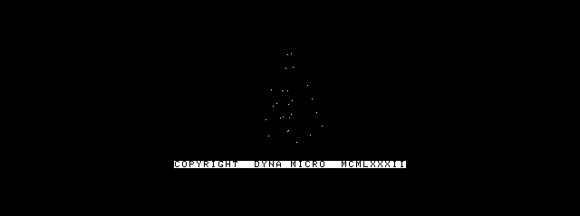
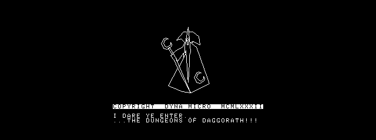
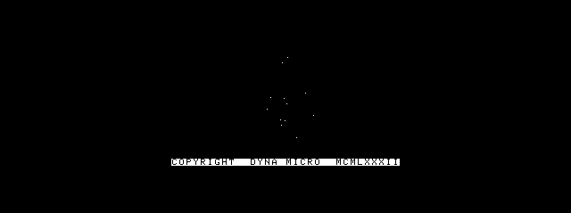
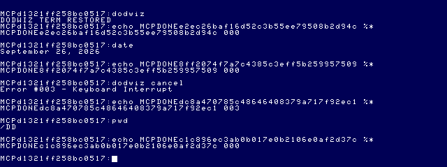
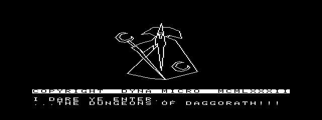
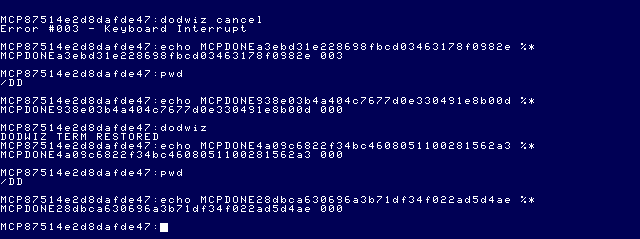

# Dungeons of Daggorath: native NitrOS-9 Wizard M1

2026-09-26. Bounded introductory sequence only. No gameplay, side panels, menus,
mouse, enhanced sound or new MCP capability.

**Current canonical build:** 512×192 at (64,4), 2× horizontal / 1× vertical.
The final timing investigation below supersedes the original 98.5-second playback
and the earlier 1:1/smaller-viewport experiments. Those results remain historical evidence.

## Source and architecture

[Application tree](../../apps/daggorath/README.md) ·
[Detailed provenance](../../apps/daggorath/PROVENANCE.md) ·
[Input hashes and segment locations](../../apps/daggorath/src/original/provenance.json).

The external recovered source is pinned to
`daggorath-reference a94326f00ebb16a106b540c58bc2ccf5f7b66dac` and was read only.
Original Dyna Micro / MCMLXXXII attribution is retained in source and on screen.
The checkout's recovered macros and license-grant context are recorded in the
provenance document; no new blanket license is asserted.

```text
D4 WIZ1 → WIZ0, SWCTAB, ONCE packed text
             ↓ checked data import (unity-scale intro only)
original/logical.c: private 256×192, 1-bit framebuffer
             ↓ build-time RLE cache; reconstruct identical 6144 bytes
presentation.c: owned OS-9 /w + exclusively mapped GP buffer
             ↓ duplicate each bit; PutBlk at (+64,+4), 512×192
640×200 type-5 screen → cleanup → original Term
```

| Original source/labels | Port use |
|---|---|
| D4.ASM WIZ1, WIZ0; missing-macros.asm SVORG/SVECT/SVNEW/SVEND | 84 ordered segments, crescent variant. The importer checks signed two-pixel delta encoding and records each source location. |
| VCTLST.ASM VCTLSX/VCTREL/VCTJMP, centroid/scale | Flatten only the selected unity-scale path; preserve endpoints/order. No general interpreter or unrelated vector lists. |
| VECTOR.ASM VECTOR/INCRE/DIVIDE/VECT30–60/BITMSK | C rendition of fractional DDA, half-pixel initialization, signed truncated increments, exclusive last endpoint, clipping and dotted fade. |
| CLEAR.ASM; COMDAT.ASM STSVDB/PRIVDB/TXTSTS/TXTPRI | Private bitmap regions: vectors 0–151, inverse status 152–159, primary text 160–191. |
| SWCHAR.ASM SWCTAB; EXPAND.ASM GETFIV; COMTXT.ASM TXTDPB/NDPB10/TXTCR; TXTSER.ASM | Original packed 5×7 glyphs, centered in 8-pixel cells; original copyright and two packed intro messages, including CR behavior. |
| ONCE.ASM DEMO10; MISC.ASM WIZIX0/WIZI10/WIZI20/WIZOX/WIZO10/WIZZES/WAITX | Fade in, message hold, clear messages, fade out, blank vectors, then exit before GAME20. |

No original COMINI, physical screen addresses, private scheduler, IRQ vectors,
PIA/SAM writes, BASIC ROM calls or gameplay runtime is reused. Ordinary CMOC C was
chosen for maintainability; small inline-assembly syscall wrappers retain the
Window Manager/graphics-probe ABI. No 6309-only code is introduced.

## Rendering and geometry

The logical buffer is 32 bytes × 192 rows. Each original vector plots every
`fade+1` step, resetting its counter per line; this is spatial fading, not palette
brightness. Length is `max(abs(dx),abs(dy))`; increments are magnitude-truncated
8-bit fractions with sign restored. The starting accumulator is endpoint + 0.5.
There are exactly `length` iterations: the final endpoint is excluded.

The presentation requests the previously verified type-5 screen with DWSet
`1b 20 05 00 00 50 19 01 00 00`, disables scaling, and checks type 5 / 80×25 cells.
These queries are cell/type queries; the graphics probe already verified the
corresponding 640×200 EOU geometry. This application independently verifies its
pixel placement by comparison of live frames.

It exclusively allocates GP buffer 196/1 with DefGPB. Upstream GrfDrv L08E1 rejects
an existing buffer; allocation failure never permits overwriting or freeing a
foreign buffer. GetBlk initializes a 512×192 type-5 buffer, SS.MpGPB maps its
data, and bounded bit expansion fills it. PutBlk is issued at `(64,4)`. The offset occurs only at this presentation boundary. Buffer collision
on another environment is a safe failure, not a global allocation scheme.

One private buffer replaces the original physical double buffering. Each frame
is completely prepared in the mapped buffer before its deadline and PutBlk. It preserves the logical bitmap
but does not promise original scanout/flip synchronization or tear-free vblank.

## Timing and audio

The sequence preserves fade values **32,30,…,0**, messages, **0,2,…,30**,
and the final blank. Playback now follows measured absolute video-tick deadlines,
with cooperative timed sleeps and elapsed-time checks. See the final investigation
below for the cartridge trace, target-specific clock adapter, exact measurements,
and remaining jitter. The unchanged logical renderer runs at build time; its
19 distinct frames are RLE-cached and reconstructed in the logical framebuffer.

Original audio comprises the CLK20/NOISEV buzz and WIZI20's A$EXP1 explosion through
SOUNDS KABOOM/BOOMER/SNOUT/SNWAIT and SWCHAR THUDD. M1 preserves event hooks but is
**silent**. Original direct DAC/private-IRQ/busy-loop audio is not OS-9-safe and was
not copied. No OPL3/Speech-Sound enhancements are included.

## Lifecycle

The program starts from verified Term, opens only its own `/w`, allocates only its
own GP buffer, selects graphics and runs the sequence. It selects stdout Term,
unmaps with F$ClrBlk, frees its allocated buffer and closes its window on completion or handled error.
Buffer cleanup is sent through Term's parser so an interrupted graphics upload
cannot consume cleanup bytes as bitmap payload.

Signals 2/3 set a flag; polling routes them through normal cleanup. `dodwiz cancel`
self-sends actual OS-9 signal 3 during fade-in, exercising that path without
concurrent MCP keyboard injection. Forced termination/signal 0 cannot guarantee
cleanup. The program is noninteractive and requires stdout to be the original Term.

## Build and staging

The exact build command is in the [application README](../../apps/daggorath/README.md)
and [build record](assets/daggorath-wizard-m1/build.json), which records actual tool,
source/include, library and artifact hashes. CMOC 0.1.90, lwasm/lwlink 4.22 and
ToolShed 2.2; `--os9 -O0 --add-os9-stack-space=1536`. Two independent builds are
byte-identical. ToolShed identified a valid native module:

| Property | Final value |
|---|---|
| Name | dodwiz |
| Size | 5,160 bytes (`$1428`) |
| Type/language | Program / 6809 object (`$11`) |
| Attributes/revision, edition | `$81`, revision 1, edition 1 |
| Entry | `$000D` |
| Data + stack request | 7,718 bytes (`$1E26`), including 6,144-byte framebuffer and 1,536 extra stack bytes |
| CRC | `$30A321` — Good |
| SHA-256 | `00f95126c0bf6336ed911070b95bb81220f6a794ceaaf35866b384863790b775` |

[Staging result](assets/daggorath-wizard-m1/stage.json) records a fresh disposable
artifact floppy, verified installed bytes/CRC and no replacement. Cold boot used
new EOU floppy/VHD copies, never the stock image. A session-only `wizard_ready2`
checkpoint was created after mounting the final media, then `os9_restore_ready`
verified post-load and shell readiness. No canonical state was overwritten or
restored against changed media. [Launch command](assets/daggorath-wizard-m1/launch.json).

## Live results

Exact successful normal response:

```json
{
  "command": "dodwiz",
  "completed": true,
  "commandCompleted": true,
  "status": 0,
  "statusText": "000",
  "timedOut": false,
  "shellReady": true,
  "outcome": "completed",
  "phase": "complete",
  "elapsedMs": 104116,
  "outputComplete": false,
  "allowGraphics": true,
  "displayDepartures": 1,
  "consoleReturned": true,
  "executionState": "COMPLETE",
  "marker": "MCPDONEe2ec26baf16d52c3b55ee79508b2d94c",
  "commandPromptMs": 98528
}
```

The command prompt returned after **98,528 ms**; the complete handshake took
**104,116 ms**. This is a substantial playback-speed limitation, not an assertion
of cartridge timing equivalence. The semantic frame sequence and WAITX counts are
preserved. The subsequent strict `date` returned status 000 in 6,470 ms.

Handled cancellation returned status **003** in **31,254 ms**, with
`completed:true`, `shellReady:true`, `consoleReturned:true`, one display departure
and no timeout. The following strict `pwd` returned **000** in 7,371 ms;
`unlink dodwiz` returned **000**, and `coco_stop` returned `{"ok":true}`.
[Exact structured MCP results](assets/daggorath-wizard-m1/live-results.json) also
retain the initial failed build's timeout rather than hiding it.

## Frame evidence and fidelity

[Pixel comparison record](assets/daggorath-wizard-m1/frame-comparison.json):
**72 captured graphics frames** matched expected logical bitmaps with **zero pixel
differences**, including distinct fade-in and fade-out levels and the full text
stage. Every matching frame also had black side bands. MCP snapshot calls succeeded
while `os9_run(...allow_graphics:true)` remained active.

The live image origin for the logical frame is `(192,26)` within MAME's capture:
the active 640×200 display starts at capture row 22, so this is exactly the required
physical offset `(192,4)`. The 256×192 buffer ends at physical `(447,195)`.
Snapshots can be 640×239 rather than 640×240; image height is not treated as the
active display height. The comparison checks actual pixels, not an assumed crop.









The evidence chain is: pinned source data/labels → imported ordered endpoints →
independent host fixed-point oracle → C framebuffer → actual guest screenshot.
This is stronger than judging resemblance, but is **not** a differential run of
the original cartridge in an emulator or a scan-by-scan original listing audit.
The palette is deliberate white-on-black in the owned RGB graphics window, not a
claim about every original CoCo VDG/composite color appearance.

## Tests and integrity

- **22 rendering checks passed**: endpoint/fade/zero-line rules, source geometry,
  all 17 fade levels and message placement. [Log](assets/daggorath-wizard-m1/render-tests.log).
- **4 lifecycle cases passed**: completion, real signal path via mock OS service,
  presentation error, setup error. Assertions also check the 35 frame submissions
  and 195 requested cooperative ticks for a normal sequence.
- **2 presentation cases passed**: verified packets/ownership and refusal to
  overwrite/free an existing buffer.
- **115 MCP tests passed**, zero failures/skips. [Log](assets/daggorath-wizard-m1/mcp-tests.log).
- Independent builds matched byte-for-byte; ToolShed CRC and staging round-trip
  passed. `npm run build`, `git diff --check`, new-file whitespace and local links
  passed. Existing test expectations were not altered.

[Before/after SHA-256 evidence](assets/daggorath-wizard-m1/media.json) confirms all
three canonical images unchanged:

| Media | Before = after SHA-256 |
|---|---|
| 63SDC.VHD | `db2f0f444073d3b88a3610a63ec9f7d2e2dd4299347181faa6b2b2aa9637de2c` |
| 63SDC-MCP-DEV.VHD | `4c6bdc0cd2f68aa57a9c75f75f15fe429f30926aa522917dd8d14aa1b9ae622e` |
| 63EMU.DSK | `9a51adb8656b9f003c7f822352c291487362f1b4c43aac1a16672d5d2bcb4c40` |

Both disposable EOU media sets and both artifact floppies also remained unchanged.
Stock stayed 0444 and was never mounted. No application was installed into a VHD.
No external reference or MCP source was modified by this milestone. Pre-existing
uncommitted graphics-execution work remains separate. No commit.

## Limitations and next milestone

1. **Playback speed:** approximately 98.5 seconds to the command prompt, versus
   an uncalibrated much shorter original sequence. Logical fading and hold counts
   are preserved; original wall-clock animation is not. Next, profile/measure
   against the original and consider adapting its compact assembly rasterizer or
   selecting a normal optimized release build while retaining these frame tests.
2. **Sound:** silent; add an OS-managed backend for the existing buzz/explosion
   hooks only after transport/timing evidence. No enhanced audio hardware is needed.
3. **Presentation:** one logical buffer plus an owned GP buffer; no vblank guarantee.
   Fixed GP namespace can fail safely if occupied. Forced kill cannot clean up.
4. **Scope:** only unity-scale WIZ1/WIZ0 and selected text. General display-list
   decoding, gameplay, input, world state and side-panel UI remain unimplemented.

Recommended next Daggorath milestone: improve and calibrate intro timing while
preserving the checked frame corpus, then original-style sound through a verified
OS-9 service. Do not start dungeon gameplay until those fidelity limits are resolved.

## Aspect Ratio / Presentation investigation

2026-09-26 follow-up. **Recommendation: duplicate each logical pixel into two
horizontal 640-mode pixels, at `(64 + 2*x, 4 + y)`.** The second copy is at
`65 + 2*x`. Keep the logical 256×192 bitmap, vectors, glyphs, fade and animation
unchanged. This investigation has **not changed the application's presentation
default**; the earlier sections describe the existing 1× implementation.

### Verified source and controlled original

The local `MCP/Documents/` and `DOCS_INDEX.md` were unavailable. Hardware conclusions
here therefore use the recovered original source, pinned MAME 0.289 source and live
measurements, rather than an uncited recollection of a video mode.

- Original `CD.ASM:G6.LEN/D0$BAS/D1$BAS/D0.SAM`, `ONCE.ASM` initialization and
  `COMMON.ASM:SAM` identify Resolution Graphics-6, 6,144-byte displays at `$1000`
  and `$2800`. `ONCE` writes VDG mode `%11111000`; `VECTOR` uses 32-byte scanlines.
  This is a 256×192 1-bit legacy display, not a 640-pixel native GIME display.
- MAME tag `mame0289`, [gime.cpp](https://github.com/mamedev/mame/blob/mame0289/src/mame/trs/gime.cpp),
  `update_screen` (around lines 1846–1925), emits this legacy mode through
  `emit_mc6847_samples<2>`. `render_scanline` places the body at x=64. The 32 bytes
  produce **512 raster samples**, occupying x=64–575 in the 640-wide capture.
  Native 640×1bpp uses `emit_gime_graphics_samples<1,1>` with 80 bytes and x=0.
- [coco3.cpp](https://github.com/mamedev/mame/blob/mame0289/src/mame/trs/coco3.cpp),
  `coco3` machine configuration, specifies a 640×239 visible raster
  (`set_raw(...,912,0,640,262,1,240)`). `gime.cpp:update_geometry` gives 192-line
  and 200-line bodies different top-border timing. Captures locate them at y=24
  and y=22 respectively. Neither PNG has square-pixel display semantics merely
  because it contains rectangular raster samples.

A cartridge was assembled **outside** the read-only reference checkout:

```sh
cd /Volumes/SEDONA/Projects/daggorath-reference
/usr/local/bin/lwasm --format=raw \
  --output=/private/tmp/daggorath-aspect/daggorath.rom DAGGORATH.ASM
```

This is an 8-KiB build of recovered source at
`a94326f00ebb16a106b540c58bc2ccf5f7b66dac`, not an independently authenticated retail
ROM dump. It ran on the same installed Ample MAME 0.289, `coco3h`, 2M RAM, RGB:

```sh
/Applications/Emulators/Ample.app/Contents/MacOS/mame64 coco3h \
  -window -skip_gameinfo -ramsize 2M \
  -rompath '/Users/magneto-optimus/Library/Application Support/Ample/roms' \
  -cfg_directory /private/tmp/daggorath-aspect/cfg \
  -cart /private/tmp/daggorath-aspect/daggorath.rom \
  -autoboot_delay 0 \
  -autoboot_script /private/tmp/daggorath-aspect/capture.lua
```

No disk was attached to the cartridge run. The isolated cfg contains
`<port tag=":screen_config" type="CONFIG" mask="1" defvalue="0" value="1" />`.
The [capture script](assets/daggorath-aspect/capture-original.lua) reads RAM only,
records snapshots and exits MAME. Its subscription is retained globally; an initial
local-subscription trial stopped capturing after garbage collection and was stopped
before repeating the capture. Frame 498 contains the complete wizard and messages.
The displayed `$2800` buffer **matches all 6,144 bytes** of
`wizard_frame(frame,0,1)`, including text. Both SHA-256 values are
`e9d1cd67c58cfab97b6cf2c7e0080fd356c69e4833509326349cc5a4b1a009fc`.
This independently strengthens the earlier 72 logical-frame comparisons: changing
wizard geometry would change a bitmap that already matches the cartridge build.

### Why 1× is narrow

A legacy logical pixel occupies **two** native 640-mode pixel periods. Current 1×
presentation gives it only one. Under the same display scaling, width is halved
while height is retained. The 640/256 = 2.5 calculation is inappropriate here:
legacy video uses the central 512 samples, whereas native wide mode also uses the
former left and right border regions.

[Live render settings](assets/daggorath-aspect/original-config.txt) report
`screen_config=1`, `Screen 0 Standard (4:3)`, effective aspect `1.3333333730698`,
container scale `(1,1)` and offset `(0,0)`. Installed `-showconfig` reports
`keepaspect=1`, `aspect=auto`, `unevenstretch=1`, `filter=1`; neither launch adds a
stretch override. The port uses the same driver and has no saved screen-scale/view
override. For this standard 4:3 view, one raw 640×239 sample has display width/height
`(4/3)/(640/239) = 239/480 ≈ 0.497917`. Thus legacy pixels are approximately square
(2× this ratio), while native 640 pixels are approximately half as wide as tall.
The 512×192 legacy body has apparent aspect ≈1.32778; the full native 640×200 body
has apparent aspect ≈1.59333. The common outer raster is 4:3.

The [MAME options documentation](https://docs.mamedev.org/commandline/commandline-all.html#core-video-options)
explains that `keepaspect` preserves the system's aspect, while disabling it can
distort the image. Raw `screen:snapshot` PNGs here are 640×239 with no pixel-aspect
metadata; displaying those PNGs as square pixels is **not** the same as MAME's 4:3
window. Compare equal render settings, or normalize both captures to the same 4:3
canvas. Do not compensate for host-window distortion inside original geometry.

RGB changes color interpretation, not the two-to-one sampling relationship:
`gime.cpp:update_rgb/update_composite` both use `update_screen`. The original
capture has colored fringes despite the verified RGB input value; the legacy
`render_scanline` path invokes artifact processing. The native probe uses its own
black/white palette. Consequently colored-edge bounding boxes are unsuitable for
an exact geometry comparison. Measurements below use the verified monochrome bits;
the original framebuffer match avoids confusing fringes with vector coordinates.

### Candidate measurements and live captures

The full-strength wizard's set-bit bounds, excluding status/text rows, are
**x=82–164, y=20–132 inclusive: 83×113 logical pixels**. Inclusive raster coverage
is used, not the endpoint-distance convention. Every candidate uses this same
frame (`fade=0`, messages enabled), keeps y unchanged, and centers its viewport.

| Candidate | Mapping / viewport | Wizard raster box | Raw W/H | Apparent W/H in 4:3 view | Side space each |
|---|---|---|---:|---:|---:|
| A: 1× | x+192; 256×192 | 83×113 | 0.73451 | 0.36573 | 192 pixels |
| B: 2× | 2x+64, duplicate pixel; 512×192 | 166×113 | 1.46903 | 0.73145 | 64 pixels |
| C: 5/2× | 640×192, source x=floor(2*destination_x/5) | 208×113 | 1.84071 | 0.91652 | 0 pixels |
| Original legacy sampling | 2x+64; 512×192 | 166×113 before color fringes | 1.46903 | 0.73145 | 64 raster-border pixels |

C alternates 3/2-pixel replication and adds quantization asymmetry. It is about
25% wider than original sampling and removes all side-panel space. B exactly
preserves original horizontal pixel coverage; the cost is reducing future side
regions from 192 to **64 native pixels each**. There is no demonstrated basis for
another rational horizontal ratio in this same-MAME comparison.

All port candidates retain physical y=logical_y+4, giving capture y=logical_y+26.
The original body starts at capture y=24. Therefore B has the original size/aspect
but is two captured scanlines lower. Keeping y=4 centers 192 rows within the
requested 200-row window. If exact original raster registration becomes a goal,
y=2 would align their tops in this MAME build; this is a separate placement choice,
not a reason to change the logical height or wizard coordinates.

Raw live captures (same full-strength logical frame):

- [Source-built original cartridge](assets/daggorath-aspect/original.png)
- [A: native 1×](assets/daggorath-aspect/one.png)
- [B: native 2×](assets/daggorath-aspect/two.png)
- [C: native 2.5×](assets/daggorath-aspect/two-and-half.png)
- [Labeled comparison normalized to 4:3](assets/daggorath-aspect/comparison.png)
  — derived from the captures, not an additional live screenshot.

### Reproduction, scope and checks

A disposable copy of `apps/daggorath` under `/private/tmp/daggorath-aspect/probe`
uses these research-only patches: [first probe](assets/daggorath-aspect/probe-v1.patch)
and [revised probe](assets/daggorath-aspect/probe.patch). Each is applied to a fresh
copy of the unchanged app. It replaces
the copy's entry point with a single-frame hold, and adds presentation-only pixel
replication/GPLoad dimensions. The repository's original-derived code, application
entry point and presentation implementation were not edited. The probe accepts
`1`, `2`, or `5` (5 means 5/2), reserves the same GP-buffer namespace, selects only
its owned window and returns to Term. This is a measurement harness, not a new
playback implementation or an optimization.

[Build provenance](assets/daggorath-aspect/build.json) records exact inputs/tools:
CMOC 0.1.90, lwasm/lwlink 4.22, ToolShed inspection. Module `dodaspect` is 5,218 bytes,
CRC `136C0B` (Good), edition/revision 1, type/language `11`, attributes/revision `81`.
The build script's host output is named `dodwiz`; staging correctly uses its
internal module name `dodaspect`. Reproduce with the existing `build.py` against
the patched temporary copy and the exact command in the build record.

[Stage manifest](assets/daggorath-aspect/stage.json) records a fresh artifact floppy
containing `/dodaspect`. [Launch arguments](assets/daggorath-aspect/launch.json)
use fresh boot-floppy/VHD copies. Mount that artifact as `flop2` at BASIC, cold-boot
with `DOS`, then save a new paired `aspect_ready` checkpoint. The first save found
no file because the isolated `states/coco3h` directory was absent; readiness
correctly returned `state_missing`, and `os9_run` refused to run. After creating
that directory and saving successfully, `os9_restore_ready` verified post-load and
shell readiness. Then `load /d1/dodaspect` and each
`os9_run({command:"dodaspect N",timeout_ms:120000,allow_graphics:true})` captured
snapshots concurrently. No canonical state was restored against changed media.

The first probe completed 1× and 2× normally. Its naïve 5/2 per-pixel division
returned Term at 119,817 ms, leaving insufficient time for the separate status
handshake: the tool correctly returned timeout, not successful completion. Its
90-second snapshot loop had ended before that frame was displayed. This is a
measurement-harness limitation; the application's 98.5-second playback was not
changed. A revised probe computes the identical 5/2 mapping by alternating three
and two copies of each source pixel, avoiding division inside the inner loop.
It was staged on another fresh floppy and cold-booted with new media copies and
an `aspect_ready2` checkpoint. [Second build](assets/daggorath-aspect/build2.json),
[second stage](assets/daggorath-aspect/stage2.json) and
[second launch](assets/daggorath-aspect/launch2.json) preserve that provenance.
The revised `dodaspect` is 5,263 bytes, CRC `46E812` (Good), otherwise the same
module edition/type. This revision changes no logical bits.

This conclusion is calibrated to the installed NTSC `coco3h` MAME environment.
Physical CRT overscan, analog monitor adjustments and PAL machines were not
measured. Those may affect absolute displayed dimensions; they do not justify
changing the original vectors to compensate for the demonstrated 1× mapping error.

Final verification:

| Operation | MCP status | Elapsed ms | Result |
|---|---|---:|---|
| First probe, `dodaspect 1` | 000 | 37,149 | Term returned; unique marker/final prompt verified |
| First probe, `dodaspect 2` | 000 | 50,118 | Term returned; unique marker/final prompt verified |
| First probe, `dodaspect 5` | timeout | 120,016 | Command prompt at 119,817; status handshake missed deadline |
| Revised probe, `dodaspect 5` | 000 | 56,134 | Term returned; unique marker/final prompt verified |
| Subsequent strict `pwd` | 000 | 7,402 | Shell remained usable |

[Exact MCP responses](assets/daggorath-aspect/live-results.json) include the failed
setup/timeout attempts as well as successful runs and clean stops. All three
retained candidate captures have **zero differing pixels** against the expected
presentation of the unchanged full logical frame. The read-only
[verification script](assets/daggorath-aspect/verify-aspect.py) regenerates that
comparison; [measurements](assets/daggorath-aspect/measurements.json) record results.

[Integrity evidence](assets/daggorath-aspect/integrity.json) records before/after
SHA-256 values: all three canonical media files and every `apps/daggorath/src`
file are unchanged. The stock VHD was never mounted. No MCP source changes were
made in this investigation; pre-existing working-tree changes were retained.
Both MAME sessions were stopped. Nothing was committed.

Checks: **22 rendering checks, 2 presentation cases, 4 lifecycle cases passed**;
**115 MCP tests passed, 0 failed/skipped**; `npm run build` and `git diff --check`
passed. All report-local links resolve. The existing application still uses 1×;
applying the recommended 2× transform is a subsequent presentation-only change.
Timing, audio and gameplay remain outside this investigation.

## Presentation-scale comparison: central viewport and future regions

2026-09-26. This is a **presentation experiment**, not a new game layout or a
change to M1's original-derived renderer. Every run owns **one** type-5 640×200
screen. The left, center, right and top/bottom outlines are bitmap regions inside
that screen; no panel has a separate `/w`, process, input handler or feature.
The reference 256×192 logical buffer remains unchanged.

### Sizes and sampling contract

| Candidate | Viewport | Origin | Left / right available | Top / bottom available | Scale relative to faithful 512×192 |
|---|---|---|---|---|---|
| A, reference | 512×192 | (64,4) | 64 / 64 | 4 / 4 | 1 × 1 |
| B, intermediate | 426×160 | (107,20) | 107 / 107 | 20 / 20 | 213/256 × 5/6 |
| C, 75% | 384×144 | (128,28) | 128 / 128 | 28 / 28 | 3/4 × 3/4 |

These are total reserved strips, before accounting for bezel strokes, padding or
future labels. The probe draws an outer rectangle, two vertical separators just
outside the viewport, and two horizontal separators. It draws no map, inventory
or status content. B uses exactly 426 pixels, not 426⅔: its aspect is 0.15625%
narrower than an exact uniform 5/6 reduction. C is an exact uniform 3/4 reduction
of the faithful *displayed* size, not of the 256×192 logical pixel counts.

For output viewport pixel `(u,v)`, the experiment samples:

```text
source_x = floor(u * 256 / viewport_width)
source_y = floor(v * 192 / viewport_height)
physical_x = origin_x + u
physical_y = origin_y + v
```

The host generates integer `source_byte`, `source_bit_mask`, and `source_row_offset`
lookup tables. The target uses those tables and a shifting destination bit mask;
there is **no floating point and no per-pixel division**. This is point sampling
with a fixed top-left phase. A duplicates every horizontal bit exactly and retains
all rows. B retains 160 of 192 rows; C retains 144. All source columns are sampled,
but horizontal duplication becomes nonuniform for B/C.

This is one explicit, reproducible sampling policy, not proof that every possible
reduction filter looks the same. Averaging/thresholding or coverage-preserving
filters could trade missing strokes for merged/thicker strokes. They were not
substituted silently into this comparison.

### Same-frame evidence

All three candidates present the same four `wizard_frame` inputs in the same order:

1. `fade=0, messages=0`: full wizard geometry and original inverse copyright.
2. `fade=0, messages=1`: the original “I DARE YE ENTER...” / Daggorath message frame.
3. `fade=14, messages=0`: sparse thin/dotted vector detail, 25 lit logical pixels.
4. `fade=32, messages=0`: the actual six-dot earliest fade frame, a sampling-phase
   control. It is not a substitute for a densely detailed dungeon scene.

The crescents, face/staff intersections and original glyphs in frames 1/2 provide
additional fine-detail examples. No gameplay frame exists in the bounded M1
renderer; this experiment does not invent one or claim full-game visual coverage.
The original-derived source is linked unchanged; the disposable harness selects
these static inputs and holds each for 240 cooperative ticks.

| Frame | A: 512×192 | B: 426×160 | C: 384×144 |
|---|---|---|---|
| Wizard | [capture](assets/daggorath-scale/a-wizard.png) | [capture](assets/daggorath-scale/b-wizard.png) | [capture](assets/daggorath-scale/c-wizard.png) |
| Original messages | [capture](assets/daggorath-scale/a-message.png) | [capture](assets/daggorath-scale/b-message.png) | [capture](assets/daggorath-scale/c-message.png) |
| Thin fade detail | [capture](assets/daggorath-scale/a-thin.png) | [capture](assets/daggorath-scale/b-thin.png) | [capture](assets/daggorath-scale/c-thin.png) |
| Six-dot fine control | [capture](assets/daggorath-scale/a-fine.png) | [capture](assets/daggorath-scale/b-fine.png) | [capture](assets/daggorath-scale/c-fine.png) |

[Same-message comparison with bezels, normalized to MAME's 4:3 view](assets/daggorath-scale/message-comparison.png).
Raw captures retain the 640×239 raster; normalization affects only this labeled
comparison image, not the guest or pixel measurements.

### Measured fidelity and readability

“Lost” below means an original lit logical pixel lies on a row never sampled. It
does not count horizontal duplication as added detail, and does not compare raw
pixel counts between differently sized images. The wizard region excludes all
copyright/message rows.

| Measurement | A | B | C |
|---|---:|---:|---:|
| Full wizard bounds, width×height | 166×113 | 138×94 | 125×85 |
| Original wizard pixels omitted / 844 | 0 | 146 (17.30%) | 207 (24.53%) |
| Thin fade pixels omitted / 25 | 0 | 5 (20%) | 6 (24%) |
| Entirely lost segments with dots, thin frame / 11 | 0 | 0 | 1 |
| Earliest fade dots omitted / 6 | 0 | 0 | 0 |
| Message foreground pixels omitted / 576 | 0 | 76 (13.19%) | 93 (16.15%) |
| Source rows omitted / 192 | 0 | 32 | 48 |

The six-dot result illustrates sampling phase sensitivity: zero loss in that sparse
frame does **not** mean B/C preserve the fade generally. Full-strength line
segments all retain some pixels in these candidates, but dropping intermediate
points can introduce gaps or change tiny features. Global wizard proportions remain
close to the intended scale; local raster fidelity does not.

There is a stronger text warning than size alone. Decode the unchanged packed
`SWCTAB` glyphs (`original/data.h`, via `EXPAND:GETFIV` semantics) and retain only
the sampled rows. At baseline 176, B and C both omit glyph row 3; the original
**B and D then have identical five-column patterns**. The same collision occurs
at copyright baseline 152 for both, and baseline 168 for C. B retains a different
six-row subset at baseline 168, without this A–Z collision. Horizontal sampling
phase can change pixel widths; it cannot restore the missing distinguishing stroke.
The displayed messages contain D but not B, so their readability alone would miss
this ambiguity. This is a source-derived glyph analysis, not an OCR result or a
claim to have rendered an extra alphabet test screen.

A retains all seven original glyph rows. B/C retain six at these particular
baselines. Familiar message text may remain decipherable, but reduced text should
not be called faithfully preserved or assumed suitable for arbitrary game commands.
The original font data has not been edited, enlarged, replaced or redrawn.

### Cost and memory

The probe deliberately uses a constant full-screen upload for comparable behavior:
a 16,000-byte 1bpp canvas including bezels, GPLoad, then PutBlk at `(0,0)`. The
256×192 logical source always consumes 6,144 bytes. Clearing, bezel generation,
logical drawing and the 16,000-byte transfer are common costs across candidates.
Only the sampling loop count changes:

| Cost / storage | A | B | C |
|---|---:|---:|---:|
| Output sample lookups per frame | 98,304 | 68,160 | 55,296 |
| Relative sampling iterations | 100% | 69.34% | 56.25% |
| Tables if only this mode included | 1,408 B | 1,172 B | 1,056 B |
| Theoretical packed viewport bitmap | 12,288 B | 8,640 B | 6,912 B |

The last row uses `ceil(width/8)*height`, including row padding for B. These are
storage estimates, **not** measured reduced-bandwidth GPLoad implementations; the
probe always uploads 640×200, avoiding assumptions about odd-width buffer handling.
A later viewport-only or dirty-region path would need separate API validation.

All three sets of tables occupy 3,636 bytes in this probe's module. ToolShed reports
module `dodscale`, 9,147 bytes, CRC `5F88F2` (Good), edition/revision 1, type/language
`11`, attributes/revision `81`, data+stack 23,732 bytes. That process storage includes
the 16,000-byte canvas, 6,144-byte source and stack/state. The owned graphics screen
and 16,000-byte GP buffer additionally consume system-managed memory. The module's
read-only size and its process data allocation are separate quantities.

### Direct transformed vectors: later possibility, not implemented

There is a plausible separate presentation backend for unfaded vector primitives:
transform original endpoints using integer rational arithmetic, clip to the central
region and issue public drawing commands on the same owned screen. The existing
live graphics probe already exercised `SetDPtr` (`ESC $40`) and `Line` (`ESC $44`).
Upstream `nitros9-reference` at `f470fa52`, `level2/cmds/grfdrv.asm:I.Line/L1654/L1724`,
shows the graphics setup and line renderer. These are inspected upstream internals,
not an invitation to call private labels or a claimed exact EOU module match.

This could keep a continuous thin line visible after reduction even when dropping
bitmap rows would remove it. It is **not raster-equivalent** to scaling the original
bitmap: original `VECTOR:INCRE/VECT30–60` has its own fixed-point stepping, excluded
last endpoint, draw order and per-line fade counter. GrfDrv has a different line
implementation; its source even records a 2007 symmetry change that distorted some
applications. A generic line command does not establish the original dotted-fade
semantics.

A future controlled hybrid could compare transformed solid vectors with bitmap
text, while keeping fade frames in the original bitmap path. That creates a risk
of a visible geometry/style change at the fade-to-solid boundary and inconsistent
occlusion/draw order. Compositing bitmap content must also avoid erasing already
drawn vectors. Text remains vulnerable to row loss. Before adoption, compare
endpoints, intersections, clear/inverse behavior and every fade transition with the
original raster. No direct-vector backend, hybrid compositor or M1 redesign was
implemented here.

### Live execution cost, conclusions and reproducibility

The same module ran A → B → C after `os9_restore_ready` on a freshly cold-booted,
media-paired `scale_ready` checkpoint. Every run used `allow_graphics:true` and
returned **status 000**, a fresh unique status marker and a verified final Term
prompt. A following strict `pwd` also returned 000, and MAME stopped cleanly.
[Exact responses](assets/daggorath-scale/live-results.json) and
[timestamp/cost measurements](assets/daggorath-scale/cost.json) retain the evidence.

| Observed wall-clock measure | A | B | C |
|---|---:|---:|---:|
| Command sent → fresh command prompt | 74.264 s | 64.191 s | 59.892 s |
| Complete MCP operation, including status handshake | 79.865 s | 69.778 s | 65.479 s |
| First observed wizard → message frame | 18.416 s | 16.387 s | 15.386 s |
| Message → thin frame | 17.321 s | 15.304 s | 14.382 s |
| Thin → six-dot frame | 17.397 s | 14.331 s | 13.318 s |

These are **one run per candidate**, not statistical/cycle benchmarks. Each frame
interval includes the previous 240-tick hold (nominally about four seconds), the
next original logical render, resampling, bezel drawing and upload. Snapshot
polling is about one second, so transition timing is approximate at that scale.
Command time additionally includes input/startup/cleanup, and all four holds.
Smaller dimensions reduced measured total time, but did not eliminate the common
16,000-byte transfer or original drawing work. No animation-speed change or
performance optimization was applied to the actual application.

Visual assessment at a common 4:3 display scale:

- **A:** intact source detail and strongest original lettering. The narrow side
  strips are the price of preserving every original bit.
- **B:** recognizable geometry and decipherable familiar messages, with visibly
  reduced strokes and damaged letter distinctions. It gains 43 pixels on each side
  and 16 rows above/below versus A. It is the smallest candidate here worth carrying
  forward as an **optional compromise**, not a fidelity-equivalent replacement.
- **C:** more panel room, but greater loss in small contours and dotted detail.
  It adds only 21 side pixels and 8 top/bottom rows over B while increasing wizard
  set-pixel loss from 17.30% to 24.53%. It is not recommended as the faithful default.

[Fine-detail comparison](assets/daggorath-scale/detail-comparison.png) uses the same
display magnification across candidates; it does not resize each wizard to hide the
scale difference. No user readability study or full-game/dungeon evaluation was
performed. **Keep A as the reference/default recommendation.** If larger panels
become necessary, B can be evaluated explicitly as a reduced-detail mode; test real
game scenes and all text before declaring it acceptable. Preserving every original
bit while reducing height is impossible with this point-sampled 1bpp presentation.
No viewport choice or filtering policy has been applied to the production app.

The [probe preparation script](assets/daggorath-scale/prepare-probe.py) records the
exact temporary-copy construction and integer table generator. It writes only its
research workspace and reads the unchanged application. The
[build record](assets/daggorath-scale/build.json),
[artifact stage manifest](assets/daggorath-scale/stage.json) and
[launch argument vector](assets/daggorath-scale/launch.json) record CMOC 0.1.90
`-O0`, lwasm/lwlink 4.22, ToolShed module inspection and disposable media. Source
API provenance remains the verified M1 presentation/graphics-probe paths; local
`MCP/Documents/` and `DOCS_INDEX.md` remain unavailable. The experiment did not
introduce a new window API or infer an undocumented one.

[Analysis script](assets/daggorath-scale/analyze.py) records capture selection,
set-pixel/segment loss and font-row analysis. Its paths describe this live session.
[Measurements](assets/daggorath-scale/measurements.json) include capture IDs and
sampling-phase details. The separate portable
[read-only capture verifier](assets/daggorath-scale/verify-captures.py) regenerates
all twelve expected screens from repository source and compares them with the
curated PNGs, including bezel placement. [All twelve comparisons](assets/daggorath-scale/capture-verification.json)
have zero differing pixels. Run it with Python/Pillow and a host C compiler.

[Before/after hashes](assets/daggorath-scale/integrity.json) confirm all application
source files and all three canonical media files remained unchanged. Only fresh
disposable media were attached; the stock VHD was never mounted. No MCP source or
external reference checkout was modified, and nothing was committed.

One additional message-layout loss is visible in C: logical row 175 is the blank
row between the two seven-row message glyph bands (168–174 and 176–182). A and B
sample that row; C skips it, leaving **no blank output row between those bands**.
Thus preserving the original text bytes does not preserve its line spacing after
reduction. This reinforces keeping C out of the faithful-default path.

Validation for this follow-up: 12/12 live-frame comparisons passed; 22 existing
rendering checks, 2 presentation cases and 4 lifecycle cases passed; the full MCP
suite passed **115 tests, 0 failures/skips**. `npm run build`, `git diff --check`,
new-file whitespace checks and all report-local link checks passed. Existing tests
and application behavior were not changed to obtain these results.

## Final canonical presentation and timing correction (2026-09-26)

### Canonical decision

The logical framebuffer remains **256×192, 6144 bytes**. The canonical presentation
is **512×192 at (64,4)** on one owned 640×200 type-5 screen: duplicate each logical
bit horizontally, preserve every row. The 64 physical pixels on either side are
reserved and remain empty. 426×160 is an optional future mode only; 384×144 is
rejected as the default because of the previously measured detail loss. No game
vectors, coordinates, glyphs, message data, fade content or original-derived
renderer were changed by this correction.

### Controlled cartridge timing

The recovered cartridge was assembled from the pinned external source and run
without disks in the **same MAME 0.289 coco3h / 2M / RGB environment**. This is a
controlled emulator reference, not a measurement on a physical original CoCo.

- [Exact original launch](assets/daggorath-timing/original-launch.json)
- [Read-only original frame observer](assets/daggorath-timing/capture-original.lua)
- [Per-video-frame timing trace](assets/daggorath-timing/original-timing.csv)
- [Identified original frame groups](assets/daggorath-timing/original-groups.json)
- [Original classification method](assets/daggorath-timing/classify-original.py)

The observer follows `COMDAT FLIP` ($0209) to the active DSP descriptor, reads its
6144-byte framebuffer, and records emulated time, VCTFAD, NOISEF, UPDATE and PC.
All reads are observational. Each known complete bitmap is compared with the
unchanged host renderer. The 1200-frame raw dump is temporary, not copied to Git.

MAME's `mame0289/src/mame/trs/coco3.cpp:coco3` declares the NTSC crystal
28,636,363 Hz, CPU base divisor 32 and video timing 912×262 at half crystal.
The trace measures **0.0166881533 seconds per video frame** (~59.9227 Hz).
Original `CD.ASM:D0.SAM=$2046`, `ONCE.ASM:COMINI` and `IRQSYN` select the original
SAM/VDG layout and frame-sync IRQ; `COMMON.ASM:CLOCK` performs the pending screen
flip. Timing is therefore measured from actual cartridge execution, not estimated
by dividing a guessed loop count by an assumed CPU speed. Local hardware manuals
remain absent (`MCP/Documents/` / `DOCS_INDEX.md`); these are identified source and
runtime observations, not invented manual citations.

| Transition | Original video frame | Relative ticks | Relative seconds |
|---|---:|---:|---:|
| First visible fade 32 | 102 | 0 | 0 |
| Complete wizard, fade 0 | 395 | 293 | 4.889629 |
| Both messages fully visible | 479 | 377 | 6.291434 |
| Messages cleared | 641 | 539 | 8.994915 |
| Fade-out 0 redraw, visually unchanged | 741 | 639 | 10.663730 |
| Fade-out 2 | 760 | 658 | 10.980805 |
| Fade-out 30 | 1012 | 910 | 15.186220 |
| Final blank vector area | 1014 | 912 | **15.219596** |

The first visible wizard is at emulated time 1.700727 seconds; final blank begins
at 16.920322 seconds. The bounded sequence measured here excludes cartridge
initialization before the first wizard and subsequent gameplay.

### Where the original time goes

All paths below are in the pinned `daggorath-reference` checkout.

| Source | Timing behavior and port treatment |
|---|---|
| `MISC.ASM:WIZIX0/WIZI10/WIZZES` → `VCTLST.ASM` / `VECTOR.ASM` | Draw each fade into FLOP, request UPDATE, then SYNC. There is no explicit 18-tick fade delay: drawing plus frame flip usually consumes 18 ticks. The last fade-in intervals take 19 and 22 ticks. The port preserves complete frame content and schedules those observed transitions. |
| `COMMON.ASM:CLOCK/CLK20` | Frame IRQ flips the buffers and toggles NOISEV/DAC buzz. No private IRQ handler or PIA writes are used by the port. |
| `MISC.ASM:WIZI20`, `SOUNDS.ASM:KABOOM/BOOMER/SNSUB3/SNWT1K/SNWAIT/SNOUT`, `SWCHAR.ASM:THUDD` | Synchronous double explosion: pitch/amplitude/noise loops and the $1000 delay consume real CPU time. Silencing these calls previously removed their time. The new timeline reserves the observed interval, without executing busy-loop audio. |
| `ONCE.ASM:DEMO10`, `COMTXT.ASM`, `EXPAND.ASM` | Message rendering itself takes time; partial message frames occur before the complete frame at 479. M1 presents the complete message frame at that boundary and does not emulate character-by-character typing. |
| `MISC.ASM:WAITX/WAIT10` | `LDB #81; SYNC; DECB; BNE`: called twice. Complete messages remain visible exactly 162 ticks (2.703481 seconds). The source's broad “1.5 seconds” heading is not a substitute for the instruction/trace evidence. |
| `MISC.ASM:WIZOX/WIZO10` | Clear primary text, run the second blocking explosion, then fade out. The new schedule clears messages at tick 539 and retains the full wizard while reserving this interval. The original fade-0 redraw at tick 639 changes no pixels. |
| `ONCE.ASM` after WIZOUT | Clear vector area, request flip and SYNC before GAME20. M1 retains a short blank dwell and returns to Term instead of starting gameplay. |

No sound is implemented. Future audio must fit these existing event intervals;
adding the old blocking sound duration again would double-count it. Event hooks
are silent boundaries, not an already synchronized audio backend.

### Why 98.5 seconds was wrong

The earlier port repeatedly performed general 32-bit C vector arithmetic and
GPLoad through the console byte stream. Rendering/upload cost accumulated before
its relative sleeps. Repeating 195 short sleeps did not reproduce the original
implicit rendering and sound delays. Merely enabling CMOC optimization while
expanding to the canonical width still exceeded a 120-second experiment deadline.

The existing `os_sleep(1)` wrapper passes **X=2** to F$Sleep. The upstream
`level1/modules/kernel/fsleep.asm` documentation and implementation distinguish
X=1 (yield remainder of time slice) from timed sleeps; the file includes the
Level II implementation. Thus the previous application was **not** simply passing
F$Sleep(1), and sleep granularity alone cannot explain ~98.5 seconds. Wakeup and
rendering cost must be measured rather than summed from requested sleep counts.

### Implementation

1. `prepare_frames.py` executes unchanged `src/original/logical.c` on the host.
   Its 19 distinct 6144-byte frames become a **13,282-byte RLE cache**. Every frame
   is round-trip checked; `test_playback.py` also tests the target C decoder against
   the renderer. Generated cache files live in the build directory, not Git.
2. `playback.c` reconstructs a complete **logical** framebuffer. There are still
   35 presentations, with the original fade order and exact frame bytes.
3. `presentation.c` exclusively allocates buffer 196/1. GetBlk initializes its
   512×192 type-5 metadata. Public **SS.MpGPB ($84)** maps its 12,288 pixel bytes.
   Source: upstream `level2/coco3/modules/cowin.asm:L0BD1`,
   `level2/cmds/grfdrv.asm:L0F31`; real application example:
   `archive/utils/view/view_gfx.a:setbuffer` and `view_pix2.a:setvert`.
4. A small bounded **6809** nibble-expansion loop duplicates each bit. It is work,
   not a delay loop. Preparation occurs before the absolute deadline; PutBlk
   presents the completed buffer at (64,4). No hardware/MMU registers are written.
5. `main.c` uses the measured 35-entry timeline, polls handled signals, and sleeps
   cooperatively while waiting. It remeasures elapsed ticks after waking, so
   scheduler delays do not permanently shift every later transition. Frames are
   never skipped to hide an overrun.
6. The EOU **read-only clock adapter** uses public F$CpyMem ($1B) to copy the
   identified Level II `D.Time` / `D.Tick` packet at physical block 0, offsets
   $28–$2e. This is an explicitly **private, target-specific layout dependency**,
   not a portable high-resolution public API. Before graphics it compares all
   six calendar bytes against public F$Time ($15); tick range and elapsed jumps
   are checked, and an incompatible clock fails closed with 187. `Clock`'s
   countdown yields tick-of-minute; modulo-3600 subtraction handles minute wrap.
   No F$Alarm ownership, IRQ changes or memory writes are involved.
7. Provenance for that adapter: indexed EOU `/dd/SOURCECODE/ASM/NITROS9/KERNEL/`
   `fcpymem.asm`, EOU `/dd/DEFS/os9.d`, and upstream
   `defs/os9.d`, `level2/modules/clock.asm`,
   `level2/modules/kernel/krn.asm` (initial system DAT block 0), `fcpymem.asm`.
   The F$CpyMem implementation takes D as a pointer to eight DAT words; its old
   “starting block number” header is misleading. Startup packet validation and
   measured live timing provide target runtime evidence; no exact EOU/upstream
   binary equivalence is inferred.
8. EOU SS.MpGPB unmapping returned **210 / E$BPAddr** for the first two-block
   experiment; that result is not hidden as success. Cleanup now uses public
   **F$ClrBlk ($50)** on the exact aligned mapping range, followed by KillBuff and
   closing the owned window. Source: `level2/modules/kernel/fclrblk.asm`, B=block
   count, U=aligned logical address. It removes mappings, not GP-buffer ownership.
   Both normal and cancellation cleanup passed repeatedly. If unmapping fails,
   cleanup does not free still-mapped storage; process exit removes mappings and
   the error is reported (buffer leakage is preferable to freeing live storage).

Syscall constants were additionally assembled from upstream `defs/os9.d` with
Level=2/H6309=1 and lwasm `--pragma=dollarnotlocal`: bytes **50 1b 15 84** for
F$ClrBlk, F$CpyMem, F$Time, SS.MpGPB. Upstream reference commit remains
`f470fa52eb172b59b22c1b722074998cb42de9b1`.

### Measured corrected playback

[Per-transition comparison](assets/daggorath-timing/comparison.json) ·
[Port normal timing](assets/daggorath-timing/port-normal-timing.csv) ·
[Port normal frame groups](assets/daggorath-timing/port-normal-groups.json) ·
[All three runs](assets/daggorath-timing/port-all-groups.json) ·
[Read-only port observer](assets/daggorath-timing/capture-port.lua) ·
[Port classification method](assets/daggorath-timing/classify-port.py).

The port observer reads the physical GIME-selected bitmap each video frame,
independently of the process MMU. Classification checks the entire 512×192 crop
against exact bit-duplicated logical frames, not merely a wizard bounding box.
GIME registers were $80/$34 in the captured graphics phases. MCP snapshots remain
independent evidence of the actual screen.

| Metric | Cartridge | Corrected port, both complete runs |
|---|---:|---:|
| First wizard → final blank | 912 ticks / 15.219596 s | 928 ticks / **15.486606 s** |
| Complete fade-in | tick 293 | tick 301 (first run) |
| Complete messages | tick 377 | tick 378 |
| Messages cleared | tick 539 | tick 540 |
| First nontrivial fade-out | tick 658 | tick 659 |
| Last fade-out | tick 910 | tick 911 |
| Full message hold | 162 ticks | 162 ticks |
| Complete frame sequence | 35 corresponding content states | **35/35 exact**, each run |

Difference: **+16 video ticks / 0.267010 seconds / 1.75%**. Before the final blank,
maximum first-run lateness was eight ticks at the densest fade-in frame; the later
message deadline recovered to one tick late. Preparing the last blank after the
last faded frame takes longer than the cartridge's two-tick interval. No claim of
cycle-exact timing or zero jitter is made. No cumulative hold-time drift was found;
both full runs had identical total duration. Process scheduling under other loads
can increase lateness without dropping frames.

The first run contains 947 sampled graphics frames: 901 match complete expected
content; the other 46 include initial blank and partial PutBlk transitions.
Mapped preparation avoids exposing half-prepared GP buffers, but PutBlk is not a
vblank-atomic screen flip. Transient scanout/partial frames remain a fidelity
limitation. The original cartridge's partial text drawing is also not reproduced.




### Build and live MCP evidence

Build command (repository root):

```sh
python3 apps/daggorath/build.py --out /private/tmp/daggorath-timing/rebuild \
  --cmoc /usr/local/bin/cmoc --lwasm /usr/local/bin/lwasm --lwlink /usr/local/bin/lwlink \
  --os9 /Users/magneto-optimus/Documents/Coding/toolshed-2.2/build/unix/os9/os9
```

[Full build provenance](assets/daggorath-timing/build.json) records the host C
compiler, CMOC/lwasm/lwlink/ToolShed versions and hashes, exact commands, library
inputs and source hashes. Independent builds were byte-identical. Module:
**dodwiz**, Prgrm/6809 Obj, edition 1, revision 1, **19,809 bytes**, data/stack
7,764 bytes, CRC **FD6C50 (Good)**, SHA-256
`dde93daf2b31b99a16d98d3b3e906758dfc5d07a9e5b9baf0890b06c2c0ea339`.

[Stage result](assets/daggorath-timing/stage.json) records a fresh disposable
artifact floppy. New copies of the canonical boot floppy/VHD were cold booted;
a session-only `timing_ready` state was created with that media already mounted.
The test began with os9_restore_ready, then `load /d1/dodwiz`. The canonical saved
states and canonical media were never used for installation or overwritten.
[Exact launch](assets/daggorath-timing/launch.json) retains the temporary observer
wrapper; the wrapper loads the unchanged MCP bridge before registering read-only
capture. No MCP source changes were made for this task.

| Call | Status | Prompt returned | Complete MCP operation |
|---|---|---:|---:|
| `dodwiz`, allow_graphics=true | 000 | 17,188 ms | 22,793 ms |
| strict `date` | 000 | 869 ms | 6,457 ms |
| `dodwiz cancel`, allow_graphics=true | 003 | 5,169 ms | 10,778 ms |
| strict `pwd` | 000 | 1,796 ms | 7,386 ms |
| repeated `dodwiz`, allow_graphics=true | 000 | 17,172 ms | see exact result |
| strict final `pwd` | 000 | 1,765 ms | 7,352 ms |

Command/prompt timing includes input, setup and cleanup; MCP operation timing also
includes the separate status-marker handshake. These are not the visible-sequence
measurement. The comparable command-to-prompt result fell from the old ~98.5 seconds
to ~17.2 seconds.

Exact unabridged responses: [normal](assets/daggorath-timing/normal-result.json),
[date](assets/daggorath-timing/date-result.json),
[cancellation](assets/daggorath-timing/cancel-result.json),
[pwd](assets/daggorath-timing/pwd-result.json),
[repeat](assets/daggorath-timing/repeat-result.json),
[final pwd](assets/daggorath-timing/final-pwd-result.json).
All graphics calls reported consoleReturned=true, shellReady=true, no timeout.
Cancellation still self-sends actual signal 3; no private interrupt replacement.
[Cancellation restored Term](assets/daggorath-timing/cancel-term.png).
MAME was stopped cleanly after verification.



[Integrity evidence](assets/daggorath-timing/integrity.json): stock VHD, development
VHD, boot DSK, and all three original-derived source/data/provenance files have
identical before/after SHA-256 hashes. The stock VHD was never mounted.

[Checks](assets/daggorath-timing/tests.txt): **115 MCP tests**, **22 logical rendering
checks**, **19 cache frame comparisons**, **2 presentation cases**, **5 lifecycle
cases** passed; TypeScript and application builds passed. Tests cover every measured
transition, minute rollover, cancellation, write/open/clock failures, exact pixel
duplication, ownership and unmapping before freeing. Existing expectation changes
were explicitly approved by the user. The initial sandboxed MCP run could not open
tsx's IPC pipe; the approved rerun passed normally. No tests were skipped or weakened.

### Remaining limits / next work

- This is the measured NTSC EOU target. The private clock-packet layout and 60 ticks
  per second must be revalidated for another OS build or PAL target. Concurrent
  clock-setting or changing emulator state during playback is unsupported; detected
  discontinuities return an error with cleanup. Startup during a calendar rollover
  can fail the strict F$Time comparison safely rather than use an unverified clock.
- The fixed intro cache is appropriate to this bounded milestone. It is not a
  proposed full-game rendering architecture. Geometry and font source remain the
  authority; the cache must always be regenerated and verified from that source.
- The remaining blank-transition delay, PutBlk scanout transients and partial-text
  cadence are documented fidelity differences. No general optimization pass,
  gameplay, smaller canonical viewport, side content or sound was added.
- A future audio milestone should use the measured sound boundaries and an OS-safe
  backend, without reintroducing the cartridge's busy waits or extending the already
  reserved timing intervals. Preserve the canonical 512×192 presentation.
