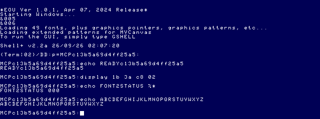
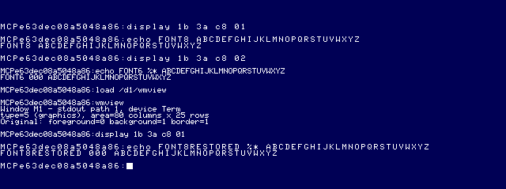

# EOU window fonts and Window Manager M2 capabilities

Research/live verification: 2026-09-26. **No M2 implementation.** No application,
MCP or reference-repository source was edited. No guest files were written.

## Conclusions

- CoWin graphics fonts are shared GET/PUT buffers addressed by numeric group/buffer.
  A `/SYS` filename, catalog display name and loaded buffer identity are different.
- `Font` can select an already loaded font. No public current-font or list-all-fonts
  query was found in the inspected EOU CoWin/VTIO or current upstream dispatchers.
  Bundled WInfo obtains this information through private tables and `F$CpyMem`.
- Hardware-text windows do not gain downloadable glyphs from this graphics-font
  selection. Live narrow-font selection succeeded on Term without narrowing text.
  Graphics selection visibly changed 8×8 → 6×8 → 8×8.
- The installed startup's font files contain **50 distinct buffers**; its banner
  says 49. `/dd/SYS/fontlist.txt` has 49 entries, including one not present in those
  files and omitting two that are present. A catalog is not a resident-resource query.
- Smallest safe M2: one-window foreground/background profiles, explicit revert,
  capability display, and a read-only font catalog. Font preview belongs in an
  application-owned graphics window with a deliberately established baseline.

## Evidence and source precedence

Start with [feasibility](WINDOW_MANAGER_FEASIBILITY.md), [M1](WINDOW_MANAGER_M1.md),
[source navigation](../source-index/README.md), [graphics/windowing](../source-index/GRAPHICS_WINDOWING.md),
[SCF/VTIO](../source-index/SCF_VTIO.md), and the
[EOU/upstream crosswalk](../source-index/EOU_UPSTREAM_CROSSWALK.md).
The frozen EOU runtime is primary for claims about this target. Source candidates
are not assumed byte-identical to installed modules.

`MCP/Documents/` and `DOCS_INDEX.md` are absent in this checkout. The project's
[windowing documentation](https://sourceforge.net/p/nitros9/wiki/The_NitrOS-9_Windowing_System/)
confirms the Font/GPLoad interface and shared resource lifecycle; its legacy screen
sizes and inconsistent font-group wording must not override installed files and
EOU observations. The EOU Windowing Manual v0.30 PDF was located online but fetching
it failed; no claim here depends on having read that PDF. Numeric/source details
below come from inspected local implementations and files.

### Source keys used below

| Key | Exact source/provenance |
|---|---|
| **ECW** | EOU `/dd/SOURCECODE/ASM/NITROS9/SCF/cowin_beta6.asm`: `GetStt`, `SS.SInf`, `Font/PSet`, `GPLoad`, `L0BD1`, `L12D7`. NitrOS-9/EOU candidate system source. |
| **G2** | EOU `/dd/SOURCECODE/ASM/BASIC09/gfx2_ver1.asm`: `L0520` Font, `L0531` GPLoad, `L0585` Palette, `L05E2/L05E6/L05EA` text switches, `L0800`, `L0833/L083B`. Header records Tandy original, Darling/Meyers enhancements and L. Curtis Boyle changes through 2022; edition 5 source. |
| **WI** | EOU `/dd/SOURCECODE/ASM/VEFIO-WINFO/winfo.asm` and `winfodefs`: Wt.FBlk/Wt.FOff reads, `fetchit`, `WI$FntGr/WI$FntBf`. Ron Lammardo 1987, Alan DeKok 1995, Willard Goosey VTIO edition 3, LCB 2022 fix. Version-specific inspection, not a public font GetStat. |
| **FD** | EOU `/dd/SOURCECODE/BASIC09/FontDemo.bas`: reads catalog, emits Font via `SysCall($8A)`, explicit font 1 reset, DATA 100 screen setup. Example, not authoritative enumeration or arbitrary-window restoration. |
| **FM** | EOU `/dd/SOURCECODE/BASIC09/FONTMAN/FontMan.B09`: GFX2 `gpload`, `font`, GUI buffers and editing. Historical application/decompiled-looking source; authorship/complete runtime match not established. Do not run its editor as a read-only probe. |
| **CTL** | EOU `/dd/SOURCECODE/C/CONTROL/control.c`: `SetUpScr`, `Append`, `ScrTyp`, calls Font/CurOff/CurOn and `_gs_scsz/_gs_styp`. Third-party control utility; explicit selected font, not query-and-restore. |
| **UCW/UG** | Official external upstream `level2/coco3/modules/cowin.asm` and `level2/cmds/grfdrv.asm`, commit `f470fa52eb172b59b22c1b722074998cb42de9b1` in `/Volumes/SEDONA/Projects/nitros9-reference`. UG `L063C/L0643` Font, `L1002` dimensions, `L056E` CWArea, `L04CC` overlay inheritance, `L0930` buffer lookup. |
| **UV** | Same upstream `level2/coco3/modules/vtio.asm` GetStat and `covdg.asm` GetStat; `defs/os9.d` constants. Distinguish CoVDG from CoWin. |
| **UF** | Same upstream `level2/sys/stdfonts.asm`, `isolatin1font.asm`, `ibmedcfont.asm`: raw GPLoad payload assembly, not ordinary OS-9 module headers. |
| **DATA** | Current development VHD `/startup`, `/SYS/fontlist.txt`, and the ten font files in the next table, read using ToolShed. These are the installed file bytes, not a claim about all resident buffers. |

Only targeted sources/files were inspected, reusing the prior byte-preserving EOU
extraction where available. No indiscriminate SOURCECODE extraction was repeated.

## Font lifecycle and installed resources

### Storage, identities and dimensions

DATA's font files are concatenated binary command streams. Each inspected entry has:

```text
1B 2B  group buffer style  width16 height16 length16  glyph-data[length]
```

For these installed fonts group is `$C8` (200), style 5, width 6 or 8 and height 8.
Sizes are big-endian words. The parser stepped by `11 + length`, required each next
header, and required an exact end-of-file match. It found no embedded font names or
OS-9 module identity headers. See the [parsed headers](assets/window-font-research/fonts.json).
Names come from catalog/source context, not a public name service. Some fonts drawn
with five or seven occupied scan lines still have an **8-pixel cell height**.
Evidence: DATA, UF, UG Font validation.

| Startup font file under `/dd/SYS` | Buffers (hex, group C8) | Count |
|---|---|---:|
| `stdfonts` | 01–19, 1B–26, 29 (file order differs) | 38 |
| `isolatin1font` | 3F | 1 |
| `ibmedcfont` | 40 | 1 |
| `smallfont.27` | 27 | 1 |
| `macfonts` | 31, 32, 33 | 3 |
| `ansifonts_65.fnt` | 41 | 1 |
| `ia.fnt` | AD | 1 |
| `roguefonts` | 2A, 2B | 2 |
| `ibmpoker.fnt` | 34 | 1 |
| `ibmcga.fnt` | 42 | 1 |

Buffer 02 and 32 are 6×8; other entries are 8×8. Most hold 1,024 bytes (128 glyph
slots at eight bytes each); 3F/40/42 hold 1,792 bytes (224 slots), and 03 holds only
104 bytes (13 slots). Do not assume every font contains the same character range.
UG's extended-font path remaps character ranges; payload slot count alone is not
an encoding specification.

The catalog omits **26 and 34**, and lists **1A** even though none of these startup
font payloads defines it. Its opening prose mentions two extended fonts, whereas
these headers show three. Do not silently repair this historical catalog or label
its names as verified metadata for uncatalogued buffers. Startup file parsing is a
candidate-resource inventory, not proof that every startup load succeeded or that
no process subsequently deleted/replaced a buffer.

### Loading and lifetime

Current `/startup` merges these files, plus patterns and pointers, to the active
window path. `merge` sends their binary command streams; it is not `load`/`F$Load`
of a font module. G2 constructs the same GPLoad header. ECW's GPLoad passes bytes
into graphics buffer storage; the resources can be used by multiple windows.

`Font`: raw `I$Write` of `1B 3A group buffer`, or BASIC09 `RUN GFX2("Font",group,buffer)`
(with path form as supported by that wrapper). Selection does not load a filename.
UG validates a selected font's 6/8 width and 8 height and returns an error for an
unsuitable buffer. Undefined-font rendering can fall back to a dot; absence must
not be presented as a legitimate selected font. Loading buffers, replacing shared
IDs or `KilBuf` (`1B 2A group buffer`, zero buffer means group) is not a harmless
way to browse fonts. M2 should not reload or delete startup fonts automatically.

**Enumeration:** reading `/SYS/fontlist.txt` or parsing trusted files provides a
catalog. `SS.MpGPB` is a SetStat for a **known** group/buffer (X), map/unmap selector
(Y); it returns mapped address/length. ECW `L0BD1` invokes F$MapBlk and consumes
process address space. It is not a list-all API, current-font query, or a stable
font-name/dimension service. No brute-force mapping or private list walk was used.

### Querying and restoring

ECW/UCW's complete GetStt dispatch includes size, palettes, screen type, colors,
default palette, menu selection and screen information. It does not expose current
font. VTIO delegates unhandled calls to the co-module. WI instead copies private
window tables, follows Wt.FBlk/Wt.FOff, and fetches group/buffer from the graphics
buffer header through F$CpyMem. Its existence must not be described as a portable
GetStat. It would need a separately validated ABI adapter and runtime identity checks.

A reliable selection rollback is possible **conditionally**: the application knows
what it previously selected, the buffers remain valid/unchanged, and no other actor
changes the same window. Selecting that known group/buffer again restored visible
font width in the live test. An inherited arbitrary font cannot presently be captured
by the verified public API. Font 1 is an explicit new baseline, not proof of the
caller's original font. Re-selecting a font also does not repaint old text, restore
cursor position or reverse a line wrap caused by a width change (UG `L0643`).

### Hardware text versus graphics; Multi-Vue

UG `L1002` takes a separate hardware-text path with character-cell units; graphics
uses the selected buffer and its glyph dimensions. Our hardware-text Term remained
visually unchanged after selecting C8/02. In graphics, C8/01 and C8/02 visibly used
8- and 6-pixel glyph widths. `SS.ScSiz` still reported 80×25 in the narrow-font test:
working-area units must not be labeled as the number of printable narrow glyphs.
UG `xy.intoq` treats graphics working-area units as eight-pixel units.

CoWin's menu/chrome code switches between graphic font C8/03 and a text font, with
C8/27 as fallback (`L12C2/L12D7/L12E9`). Application content font and system chrome
font are not one global preference. UG overlay initialization copies font state
from the underlying window (`L04CC`); this is useful for owned dialogs, not evidence
that replacing an arbitrary window/font is reversible.

## Public API and capability matrix

Categories: **A** query/change/restore with the stated ownership constraints;
**B** settable but a complete safe round trip is not established;
**C** requires definition/recreation for the requested change;
**D** no verified public operation found for this target. “Source” is not a live
certification. No unsupported SS number was guessed or probed.

| Attribute | Query | Change | Class / restoration boundary | Evidence |
|---|---|---|---|---|
| Foreground/background | `I$GetStt SS.FBRgs ($96)`: A/B | `1B 32 fg`, `1B 33 bg` through I$Write | **A** on controlled path, mode-valid indices, query-back; existing pixels remain | ECW `L0AF4`, G2 Color; M1 live |
| Border | Same query, X | `1B 34 value` | **A conditional**: screen-scoped, shared with other windows. M1 verified controlled rollback; not automatic per-window application | ECW Border; M1 |
| Palette | `SS.Palet ($91)`, caller X→16-byte buffer | `1B 31 index color` | **A conditional/source**: capture all16, exclusive/cooperative screen ownership and query-back; shared-screen recoloring. Not live-mutated here | ECW `L0AA7`, G2 `L0585` |
| Default palette | `SS.DfPal` | same SetStat | Global/default policy, not current-window profile. Exclude from M2 | ECW `L0AC3`, SetStt |
| Text/graphics type | `SS.ScTyp ($93)`, A | DWEnd/DWSet with screen type | Query safe; **C** for mode change. No in-place conversion/content preservation contract | ECW `L0AD5`, G2 DWSet, FD DATA100 |
| Current working dimensions | `SS.ScSiz ($26)`, X/Y | CWArea `1B 25 x y width height` | **B** general existing window; controlled owned layout can use it. Resets cursor/layout; size-only snapshot is insufficient | ECW `L0A9A`; UG `L056E/L0581` |
| Working-area origin | `SS.ScInf ($8F)`: Y high/low=x/width, U high/low=y/height; also screen memory data | CWArea | Source-confirmed query, not live-tested here. Query refers to current area, not original DWSet bounds. Validate coordinate conventions/owned bounds before rollback | ECW/UCW `SS.SInf` |
| Original window extent / physical resolution | Screen type identifies mode family; current-area query does not supply original extent | DWSet during creation; end/redefine as required | **C** for screen definition; **D** for full original-extent discovery through inspected public queries. EOU vertical modes cannot be inferred from old 192-line tables | UG setup/default table; WI reads private defaults |
| Font selection | No public selected-font query found | `1B 3A group buffer` | **B** inherited window; conditional known-baseline graphics round trip verified. Hardware-text glyph change unsupported by this path | G2 Font, ECW/UG; live |
| Font name/list | Catalog/files only; no public resident list found | Not a window-setting operation | **D** as kernel enumeration/name service. Catalog UI is feasible with uncertainty labels | DATA, FD, dispatch inspection |
| Cursor show/hide | No CoWin public visibility query found | `05 21` on, `05 20` off | **B**: forcing on afterward is not restoration of unknown prior visibility | G2 `L0833/L083B`; UV |
| Cursor position | No CoWin public query found in inspected dispatch | CurXY `02 (x+20h) (y+20h)` | **B** arbitrary existing window; can track position within owned UI | G2 `L0800`; WI private cursor fields |
| Cursor GetStat name in defs | `SS.Cursr` exists but CoVDG handles it | Not evidence for CoWin | **D** for claimed universal /w cursor query; do not transfer VDG semantics | UV `covdg.asm` GetStat vs CoWin |
| Proportional/bold/transparent text | No public switch-state query found | `1B 3F switch`, `1B 3D switch`, `1B 3C switch` | **B**: affects layout/rendering, belongs to explicitly initialized owned renderer | G2 `L05EA/L05E6/L05E2`; UG |
| Terminal path options | `SS.Opt` / SCF options | `SS.Opt` SetStat | Separate I/O state; not font or cursor state. Leave unchanged for profile application unless explicitly owned | SCF index, mvedit example below |

## MVKit and surviving applications

[Recovered MVKit](../reference-projects/MVKIT_RECONSTRUCTION.md), at mvdraw historical
commit `47b116fc8af27cf83f8cc1e3aa7f85c3fbe288b2`, supplies useful menu/event dispatch,
view bounds/callbacks and document/dirty-state plumbing. `mvkit/src/mv_app_init.c`
installs a supplied palette; `mvkit/src/mv_app_run.c` forces cursor/text/scaling
options and exits through ordinary process exit. `mvkit/include/mvkit/mv_theme.h`
encodes chrome palette conventions. These are explicit setup policies, not capability
queries or comprehensive restoration machinery.

Current `mvedit-reference/mvedit.c` (`mvedit_init`, commit
`9fd15c476aed9cdc67d2d628309470e67951f174`) selects `_cgfx_font(...GRP_FONT,FNT_S8X8)`
and edits SCF options for input handling. It does not discover the previous font.
No reconstructed MVKit abstraction closes the font-query gap identified above.
Retain replaceable event/document/menu concepts; keep WindowProfile logic, ownership,
capability detection and actual window operations independent of chrome styling.
No MVKit build or reference checkout was changed.

## Candidate WindowProfile information — not a format decision

Distinguish three things: desired preferences, an observed launch snapshot, and an
application-owned creation recipe. They have different restoration guarantees.

Candidate fields are logical target role (not persistent path number), supported
mode constraints, observed current working area, foreground/background, optional
screen-scoped border/palette policy, and capability/evidence flags for unknowns.
A future font preference needs group/buffer, human catalog label with provenance,
resource filename/hash or other resource identity, dimensions/encoding assumptions,
and whether it was observed, explicitly established, or merely requested.

Original font, cursor visibility and unknown geometry must stay unknown; do not
fill them with font1/cursor-on/fullscreen defaults. Keep shared resources and
creation-only mode/geometry separate from per-window color fields. A snapshot is
not a redraw buffer or a process snapshot. A save-state restore invalidates host-side
assumptions about selected fonts and resource lifetimes; re-establish capability
and resource evidence rather than trusting an earlier profile session cache.

## Live tests and boundaries

Used the existing rebuilt MCP over a temporary stdio client. The connected plugin
exposed older CoCo tools without `os9_restore_ready`, so the temporary client invoked
the repository's existing rebuilt server. No MCP tool implementation was changed.
The M1 disposable VHD/boot copies and their byte-matched artifact floppy were used;
`NITROS9_READY_STATE` was configured as the matching `wm_m1_ready` state under
`/private/tmp/wm-m1/states/coco3h/`. Neither canonical `nos9_ready_v2` nor that temporary
state was overwritten. Before each experiment, `os9_restore_ready` completed its
post-load event and fresh-shell handshake.

[Exact structured results and typing requests](assets/window-font-research/live-results.json)
retain status, timing and readiness evidence. Typing results mean **queued**, not
executed; graphics observations/status are read from snapshots. We did not claim
complete stdout capture or a graphics-compatible `os9_run` completion detector.

### Experiment 1 — hardware-text Term

An initial `os9_run("display 1b 3a c8 02")` was rejected as `invalid_input` because
that tool intentionally excludes console-control commands. No command executed.
After another restore-ready handshake, the explicitly requested research operation
used `coco_type`, the existing tool intended for direct console input:

```text
display 1b 3a c8 02
echo FONT2STATUS %*
echo ABCDEFGHIJKLMNOPQRSTUVWXYZ
```

Observed `FONT2STATUS 000`, normal hardware-text glyph width, and returned prompt.
This proves accepted selection and unchanged visible hardware glyphs; it does not
prove that internal font-pointer fields were unchanged. Snapshot:



### Experiment 2 — controlled disposable graphics console

Started with `os9_restore_ready` again. The screen-definition sequence is based on
FD's DATA100: end the current device window, define a type-5 graphics screen with
80×25 area, then select it. This deliberately replaces the **disposable test shell's**
screen definition. It is not recommended as a profile operation on an arbitrary
user window. The enclosing MAME restore provides rollback of this experiment;
there is no claim that DWEnd/DWSet preserves the original terminal contents.

```text
display 1b 24 1b 20 05 00 00 50 19 00 01 01 1b 21
display 1b 3a c8 01
echo FONT8 ABCDEFGHIJKLMNOPQRSTUVWXYZ
display 1b 3a c8 02
echo FONT6 %* ABCDEFGHIJKLMNOPQRSTUVWXYZ
load /d1/wmview
wmview
display 1b 3a c8 01
echo FONT8RESTORED %* ABCDEFGHIJKLMNOPQRSTUVWXYZ
```

`display` source at upstream `level1/cmds/display.asm`, `Start/Loop/S.01`, parses
hexadecimal byte operands and emits raw `I$Write`; no file redirection or save is
used. `wmview` is the unchanged M1 module already on its read-only artifact floppy,
used in query-only mode.

Observed:

- FONT8 uses wider glyphs; FONT6 uses visibly narrower glyphs and reports `000`.
- In narrow mode, `wmview` reports Term, **type 5 (graphics), 80 columns × 25 rows**,
  and foreground/background/border 0/1/1. It does not query font identity.
- FONT8RESTORED reports `000` and visibly returns to wider glyphs. Already printed
  narrow text remains narrow. Known C8/01 → C8/02 → C8/01 selection works; arbitrary
  original-font discovery remains unproven.



Finally `os9_restore_ready` returned `ready:true`, `loadCompleted:true`,
`shellVerified:true`, `timedOut:false`, post-load epoch 4, in 6,191 ms. `os9_run("date")`
then returned status `000`, completed/shellReady true, timedOut false. MAME stopped
cleanly with `{"ok":true}`. No new state was saved and no font resource was loaded,
replaced or deleted during these experiments.

### Integrity

[Before/after SHA-256 evidence](assets/window-font-research/media-integrity.json)
confirms all three canonical media files unchanged. Disposable development VHD and
boot DSK also match their original bytes after shutdown. Stock VHD was never mounted.
The test used memory-only window operations; no guest startup/profile/font file was
edited. No application/MCP source change, external checkout modification or commit.

## Inspection methods and reproducibility

ToolShed executable used throughout:

```text
/Users/magneto-optimus/Documents/Coding/toolshed-2.2/build/unix/os9/os9
```

Commands (run from repository root; `os9` below abbreviates that exact executable):

```sh
os9 list media/63SDC-MCP-DEV.VHD,startup
os9 dir media/63SDC-MCP-DEV.VHD,SYS
os9 list media/63SDC-MCP-DEV.VHD,SYS/fontlist.txt
# For each exact filename in the ten-row startup-font table:
os9 copy media/63SDC-MCP-DEV.VHD,SYS/<filename> /private/tmp/wm-font-research/<filename>
```

The last command only reads the image and writes a temporary host copy. Python
parsed header offsets 0/2/3/4/5/7/9 and skipped each payload by its recorded length;
it did not scan payloads for coincidental ESC bytes. The complete compact parsed
result is retained. Canonical SHA-256 values were computed with Python hashlib
before any emulator operation and after stop, and compared for equality. No
filesystem repair, writeback, compilation, app staging or new image creation occurred.

Source archaeology used targeted `rg`/line reads of the source-key table, normalized
CR text copies in `/private/tmp` for EOU files, `git rev-parse HEAD`, and read-only
`git show 47b116fc8af27cf83f8cc1e3aa7f85c3fbe288b2:mvkit/...` in mvdraw-reference.
No Git checkout/reset/pull or source modifications were performed in any reference.

## Smallest safe M2 recommendation

1. Keep M1's inherited one-path inspector and cleanup boundary. Add a validated
   foreground/background preference with explicit preview, revert and apply choice.
   Preserve queried originals on cancellation/error; distinguish apply from rollback.
2. Add save/load of that small preference only to an explicitly selected disposable
   or user-approved destination. Do not bake writes to the canonical VHD into the
   development loop. No persistence or serialization schema is implemented here.
3. Present type/current area and capability limitations clearly. Border stays an
   explicit screen-scoped option; palette can be queried for display but not changed
   automatically. Exclude mode/geometry conversion and cursor manipulation.
4. Add a **read-only catalog view** with resource provenance, known cell dimensions,
   and separate “catalogued”, “present in startup file” and “runtime verified” states.
   Report inherited font as unknown. Do not treat selecting font1 as restoration.

If a visible font preview is required next, make it a bounded follow-on: create an
owned graphics preview window, explicitly select a known baseline, use already
verified buffers, and destroy only owned resources on exit. Test creation/cleanup,
sharing and failure paths before implementation. Defer global font enumeration,
private WInfo adapters, arbitrary-window font replacement, shared resource loading,
mode conversion and full terminal-state profiles.

## Checks

Local Markdown links and all five curated evidence files checked; `git diff --check`
and explicit whitespace checks of the new untracked documentation passed. No host
build/test rerun was needed for this documentation-only task; live checks above
exercised the unchanged server and unchanged M1 binary.
