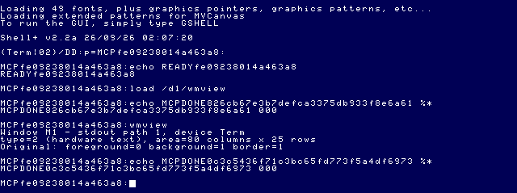
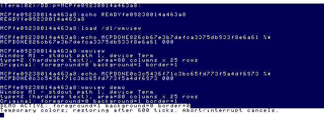
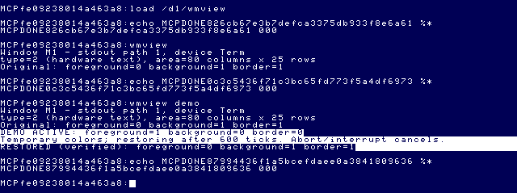
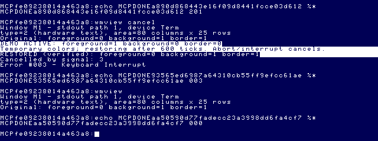

# Window Manager Milestone 1 — native inspector and reversible colors

2026-09-26. Application: [`apps/window-manager`](../../apps/window-manager/README.md).
This milestone uses the frozen EOU target and existing MCP tools. No MCP source,
canonical media, external reference repository or canonical save state is changed.

## Architecture and language

CMOC 0.1.90 C with small 6809 assembly syscall wrappers; LWTOOLS 4.22 supplies
assembly/linking. The program is a reentrant native OS-9 module. It does not need
6309 instructions, private driver offsets, direct video memory, or BASIC09 GFX2
as a loaded dependency. GFX2 source supplies the verified underlying path protocol.

`WindowInfo` and `WindowColors` separate data from query/set operations. `window.c`
queries and restores; `ui.c` presents; `main.c` owns lifecycle and cleanup; `os9.c`
contains register conventions. This leaves room for later profiles without adding
serialization or a multi-window policy now.

MVKit was evaluated through the [reconstruction research](../reference-projects/MVKIT_RECONSTRUCTION.md)
and mvedit/mvdraw build patterns. Its event/menu/document plumbing is unnecessary
for this bounded text UI, and depending on an incompletely recovered library would
add risk. Future graphical UI may adopt those concepts independently.

## APIs and provenance

Read the [feasibility report](WINDOW_MANAGER_FEASIBILITY.md), [source index](../source-index/README.md),
[windowing](../source-index/GRAPHICS_WINDOWING.md), [SCF](../source-index/SCF_VTIO.md)
and [upstream crosswalk](../source-index/EOU_UPSTREAM_CROSSWALK.md) first.
`MCP/Documents/` and `DOCS_INDEX.md` are absent here: no manual-page verification
is claimed. Implementation sources below were inspected; live compatibility is
separately tested. Similar module names do not prove exact source/runtime identity.

| Operation | Public interface | Source evidence |
|---|---|---|
| Device identity | `I$GetStt SS.DevNm ($0E)`, caller buffer X | Upstream `level1/modules/ioman.asm`, `SSDevNm`/`SSCopy`: copies descriptor name, at most 32 bytes. It is not global window enumeration. |
| Type | `I$GetStt SS.ScTyp ($93)`, returned A | EOU `/dd/SOURCECODE/ASM/NITROS9/SCF/cowin_beta6.asm`, `L0AD5`; GFX2 WINFO `L043F`. Types 1/2 are hardware text. |
| Working area | `I$GetStt SS.ScSiz ($26)`, X/Y | Same CoWin `L0A9A`: current CWArea character columns/rows, not pixel dimensions or original window extent. |
| Color query | `I$GetStt SS.FBRgs ($96)`, A/B/X | Same CoWin `L0AF4`: foreground/background palette indices and screen border value. These are not RGB triples. |
| Set colors | `I$Write`, ESC `$32` fg, ESC `$33` bg, ESC `$34` border | EOU `/dd/SOURCECODE/ASM/BASIC09/gfx2_ver1.asm`, `L05A5/L05B6/L05BA/L05CA`; CoWin `Border`. Raw binary writes avoid escape-parameter translation. |
| Signal interception | `F$Icpt`, X handler, U flag; B signal; RTI | EOU `/dd/SOURCECODE/ASM/NITROS9/KERNEL/ficpt.asm`; `/dd/SOURCECODE/ASM/GSHELL/gshell_ver1_0_1.asm`, `SAVESGNL`. |
| Cancellation test | `F$ID`, then `F$Send`, A own PID/B=3 | EOU kernel `fid.asm`/`fsend.asm`; current upstream defs. No unrelated process receives the signal. |
| Timed observation | `F$Sleep` | Upstream `level1/modules/kernel/fsleep.asm`: X=1 only yields; timed queue subtracts one. Wrapper adds one to positive polling intervals. |
| Exit | CMOC OS-9 CRT → `F$Exit` | Installed CMOC `src/stdlib/crt.asm`, OS9PREP/exit; low byte of main result is status. |

Upstream reference commit: `f470fa52eb172b59b22c1b722074998cb42de9b1` in
`/Volumes/SEDONA/Projects/nitros9-reference`. Numeric syscall/SS/error constants
were checked against its `defs/os9.d` through an assembler symbol listing.
CMOC's local manual (`cmoc/doc/cmoc-manual.markdown`, “Making OS-9 system calls”
and calling convention) establishes Y=data base and U=C frame pointer; wrappers
preserve those registers where calls repurpose them. CMOC does not implement
`volatile`; the signal polling wrapper explicitly reads the flag each time.

## Lifecycle and safety boundaries

Default `wmview` performs queries only. `wmview demo` records originals, restricts
mutation to hardware text, swaps foreground/background (choosing a different index
if equal), and changes border to 0 or 1. It queries back all three before announcing
`DEMO ACTIVE`, waits through 600 short timed polls, restores, and verifies equality.

The changed flag is set **before** the first write, so partial errors still enter
cleanup. One cleanup path handles success, syscall/UI error, and signals 2/3.
The intercept itself only records the signal and returns with RTI. Failed restoration
returns an error and never prints a verified-restoration claim.

The border belongs to a shared screen. Run the explicit demonstration on an idle
foreground window under your control. There is no ownership lock against another
writer. Restoring drawing attributes does not repaint previously printed cells.
No palette, font, working-area, terminal-option or input-echo changes are made.
Signal 0, forced termination, a broken device, or concurrent settings changes cannot
be given an unconditional cleanup guarantee.

Diagnostic `fault` deliberately queries unopened path 255 after 120 polls (error
201); `cancel` sends signal 3 to itself at that point. Both must restore before
returning the deliberate nonzero status. This is a real kernel intercept test;
it does not certify every keyboard configuration's interrupt mapping.

## Build and artifact provenance

```sh
python3 apps/window-manager/test.py
python3 apps/window-manager/build.py --out /private/tmp/wm-m1/build3 \
  --cmoc /usr/local/bin/cmoc --lwasm /usr/local/bin/lwasm \
  --lwlink /usr/local/bin/lwlink \
  --os9 /Users/magneto-optimus/Documents/Coding/toolshed-2.2/build/unix/os9/os9
node MCP/dist/os9-stage-cli.js \
  --artifact /private/tmp/wm-m1/build3/wmview \
  --output-root /private/tmp/wm-m1/staged \
  --os9 /Users/magneto-optimus/Documents/Coding/toolshed-2.2/build/unix/os9/os9 \
  --provenance /private/tmp/wm-m1/build3/build.json
```

The builder records the full compiler command and verbose assembler/linker invocations,
source/header/tool/library SHA-256 values, and ToolShed identification. It uses
`--os9 -O0 --intermediate --verbose --add-os9-stack-space=1536`. Explicit LWLINK
`__os9` metadata supplies module name, edition and revision. No post-link byte editing.

Final module: `wmview`, 4,968 bytes (`$1368`), CRC `$B04A2F` (Good), edition 1,
revision 1, type/language `$11` (Prgrm/6809 Obj), attributes/revision `$81`, entry
`$000D`, requested data/stack `$062C` (1,580 bytes).
SHA-256: `6ee9b41b05821ab86d5c8b29503c3a5daf8565f407efccf6f91b85de23994bc9`.
Toolchain: CMOC 0.1.90, lwasm/lwlink 4.22, ToolShed 2.2. The host preprocessor warns
about undefining builtin `__cplusplus`; build succeeds without CMOC/link errors.

## Live procedure

Use the [artifact staging protocol](../architecture/NITROS9_ARTIFACT_STAGING.md).
Canonical boot floppy and development VHD were copied into `/private/tmp/wm-m1`
while MAME was stopped; only those disposable copies were mounted. The stock VHD
was never mounted. A fresh read-only artifact floppy holds `/wmview` on `/d1`.
Cold boot precedes creating a matching temporary ready state. No older canonical
state is restored with changed media.

The first build exposed two genuine platform issues: raw CR did not advance lines,
and `F$Sleep(1)` did not create the intended observation interval. The corrected
build writes line terminators separately from `sprintf` (whose OS-9 character
conversion otherwise turns LF into CR) and requests timed sleeps. MAME was stopped, a new
artifact floppy created, and the corrected module tested after a fresh cold boot.
A premature first `DOS` during BASIC startup also caused a syntax error; subsequent
boot input followed observed BASIC readiness. An incorrectly named host tool call
was rejected before any guest effect; the verified tool is `coco_mount_flop`.

## Final live results

[Exact MCP request/response records](assets/window-manager-m1/live-results.json)
retain all fields, including markers, durations and structured results. `os9_run`
reports completion/status, **not complete stdout**. UI evidence comes from snapshots.

| Operation | OS-9 status / result | Evidence |
|---|---|---|
| Start / mount fresh artifact | success | Records 35, 37; image at `stage-mlMQ5P/artifact.dsk`, `flop2` → `/d1` |
| Save matching temporary state / restore-ready | ready, post-load epoch 1, shellVerified true | Records 41–42; `/private/tmp/wm-m1/states/coco3h/wm_m1_ready.sta` |
| `load /d1/wmview` | 000 | Record 43 |
| `wmview` | 000 | Record 44; Term, type 2, 80×25, foreground/background/border 0/1/1 |
| `wmview demo` | 000 | Record 46; 1/0/0 observed, then verified 0/1/1; returned prompt after 11,612 ms including input |
| `wmview demo` repeated | 000 | Record 50; same restoration, returned prompt after 11,606 ms |
| `wmview fault` | 201 | Record 51; RESTORED verified before Illegal Path Number; shellReady true |
| `wmview cancel` | 003 | Record 53; RESTORED verified before signal 3/Keyboard Interrupt; shellReady true |
| `wmview` afterward | 000 | Record 54; unchanged original 0/1/1, Term 80×25 |
| `date` / `unlink wmview` | 000 / 000 | Records 56–57; shell remains usable; loaded module released |
| Stop | `{"ok":true}` | Record 58; clean shutdown |

All final `os9_run` calls have `completed:true`, `commandCompleted:true`,
`timedOut:false`, `shellReady:true`, `outcome:"completed"`, `phase:"complete"`,
`outputComplete:false`, `isError:false`. Nonzero diagnostic statuses are intentional
OS-9 results, not MCP failures.

### Media integrity

Canonical [before](assets/window-manager-m1/media-before.sha256) and
[after](assets/window-manager-m1/media-after.sha256) hashes are identical:

| Media | SHA-256 before = after |
|---|---|
| Stock `63SDC.VHD` | `db2f0f444073d3b88a3610a63ec9f7d2e2dd4299347181faa6b2b2aa9637de2c` |
| Development `63SDC-MCP-DEV.VHD` | `4c6bdc0cd2f68aa57a9c75f75f15fe429f30926aa522917dd8d14aa1b9ae622e` |
| Boot `63EMU.DSK` | `9a51adb8656b9f003c7f822352c291487362f1b4c43aac1a16672d5d2bcb4c40` |

The disposable VHD/boot copies also retain those hashes after all boots. Final
artifact floppy SHA-256 remains
`8b13fe4d09931719bf57283afbee1db0f7fe95273cd922e09fd138c8c37452e5`,
matching staging. No canonical media was mounted; no app installation or removal
was performed on a VHD. The disposable module was unlinked from guest memory.
Temporary files remain outside Git as reproducibility artifacts. MAME is stopped.

## Host verification

The application lifecycle suite passes 13 cases: inspect-only; normal demo;
injected OS error; intercept cancellation; externally simulated abort; partial
color write; UI output error; changed-color readback mismatch; failed restore;
unsupported query; graphics mutation rejection; invalid argument; equal original
foreground/background. Restoration assertions were preserved. The equal-color
fixture setup correction was explicitly approved by the user.

These tests run real C lifecycle/query/set/UI logic against a mock OS boundary.
They do not emulate the CPU, certify syscall register behavior, or substitute for
live screenshots. The CR/LF and sleep issues above demonstrate that boundary.
Two builds of the final module in independent output directories compare byte-for-byte.
The full MCP suite passes 101 tests; `npm run build` and `git diff --check` pass.

## Milestone 2 recommendations

1. Define a versioned, validated profile format for the public values already
   verified; write files only through an explicit user-selected destination.
2. Add a terminal-aware UI layer with line/error presentation tests; keep binary
   control packets separate from text formatting.
3. Establish screen ownership and concurrent-change policy before generalizing
   border changes or targeting another process's window.
4. Expand live coverage to a separately owned graphics window before allowing
   graphics mutation. Do not infer font availability or private window identity.
5. Add keyboard-originated cancellation tests for each supported terminal mapping.
   Keep cleanup best-effort failures visible and preserve nonzero OS-9 statuses.

No font discovery, saved profiles, window creation/enumeration, GShell integration,
private WInfo structures, or graphical framework reconstruction is included.

## Curated reproducibility evidence

- [Build provenance](assets/window-manager-m1/build.json): source/header/tool/library
  hashes, exact compiler command and module identification.
- [Build log](assets/window-manager-m1/build.log): actual compiler, assembler and linker invocations.
- [Staging result](assets/window-manager-m1/stage.json): fresh image, no replacement,
  identical host/installed module identification and exact ToolShed commands.
- [Launch arguments](assets/window-manager-m1/launch.json): canonical hardware with
  disposable boot/VHD copies; artifact image subsequently mounted through MCP on `flop2`.
- [Original media hashes](assets/window-manager-m1/media-before.sha256).

### Inspection



### Temporary colors



### Restored attributes and returned shell



### Cancellation cleanup and subsequent inspection


