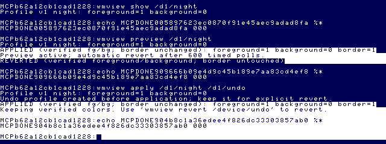
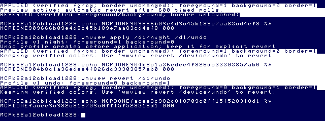
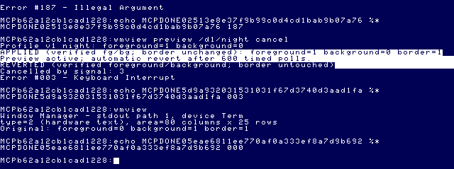
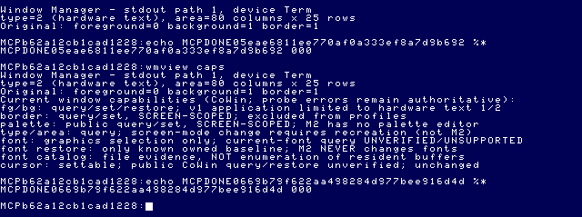
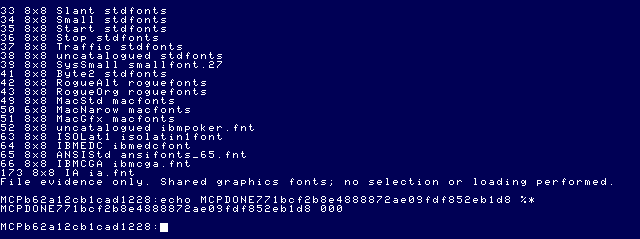

# Window Manager Milestone 2 — one-window profiles

2026-09-26. `wmview` edition 2 extends [M1](WINDOW_MANAGER_M1.md) using only the
[font/capability research](WINDOW_MANAGER_FONT_RESEARCH.md) and
[verified public window APIs](WINDOW_MANAGER_FEASIBILITY.md). No graphical UI,
font selection, window enumeration, GShell integration or workspace management.

## WindowProfile v1

A profile is a small ordinary RBF text file, **not** an OS-9 executable module.
Canonical serialization uses carriage-return line endings:

```text
WindowProfile 1
name=night
foreground=1
background=0
end
```

The final line also has a terminator. Readers accept CR, LF and CR/LF. Names contain
1–24 ASCII letters/digits/underscore/hyphen. Colors are one or two decimal digits,
0–15. Fields have the exact order shown. No NUL, control characters, blank/extra
lines, unknown/duplicate keys, missing terminator or missing `end` is accepted.
Maximum input size is 160 bytes. Unsupported versions are rejected, not interpreted
as v1. Future versions must retain an explicit v1 reader rather than reinterpret its
fields. Unknown fields are deliberately not silently ignored in v1.

The in-memory `WindowProfile` contains only name, foreground and background. It has
no font, border, palette, device number or persistent path identity. M2 application
is limited to **hardware-text screen types 1/2** with valid queried colors and area.
The file's name is descriptive; its storage path is explicit and independent.
Colors are palette indices, not RGB values. Valid indices can still produce poor
contrast with a user's palette; the program does not claim perceptual validation.

## Commands and semantics

```text
wmview
wmview caps
wmview fonts
wmview capture entry /d1/entry
wmview create night 1 0 /d1/night
wmview show /d1/night
wmview preview /d1/night
wmview apply /d1/night /d1/undo
wmview revert /d1/undo
```

- **Inspect:** the default command retains M1 public queries. `caps` displays the
  current queried information followed by capability/ownership limits.
- **Capture:** query the current supported fg/bg and exclusively save a named profile.
- **Create:** validate an explicit name/fg/bg and exclusively save it without changing
  the window. This makes alternate profiles without editing bytes or first changing colors.
- **Show/load:** fully read, close and validate the bounded profile, then display it.
- **Preview:** apply and query-back, hold for 600 timed polling intervals, then restore
  and query-back entry fg/bg. `preview FILE cancel` deliberately sends signal 3 after
  120 polls to test the same real intercept path used by M1.
- **Apply:** load/validate, query entry colors, **create a new undo profile first**,
  apply only fg/bg, query-back and report. Successful completion explicitly keeps
  the requested colors. A new undo destination is mandatory each time.
- **Revert:** load the explicitly selected undo profile and apply it to the current
  window, keeping those values on success. It takes its own entry snapshot for
  rollback if this operation fails. It does not delete the undo file.

There is no process-persistent implicit “last window” state. Undo files hold ordinary
color values, not proof of window identity. Use the undo file captured for the current
controlled window; no other window is opened or targeted by this utility.

## Persistence and error policy

`persistence.c` owns bounded loading, format validation and exclusive saving.
`fileio.c` wraps I$Open ($84), I$Create ($83), I$Read ($89), I$Close ($8F); I$Write
uses the existing checked wrapper. Create uses write access with owner read/write
permissions. There is **no** delete, truncate, replacement retry or overwrite flag.

Evidence: official `nitros9-reference` commit
`f470fa52eb172b59b22c1b722074998cb42de9b1`, `defs/os9.d` and
`level1/cmds/copy.asm` Open/Create/CopyLoop/Close, plus `level1/cmds/save.asm`.
Copy's replacement branch explicitly deletes after E$CEF; this application omits
that branch. CMOC Y/U calling conventions follow the M1 wrapper provenance.
Local `MCP/Documents/` and `DOCS_INDEX.md` remain absent; no manual-page authority
is claimed for the absent manuals.

Paths must be explicit `/device/file...` paths, at most 80 bytes, using the documented
restricted ASCII path characters. Use ordinary RBF files; this is not a general
SCF stream importer. Relative paths, spaces and bare device paths are rejected.

Missing file returns the OS error (216 on the tested target). Existing file returns
218 with an explicit refusal message. Malformed/version/name/color/mode problems
return 187. Read, write and close errors are propagated. Loading handles short
successful reads and requires EOF before accepting the file. Parsing publishes a
fully initialized profile only after complete validation.

A failed save can leave a new partial file. It is not silently deleted or reused;
choose another destination after inspecting the failure. The end marker rejects
truncated profiles. An I/O error may leave a fully written file even though the
operation reported failure. This is exclusive creation, not a power-loss-atomic
filesystem transaction. No save-state restore is safe merely because a filename
still looks the same after writes; follow the media/checkpoint pairing rules.

## Lifecycle and architecture

```text
main.c -> m2.c command lifecycle / commit-or-rollback
               |-> profile.c: model validation, parse/format, capture
               |-> persistence.c -> fileio.c: bounded exclusive file I/O
               |-> window.c: query, pair-only setting, query-back restore
               |-> font-catalog.c + font-data.h: read-only frozen catalog
               |-> ui.c: presentation
```

M1 demo/fault/cancel modes remain intact. Profile mutation sends only the six-byte
foreground/background packet; it never sends a border command. The changed flag is
set before the first write. Error, failed readback, output error or handled signal
before commit triggers rollback to entry fg/bg. Failed rollback is reported distinctly
and overrides the status rather than claiming success. Signals 2/3 are recorded
by the existing minimal intercept handler; cleanup runs in normal code.

Successful apply/revert intentionally leaves the verified colors selected. Preview
never commits. Errors before application do not touch window colors. Cancellation
while file creation is in progress can leave a new file but must not intentionally
commit changed colors. As in M1, forced termination, a broken device, signal 0,
concurrent writers and the final exit boundary cannot provide an unconditional
restoration guarantee. No terminal options or cursor states are modified.

## Capabilities and font catalog

The capability view distinguishes query/set/restore, screen-scoped border/palette,
creation-only mode changes, and unverified cursor/current-font restoration. It
shows the live queried window type; graphics mode is rejected by v1 application.
A public API's existence is not confused with an M2 editor for that property.

`font-data.h` freezes the research's verified startup-file headers and `/SYS/fontlist.txt`
labels. Its catalog hash identifies the ToolShed text export used to generate the
labels. There are 50 startup-file buffer records plus one catalog-only record:
C8/1A is catalogued but absent from those payloads; C8/26 and C8/34 are present but
uncatalogued. IDs are displayed in decimal, group 200. Width/height comes from
verified payload headers; `0x0` explicitly means unverified in startup files for
the catalog-only entry. Catalog labels are not kernel names.

The UI states **NOT resident enumeration/current font**. It neither probes/maps
buffers nor loads, deletes, selects or changes fonts. The evidence describes the
frozen EOU files, not every EOU release or the machine's present resource residency.
See the research report and its parsed-header artifact for exact provenance.

## Development loop

Build with the existing native CMOC/LWTOOLS/ToolShed pipeline. A fresh `os9-stage`
artifact floppy is prepared and identified. While MAME is stopped, copy that image
to a **writable disposable session floppy** and add malformed/new-version/invalid-color
fixtures there. Cold boot disposable boot/VHD copies with that floppy as `/d1`.
The canonical EOU images are never mounted for installation.

Create/restore the matching temporary ready checkpoint **before** profile writes,
then use `os9_run` throughout. Once profiles are written, do not restore that older
checkpoint against the changed floppy. Cleanup stops MAME and checks hashes; it does
not remove files from a live or canonical VHD. This task intentionally retains the
disposable result floppy for inspection.

## Build provenance and artifact

```sh
python3 apps/window-manager/build.py --out /private/tmp/wm-m2/build \
  --cmoc /usr/local/bin/cmoc --lwasm /usr/local/bin/lwasm \
  --lwlink /usr/local/bin/lwlink \
  --os9 /Users/magneto-optimus/Documents/Coding/toolshed-2.2/build/unix/os9/os9
node MCP/dist/os9-stage-cli.js --artifact /private/tmp/wm-m2/build/wmview \
  --output-root /private/tmp/wm-m2/staged \
  --os9 /Users/magneto-optimus/Documents/Coding/toolshed-2.2/build/unix/os9/os9 \
  --provenance /private/tmp/wm-m2/build/build.json
```

CMOC 0.1.90; lwasm/lwlink 4.22; ToolShed 2.2. The [build record](assets/window-manager-m2/build.json)
contains exact command, input/tool/library hashes and identification; the
[verbose log](assets/window-manager-m2/build.log) includes assembler/linker invocations.
A second build in `/private/tmp/wm-m2/repro` compared byte-identical.

Module `wmview`: **14,818 bytes** (`$39E2`), CRC **`91B2AF` (Good)**, edition **2**,
revision 1, type/language `$11` (Prgrm/6809 Obj), attributes/revision `$81`, entry
`$000D`, data/stack request `$07BA` (1,978 bytes, including 1,536 requested stack).
SHA-256: `0230b0a2c268af11f31d5b96e2d8b1a9b368abfdbea1b7cfacd3e4274e5e2ab9`.

The [staging record](assets/window-manager-m2/stage.json) identifies the read-only
fresh source image and verified installed module. The live session instead mounted
its writable copy `/private/tmp/wm-m2/profiles.dsk` as `flop2`, after adding test
fixtures while stopped. [Launch arguments](assets/window-manager-m2/launch.json)
record disposable VHD/boot paths and unchanged canonical hardware/bridge settings.

### Visual evidence





These demonstrate changed drawing attributes and subsequent shell output. They do
not claim that applying a profile repaints all previously printed cells.

## Limitations and M3 recommendation

- v1 application is hardware-text only; no graphics profile application, arbitrary
  window targeting, mode conversion, font replacement or palette changes.
- Undo files are explicit values, not locks, ownership tokens or complete terminal
  snapshots. Concurrent writers can defeat rollback assumptions.
- Persisted files use exclusive creation, not atomic replace or crash-safe transactions.
  Partial new files are retained and reported. Stronger durability needs separate research.
- Syntax/version/color errors share OS-9 status187 and an explanatory message; a future
  UI can give field-specific diagnostics without changing the v1 grammar.
- The font catalog is pinned evidence, not runtime discovery. Unverified properties
  remain unverified. No MVKit dependency was introduced.

Recommended M3: improve the one-window profile workflow with selectable previews,
field-specific validation and explicit file browsing on user-selected storage. If
font preview is desired, build a separately owned graphics preview window with a
known baseline and tested creation/cleanup. Do not make font replacement on an
inherited window the next incremental feature without solving its query/restore gap.

## Live verification results

[Exact MCP results](assets/window-manager-m2/live-results.json) retain request,
completion, status, markers and timing. All executed `os9_run` tests returned
`completed:true`, `shellReady:true`, `timedOut:false`; deliberate OS-9 failures
remain completed operations. No complete-stdout capture is claimed.

| Test | OS-9 status | Observation |
|---|---:|---|
| Capture entry / save | 000 | Named `entry`, fg/bg 0/1 |
| Create alternate / save | 000 | Named `night`, fg/bg 1/0 |
| Load/show alternate | 000 | Name and values correct |
| Preview | 000 | Visible change, automatic verified revert |
| Apply and explicit revert | 000 / 000 | Changes kept after apply; entry colors restored by separate revert command |
| Repeat with new undo filename | 000 / 000 | Same result |
| Reuse undo / overwrite captured profile | 218 / 218 | Refused before changing colors |
| Apply malformed profile | 187 | No application/undo file created |
| Apply version2 profile | 187 | Rejected |
| Apply profile with color16 | 187 | Rejected |
| Load nonexistent file | 216 | Reported missing file |
| Create with color16 | 187 | No file created |
| Preview with real self-signal3 | 003 | Verified fg/bg restoration before exit |
| Inspector afterward | 000 | Term, type2, 80×25, fg/bg/border 0/1/1 |
| Capabilities / font catalog | 000 / 000 | Limitations displayed; no font change |
| `date` / `unlink wmview` | 000 / 000 | Shell usable; preload released |
| MAME stop | `ok:true` | Clean shutdown |







After stopping, ToolShed extracted entry/night/undo/undo2 from the disposable floppy.
All four matched the expected format **byte-for-byte**, including CR terminators;
the module still matched the host build. ToolShed dcheck reported an intact filesystem,
one directory/eight files and zero allocation/descriptor inconsistencies.
[Media/profile evidence](assets/window-manager-m2/media-and-profiles.json) includes
exact saved text and hashes. Invalid operations created no additional files.

All three canonical media SHA-256 values are unchanged. Disposable boot and VHD
copies also retain their original hashes. Only the intended disposable profile
floppy gained four files. No state restore followed these writes. No canonical
image or canonical state was modified, and no application was installed into a VHD.

## Host checks

- Original **13 M1 lifecycle cases pass**, with their assertions/mocks unchanged.
- New M2 host coverage exercises capture/create/load, repeated apply/revert, exclusive
  saves, missing files, partial writes, readback mismatch, output failure, restore
  failure, close/open errors, unsupported mode, cancellation, version/grammar/color
  rejection and parse-output isolation.
- With explicit user approval, the LF-format fixture's incorrect hard-coded length
  52 was replaced with `strlen(...)` for its 53-byte string. No assertion or
  application behavior changed. The complete application suite was rerun from the
  beginning: **both test executables passed**, including the 13 M1 lifecycle cases
  and all M2 profile, capability and catalog assertions. The M2 executable does not
  emit a separate numerical case count.
- Full MCP suite rerun: **101 passed**, zero failures, cancellations or skips.
- Fresh application compile/assemble/link and ToolShed module checks pass. The
  rebuilt module is byte-identical to the live-tested artifact: 14,818 bytes,
  edition 2, CRC `$91B2AF` (Good).
- `npm run build`, `git diff --check`, new-file whitespace and local-link checks pass.

No commit was made.
