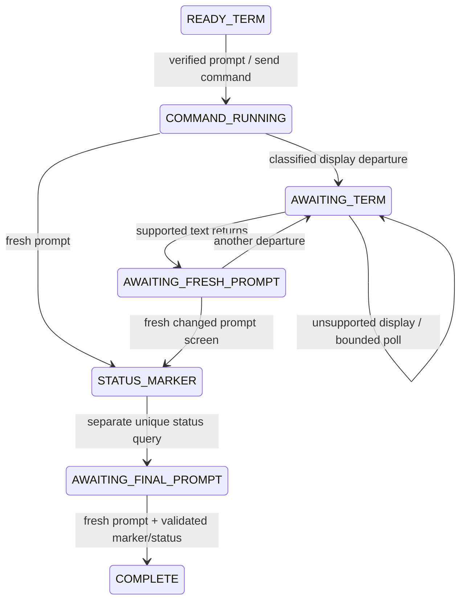
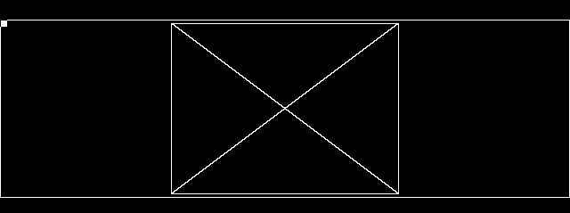
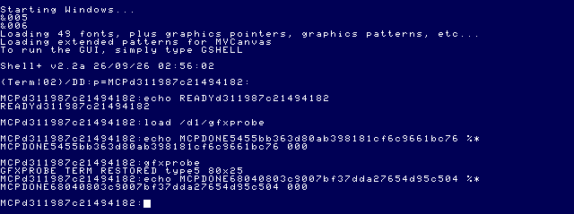

# Bounded graphics-aware OS-9 execution

2026-09-26. General execution capability; no Daggorath implementation.

## API

```json
{"command":"gfxprobe","timeout_ms":60000,"allow_graphics":true}
```

`allow_graphics` is an optional boolean, default **false**. Existing strict calls
retain their execution policy. The same 1,000–120,000 ms overall host deadline
(default 30,000) includes command execution and the separate status handshake.
It is never extended by display transitions.

Opt-in permits only an explicitly classified `unsupported_display` response from
the Lua bridge during the **command** phase. The response includes the owned
operation's epoch. Missing hardware introspection, corrupt text data, transport
errors, resets and invalidated operations are not treated as graphics. Both
preflight and status-marker phases still require the supported text console.

## State machine and freshness



Every active state can terminate on deadline, bridge failure or epoch invalidation.
`phase` retains existing values (`preflight`, `command`, `status_marker`, `complete`);
`executionState` adds more detail, including the state in which a failure occurred.

Preflight requires the session established by `os9_restore_ready`, the same epoch,
and an idle, decoded 80×25 console ending in its unique session prompt. Graphics
never counts as prompt activity. On departure the text-activity flag is reset.
After return, a prompt screen must differ from the pre-command screen. A changed
returned screen accommodates applications whose command echo/output and new prompt
are all visible on the first post-graphics poll. An unchanged restored prompt
cannot cause a status query, even after a graphics transition.

This retains a **screen-observation protocol**, not process-table verification.
Changed screen content is freshness evidence, not proof of process identity. As
with strict `os9_run`, callers must use noninteractive foreground programs and
exclusive UI access; a program that deliberately fabricates the session prompt or
consumes the status query is outside the protocol. No OCR, output-capture claim,
or arbitrary GUI/process controller is introduced.

Once that command prompt is accepted, the tool sends a separate line:

```text
echo MCPDONE<new 128-bit host nonce> %*
```

It requires normal text activity and another fresh idle prompt, exactly one new
standalone marker, and a three-digit status in 000–255. Semicolon sequencing and
same-line status expansion remain prohibited. A nonzero guest status is a completed
MCP operation, not a transport error.

## Results and failure semantics

Additional result fields:

- `allowGraphics`: effective requested policy.
- `displayDepartures`: observed runs of unsupported display, not a claim that each
  is a graphics mode rather than another unsupported layout.
- `consoleReturned`: supported text was observed after the latest departure;
  false when no departure occurred. It alone does not certify shell readiness.
- `executionState`: current/final state.
- `timeoutReason: "console_not_returned"`: deadline while awaiting Term.

A never-returning display produces `outcome:"timeout"`, `timedOut:true`,
`completed:false`, `status:null`, `shellReady:false`, with state `AWAITING_TERM`.
A returned but stale screen also times out, in `AWAITING_FRESH_PROMPT`. Disconnects
remain `bridge_failure`; epoch changes remain `shell_not_ready`; malformed markers
remain `protocol_error`. Failed execution invalidates the cached ready session.
Timeout does not kill the guest process or restore a state automatically. Recover
only with a checkpoint compatible with the unchanged backing media or a cold boot.

Snapshots remain outside the mutation lock and do not require text decoding. Live
screenshots below were taken while `os9_run` was pending. Mutating MCP operations
remain excluded; opting in does not permit concurrent typing or state restoration.

## Probe, public APIs and provenance

Source: [apps/graphics-probe](../../apps/graphics-probe/README.md). The program opens
an owned `/w` with `I$Open`, issues DWSet type 5 at `(0,0)` with 80×25 cells, then
checks `SS.ScTyp` and `SS.ScSiz`. It disables coordinate scaling, sets black/white
palette registers on its **own** screen, and draws outlines/diagonals with SetDPtr,
Box and Line. It selects the new window, cooperatively waits using `F$Sleep`, then
selects stdout Term, DWEnds its owned window and closes its path. Term settings are
not repurposed. Signals 2/3 set a flag and use normal cleanup.

The local `MCP/Documents` / `DOCS_INDEX.md` paths remain absent. Contracts were
checked against the NitrOS-9 Project's [Windowing System manual](https://sourceforge.net/p/nitros9/wiki/The_NitrOS-9_Windowing_System/)
and the identified upstream sources:

- `/Volumes/SEDONA/Projects/nitros9-reference/level2/coco3/modules/cowin.asm`,
  L0027 dispatch, DWSet, Select, DWEnd and SS.ScSiz.
- `level2/cmds/grfdrv.asm`, L086A.25 versus L086A.24 geometry.
- `level2/cmds/wcreate.asm`, owned path/open and display packet examples.
- `defs/os9.d`, syscall numbers; existing Window Manager CMOC wrappers and signal
  lifecycle, reused with provenance comments.

Upstream reference commit: `f470fa52eb172b59b22c1b722074998cb42de9b1`.
No reference repository was modified. Older documentation's 640×192 table is not
used as evidence for EOU's 640×200 extension; geometry was checked live.

### Exact mode and pixel evidence

DWSet packet: `1b 20 05 00 00 50 19 01 00 00`.
ScaleSw: `1b 35 00`. The selected EOU mode is **type 5, 640×200, two colors**.
Queries return type 5 and 80×25 character cells; these are not themselves a pixel
resolution query.



The 640×240 MAME snapshot contains the full outline at `(0,22)..(639,221)`, exactly
640×200 inclusive. Pixel checks confirm the inner rectangle at
`(192,26)..(447,217)`, exactly 256×192, offset `(+192,+4)` within that screen. Both
side regions are otherwise unused. The small top-left mark is the owned window's
text cursor; this diagnostic does not attempt polished graphics presentation.

## Reproducible build and staging

[Build record](assets/graphics-execution/build.json) records exact commands,
source/library/tool hashes and module inspection. Two independent output directories
produced byte-identical modules. CMOC 0.1.90; lwasm/lwlink 4.22; ToolShed 2.2.

| Property | Value |
|---|---|
| Module | `gfxprobe` |
| Type/language | Program, 6809 object (`$11`) |
| Attributes/revision | `$81`, reentrant/read-only, revision 1 |
| Edition | 1 |
| Size | 1,839 bytes (`$072F`) |
| CRC | `$F4B207`, ToolShed Good |
| Entry / data+stack | `$000D` / `$0625` (1,573 bytes) |

The [stager result](assets/graphics-execution/stage.json) confirms fresh artifact
floppy, no replacement, valid module and round-trip byte equality. Cold boot used
new `/private/tmp/graphics-execution/63EMU.DSK` and `63SDC-MCP-DEV.VHD` copies.
The [exact launch command](assets/graphics-execution/launch.json) preserves the
canonical coco3h/2M/RGB/MPI/SCII configuration. Artifact `flop2` was mounted through
MCP before DOS; no executable was installed into either canonical VHD.

A fresh `graphics_ready` checkpoint was created under the isolated session's
`states/coco3h/`, with the final media set already attached. `os9_restore_ready`
reported post-load epoch 1 and a successful fresh shell handshake. No old canonical
state was loaded or overwritten. `load /d1/gfxprobe` returned 000.

## Live execution

[Exact MCP results](assets/graphics-execution/live-results.json) retain requests,
structured responses and snapshot locations. The normal execution response was:

```json
{
  "command": "gfxprobe",
  "completed": true,
  "commandCompleted": true,
  "status": 0,
  "statusText": "000",
  "timedOut": false,
  "shellReady": true,
  "outcome": "completed",
  "phase": "complete",
  "elapsedMs": 17186,
  "outputComplete": false,
  "allowGraphics": true,
  "displayDepartures": 1,
  "consoleReturned": true,
  "executionState": "COMPLETE",
  "marker": "MCPDONE68040803c9007bf37dda27654d95c504",
  "commandPromptMs": 11597
}
```

| Request | Status | Completion/readiness | Elapsed |
|---|---|---|---|
| `gfxprobe`, graphics enabled | 000 | completed, shellReady | 17,186 ms |
| `date`, strict | 000 | completed, shellReady | 6,455 ms |
| `gfxprobe cancel`, graphics enabled | 003 | completed, shellReady | 11,229 ms |
| `gfxprobe error`, graphics enabled | 187 | completed, shellReady | 10,925 ms |
| `pwd`, strict | 000 | completed, shellReady | 7,382 ms |
| `unlink gfxprobe`, strict | 000 | completed, shellReady | 7,543 ms |

Both exceptional probe runs observed one departure and returned through the normal
status handshake. Cancellation uses an actual self-sent OS-9 signal 3 after 180
polls; it is not an external keyboard-abort test. Normal duration is 600 polls.
`coco_stop` returned `{"ok":true}`. Snapshot calls succeeded during all three runs.



### Media integrity

[Before/after hashes and permissions](assets/graphics-execution/media.json) confirm
all three canonical images unchanged, as well as both disposable EOU copies and
the artifact floppy. Stock remained mode 0444 and was never attached.

| Canonical image | Before = after SHA-256 |
|---|---|
| 63SDC.VHD | `db2f0f444073d3b88a3610a63ec9f7d2e2dd4299347181faa6b2b2aa9637de2c` |
| 63SDC-MCP-DEV.VHD | `4c6bdc0cd2f68aa57a9c75f75f15fe429f30926aa522917dd8d14aa1b9ae622e` |
| 63EMU.DSK | `9a51adb8656b9f003c7f822352c291487362f1b4c43aac1a16672d5d2bcb4c40` |

## Validation and limits

- Complete MCP suite: **115 passed**, zero failures/skips; [log](assets/graphics-execution/tests.log).
- Graphics probe: **4 lifecycle cases passed** (normal, signal, deliberate error,
  setup error), reproducible build/link, ToolShed CRC and live staging passed.
- Window Manager regression: 13 M1 lifecycle cases plus all M2 assertions passed.
- `npm run build`, `git diff --check`, new-file whitespace and local-link checks passed.
- New tests cover text under both policies, graphics/status 000 and 216, permanent
  graphics timeout, disconnect, epoch change, malformed marker, unchanged stale
  prompt, strict rejection, corrupt text, strict status phase, invalid input and
  MCP option forwarding. Existing test assertions/mocks were not changed.

Timeout/disconnect/epoch failure cases are host tests, not deliberately hung live
MAME sessions. macOS Ample MAME 0.289 is the live-tested platform. Snapshot pixel
checks verify this probe's mode, not arbitrary graphics applications. This does
not add process isolation, interactive input, output capture, OCR, external abort,
or automatic guest cleanup on host timeout. No Daggorath code or commit.
